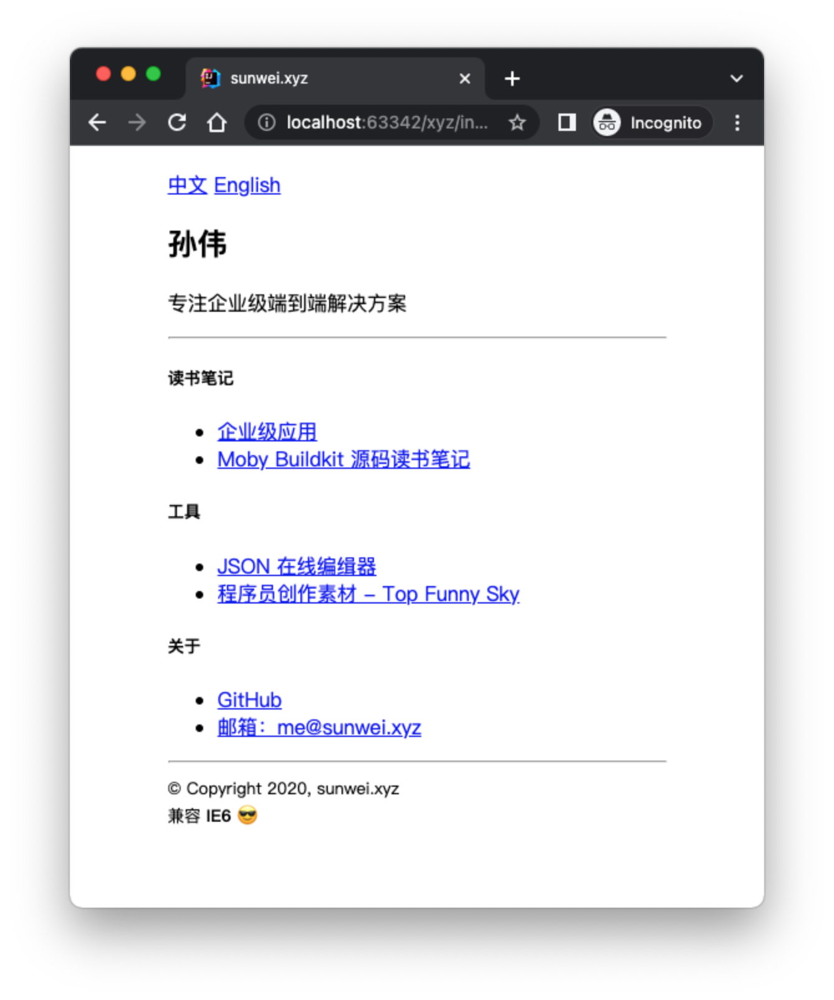
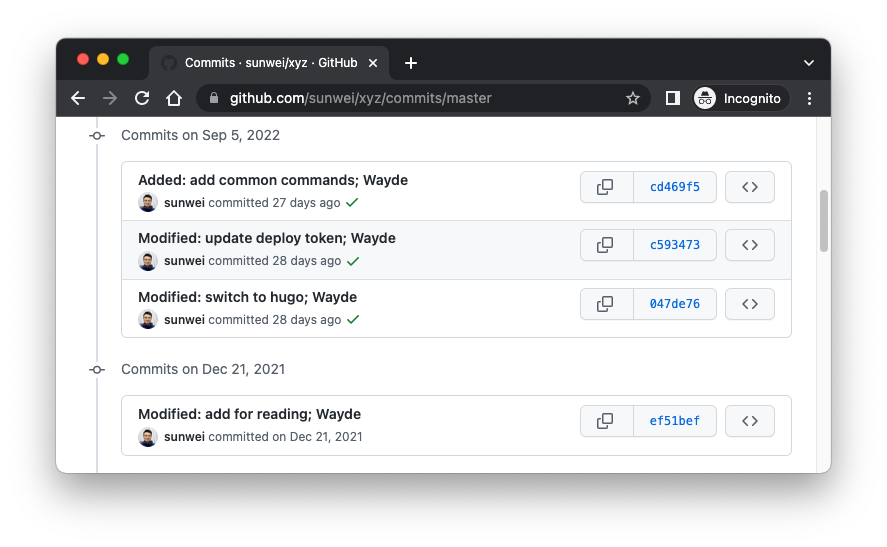
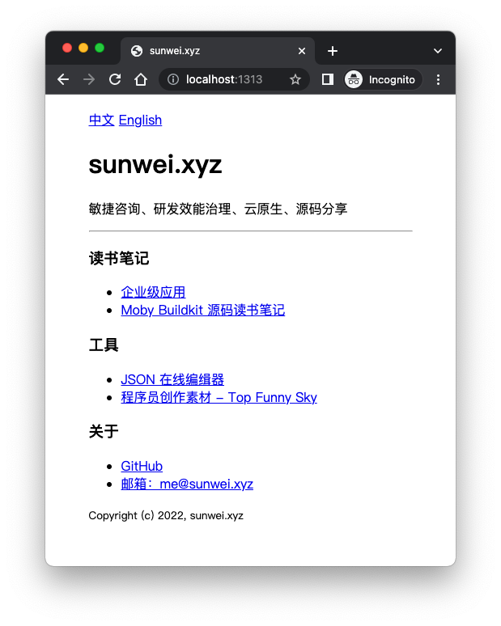

# 个人站点样例: https://sunwei.xyz

Hugo能很方便的帮助我们构建站点，接下来我们来重放一下我的个人站点是如何构建出来的。

## 需求

**将原有的纯HTML站点切换成Hugo站点。**

原站点一览：



功能也不复杂，让我们切换到原始版本。
通过`git history`可以查到提交记录如下：


```shell
➜  xyz git:(master) git checkout ef51befc96f398dcfac1b5c04eb4dc7101633012
```

得到源码如下：

```html
<!DOCTYPE html>
<html lang="zh">
<head>
    <meta http-equiv="Content-Type" content="text/html; charset=UTF-8">
    <meta name="viewport" content="width=device-width, initial-scale=1, shrink-to-fit=no">
    <title>sunwei.xyz</title>
</head>
<body>
<div style="width: 400px; margin: 20px auto;">
    <a href="/">中文</a> <a href="/en.html">English</a>
    <div>
        <h2>孙伟</h2>
        <p>专注企业级端到端解决方案</p>
    </div>
    <hr>

    <h5>
        <span>读书笔记</span>
    </h5>
    <ul>
        <li>
            <a href="https://ent.sunwei.xyz" target="_blank">
                企业级应用
            </a>
        </li>
        <li>
            <a href="https://buildkit.notes.sunwei.xyz/" target="_blank">
                Moby Buildkit 源码读书笔记
            </a>
        </li>
    </ul>

    <h5><span>工具</span></h5>
    <ul>
        <li>
            <a href="https://jsoneditoronline.cn/" target="_blank">
                JSON 在线编缉器
            </a>
        </li>
        <li>
            <a href="https://fsky.top" target="_blank">
                程序员创作素材 - Top Funny Sky
            </a></li>
    </ul>

    <h5><span>关于</span></h5>
    <ul>
        <li>
            <a href="https://github.com/sunwei" target="_blank">
                GitHub
            </a>
        </li>
        <li>
            <a href="mailto:me@sunwei.xyz" target="_blank">
                邮箱：me@sunwei.xyz
            </a>
        </li>
    </ul>

    <hr>
    <footer>
        <small>
            © Copyright 2020, sunwei.xyz
            <br>
            兼容 <strong>IE6</strong>
            <span>&#128526;</span>
        </small>
    </footer>
</div>

</body>
</html>
```

可以看到，纯HTML，为了让站点居中，使用了简单的样式，同时还支持中英双语。
兼容性更不用说，把IE6刨出来，都测不出任何BUG。

## 切换前结合Hugo进行分析

结合Hugo的使用方法，结合上述源码，我们把需要完成的工作拆分成如下任务：

* 配置站点基本信息
* 提取Header
* 提取Footer
* 配置多语言信息，提取多语言切换功能组件
* 提取样式
* 并将内容分别放在中，英内容文件夹下
* 首页汇总

## 开始将sunwei.xyz切换成Hugo模式

通过以上分析，及任务的拆分，我们现在正式进入切换环节。

### Hugo项目的基础结构

创建一个Hugo站点很方便，通过以下命令：

```shell
➜  tmp hugo new site xyz
```
查看目录结构：
```shell
➜  xyz tree
.
├── archetypes
│   └── default.md
├── config.toml
├── content
├── data
├── layouts
├── public
├── static
└── themes

7 directories, 2 files
```
可以看到默认的文件夹有7个，根据我们的需求，我们需要保留：

* content，用来存放站点内容，如果content文件夹用来存放中文，我们还需要再创建一个content.en来存放英文
* layouts，用来存放站点页面模板
* static，因为有对站点用到居中样式，所以要存放样式文件
* config.toml， 基本配置信息和多语言信息都会存放在其中

文件结构看起来如下：
```shell
➜  xyz git:(master) tree
.
├── README.md
├── config.toml
├── content
├── content.en
├── layouts
└── static

```
之所以移除`public`目录，是因为我们将会使用Github Pages + Actions来发布我们的站点，所以每次都会在构建时自动创建发布目录。

### 配置站点基本信息

我们只需要配置baseURL和title就行，打开config.toml并输入：
```toml
baseURL = 'https://sunwei.xyz/'
title = 'sunwei.xyz'

```

### 提取Header

通过查询Hugo的layouts说明，我们发现，是支持模板互相引用的，所以我们先把这些重复使用较多的代码提取出来，方便重用。

进入到layouts，并创建分类目录partials，创建文件head.html，并将原站点header内容拷贝其中：
```html
<head>
  <meta http-equiv="Content-Type" content="text/html; charset=UTF-8">
  <meta name="viewport" content="width=device-width, initial-scale=1, shrink-to-fit=no">
  <link rel="stylesheet" type="text/css" href="/css/style.css">
  <title>sunwei.xyz</title>
</head>
```

### 提取Footer

同理，进入到layouts，在分类目录partials下，创建文件foot.html，并将原站点footer内容拷贝其中：
```html
<footer>
  <small>
    Copyright (c) {{ now.Format "2006"}}, sunwei.xyz
  </small>
</footer>
```
这里比较有意思的是这个Copyright，从2006年开始计算，得到当前年份。
对细节感兴趣的小伙伴，可以参考[golang time](https://pkg.go.dev/time#pkg-constants)

### 配置多语言信息，提取多语言切换功能组件

当点击多语言链接时需要切换到对应语言内容。
将语言切换控件切换成Hugo layouts模板前，先更新配置文件如下：
```toml
baseURL = 'https://sunwei.xyz/'
title = 'sunwei.xyz'

defaultContentLanguage = 'zh'
[languages]
[languages.zh]
  languageName = '中文'
  contentDir = 'content'
  weight = 1

[languages.en]
  languageName = 'English'
  contentDir = 'content.en'
  weight = 2

```

接下来还是一样，进入到layouts，在分类目录partials下，创建文件language.html，并将原站点footer内容拷贝其中：
```html
{{ range $.Site.Home.AllTranslations }}
<a href="{{ .Permalink }}">{{ .Language.LanguageName }}</a>
{{ end }}
```
可以看到，这里要用到Hugo提供的函数range，以及获取语言相关的配置信息，并设置上对应链接。
是不是很方便，不用再硬编码这些链接了。

### 提取样式

因为原站点中有用到样式，让内容居中显示。
我们需要把样式，提取出来，并放在相应的位置。

这一次不再是layouts，而是static目录下。
进入目录后，创建css文件夹，并在里面创建样式文件style.css:

```css
.content {
    width: 400px;
    margin: 20px auto;
}
```

### 并将内容分别放在中，英内容文件夹下

因为需要中英双语，在之前已经为中英切换组件配置了多语言相关信息。
这次需要将内容放入对应的文件夹中。

在配置项中，中文对应的文件夹是content：

```toml
defaultContentLanguage = 'zh'
[languages]
[languages.zh]
  languageName = '中文'
  contentDir = 'content'
  weight = 1
```

在content目录下，创建表示章节的文件_index.md：
```markdown
---
title: Introduction
date: 2022-09-05T16:32:38+08:00
---

敏捷咨询、研发效能治理、云原生、源码分享

---

### 读书笔记

* [企业级应用](https://ent.sunwei.xyz)
* [Moby Buildkit 源码读书笔记](https://buildkit.notes.sunwei.xyz/)

### 工具

* [JSON 在线编缉器](https://jsoneditoronline.cn/)
* [程序员创作素材 - Top Funny Sky](https://fsky.top)

### 关于

* [GitHub](https://github.com/sunwei)
* [邮箱：me@sunwei.xyz](mailto:me@sunwei.xyz)

```

同理，在content.en目录下，放入英文版内容。

在Hugo中，index.md表示一个常规页面，访问路径就是对应所在目录的目录名，可以包含其它页面。
比如content/about/index.md，对应的访问链接就是`baseURL/about`。

而_index.md，通常是列表类型，通常有子目录，但不能包含其它页面。

不过目前官方关于index.md和_index.md的明确比较说明，还没有准备好。
所以很多时候并没有那么明确的区分。

### 首页汇总

准备好内容后，接下来要做的就是用首页对header, footer, language, content进行汇总了。

因为我们的站点是个人品牌站点，重点是向其它人介绍所专注的领域，相关的博文，工具。
目前并不需要在首页展示博客列表，对首页的定位也不是一个单纯的页面，所以我们选择用_index.md。

我们的输出格式是默认的HTML。
想要把主页渲染出来，我们同样需要layout中的模板。
先来看一下Hugo主页Layout的[查找规则](https://gohugo.io/templates/lookup-order/#examples-layout-lookup-for-home-page)：
```markdown
1. layouts/index.html.html
2. layouts/home.html.html
3. layouts/list.html.html
4. layouts/index.html
5. layouts/home.html
6. layouts/list.html
7. layouts/_default/index.html.html
8. layouts/_default/home.html.html
9. layouts/_default/list.html.html
10. layouts/_default/index.html
11. layouts/_default/home.html
12. layouts/_default/list.html
```
没错，任意选择其中一个就行。

在这我们选择了最常见的index.html，那接下来我们就要进入layouts目录，并创建index.html文件，汇总所有提取出来的内容：
```html
<!DOCTYPE html>
<html lang="{{ default .Site.Language.Lang .Site.LanguageCode  }}">
{{- partial "head.html" . -}}
<body>
<div class="content">
    {{- partial "language.html" . -}}

    <h1 class="title">{{ .Site.Title }}</h1>
    <p>{{ .Content }}</p>

    {{- partial "foot.html" . -}}
</div>
</body>
</html>

```
可以看出，模板语言很容易理解。

接下来，我们可以直接在本地查看实际效果：

```shell
hugo serve
```

输入地址[http://localhost:1313/](http://localhost:1313/)，就能看到我们的站点了：



简直一模一样。

以后想要加入[深入理解Hugo](https://juejin.cn/column/7145825003198480391)系列，更新站点的时候，直接写MD就可以了。
真的很方便。

最后的目录结构看起来是这个样子的：

```shell
➜  xyz git:(master) tree
.
├── CNAME
├── README.md
├── command.sh
├── config.toml
├── content
│   └── _index.md
├── content.en
│   └── _index.md
├── layouts
│   ├── index.html
│   ├── partials
│   │   ├── foot.html
│   │   ├── head.html
│   │   └── language.html
│   └── taxonomy
│       └── taxonomy.html
└── static
    └── css
        └── style.css

11 directories, 12 files
```

源码可参考Github[sunwei/xyz](https://github.com/sunwei/xyz/tree/v0.1.0-zero)
