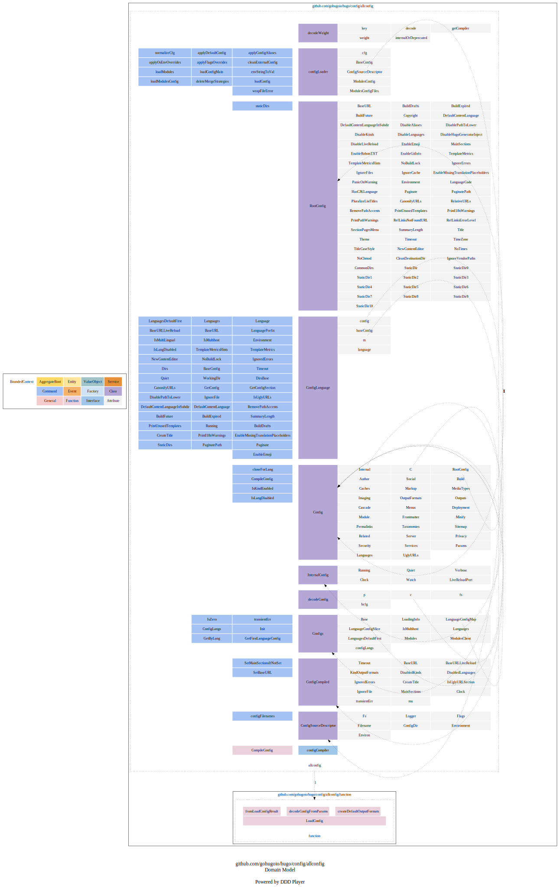
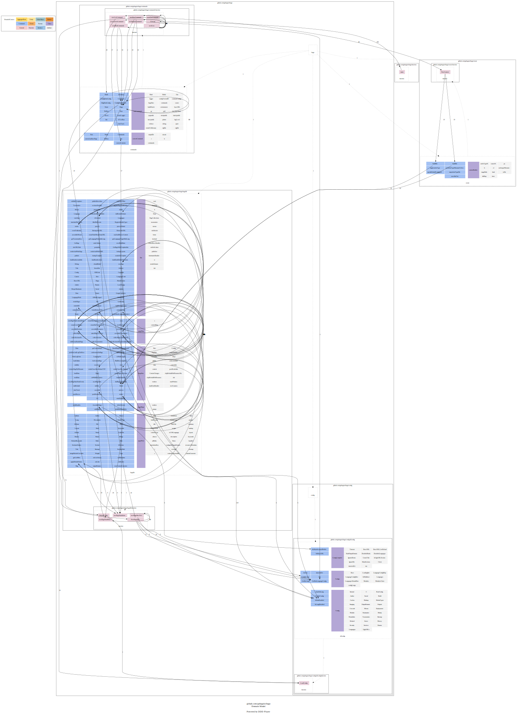
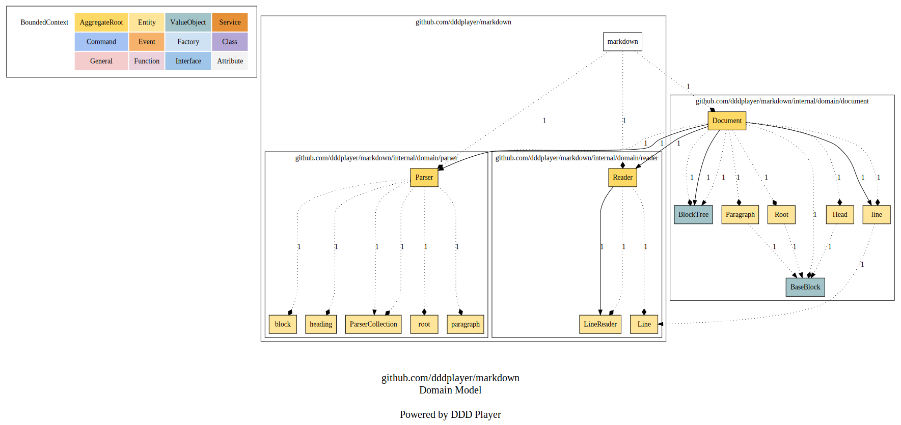
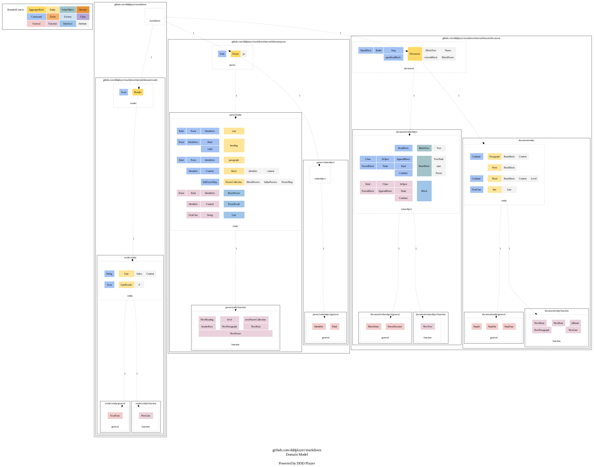

# DDD在本书中的应用

我们会使用领域驱动设计（DDD）思想贯穿整个源码的解析。
从源码分析开始，借助辅助工具 dddplayer 对Hugo源码进行深入分析。
这会给我们提供代码结构和信息流的详细信息，以确保我们对源码结构有清晰地认识。

再将源码拆解为一个个的功能点，每个功能点代表着系统中的一个特定任务或操作。
这样可以帮助我们了解各个功能点之间的关系和依赖，并动手练习，掌握每一个功能点。
通过动手实现这些功能点，将有助于我们更好地理解源码中的交互和业务逻辑。

接下来，让我们把这些功能点关联起来，一起动手实现一个小巧的静态站点生成服务。
我们将运用领域驱动设计的思维方式，将这些功能点按DDD概念有机的融合在一起，形成一个完整的服务 - Hugoverse（书中例子的名字）。

在这个过程中，我们会使用战略图和战术图来一步步可视化我们实现的系统。
战略图用于指导整个系统的组织结构和限界，而战术图则更关注限界内部的微观设计决策。

我们会应用六边型项目结构，确保项目组织符合DDD的原则。
这包括清晰的限界上下文、领域模型的定义、实体和值对象的划分、以及聚合的设计等。
通过这一步步的构建，我们致力于打造一个能够更好地反映业务需求和更易于维护的系统。

这个过程将源码解析、功能点拆解、DDD思维、战略图和战术图等结合在一起。
以确保我们在开发过程中更加注重业务需求，建立起一个有机、清晰且符合DDD原则的软件系统。
这种方法有助于我们对系统的整体理解，同时确保代码的可维护性和灵活性。

## 辅助工具DDDPlayer简介 

[DDDPlayer](https://github.com/dddplayer/dp)是一款战略和战术治理工具，通过源码分析实时生成战略图和战术图，帮助团队保持业务和代码的一致性。

### 分析源码组成结构

可以用来分析Golang源码，帮助我们深入理解源码组成和结构。

比如我们想了解`github.com/gohugoio/hugo/config/allconfig`模块下结构体之间的关联关系：
DDDPlayer可以帮我们生成如结构图：

可[线上查看细节](https://dddplayer.com/?path=https://assets.dddplayer.com/resource/hugo/github.com.gohugoio.hugo.config.allconfig.composition.dot)。

### 分析源码组信息流

还可以分析模块间的调用关系。

如果我们想了解`allconfig`模块是怎么被外部调用的，我们还可以用DDDPlayer帮助我们生成信息流图：

可[线上查看细节](https://dddplayer.com/?path=https://assets.dddplayer.com/resource/hugo/github.com.gohugoio.hugo.config.allconfig.messageflow.dot)

### 生成DDD战略图

[Clean Markdown](https://github.com/dddplayer/markdown)是用DDD实现的一个样例项目。

我们可以用DDDPlayer帮助我们生成战略图：

### 生成DDD战术图

还可以帮我们生成战术图：

有了DDDPlayer后，将大大方便我们理解源码，以及用DDD的方式实现我们的领域服务。
