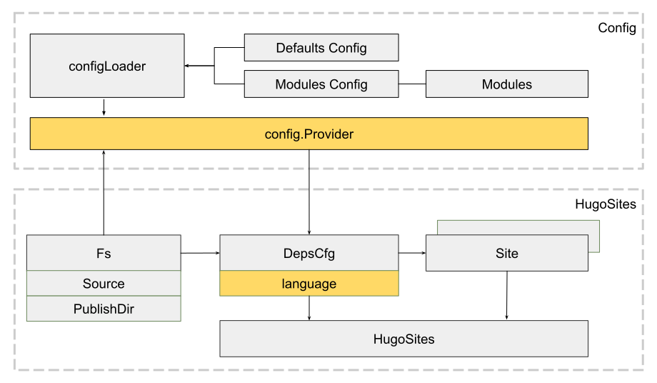
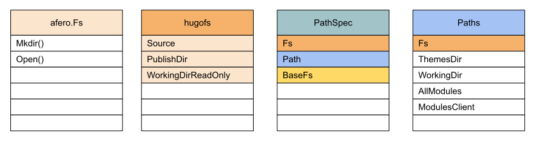
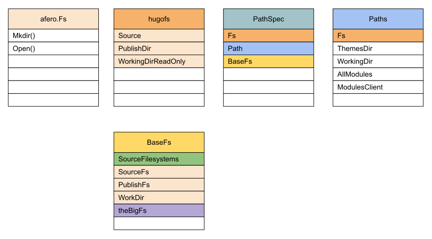
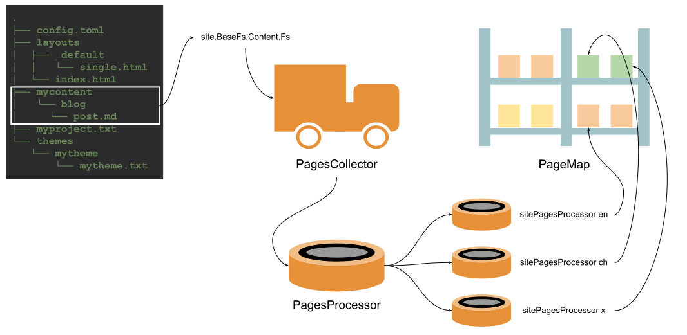
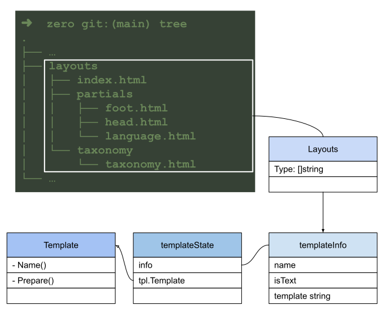
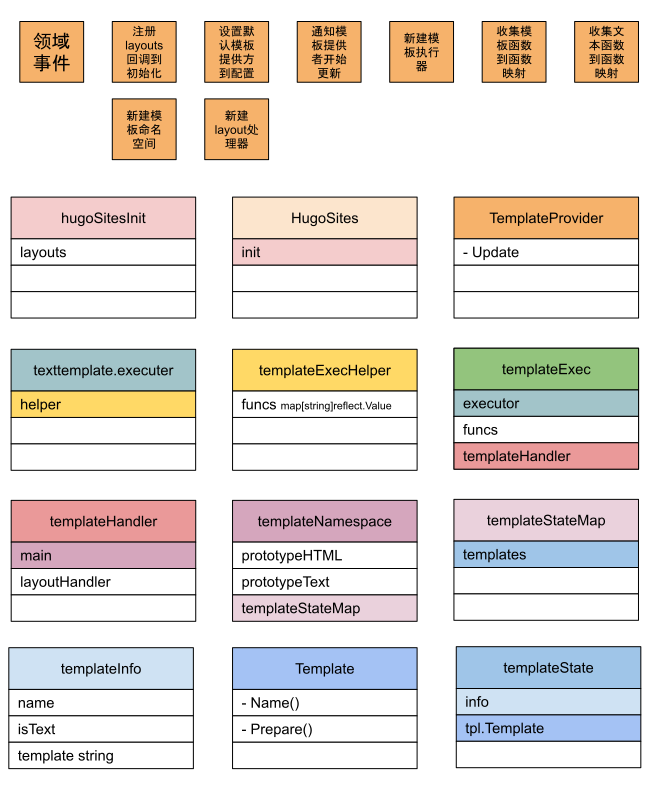
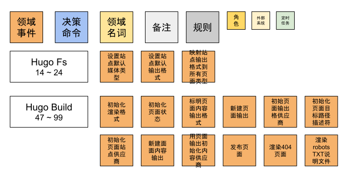
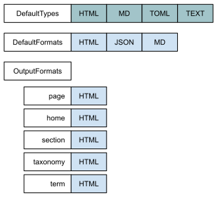
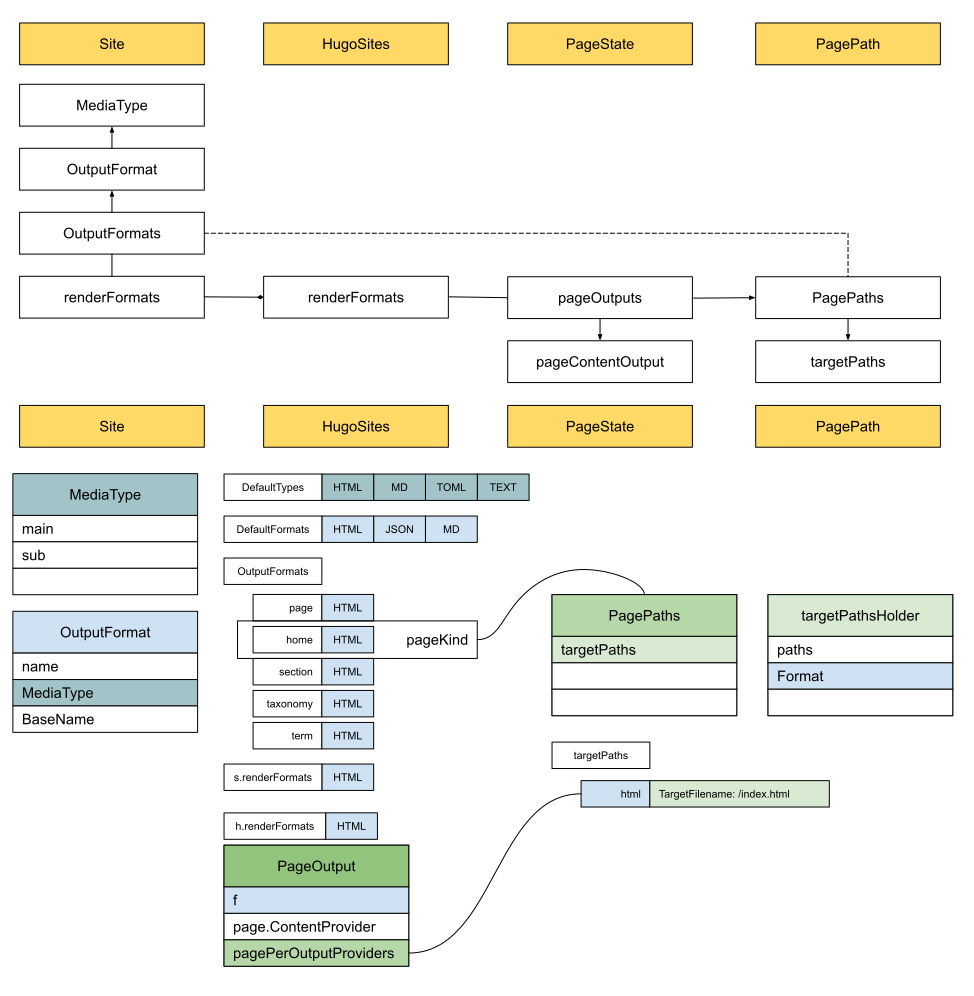

# Hugo的架构设计

本节的目标就是打开藏宝图来了解Hugo的基础架构，主要从以下两个方向展开：

* 对架构思路做一个概要说明，对基础架构有一个全貌的理解
* 从模块代码入手，讨论配置和语言的关系、Hugo的模块、文件系统的组织、站点内容的收集方案、模板的生命周期，以及发布的流程。

通过阅读本章内容，我们将会对Hugo这个站点构建工具有一个全面的认识，并对各阶段之间的关系有一个清晰地认识，为接下来详细源码实现讲解章节打好基础。

出发吧，伟大的工程师啊！

## 架构设计图

Hugo的主营业务就是构建静态站点。
那从代码架构层面，是如何体现出来Hugo的构建思路的呢？

站点构建就是将写好的内容，转化成Web服务器能理解的网站资源。
比如我们写作的时候用的是Markdown格式，生成的网站资源通常是HTML格式。

下面让我们一起来探索Hugo的架构。

从[Hugo本地环境搭建](../prerequisite)的样例项目中，我们可以看到Hugo是根据配置文件信息进行构建的，那我们可以先了解一下Hugo源码里的配置模块。

### 了解 config 模块信息

```shell
➜  hugo git:(master) ✗ tree -L 1 -d
.
├── bufferpool
├── cache
├── codegen
├── commands
├── common
├── compare
├── config
├── create
├── dddplayer
├── deploy
├── deps
├── docs
├── docshelper
├── helpers
├── htesting
├── hugofs
├── hugolib
├── identity
├── langs
├── lazy
├── livereload
├── main
├── markup
├── media
├── metrics
├── minifiers
├── modules
├── navigation
├── output
├── parser
├── public
├── publisher
├── related
├── releaser
├── resources
├── scripts
├── snap
├── source
├── testscripts
├── tpl
├── transform
└── watcher

43 directories
```

通过`tree`命令，很方便我们查找目录结构，很快就定位到了`config`目录。

**先查看一下config目录里所有的对象信息：**

```shell
➜  hugo git:(master) ✗ ~/go/bin/dp normal -m ./ -p github.com/gohugoio/hugo/config -d
```

通过上面命令，我们可以看到[config模块组成信息](https://dddplayer.com/?path=https://assets.dddplayer.com/resource/hugo/github.com.gohugoio.hugo.config.dot)，可得出以下结论：
* 有两个主要接口，一个是AllProvider，另一个是Provider。前者提供站点所有配置信息，包括语言、目录等信息；后者可提供Hugo项目主要配置信息。
* allconfig模块提供了站点主要的配置信息，看起来和AllProvider定位接近。

**接着查看一下allconfig的信息流**

```shell
➜  hugo git:(master) ✗ ~/go/bin/dp normal -m ./ -p github.com/gohugoio/hugo/config/allconfig -mf
```

这样我们可以看到[allconfig信息流](https://dddplayer.com/?path=https://assets.dddplayer.com/resource/hugo/github.com.gohugoio.hugo.config.allconfig.messageflow.dot):
* 到allconfig的主流程主要有两条，一条是 main -> commands -> hugolib -> allconfig，另一条是 main -> commands -> allconfig
* 两条主流程的入口都是调用allconfig模块的LoadConfig方法，

查看Hugo源码，查看方法定义:
```go
func LoadConfig(d ConfigSourceDescriptor) (*Configs, error){...}
```

发现返回的是Configs指针，不禁又想了解一下allconfig模块中对象之间的关系。

**allconfig模块组成**

```shell
➜  hugo git:(master) ✗ ~/go/bin/dp normal -m ./ -p github.com/gohugoio/hugo/config/allconfig -c
```

这样我们就可以查看[allconfig模块内对象的组成关系](https://dddplayer.com/?path=https://assets.dddplayer.com/resource/hugo/github.com.gohugoio.hugo.config.allconfig.composition.dot)了:
* Configs是对外提代的主要配置服务实例
* Configs的Base，指向的就是Config，Config又包含了RootConfig
* Configs还包含了模块信息和模块客户端信息
* Configs也包含了语言的配置信息，并且是复数形式

从DDD概念来看，Configs很像是配置这个领域的聚合根，是对外提供的主要服务，包含了所有相关的信息。


Hugo的架构设计图如下所示：


Hugo的架构思路很容易理解，主要分三大块，分别是配置模块，站点模块和依赖模块。

## 配置模块

Hugo最先解析的，就是用户项目的配置文件`config.toml`。
由`configLoader`发起，从硬盘读取配置文件，解析后存储为键值对对象。
`configLoader`主要需完成三件事，加载用户项目配置文件是第一件，用来理解用户的自定义需求。
第二件是补全默认配置`Defaults Config`，这样才能保其它模块正常运作。
第三件是生成模块配置信息，从用户项目开始，将用户项目作为第一个模块 - `project module`，在我们的实例中还有第二个模块，那就是主题模块`mytheme`。
模块之间有依赖关系，并且只有一个所有者`Owner`。
项目模块`project module`比较特殊，因为是初始模块，所以不属于任何其它模块。

```go
type Module interface {
	...
	// Owner In the dependency tree, this is the first 
	// module that defines this module as a dependency.
	Owner() Module
	...
}
```

所有信息收集齐全后，会对外提供`config.Provider`服务：可查询，可更新配置项。

## HugoSites模块

这是构建站点的核心模块，相当于DDD中的聚合根，内部组织构建站点所需要的全部信息，对外提供站点构建服务。

`HugoSites`的初始化依赖于`DepsCfg`和`Site`，没错，有两个site。
HugoSites和Site的关系是一对多，Site和Language的关系是一一对应的，所以多语言站点会为每一个语言创建一个站点，共同组成了HugoSites。

语言项是由DepsCfg创建的，但会存储在`config.Provider`中，所以都用浅黄色标明。
而DepsCfg的初始化则依赖于`Fs`和`config.Provider`。
`Fs`记载了源文件地址和发布地址。
源文件来自于用户项目，也就是实际的硬盘文件系统。
发布地址是获取自config.Provider，默认的是public文件夹，在这里会检测是否已经存在，如果没有则主动创建。
最后将新创建的信息如`workingDir`等信息同步回config.Provider。

可以看出，他们的依赖关系是`HugoSites <- Site <- Language <- DepsCfg <- Fs`。

## Deps模块

Hugo将构建站点所需要的所有服务和对象都称作依赖，全部放在了`Deps`中。

在构建依赖的过程中，会生成提供模板的`TemplateProvider`；
明确输入输出的媒体类型`MediaType`；和输出格式的`OutputFormats`；都会更新到`config.Provider`中。

也会为收集站点内容做好准备，会有`Page Collection`帮助收集。
最终发布站点时需要用到的发布服务则是`Publisher`。
这些都会更新到`Site`中。

同时，还需要将资源统一管理，明确规范，这样可以保障在使用时的便捷性，也符合面向对向设计原则中的单一职责原则。
包含提供统一标准文件结构服务的`Path Spec`；
和拥有所有媒体类型和输出格式信息的`Resources Spec`；
以及针对`Content`信息提供服务的`Content Spec`；
加上帮助定义资源策略，如过滤功能的`Source Spec`。

有了Deps的帮助，所有构建站点所需的信息，如原材料、规则和输出格式等，都已准备妥当。

万事俱备，只欠东风！

## Hugo的组件设计

架构图可以帮助我们从全局视角理解Hugo的架构设计。
现在让我们更近一步，从模块的角度来观察Hugo架构的细节

### 配置和语言的关系

Hugo提供了强大的配置功能，如配置文件、配置目录、配置主题等等。
构建站点过程中，只要是你能想到的定制化需求，基本都能通过配置实现。

为了满足不同的定制化需求，Hugo的思路是首先要处理好多配置文件之间的关系，所以需要合并一些配置项，这样就需要大小写不敏感。
定制化只是一小部分，其它的通用信息，就用默认配置来进行说明。

支持多语言是常见需求，现在好多软件遵循的策略就是国际化优先。
那Hugo是怎么理解语言和配置的关系呢？

在[个人站点](../../01/site)实例中，我们在`config.toml`中和语言相关的配置如下：

```toml
defaultContentLanguage = 'zh'
[languages]
[languages.zh]
  languageName = '中文'
  contentDir = 'content'
  weight = 1

[languages.en]
  languageName = 'English'
  contentDir = 'content.en'
  weight = 2
```
可以配置默认语言，支持的多语言有中文和英语。

那这样看来，配置应该包含语言。
也就是说语言应该是配置结构体中的一个字段。
而事实是这样的吗？

我们先从架构图中寻找线索：


可以看到，最终创建Language的地方是在DepsCfg，并不是Config。
这和我们的直觉是相反的，让我们来看看关键的config.Provider，DepsCfg和Language相关代码片断。

**config.Provider**

```go
// Provider provides the configuration settings for Hugo.
type Provider interface {
	...
	Get(key string) any
	Set(key string, value any)
	...
}
```

可以看出，Provider接口提供了`Get`和`Set`方法，就像一个key/value仓库。
那语言相关的配置同样也存储在了Provider里面。

**DepsCfg**

```go
// DepsCfg contains configuration options that can be used to configure Hugo
// on a global level, i.e. logging etc.
// Nil values will be given default values.
type DepsCfg struct {
	// The language to use.
	Language *langs.Language
	
	// The configuration to use.
	Cfg config.Provider

	...
}
```

DepsCfg中包含了config.Provider以及Language。

创建站点的时候，直接传入的就是DepsCfg:

```go
// newSite creates a new site with the given configuration.
func newSite(cfg deps.DepsCfg) (*Site, error) {
	...
}
```

在调用创建站点前，DepsCfg就已经把Language准备好了:

```go
func createSitesFromConfig(cfg deps.DepsCfg) ([]*Site, error) {
	...
	languages := getLanguages(cfg.Cfg)
	for _, lang := range languages {
		... 
		cfg.Language = lang
		s, err = newSite(cfg)

		...
	}
	return sites, nil
}
```

而从Language结构体可以看出：

```go
// Language manages specific-language configuration.
type Language struct {
	Lang   string
	Weight int // for sort

	// Global config.
	// For internal use.
	Cfg config.Provider
	
	...
}
```

Language是包含了Cfg config.Provider的。
也就是说Language和Config的关系实际上是包含关系，并不像我们上面感受到的那样。
仔细一想，合情合理。
Config专注提供配置key/value仓库管理服务，而Language和Site是一一对应的，需要其它配置信息补充说明。

### Hugo的模块

提到模块化，大家可能会想到的是Nginx模块，IDEA插件等等。
通常是我可以通过上传一些模块，来满足我的差异化需求。
之所以大家都喜欢这种模块，主要是因为足够灵活，不用费太大的劲就可以满足自身的需求。
因为很多时候，虽然大体上差不多，但总有一些细节上的差异。
这也正说明软件的复杂度，除了技术上的复杂度，还有业务上的复杂度。
大多数情况下，我们面对的主要是业务复杂度。
这也正是在软件领域，对"隔行如隔山"这句俗语最好的阐述。
如今，不仅互联网行业，金融行业，就算传统的制造业，都已经使用上了信息化系统，来帮助企业的生产和管理。
同样是请假系统，哪怕在同样的行业，不同的公司，都会有所差异。

而Hugo的模块和大家印象中的模块有点不一样，并不是以功能为单位，来满足差异化需求。
而是以目录结构为主，来识别相同的结构。

先来看看在我们架构中，模块的位置：


在架构图中，`Modules`需要统一组织起来，依赖于`Modules Config`描述信息，而这个信息的加载是由configLoader负责的。

我们再从源码来看一看实际的调用时序：


可以看出，在我们的游乐场中，由主函数，调用`LoadConfig`方法，并在该方法中为`Modules`做了两件事。
一件是`loadModulesConfig`，把和Modules相关的配置信息整理到Module Config中。
另一件则是`collectModules`，根据收集到的配置信息，按模块的标准，将模块信息标准化。

先来看看`Module Config`的源码定义：

```go
// Config holds a module config.
type Config struct {
	Mounts  []Mount
	Imports []Import

	// Meta info about this module (license information etc.).
	Params map[string]any
}
```

可以看出，重要字段有两个，一个是Mounts，一个是Imports。
`loadModulesConfig`中主要是对Imports字段进行处理，在我们实例中：
```
-- config.toml --
theme = "mytheme"
...
```
主题的配置信息是`theme = "mytheme"`，解析成模块配置信息就成了`c.Imports = [mytheme]`。

接下来就是收集模块`collectModules`了：
```go
func (l configLoader) collectModules(modConfig modules.Config, ...) (modules.Modules, ...) {
	...
}
```
传入刚收集到的模块配置信息，输出标准的模块信息。
而我们刚收集到的配置信息只有Imports有值，并且只有一个值"mytheme"，输出实例如下图所示：
```go
fmt.Printf("%#v\n", modulesConfig)

modules.Config{
	Mounts:[]modules.Mount(nil), 
	Imports:[]modules.Import{
		modules.Import{
			Path:"mytheme", 
			...
	}}, 
	Params:map[string]interface {}(nil)
}
```

**为什么Hugo管Theme叫模块呢？**

输入以下命令，创建一个站点：
```shell
➜  tmp hugo new site xyz
```
查看目录结构：
```shell
➜  xyz tree
.
├── archetypes
│   └── default.md
├── config.toml
├── content
├── data
├── layouts
├── public
├── static
└── themes

7 directories, 2 files
```

再输入以下命令，创建一个主题:
```shell
➜  tmp hugo new theme mytheme
```
同样查看目录结构：
```shell
➜  mytheme tree
.
├── LICENSE
├── archetypes
│   └── default.md
├── layouts
│   ├── 404.html
│   ├── _default
│   │   ├── baseof.html
│   │   ├── list.html
│   │   └── single.html
│   ├── index.html
│   └── partials
│       ├── footer.html
│       ├── head.html
│       └── header.html
├── static
│   ├── css
│   └── js
└── theme.toml

7 directories, 11 files
```

我们把Site和Theme的目录结构放在一起比对一下：


通过对比，我们不难发现，目录结构基本上是一到的，都包含了`archetypes`, `layouts`, `static`等等。

在Hugo官网中，有对[目录结构](https://gohugo.io/getting-started/directory-structure/)有明确说明。
从源码中也可以看到：
```go
// hugo-playground/hugofs/files/classifier.go

const (
	ComponentFolderArchetypes = "archetypes"
	ComponentFolderStatic     = "static"
	ComponentFolderLayouts    = "layouts"
	ComponentFolderContent    = "content"
	ComponentFolderData       = "data"
	ComponentFolderAssets     = "assets"
	ComponentFolderI18n       = "i18n"
)

var (
	ComponentFolders = []string{
		ComponentFolderArchetypes,
		ComponentFolderStatic,
		ComponentFolderLayouts,
		ComponentFolderContent,
		ComponentFolderData,
		ComponentFolderAssets,
		ComponentFolderI18n,
	}
)

```
可以看出，Hugo通过标准化目录结构的方式，让每一个模块都遵循这一统一原则，这样无论在解析主题还是用户项目的时候，都有章可循。

再看看Hugo对[模块](https://gohugo.io/hugo-modules/configuration/)的说明：
> Hugo Modules are the core building blocks in Hugo.
> A module can be your main project or a smaller module providing
> one or more of the 7 component types defined in Hugo:
> static, content, layouts, data, assets, i18n, and archetypes.

也就是说
`static, content, layouts, data, assets, i18n, and archetypes`
这7个组件的任意组合，我们都认为是符合模块的要求。

Hugo的模块是基于Go Modules构建的，使用起来也很方便：
```toml
[module]
[[module.imports]]
  path = 'github.com/sunwei/zero'
```
也就是说，我们现在加载主题可以通过加载模块的形式，不用再把主题以git submodule的导入，更方便，更合理了。

搞清楚为什么主题也是模块后，我们再一起看下最终，我们得到了什么样的模块详细配置信息：

```go
// hugo-playground/hugolib/config.go 
// line 140
...
log.Process("collectModules", "set active modules to config with key 'allModules'")
for i, m := range moduleConfig.ActiveModules {
    fmt.Println(i)
    fmt.Printf("%#v\n", m)
}
...

Output:

==> Process collectModules: set active modules to config with key 'allModules'
0
&modules.moduleAdapter{path:"project", ... projectMod:true, owner:modules.Module(nil), 
	mounts:[]modules.Mount{
	    modules.Mount{Source:"mycontent", Target:"content", Lang:"en"}, 
	    modules.Mount{Source:"data", Target:"data", Lang:""}, 
		modules.Mount{Source:"layouts", Target:"layouts", Lang:""}, 
		modules.Mount{Source:"i18n", Target:"i18n", Lang:""}, 
		modules.Mount{Source:"archetypes", Target:"archetypes", Lang:""}, 
		modules.Mount{Source:"assets", Target:"assets", Lang:""}, 
		modules.Mount{Source:"static", Target:"static", Lang:""}}, ...}
1
&modules.moduleAdapter{path:"mytheme", ... projectMod:false, owner:(*modules.moduleAdapter)(0xc00019e410), 
	mounts:[]modules.Mount(nil), ...}

```
从输出结果看，一共有两个模块，一个是`project`，另一个是`mytheme`。
因为在我们的实例中，`mytheme`只有一个txt文件，七个组件中的任何一个都没有，所以mounts为空，而project模块则有每个组件的Mount。

Hugo通过巧妙的标准化目录结构设计，实现了Hugo Module。
强大的拓展性和便捷性，让用户可以专注于内容创作，个性化也得到了大大的满足。

### 文件系统的组织

Hugo目前主要的操作都是对本地文件进行的。
比如读取配置信息、模版信息、博客内容，写入站点信息等等。
因为这些操作都离不开文件系统，Hugo因此对文件信息的组织做了许多工作，以确保调用方良好的使用体验。

#### Afero

首先是选择基础文件系统[afero.Fs](https://github.com/spf13/afero):

> Afero is a filesystem framework providing a simple,
> uniform and universal API interacting with any filesystem,
> as an abstraction layer providing interfaces, types and methods.
> Afero has an exceptionally clean interface and simple design without needless
> constructors or initialization methods.

Afero提供的服务基本和Golang原生Fs接口一致，其次兼容多操作系统，这样就既对语言兼容，还对系统兼容，并且使用体验还和原生一致。
确实为Hugo提供了良好的文件系统基础。

为了直观查看Hugo中多种Fs的关联，我们把afero.Fs标作如下结构，包含文件系统的基础操作样例：


#### Hugo架构中的Fs

我们再来回顾下，Hugo架构中Fs应用的场景：


最先出现的是Fs，用来记录最贴近真实目录的文件系统，作为DpesCfg的参数，最终由HugoSites创建Deps的时候，透传给了Deps。
Deps是真正组织构建整个文件系统体系的模块，最终用PathSpec将前面的原始文件系统组织成了Hugo所需要的文件系统。
最终供给Template和Page相关操作使用。

#### HugoFs

我们先看基础的Fs，也就是HugoFs：


可以看到，基础hugoFs包含输入源Source，和输出目标地址PublishDir，以及用来只读的WorkingDir。
并且第一项都是afero.Fs类型，所以颜色和afero.Fs颜色一致。
后面也会用来颜色来对不同类型的文件系统进行关联。

#### PathSpec

通过上面的Hugo架构图我们知道，最终HugoFs被传入Dpes，并由PathSpec来统一组织和管理所有路径相关信息：



从上图看出PathSpec包含了hugoFs和Paths，还有另一个重要的BaseFs。

先看Paths，包含了基础文件系统，还包含了主题和工作目录信息，以及Modules相关的信息。
基于Fs和Path，PathSpec需要消化这些基础信息，并提供完整的文件系统服务。

#### BaseFs

通过准备好的基础信息hugoFs和Paths，BaseFs不仅要提供一些基础服务，比如源文件系统和发布目标文件系统，以及工作目录等相关信息。
还需要按Hugo要求的基础目录对文件进行组织，像Content, Data, i18n, Layouts, Archetypes, Assets。
并且要求严格按模块加载顺序，提供最终的文件服务，比如用户在工程目录增自定义了一些模板，需要覆盖主题里自带的模板时。



如上图所示，BaseFs用SourceFilesystems来对基础目录进行组织，用theBigFs来提供最终合并文件系统服务。

#### SourceFilesystems


想要映射出Hugo的基础文件结构，Hugo设计出了对应的结构SourceFilesystems来表示，并用字段一一对应。
每一项又具有共同的特征，既SourceFilesystem。

大家可以回忆下，在上一节[Hugo的模块](#hugo的模块)中有提到，每一个模块是如何在Mount中存储这些信息的。

#### theBigFs


多模块会生成多个相同结构的文件系统，谁在前，谁在后，由模块配置信息决定。
那最终如何合并这些文件系统呢？
由上图可以看出，Hugo给出的答案是Overlay，工作原理可参考[Wikipedia OverlayFS](https://zh.wikipedia.org/wiki/OverlayFS)。

Overlay的组织是由filesystemCollector来进行的，用到了文件元数据FileMetaInfo来进行描述，方便相关的文件操作，如查询，排序等。
在生成最终状态的Overlay视图前，需要RootMappingFs来帮助组织按Content, Static等进行分类的文件系统。
最终由Collector来将对应的文件放到对应的集合中。

有了以上这些组织好的文件系统后，想想可能的应用场景？

#### 文件系统场景一 - ContentSpec

```go
// hugo-playground/deps/deps.go
// line 145
log.Process("New content Spec", "content converter provider inside")
contentSpec, err := helpers.NewContentSpec(cfg.Language, ps.BaseFs.Content.Fs)
```

准备好PathSpec后，ContentSpec的创建立马就用到了Content.Fs，也就是SourceFilesystem.Fs，依赖于theBigFs.overlayMountsContent。

#### 文件系统场景二 - loadTemplates

```go
// hugo-playground/tpl/tplimpl/template.go
// line 340
if err := helpers.SymbolicWalk(t.Layouts.Fs, "", walker); err != nil {
    if !os.IsNotExist(err) {
        return err
    }
    return nil
}
```

在加载用户自定义模板时，就用到了`Layouts.Fs`。
通过walker对文件系统中的模板文件进行相应的处理，依赖于`b.theBigFs.overlayDirs[files.ComponentFolderLayouts]`

结合以上文件系统的设计和应用，我们可以感受到Hugo文件系统的设计需求来自于自身的特点。
因为用到了模块的理念，以及模块基础结构的设计。
基础的hugoFs并不能满足Hugo在操作文件系统过程中的所有需求，因此需要进一步封装。

Hugo的做法是用PathSpec来组织所有信息，隐藏复杂度，抽象出BaseFs提供更为贴近使用场景的综合服务。
用SourceFilesystems组织出符合Hugo基础结构特点的直观服务，并用OverlayFs底层技术，实现了多文件系统合并的需求，最终支持到真正的实际使用场景。
包括提供文章内容服务的Content文件系统，和加载自定义模板时的Layouts文件系统，等等。

### 站点内容的收集方案

[文件系统的组织](#文件系统的组织)已经帮我们将用户站点项目按Hugo基础组件的结构进行了组织。
我们从`BaseFs.Content.Fs`可以直接获取站点内容的文件系统索引，可以直接读取文件信息，生成站点面面了。

但Hugo不这么认为，我们可以用下面两个场景来了解一下Hugo的鸿鹄之志。

**场景一：Headless Bundle**

有一种页面，我们不希望她单独作为一个页面来发布。
但可以在需要她的时候，以变量的形式获取到她。
这就是Hugo对这种需求提供的解决方案：[Headless Bundle](https://gohugo.io/content-management/page-bundles/#headless-bundle)。

如果直接遍历文件系统，我们在处理该文件的时候，需要知道她的类型，如果是Headless类型的，就不按常规类型处理。
那文件类型就需要在解析文件的时候，从文件信息中获取到。
页面类型的信息可以放在文件配置中，也可以通过特殊的命名规则来表明，此类方案还有许多。

如果其它的页面依赖于Headless页面，就要考虑页面解析顺序所带来的问题。
如果Headless在前面被解析，就要存储好相关索引信息，以方便后续依赖于她的文件进行查询。
如果在其它页面之后解析，可能的方案是将之前处理的页面标记为未完成状态，并指明所依赖的Headless页面，并挂起等待条件成熟时被唤醒。
等相应的Headless页面解析完成后，时机成熟时，恢复之前页面的解析流程。
这种方案在依赖的Headless页面较多的情况下，会出现不断挂起的状况。
加上这些配置都依赖于手工维护，解析效率和正确性都很难保障。


**场景二：Page Resources**

Hugo Page可以包含不同的资源，常见的有图片类型的，还有音频、视频、数据、压缩包等等多种类型的资源。

下载页面会提供资源的下载链接，比如软件的安装包，针对不同的操作系统，会提供不同的版本。
Hugo可以很聪明的识别，哪个文件是页面文件，哪些页面是资源文件，并将资源文件信息放在页面的`Resources`属性里。
这样就方便用户根据页面，来灵活组织这些资源，可以生成一个某一类型软件的下载汇总信息，还可以生成某一章节的下载软件信息。

如果直接遍历文件系统，每个文件都是相对独立的，需要通过配置信息或者其它的方式标明同一层级的从属关系，还要标明不同层级之间的引用关系。
这些都需要在全局构建信息中存储。
因为互相独立，遍历过程中又会有先后顺序，关系越复杂，重复信息出现的概率就会越高。
当有新的需求出现时，复杂的逻辑处理也不利于软件的拓展。

从以上两个场景中，可以观察到。
简单的遍历文件系统，确实可以获取基本的文件信息。
但如果需要灵活地组织各种不同的信息，如依赖关系，资源汇总等等跨页面处理场景，我们还需要进一步对站点内容进行发掘，以页面为单位进行组织和管理。

#### 磨刀不误砍柴工

在源码中看们看到到Hugo正式收集站点内容是在`Hugo Build`阶段，之前其实都是在做准备。


#### 分工明确，高效协作

电商现在的状态已然不是正在融入我们的生活，而是成为了我们生活的一部分。
并且过了拼产品类目的时期，基本上你家有的，我这也有。
现在拼的更多的是特色，和服务。
既然是特色，那每家多多少少都有些不一样。
而服务，基本上都是相同的，其中最重要的要属快递服务。
谁能以最短的时间将包裹送达消费者手中，谁将最容易获得消费者的认可，从而占有更高的市场份额，获得投资者的青睐，进入良性的循环发展。

Hugo也认同最短时间送达这样的服务理念。
拿到待处理的内容后，立马出库装车送到离消费者最近的分拣中心，再由高效的分类机器人对货品进行分类。

**Hugo对内容处理的目标**


在我们的样例中，我们的Content就是`mycontent`目录所代表的文件系统，经过`PathSpec`处理后，文件系统可通过`site.BaseFs.Content.Fs`得到。
最终，Hugo需要对内容文件系统中的所有内容进行分类，并存放在PageMap货架上，这样方便快递小哥快速取货，装车并将包裹送达用户手中。

那Hugo到底是怎么做到的呢？

**陆地集装箱 -- 大卡车**


在实际生活中，包裹会从全球各地通过分拣中心网络，靠大卡车运输到离消费者最近的分拣点。
而Hugo的"大卡车"就是PagesCollector，不像现实世界那么复杂，货物都在`site.BaseFs.Content.Fs`中。

**分拣机器人**


等货物运到分拣中心后，经过不断对分拣效率进行优化，现在已经做到可以完全自动化。
PagesController将所有文件送达后，自动分拣机器人PagesProcessor便开始工作，无缝衔接。
为了提高处理效率，Hugo为每一个站点都提供了一个机器人，由PagesProcessor负责分发任务，sitePagesProcessor专注处理自己所擅长的语言类别。

通过明确的分工，高效的协作，最终将所有文件分门别类，规整的放在中心货架上。



### 模板的生命周期

在[Hugo事件风暴](事件风暴.md)中，我们了解到Hugo的设计理念 - 给用户提供始终如一的轻松写作体现。
而实现这一理念则是以Golang Template为基础，开发出更多实用功能，让内容创造者专于内容创作的同时，还拥有良好的体验。

让我们回顾一下Golang Template的实现步骤：


再看看Hugo是如何围绕其展开的：


Hugo围绕着Golang Template做了很多设计，现在我们通过和模板相关的领域事件，一起来看看模板的生命周期，从而能够有更全面的理解。

#### Hugo模板生命周期领域事件

还是从领域事件入手，来看看有哪些关键事件和模板强相关：


除了上面和Golang Template一一映射的事件外，还有更细节的事件，为了直观好看，我们把这些事件收集到一起来进行分析：


可以看到和模板强相关的事件，主要集中在创建HugoSites和Build阶段。
进一步细分，可发现模板生命周期可分为三个阶段：

1. 开始阶段，包括注册回调，并选定模板服务提供方，并出发模板更新。
    * 注册layouts回调到HugoSites初始化字段
    * 设置默认模板提供方到配置项
    * 通知模板提供者开始更新
2. 准备阶段，包括准备好模板执行器，收集模板相关的功能函数，解析Hugo内置和用户自定义模板，将所有模板存储到模板命名空间，以及用layout处理器连接layout和模板。
    * 新建模板执行器
    * 收集模板函数到函数映射
    * 收集文本函数到函数映射
    * 新建模板命名空间
    * 新建layout处理器
3. 渲染阶段，准备好页面内容后，回调在开始阶段注册的layouts事项，通过layout处理器查找相应的模板，最终用模板进行渲染，生成站点页面
    * 为内容结点创建页面
    * 回调layout注册项进行初始化
    * 为页面查找模板
    * 用模板渲染页面

事件可以帮助我们清晰地了解到Hugo设计的模板生命周期。
下面我们再通过[Hugo游乐场](游乐场.md)源码梳理一遍具体实现流程，好让我们能更立体地了解到模板生命周期，同时也可以为后面的代码实现讲解章节做好准备。

**Template vs Layouts**

我们先来看看Hugo中两个容易混淆的概念，Template和Layouts。

在创建[自定义Hugo主题](../what/自定义主题.md)的时候，我们接触最多的就是Layouts。
官方文档解释Layouts就是用来当模板的，这样解释并没有问题，但这会让我们很容易产生一种Layouts既模板的错觉，并将Layouts和模板直接划上等号。

但真的是这样的吗，让我们从代码层面看看他们的关联：



通过查看新建主题的目录结构，我们会发现自动生成的的文件主要在layouts目录下，里面有首页模板，还有页头和页尾模板，等等。
在代码中，Layouts的出现通过都是以`[]string`字符串数组的形式出现的。
也就是说在**代码中Layouts就是用来记录layout相关的文件路径信息**的。

如果想将Layouts转换成Golang Template，首先需要将其转换成`templateInfo`。
并记录文件名，分析是否是文本类型，将layout文件内容以字符串存储在tempalte字段中。

其中是否是文本类型，涉及到Golang Template的设计知识。
> Golang将Template按类型进行了划分。如HTML和Text，通过对HTML标签进行转换，最终也会被转换成Text。
> 说到底，通过对不同模板类型的转换，都会变成文本类型。

通过templateInfo，最终Hugo会生成真正的Hugo模板结构体`templateState`。
可以看出该结构体实现了`Template`接口。

所以我们可以得出结论：Layouts不等于Template，是制作Template的原材料。

弄清了Template和Layouts之间的关系，我们分别来看看Template生命周期中的开始、准备和渲染阶段。

**开始阶段**


`HugoSites`中的init字段是`hugoSitesInit`类型的，其中就包含了lazy.init类型的layouts。
这样就可以在layouts字段注册一些回调方法，方便在时机成熟的时候回调。

同时，对于HugoSites而言，直接面对的是模板服务的提供商，所以需要在这个阶段将`TemplateProvider`作为提供商，设置在配置信息中。
等信息都准备妥当后，就可以通知模板服务提供商开始工作更新了。

**准备阶段**


对外提供整体服务，并和Deps关联的是`templateExec`。
包含了`texttemplate.executer`和`templateHandler`，以及所有的模板功能函数。
颜色表明各结构之间的关联关系。

可以看出，`texttemplate.executer`包含了`templateExecHelper`，因为在执行的过程中，通过对模板的分析，可能会用上功能函数。

而`templateHander`则需要处理和template相关的一些操作。
`main`字段是`templateNamespace`类型，里面存储了HTML和Text原型信息，并存储了由原型创建的所有`templateState`在`templateStateMap`中。
`layoutHandler`则是连接layout和template的关键，比如通过layout查询template时，就由layoutHandler全权负责。


**渲染阶段**

结合开始阶段和准备阶段一览：



通过前期的准备和组织，我们来看看渲染阶段是怎么发生的：


页面渲染发生在`site_render.go`中，从`pageRender`正式开始。

总共分为两大步，一是`page.resolveTemplate`解析模板，拿到模板后再开始`site.renderAndWritePage`渲染和写入页面。

1. 解析模板
   因为Site组合了Deps，所以也和Deps一样，同样持有`templateExec`信息，通过调用`templateExec`的`LookupLayout`方法，查询模板信息。
   因为这些模板信息都已经存储在了`templateNamespace`里的`templateStateMap`中。

2. 渲染页面
   在`pageRender`中已经拥有了页面信息`pageState`，通过上一步又获取了模板信息，所以是时候开始真正地`site.renderForTemplate`渲染了。
   还是通过`templateExec`调用`Execute`方法。
   因为当前的执行器是`texttemplate.executer`类型，所以真正地执行是在`texttemplate.executer`的`ExecuteWithContext`方法中。
   这里是直接用的Golang Template源码，而不是调用Golang的默认包。
   因为Golang默认包中自带的功能函数，并不能完全满足Hugo的诉求。
   在后续代码实现章节将会详细讲述，这里还是专注在基础架构的初步理解上。

#### 小结


从Golang Template应用示例开始，我们了解到了Golang中模板工作的基本流程。
这有助于我们进一步理解Hugo的设计和实现。

通过对Hugo领域事件中模板强相关的核心事件进行分析，我们将Hugo模板的生命周期大致分为三个阶段：开始、准备、渲染。

为了立体的理解模板生命周期，我们不仅从领域事件进行梳理，还从代码结构进行分析。
看到了Hugo是基于HTML和Text模板原型，帮助将所有的Layouts转换成Template，并存储在了Template命名空间中。
还看到为了拓展Golang Template的功能，Hugo将强大的自定义函数保存在了执行器中。
这让模板在渲染过程中，有了更多的帮手。
而这一切，都封装在了对外统一提供的服务`templateExec`中，不仅对内进行封装，还对外提供了便捷。

还有更多有意思的事情，比如Hugo为什么不能直接用Golang内置的Template包，而要独立维护？
我们也会在后续代码实现章节，进一步展开讲解。
和大家一起，一探究竟。

### 发布的流程

通过[模板的生命周期](#模板的生命周期)我们可以看到在最后的渲染阶段，先找到页面的Template，然后对页面进行渲染。
这样我们就有了根据模板生成的待发布内容。

站点发布主要的任务就是将作者所创作的内容，通过模板转换生成待发布的内容，按照站点的输出格式，写入到我们指定的文件目录。

那这里就会有两个问题：
1. 作者所创作的内容是怎么存储在页面中的，又要怎么使用呢？
2. 发布过程中的信息，如输出格式、文件名、写入地址又是谁提供的呢？

我们还是从Golang Template基本原理出发:


在index.html模板中，我们计划用`{{.Content}}`属性来获取内容。
如果要成功获取，就需要在我们的内容提供商`Post`实例中，在Content字段设置上正确的值。
如果都按约定准备好后，在最终Golang Template执行结果中，我们就能发现右上角的内容。

在我们的[游乐场示例](游乐场.md)中，我们也有一个用到了`.Content`的layout - `layouts/_default/single.html`：
```
-- mycontent/blog/post.md --
---
title: "Post Title"
---
### first blog
Hello Blog

-- layouts/_default/single.html --
{{ .Content }}
===
Static Content
===

```
single.html会用做独立页面的模板，如上面的`mycontent/blog/post.md`。
通过模板渲染过后，`post.md`中的内容就会替换掉`single.html`中的`{{ .Content }}`。

那Hugo的页面对象PageState又是怎么提供内容服务的呢，也和上面一样，放在属性里吗？
我们在[Hugo Playground](https://github.com/sunwei/hugo-playground)源码中，很快找到了答案：

```go
// Page is the core interface in Hugo.
type Page interface {
	ContentProvider
	...
}

// ContentProvider provides the content related values for a Page.
type ContentProvider interface {
    Content() (any, error)
	...
}
```

没错，就是ContentProvider。
可以看出Golang Template不仅支持属性，同时还支持方法。
共同的特点就是要对外可见 - 都是大写字母开头。

那上面的两个问题就变得更具体了：
1. PageState中的ContentProvider是谁？
2. 发布流程中所需的详细信息是怎么来的？

**发布相关的领域事件**

同样，我们还是可以通过[领域事件风暴](事件风暴.md)中，发布相关的领域事件入手：


可以看到，关键时机有两个。
一个是在站点Site创建的时期，另一个则是在构建时期。

让我们专注在和发布相关的事件上：



这些事件的解读在[领域事件风暴](事件风暴.md)中有具体描述，这里就不再赘叙。

结合[源码](https://github.com/sunwei/hugo-playground)，我们进一步将上述事件转换成代码流程图：


不出所料，为PageState提供内容和其它信息服务的对象确实存在，那就是`pageOutputs`。
但心中不禁升起一丝疑问，为什么是个复数？

```go
// We create a pageOutput for every output format combination, even if this
// particular page isn't configured to be rendered to that format.
type pageOutput struct {
	...

	// These interface provides the functionality that is specific for this
	// output format.
	pagePerOutputProviders
	page.ContentProvider
	
	...
}

// these will be shifted out when rendering a given output format.
type pagePerOutputProviders interface {
    targetPather
	
	...
}
```
通过查阅上述源码定义，我们更加确定了我们分析的正确性。
`PageOutput`确实如我们所料，提供了`ContentProvider`服务和`targetPather`服务，这样我们前面的两个问题就有了着落。
再加上注解：
> We create a pageOutput for every output format combination, even if this
> particular page isn't configured to be rendered to that format.

我们发现pageOutput是和output format一一对应的，也就是说有多少种输出格式，就有多少个pageOutput，这也解释了上面关于复数的疑问。

那究竟是个什么样的对应关系，为什么要这样设计呢？
让我们还是结合上面的流程图来进行分析。

**站点创建时做的准备工作**


我们先看在创建Site的时候，都准备了哪些和发布相关的信息。
上图右边是流程图站点的部分，从对象引用关系来看，可以了解到OutputFormats依赖于OutputFormat，但不是聚合关系。
而OutputFormat又依赖于MediaType。

**MediaType**

从上图左侧的结构图可以看出，OutputFormat是拥有MediaType字段的。
在MediaType包含的主要字段是main和sub。

那这些字段是干什么用的呢？
我们可以通过上图中间的部分来进一步了解。
在Hugo的DefaultTypes中，经过简化，我们保留了HTML, MD, TOML, TEXT四种类型。
拿HTML MediaType举例，实际上长这样`text/html`。
没错main字段就是text，而sub字段才是html。
因为首先HTML媒体类型的文件是以文本形式存储在磁盘上的，然后才是内容是以HTML格式进行组织的。
关于Media Type的详细介绍，可以参考[Wikipedia](https://en.wikipedia.org/wiki/Media_type)。

**OutputFormat**

再来看看OutputFormat：

```go
// Format represents an output representation, usually to a file on disk.
type Format struct {
   // The Name is used as an identifier. Internal output formats (i.e. HTML and RSS)
   // can be overridden by providing a new definition for those types.
   Name string `json:"name"`
   
   MediaType media.Type `json:"-"`
   
   // The base output file name used when not using "ugly URLs", defaults to "index".
   BaseName string `json:"baseName"`
   
   ...
}
```

通过注解可以看到，实际的作用就是记载了要将一个文件输出到磁盘上的相关说明信息。
比如BaseName的默认值就是index，首页就会用到，默认文件名是index.html。

Hugo提供的`DefaultFormats`根据我们的示例简化后，保留了HTML, JSON, MD三种。
其中HTML是指我们将以HTML的输出格式将文件写入到磁盘。

实例如下：
```go
HTMLFormat = Format{
     Name:          "HTML",
     MediaType:     media.HTMLType,
     BaseName:      "index",
     Rel:           "canonical",
     IsHTML:        true,
     Permalinkable: true,

     // Weight will be used as first sort criteria. HTML will, by default,
     // be rendered first, but set it to 10 so it's easy to put one above it.
     Weight: 10,
 }
```

**OutputFormats**

如果OutputFormats和OutputFormat不是聚合关系，那又是什么关系呢？

我们直接来看看OutputFormats的结构，就清楚答案了。



这里的OutputFormats实际上就是按照Hugo页面的五种类型，分别提供的OutputFormat映射关系。
如果是home类型的页面，那这种类型的页面只提供按HTML格式渲染的结果，而不是其它的格式，如JSON。
也就是说**在一个站点下，会为每个类型的页面都定义清楚合法的输出格式**。
这将会有效保障页面在渲染的过程中，输出格式的有效性。

**renderFormats**

有了全面的站点页面输出规范后，为什么还要这个renderFormats呢？


从上图右下角可以看到，实际上renderFormats来自于outputFormats。
是将所有页面的outputFormats合并，去重后产生的。
可以理解为renderFormats代表着这个站点所有输出的类型。
在我们的实例中，因为所有页面只支持HTML一种类型，所以合并去重后，自然我们这个站点的renderFormats只有一个，就是HTML了。

从值的角度我们已经知道了两者之间的关联了，那为何Hugo要设置一个renderFormats呢？
从名字上看是以站点Site为单位，可以理解为站点在渲染时所有的渲染格式。

那为什么HugoSites也有一个一模一样的renderFormats呢？
从上图左上方可以看出，Site的renderFormats组成了HugoSites的renderFormats。
这个好理解，因为HugoSites是由多个不同语言的Site所组成的，那就是说HugoSites的renderFormats代表了全站点的渲染格式。

继续通过上图往右看，可以发现更多的线索。
原来pageOutputs和HugoSites的renderFormats是一一对应关系，也就是说全站点有多少种渲染格式，就有多少个pageOutputs。

这里不禁又冒出另一个大大的问号 - 每个站点都拥有自己的页面，也都有自己的输出格式，**为什么要为单个站点页面提供全站点输出格式的pageOutputs呢？**

同样，我们还是可以从源码中找到答案：
```go
// hugo-playground/hugolib/page__new.go
// line 97

// Prepare output formats for all sites.
// We do this even if this page does not get rendered on
// its own. It may be referenced via .Site.GetPage and
// it will then need an output format.
ps.pageOutputs = make([]*pageOutput, len(ps.s.h.renderFormats))
```

从上面的代码中可以看到，这样设计的原因是页面可能会被其它的页面引用，甚至被不同语言的页面所调用。

对应的`.Site.GetPage`功能函数在多语言使用场景下的[具体说明](https://gohugo.io/functions/getpage/#getpage-and-multilingual-sites)如下：
> The previous examples have used the full content filename to lookup the post.
> Depending on how you have organized your content (whether you have the language
> code in the file name or not, e.g. my-post.en.md), you may want to do the lookup
> without extension. This will get you the current language’s version of the page:

```go
{{ with .Site.GetPage "/blog/my-post" }}{{ .Title }}{{ end }}
```

既然存在跨站点调用的情况，那就得为调用方准备好调用方所需要的输出格式。
这样回过头来看，为每个页面pageState准备全站点渲染格式的pageOutputs是必需的。

**pageOutputs**

在发布流程中，除了内容，还有一些基础信息也很重用，如发布到哪，以什么名字写入等等。
pageOutput做为输出信息的总载体，这些信息自然了也包在其中，通过上图右上方可以看到负责提供这些信息的对象是PagePaths。
其中提供目标文件名的则是其中的targetPaths。

**PagePaths**

细心的小伙伴会发现Site的OutputFormats和PagePaths之间有一条虚线连接。
之所以是虚线，是因为PagePaths实际上是从pageMeta中获取的信息，但根源，实际上还是来源于Site的OutputFormats。

结合中下方有进一步实样例解释。
可以看到PagePaths会根据当前页面pageState的类型`pageKind`来获取当前类型的OutputFormats。
会根据每一种OutputFormat生成相应的targetPathsHolder。

根据每一个PageOutput的OutputFormat类型，选中相应的targetPathsHolder，设置在`pagePerOutputProviders`之中。
这样在渲染页面时：
```go
func pageRenderer(
	ctx *siteRenderContext,
	s *Site,
	pages <-chan *pageState,
	results chan<- error,
	wg *sync.WaitGroup) {
	defer wg.Done()

	for p := range pages {
		templ, found, err := p.resolveTemplate()
		...
		targetPath := p.targetPaths().TargetFilename

		if err := s.renderAndWritePage("page "+p.Title(), targetPath, p, templ); err != nil {
			fmt.Println(" render err")
			fmt.Printf("%#v", err)
			results <- err
		}

		...
	}
}
```
就可以通过`p.targetPaths().TargetFilename`获取到目标文件名了。

#### 独立页面的发布流程

Hugo将页面分成了两大类，一类就是上面介绍的常规页面，另一类就是接下来要看的独立Standalone页面，如404页面。

```go
func (s *Site) render404() error {
	p, err := newPageStandalone(&pageMeta{
		s:    s,
		kind: kind404,
		urlPaths: pagemeta.URLPath{
			URL: "404.html",
		},
	},
		output.HTMLFormat,
	)
	if err != nil {
		return err
	}

	if !p.render {
		return nil
	}

	var d output.LayoutDescriptor
	d.Kind = kind404

	templ, found, err := s.Tmpl().LookupLayout(d, output.HTMLFormat)
	if err != nil {
		return err
	}
	if !found {
		return nil
	}

	targetPath := p.targetPaths().TargetFilename

	if targetPath == "" {
		return errors.New("failed to create targetPath for 404 page")
	}

	return s.renderAndWritePage("404 page", targetPath, p, templ)
}
```

代码流程很清晰，先通过`newPageStandalone`创建页面，紧接着查找模板，获取目标文件名，最后渲染并写入页面。
整体流程基本一致。

既然PageOutput是发布流程上的关系所在，那我们还是用PageOutput的视角来看看独立页面会有哪些不同，同时也可以检测一下我们之前的理解是否正确。

```go
// hugo-playground/hugolib/page__new.go
// line 92
func newPageFromMeta(
n *contentNode,
parentBucket *pagesMapBucket,
meta map[string]any,
metaProvider *pageMeta) (*pageState, error) {
	...
    if ps.m.standalone {
        ps.pageOutput = makeOut(ps.m.outputFormats()[0], shouldRenderPage)
    } else {
        outputFormatsForPage := ps.m.outputFormats()
    }
	...
}
```

通过`newPageFromMeta`源码我们发现，对`standalone`的页面是有特殊处理的，而且用的就是`render404`中传入的`output.HTMLFormat`生成了pageOutput。

这样一来，我们可以确定的说，无论是普通页面，还是独立页面，基本上都是以pageOutput为核心进行展开的，符合同一套发布流程。
让我们再来回顾一下发布流程全景图：



