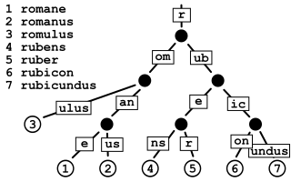

# PathSpec

我们一个个来看，先看`PathSpec`。
通过Hugo架构设计中介绍的[文件系统的组织](../../../arch#文件系统的组织)我们了解到，`PathSepc`正是文件系统的关键所在。

## NewPathSpec时序图


从上图可以看出，Hugo为自己量身打造的文件系统，庞大且复杂。
光文件系统就有很多种，仅上面提到的就有`BasePathFs`，`BaseFs`，`baseFileDecoratorFs`，`OverlayFs`，`RootMappingFs`，`SliceFs`, `LanguageFs`。
可以说琳琅满目，数不胜数。
在感叹的同时，也不禁惊心，学习曲线这么陡，可要怎么学！？

为了不把深入理解Hugo系列写成从入门到放弃系列，让我们先静下心来，发挥一下跬步千里的精神。
陡坡再陡，一天走一步，也总有到头的时候。

通过观察，我们发现无论Hugo如何组织这些文件系统，目标实际上只有一个，那就是在使用的时候，简单直接，将复杂的需求封装在内部。
那说一千，道一万，还是个文件系统。

所以首先我们要弄清楚什么是文件系统，以及Hugo是怎么使用文件系统的。
这么多文件系统之间又是个什么样的关系？

从最开始准备的`Path`，我们看到除了一些常见的信息，如基础Fs，配置信息Cfg，主题目录，工作目录还有发布目录外，还包含了所有模块的信息AllModules。
模块和文件系统又是什么样的关系？
接着我们发现在真正构建文件系统的时候，`sourceFilesystemBuilder`首先做的事情就是创建`OverlayFs`，为什么这里用到了OverlayFs，要帮助Hugo解决什么样的问题？
在创建OverlayFs的过程中，还用到了`Radix Tree`基数树数据结构，基数树是什么，又为什么要用？

通过以上这些疑问，我们可以把这个陡坡分拆成一个个的小坡：

- 什么是文件系统，Hugo是怎么理解的？
- 多个文件系统之间是如何关联的？
- Modules和文件系统之间，又存在什么样的关系？
- 什么是OverlayFs，为什么要用？
- 什么是radix tree?

先弄清楚这些问题，再让我们回过头来查看源码。

出发吧，伟大的软件工程师啊！

## 什么是文件系统，Hugo是怎么理解的？

管理人力的，我们叫人力系统；管理招聘的，我们叫招聘系统；那管理文件的，我们就叫文件系统。

在Hugo架构设计[文件系统的组织](../../../code/#文件系统的组织)中，我们有提到Hugo的文件系统是基于`Afero`库来构建的。

那我们先来看看`Afero`是怎么定义文件系统的：


通过Hugo对文件系统的实际应用，我们可以发现主要用到了`Afero`中的两个接口，一个是`Fs`，另一个是`Lstater`。
前面一个就是文件系统了，包含打开文件，查询状态等文件相关的操作。
后面的状态机`Lstater`则在查询状态的后面加上了如果可能的字样，增强了适用性。

那`Afero`在`PathSpec`中是怎么得到应用的呢？


我们知道在创建依赖`Deps`之初，有将文件信息传入依赖配置项`depsCfg`中，这里是最原始的文件信息，虽然叫`Fs`，但并没有提供文件系统的功能。
真正开始组织和构建文件系统的是中间的`BaseFs`，不仅关联上初始的信息，还包含了文件系统收集完成后的`SourceFilesystems`。
里面的源文件系统`SourceFilesystem`都完整的实现了`Afero`中的`Fs`和`Lstater`接口。

这里举一个实际的应用场景，来帮助理解：


`readAndProcessContent`就是用来读取和处理站点内容的函数，将会在下一个章节渲染中进行介绍。
在这里，我们将用这个具体的场景，来帮助我们理解上面的文件系统`BaseFs`究竟是在为什么做准备。

从上图可以看到，如果我们要开始处理站点内容了。
我们可以通过站点`site`实例，很容易的得到站点内容的文件系统。
而这个真实的文件系统，正是来自于`BaseFs`中的`Content.Fs`。

拿到内容文件系统后，就可以创建好`Walkway`实例，并对其中的文件进行遍历`Walk`了。

`site`又是怎么持有`BaseFs`的？
这个不是在`PathSpec`中吗？

这里就要提到Golang的组合机制了，可以用组合的方式，对结构体进行拓展：


可以清晰地看到他们之间的关系就是`Site -> Deps -> PathSpec -> BaseFs`，就是有点长，容易迷失方向。

在Walk的过程中，主要用到的就是`Lstater`中的`LstatIfPossible`方法。


## 多个文件系统之间是如何关联的？

我们通过一个实际应用场景，了解到为什么要这样组织文件系统。

从Hugo架构设计[文件系统](../../../arch/#文件系统的组织)的文件系统章节了解到了Hugo中复杂的文件系统：


虽然这张图能够从基础架构的角度出发，帮我们了解到文件系统是如何组织在一起的。
看起来有些复杂，但仍没能展示所有的文件系统之间的关联。
比如说，在BaseSpec中的SourceFilesystems里面，SourceFilesystem中的Fs究竟指的是哪些文件系统，和OverlayFs又有什么关联呢？


上图则帮助解答了我们的疑问。
SourceFilesystems包含了Hugo自定义的六大组件，包含Content, Data, I18n, Layouts, Archetypes, Assets。
为每一个组件都提供了一个文件系统实例，类型为SourceFilesystem。
区别就在于里面的Fs字段所指向的文件系统。

可以看到，Layouts, Archetypes, Assets都一样，都直接指向了BasePathFs，这也是Afero提供的文件系统之一，颜色也标的和Afero一致。
BasePathFs中的Fs实际指向的就是OverlayFs，可以看到她里面的Fs是复数Fss，也就是说有多个文件系统。
具体工作原理，稍后会做介绍。

再看Data和I18n，指向的都是SliceFs，里面包含的实际是Dirs，也就是多目录，类型则是FileMetaInfo。
拿Data举例，Hugo将所有的数据都集中到一起，这样可以方便统一供页面使用，这样数据之间就不存在从属关系，项目模块里的数据和主题模块里的数据相对独立。

最后看一下上面的场景中使用到的Content，她在BasePathFs上又封闭了一层，从命名看出提供了Filter的功能，因为针对不同的语言可能需要过滤掉一些其它的文件。

## Modules和文件系统之间，又存在什么样的关系？

上面已经看到SourceFilesystems为每一个模块都创建了一个文件系统，那Module和文件系统又是怎么关联的呢？

Hugo的最终目的是构建站点，而一个站点中可能要用到多个模块，为了方便组织构建，模块又定义了六大组件。
在对外提供服务，如上面的站点内容处理场景中，需要对外隐藏文件系统里面的复杂性。
保证文件系统在使用过程中，就是一个整体。


为了让使用者使用起来足够简单，Hugo需要将多模块合并，并保证文件之间正确地依赖关系。

例如，在Hugo主题中会提供很多不同的layout模板，但如果在项目中也有一个重名的模板，则优先使用项目中的模板，因为这是用户自定义的模板，应优先使用。

而在主题中数据文件需要保持独立，所以需要将所有模块的数据文件收集到一起，集中管理。

为了满足这些依赖管理的诉求，Hugo选择使用OverlayFs技术来管理有依赖的文件上，直接用集合来对独立的文件进行管理。

最终将所有模块的文件系统按依赖关系进行合并，由SourceFilesystems提供统一服务：


## 什么是OverlayFs，为什么要用？

在组织PathSpec中的BaseFs过程中，我们了解到底层文件系统用的是OverlayFs。
和其它文件系统不一样的地方是，她的文件系统是Fss，表明需要同时持有多个文件系统。


将Fss展开，我们得到了上图。

从右边我们可以看出OverlayFs的工作原理：**将多个文件系统按一定规则进行合并，合并后生成统一的文件系统服务。**

拿上图来做进一步解释。
从上往下看，`merge`层就是合并后生成的统一文件系统，包含了`upper`层和`lower`层的所有文件。
之所以叫upper和lower，是因为文件系统之间有明确的先后顺序关系，OverlayFs会优先选择更上层的文件，来生成合并过后的merge层。
如果多层都有同样的文件，就会优先选择最上面一层的这个文件，比如在上图中，upper层和lower层都有文件a.md，那就会优先选择upper层中的a.md。
如果没有重复，同样的原理，按层级选择最先出现的文件，放入到merge层，像b.md和c.md。

回到PathSpec中，如上图左边所示。
我们有Project模块和mytheme主题模块，他们都有content文件系统。
这时Project模块是最上层模块，因为这是用户直接提供的内容，也可以理解为用户所提供的自定义信息，对应的就是右边的upper层。
而mytheme主题模块，则对应的是lower层。
如果用户想要自定义站点主页，可以直接在项目中提供相应的layout文件，这样就会覆盖掉主题中对应的layout文件。
合并后的merge层也就是我们之前提到的Fss。

通过OverlayFs技术，Hugo这样就可以将多模块按需合并了。
并对调用方提供良好的用户体验。

结合上面的样例，提供源码实现做进一步参考。

Show me the code: 
- [OverlayFs](https://c.sunwei.xyz/overlayfs.html)
- [OverlayFs Afero](https://c.sunwei.xyz/overlayfs-afero.html)

## 什么是radix tree?

将多文件系统有效地组织起来后，容易理解，也方便使用。
但组织好的文件系统只是开始，Hugo还需要对文件系统内的文件进行高效操作。
比如查找某一个文件，或者遍历某一路径下的所有文件。

针对上面的诉求，Hugo选择了Radix Tree - 基数树。

下面是[Wikipedia Radix tree](https://en.wikipedia.org/wiki/Radix_tree)的示例图：



通过这一数据结构存储单词，不仅存储内容没有重复，提升了空间利用率；路径还清晰，提高了查询效率。

Hugo当然也不会错过：


以上面OverlapFs的使用场景作为样例。
当插入第一条信息"/content/a.md"时，因为是第一个结点，没有和其它的结点拥有共同前缀，可以直接插入。
当插入后续结点"/content/b.md, /content/c.md"时，因为都拥有相同前缀"/content/"，首先要对老的结点进行更新。
先提取通用结点"/content/"，并更新老结点为"a.md"。
同时创建后面新加入的结点"b.md, c.md"。
最终状态为步骤二所展示的状态。

结合上面的样例，可参考以下源码实现，自己动手试一试。

Show me the code:
- [Radix Tree](https://c.sunwei.xyz/radix-tree.html)

再来一起快速回顾一下这些问题：

- 什么是文件系统，Hugo是怎么理解的？

  文件系统就是将多个文件进行系统管理的方法，Hugo用Afero定义了基础文件系统，除了文件系统的基础操作处，还用到了状态机`Lstater`。

- 多个文件系统之间是如何关联的？

  文件系统源于OverlayFs，终于SourceFilesystems，目标就是为Hugo的各大组件提供属于自己的文件系统服务。

- Modules和文件系统之间，又存在什么样的关系？

  模块包含了Hugo的通用组件，Hugo需要将多模块按通用组件为单位进行合并，统一途径对外提供服务。

- 什么是OverlayFs，为什么要用？

  是一种可以把多文件系统组合成一个文件系统的技术。

- 什么是radix tree?

  可以快速检索信息，并保证存储信息不重复的数据结构。

对以上问题进行了解答后。
当我们再来看上面的PathSpec全景时序图，我们会发现脉络一下子清晰了起来：


* 创建Path，将所有基础信息都包含其中
* 创建BaseFs，并装饰其中的文件系统
* 准备文件系统构建器
* 开始创建OverlayFs，准备好文件系统收集器
* 根据组件类型，按目录进行整理
* 根据整理好的目录信息，为组件分别创建属于自己的文件系统，并保存在构建结果中

基础知识就绪，流程脉络也梳理清楚。
接下来将流程进一步展开，结合源码来进一步理解Hugo的实现细节。

## 源码实现

**创建Path，将所有基础信息都包含其中**

第一步就是创建Path，我们再将时序图细节还原：


可以看到Path将所有基础信息都汇集到一起了。

其中包括最原始的文件系统信息Fs：
```go
// Fs holds the core filesystems used by Hugo.
type Fs struct {
	// Source is Hugo's source file system.
	// Note that this will always be a "plain" Afero filesystem:
	// * afero.OsFs when running in production
	// * afero.MemMapFs for many of the tests.
	Source afero.Fs

	// PublishDir is where Hugo publishes its rendered content.
	// It's mounted inside publishDir (default /public).
	PublishDir afero.Fs

	// WorkingDirReadOnly is a 1.read-only file system
	// restricted to the project working dir.
	WorkingDirReadOnly afero.Fs
}
```

还有包含了用户自定义信息和Hugo的默认信息的Config Provider - Cfg。
接着就是ThemesDir, WorkingDir, AbsPublishDir这三个关键目录。
最后就是组织好的所有模块信息AllModules。

最终创建的Path将包含创建PathSpec所包含的全部信息：

```go
    p := &Paths{
		Fs:            fs,
		Cfg:           cfg,

		ThemesDir:  cfg.GetString("themesDir"),
		WorkingDir: workingDir,
		AbsPublishDir:   absPublishDir,

		...
	}

	if cfg.IsSet("allModules") {
		p.AllModules = cfg.Get("allModules").(modules.Modules)
	}
```

**创建BaseFs，并装饰其中的文件系统**

准备好Path后，正式进入到创建基础文件系统的环节：


可以看到，分别为publishDir，以及由fs.Source和p.WorkingDir组成的PathFs进行了统一装饰。

先看BasePathFs:

```go
// The BasePathFs restricts all operations to a given path within an Fs.
// The given file name to the operations on this Fs will be prepended with
// the base path before calling the base Fs.
// Any file name (after filepath.Clean()) outside this base path will be
// treated as non existing file.
//
// Note that it does not clean the error messages on return, so you may
// reveal the real path on errors.
type BasePathFs struct {
	source Fs
	path   string
}
```

在提供源文件系统source的基础上，进一步指明了路径。
也就是对外只开放源文件系统特定路径下的文件服务。

再看BaseFileDecorator：

```go
// NewBaseFileDecorator decorates the given Fs to provide the real filename
// and an Opener func.
func NewBaseFileDecorator(fs afero.Fs) afero.Fs {
	ffs := &baseFileDecoratorFs{Fs: fs}
	decorator := func(fi os.FileInfo, filename string) (os.FileInfo, error) {
		// Store away the original in case it's a symlink.
		meta := NewFileMeta()
		meta.Name = fi.Name()
		...
		opener := func() (afero.File, error) {
			return ffs.open(filename)
		}
		fim := decorateFileInfo(fi, ffs, opener, filename, "", meta)
		return fim, nil
	}
	ffs.decorate = decorator
	return ffs
}
```

baseFileDecoratorFs就是装饰过后的文件信息，实现了Afero的`Fs`和`Lstater`接口。
和其它文件系统不同的是，baseFileDecoratorFs提供了一个装饰函数，在查询文件状态的时候都会被调用。
```go
func (fs *baseFileDecoratorFs) Stat(name string) (os.FileInfo, error) {
	fi, err := fs.Fs.Stat(name)
	...
	return fs.decorate(fi, name)
}

func (fs *baseFileDecoratorFs) LstatIfPossible(name string) (os.FileInfo, bool, error) {
	...
	if lstater, isLstater := fs.Fs.(afero.Lstater); isLstater {
		fi, ok, err = lstater.LstatIfPossible(name)
	} else {
		fi, err = fs.Fs.Stat(name)
	}
	...
	fi, err = fs.decorate(fi, name)

	return fi, ok, err
}
```
这就像钩子函数一样，在原始信息准备好后，触发装饰器，在返回信息前，对信息进行统一处理。
这样提供了足够的灵活性，也方便标准化服务信息。

**准备文件系统构建器**

将原始文件系统进行装饰，并将处理后的系统放入BaseFs实例中。
有了文件系统构建所需要的信息后，Hugo就开始着手构建了。


先创建构建器：

```go
func newSourceFilesystemsBuilder(p *paths.Paths, b *BaseFs) *sourceFilesystemsBuilder {
	sourceFs := hugofs.NewBaseFileDecorator(p.Fs.Source)
	return &sourceFilesystemsBuilder{p: p, sourceFs: sourceFs, theBigFs: b.theBigFs, result: &SourceFilesystems{}}
}
```

在构建器中，用到了Path，装饰过后的源文件系统p.Fs.Source，这些之前都出现过，相对好理解一些。

而theBigFs第一次出现，直译过来就是大文件系统，从这个泛指的名字很难看出是干什么用的。

SourceFileSystems类型的result较为直观，应该就是构建后的结果，包含了所有Hugo组件的文件系统集合。

```go
type sourceFilesystemsBuilder struct {
	p        *paths.Paths
	sourceFs afero.Fs
	result   *SourceFilesystems
	theBigFs *filesystemsCollector
}
```

通过sourceFilesystemsBuilder结构体的申明可以帮助理解新出现的theBigFs，原来是filesystemsCollector收集器。

**开始创建OverlayFs，准备好文件系统收集器**

准备好站点构建器后，就正式开始构建了。


首先就是检查theBigFs是否设置好，如果没有，需要通过创建Main OverlayFs来给theBigFs赋值：

```go
// hugo-playground/hugolib/filesystems/basefs.go
// line 454
if b.theBigFs == nil {
    theBigFs, err := b.createMainOverlayFs(b.p)
    ...
    b.theBigFs = theBigFs
}
```

进入createMainOverlayFs可以看到Hugo是如何设计filesystemsCollector的：

```go
// hugo-playground/hugolib/filesystems/basefs.go
// line 518
func (b *sourceFilesystemsBuilder) createMainOverlayFs(p *paths.Paths) (*filesystemsCollector, error) {
	collector := &filesystemsCollector{
		...
		overlayDirs:   make(map[string][]hugofs.FileMetaInfo),

		overlayMounts:        overlayfs.New(overlayfs.Options{}),
		overlayMountsContent: overlayfs.New(overlayfs.Options{DirsMerger: hugofs.LanguageDirsMerger}),
		overlayMountsStatic:  overlayfs.New(overlayfs.Options{DirsMerger: hugofs.LanguageDirsMerger}),
		overlayFull:          overlayfs.New(overlayfs.Options{}),
		overlayResources:     overlayfs.New(overlayfs.Options{FirstWritable: true}),
	}

	// Module has same folder structure
	// need to merge, like static files
	mods := p.AllModules
	mounts := make([]mountsDescriptor, len(mods))

	for i := 0; i < len(mods); i++ {
		mod := mods[i]
		dir := mod.Dir()

		isMainProject := mod.Owner() == nil
		mounts[i] = mountsDescriptor{
			Module:        mod,
			dir:           dir,
			isMainProject: isMainProject,
			ordinal:       i,
		}
	}

	err := b.createOverlayFs(collector, mounts)

	return collector, err
}
```

filesystemsCollector的思路很清晰。
首先为不同的收集内容准备好各自的容器，像overlayDirs，用来存放Dir的FileMetaInfo，用来存储所有Content OverlayFs的overlayMountsContent，等等。
然后将所有的模块AllModules转换成mountsDescriptor，根据mounts创建各自的OverlayFs，并放在上一步准备好的容器里。

createOverlayFs源码如下所示：
```go
// hugo-playground/hugolib/filesystems/basefs.go
// line 562
func (b *sourceFilesystemsBuilder) createOverlayFs(
	collector *filesystemsCollector,
	mounts []mountsDescriptor) error {

	for _, md := range mounts {
		var (
			fromTo        []hugofs.RootMapping
			fromToContent []hugofs.RootMapping
			fromToStatic  []hugofs.RootMapping
		)
		...
		for i, mount := range md.Mounts() {
			...
			base, filename := absPathify(mount.Source)
			rm := hugofs.RootMapping{
				From:      mount.Target, // content
				To:        filename,     // mycontent
				ToBasedir: base,
				Module:    md.Module.Path(),
				IsProject: md.isMainProject,
				Meta: ...,
			}
			isContentMount := b.isContentMount(mount)
			...
			if isContentMount {
				fromToContent = append(fromToContent, rm)
			} else if b.isStaticMount(mount) {
				fromToStatic = append(fromToStatic, rm)
			} else {
				fromTo = append(fromTo, rm)
			}
		}
        modBase := collector.sourceProject // source fs, project module
		...
		rmfs, err := hugofs.NewRootMappingFs(modBase, fromTo...)
		...
		rmfsContent, err := hugofs.NewRootMappingFs(modBase, fromToContent...)
		...
		rmfsStatic, err := hugofs.NewRootMappingFs(sourceStatic, fromToStatic...)
		...
		// TODO
		// addDirs
		// overlayMounts
	}
	return nil
}
```
可以看出createOverlayFs进行了两层循环。
外层对module进行了循环，内层对mount里的mounts进行了循环。
内层为每一个mount都准备了一个RootMapping，并根据类型，分别放到fromToContent， fromToStatic， fromTo的集合中。
紧接着为每一个集合创建了一个RootMappingFs。
然后用创建好的RootMappingFs信息，统一对Dir和overlayMount进行处理。
这里让我们暂时先专注在NewRootMappingFs，下一章节我们将对上面的TODO内容进行展开。


从时序图中，可以观察到正是在这里，Hugo引入了Radix Tree，用来管理补充了信息的RootMapping，并用模块名做为索引key进行存储。
最终返回包含Radix Tree实例的RootMappingFs。

```go
// hugo-playground/hugofs/rootmapping_fs.go
// line 30
// NewRootMappingFs creates a new RootMappingFs on top of the provided with
// root mappings with some optional metadata about the root.
// Note that From represents a virtual root that maps to the actual filename in To.
func NewRootMappingFs(fs afero.Fs, rms ...RootMapping) (*RootMappingFs, error) {
	rootMapToReal := radix.New()
	var virtualRoots []RootMapping

	for _, rm := range rms {
		...
		rm.Meta.SourceRoot = rm.To
		rm.Meta.BaseDir = rm.ToBasedir
		rm.Meta.MountRoot = rm.path
		rm.Meta.Module = rm.Module
		rm.Meta.IsProject = rm.IsProject
		
		meta := rm.Meta.Copy()
		...
		rm.fi = NewFileMetaInfo(fi, meta)

		key := filepathSeparator + rm.From // only /layouts and /content
		var mappings []RootMapping
		v, found := rootMapToReal.Get(key)
		...
		mappings = append(mappings, rm)
		rootMapToReal.Insert(key, mappings)

		virtualRoots = append(virtualRoots, rm)
	}
	rootMapToReal.Insert(filepathSeparator, virtualRoots)
	rfs := &RootMappingFs{
		Fs:            fs,
		rootMapToReal: rootMapToReal,
	}
	return rfs, nil
}
```
源码中rootMapToReal就是包含了所有RootMapping信息的Radix Tree。
这样一来，利用Radix Tree的特性，我们将很方便按前缀对文件进行走查。

**根据组件类型，按目录进行整理**

Hugo首先将组件都以Mount的形式存储在Module中。
在创建OverlayFs的过程中，先将Mount转换成RootMapping，再由上面的NewRootMappingFs方法，将RootMapping转换成RootMappingFs内部的Radix Tree结构。

接下来就让我们回到createOverlayFs中，来看看RootMappingFs将如何被使用。

让我们实例TODO部分的addDirs和overlayMounts操作：

```go
// hugo-playground/hugolib/filesystems/basefs.go
// line 562
func (b *sourceFilesystemsBuilder) createOverlayFs(
	collector *filesystemsCollector,
	mounts []mountsDescriptor) error {
        ...
        rmfs, err := hugofs.NewRootMappingFs(modBase, fromTo...)
        ...
        rmfsContent, err := hugofs.NewRootMappingFs(modBase, fromToContent...)
        ...
        rmfsStatic, err := hugofs.NewRootMappingFs(sourceStatic, fromToStatic...)	
	    ...
        // We need to keep the ordered list of directories for watching and
        // some special merge operations (data, i18n).
        collector.addDirs(rmfs)        // add other folders
        collector.addDirs(rmfsContent) // only has /content, why need to go through all components?
        collector.addDirs(rmfsStatic)
        
        getResourcesDir := func() string {
        if md.isMainProject {
        return b.p.AbsResourcesDir
        }
        _, filename := absPathify(files.FolderResources)
        return filename
        }
        
        collector.overlayMounts = collector.overlayMounts.Append(rmfs)
        collector.overlayMountsContent = collector.overlayMountsContent.Append(rmfsContent)
        collector.overlayMountsStatic = collector.overlayMountsStatic.Append(rmfsStatic)
        collector.overlayFull = collector.overlayFull.Append(afero.NewBasePathFs(modBase, md.dir))
        collector.overlayResources = collector.overlayResources.Append(afero.NewBasePathFs(modBase, getResourcesDir()))
	}
	return nil
}
```

将上面新增部分的代码对应上我们的时序图：


在拿到创建好的RootMappingFs后，先对其收集了一波Dir，然后将其加入到相应的overlayMounts中。

先来看addDirs：

```go
// hugo-playground/hugolib/filesystems/basefs.go
// line 712
func (c *filesystemsCollector) addDirs(rfs *hugofs.RootMappingFs) {
    for _, componentFolder := range files.ComponentFolders {
        c.addDir(rfs, componentFolder)
    }
}

func (c *filesystemsCollector) addDir(rfs *hugofs.RootMappingFs, componentFolder string) {
	dirs, err := rfs.Dirs(componentFolder)

	if err == nil { // event dirs is nil
		// merge all the same component folder from different rfs in the same array
		c.overlayDirs[componentFolder] = append(c.overlayDirs[componentFolder], dirs...)
	}
}
```

对Hugo所有的组件进行轮询，从RootMappingFs中获取Dirs，并添加到overlayDirs中。
让我们展开rfs.Dirs：

```go
// hugo-playground/hugofs/rootmapping_fs.go
// line 165
func (fs *RootMappingFs) Dirs(base string) ([]FileMetaInfo, error) {
	base = filepathSeparator + fs.cleanName(base)
	roots := fs.getRootsWithPrefix(base)
	...
	fss := make([]FileMetaInfo, len(roots))
	for i, r := range roots {
		bfs := afero.NewBasePathFs(fs.Fs, r.To)
		...
		fs := bfs
		...
		fi, err := fs.Stat("")
		...
		fss[i] = fi.(FileMetaInfo)
	}
	return fss, nil
}
```

先通过RootMappingFs.getRootsWithPrefix来获取RootMapping，再获取根目录的Stat，最终返回所有目录的FileMetaInfo。

```go
// hugo-playground/hugofs/rootmapping_fs.go
// line 292
func (fs *RootMappingFs) getRootsWithPrefix(prefix string) []RootMapping {
	var roots []RootMapping
	fs.rootMapToReal.WalkPrefix(prefix, func(b string, v any) bool {
		roots = append(roots, v.([]RootMapping)...)
		return false
	})

	return roots
}
```

在这里，用上了Radix Tree类型的rootMapToReal，通过走查组件前缀，查询存储在树上的根节点RootMapping信息。

经过上面的处理后，addDirs就将所有组件根目录的FileMetaInfo都成功存储在了collector.overlayDirs中。

那collector中的其它Mounts呢？

```go
    ...
    collector.overlayMounts = collector.overlayMounts.Append(rmfs)
    collector.overlayMountsContent = collector.overlayMountsContent.Append(rmfsContent)
    collector.overlayMountsStatic = collector.overlayMountsStatic.Append(rmfsStatic)
    collector.overlayFull = collector.overlayFull.Append(afero.NewBasePathFs(modBase, md.dir))
    collector.overlayResources = collector.overlayResources.Append(afero.NewBasePathFs(modBase, getResourcesDir()))
```

将得到的RootMappingFs直接添加到overlay的不同Mounts中。

```go
// Append creates a shallow copy of the filesystem and appends the given filesystems to it.
func (ofs OverlayFs) Append(fss ...afero.Fs) *OverlayFs {
	ofs.fss = append(ofs.fss, fss...)
	return &ofs
}
```

并按顺序在放在了fss中。

到这里，thyBigFs也就是Collector已经准备妥当，按模块收到到了所有的RootMappingFs，并将她们都依次放入了OverlayMounts和OverlayDirs中。

**根据整理好的目录信息，为组件分别创建属于自己的文件系统，并保存在构建结果中**

拿到准备就绪地收集器后，是时候开始为每一个组件生成自己的SourceFilesystem了：


从时序图中可以看出，拿到theBigFs后，就开始着手准备构建结果SourceFilesystems了。

通过构建方式可以分为三类：

**Data和I18N为一类**

```go
// hugo-playground/hugolib/filesystems/basefs.go
// line 479
// Data, i18n and content cannot use the overlay fs
dataDirs := b.theBigFs.overlayDirs[files.ComponentFolderData]
dataFs, err := hugofs.NewSliceFs(dataDirs...)
if err != nil {
    return nil, err
}
b.result.Data = b.newSourceFilesystem(files.ComponentFolderData, dataFs, dataDirs)
```
直接从overlayDirs中通过组件键值获取相应的文件信息，并用SliceFs进行封装

**Layouts, Archetypes, Assets为一类**

```go
// hugo-playground/hugolib/filesystems/basefs.go
// line 464
createView := func(componentID string) *SourceFilesystem {
  if b.theBigFs == nil || b.theBigFs.overlayMounts == nil {
      return b.newSourceFilesystem(componentID, hugofs.NoOpFs, nil)
  }
  dirs := b.theBigFs.overlayDirs[componentID]
  return b.newSourceFilesystem(componentID, afero.NewBasePathFs(b.theBigFs.overlayMounts, componentID), dirs)
}
b.result.Layouts = createView(files.ComponentFolderLayouts)
```
从overlayDirs中获取目录信息，并用overlayMounts找到相应的OverlayFs，一起生成SourceFilesystem。

**Content为一类**

```go
// hugo-playground/hugolib/filesystems/basefs.go
// line 495
contentDirs := b.theBigFs.overlayDirs[files.ComponentFolderContent]
contentBfs := afero.NewBasePathFs(b.theBigFs.overlayMountsContent, files.ComponentFolderContent)
contentFs, err := hugofs.NewLanguageFs(b.p.LanguagesDefaultFirst.AsOrdinalSet(), contentBfs)
if err != nil {
    return nil, fmt.Errorf("create content filesystem: %w", err)
}
b.result.Content = b.newSourceFilesystem(files.ComponentFolderContent, contentFs, contentDirs)
```

和上面相比，在BasePathFs前又多加了一层LanguageFs，并且直接用到了overlayMountsContent。

这样，我们通过基础知识介绍，加上时序图局部拆解，就梳理完了PathSpec的完整创建流程。

## 输入文件系统和所有模块信息，输出各组件统一文件系统


在创建Deps的过程中，第一个创建的就是PathSpec。
在这之前，我们已经准备好了配置信息，其中包含了所有的模块信息。
PathSpec正是要将所有模块的信息，统一管理，按Hugo对文件系统的要求，将所有的模块按组件组合起来，对外提供统一类型的服务。

Hugo的实现思路，正如上图中间部分所示。
先将前面准备好的基础信息，如原始Fs，和包含了所有模块信息的AllModules，都放在Path之中。
想要获得最终的结果，还需要一个构建器Builder。
Builder首先准备好承载构建中间状态的容器，如OverlayDirs，OverlayMounts。
然后用Collector也就是我们的theBigFs，将所有Module中的Mount转换成RootMapping，并转换成RootMappingFs做好准备。
因为在创建OverlayFs的时候，需要将不同横块相同组件的RootMappingFs按顺序放在Fss中。
当这些基础信息都准备好后，就可以为每个组件构建自己的SourceFilesystem了，最终组合成SourceFilesystems，也就是PathSpec中的BaseFs。
既标准统一的文件系统集合。

## PathSpec动手实践

在理解`PathSpec`的实现原理后，通过抽象总结，我们将其进行简化。
照葫芦画瓢，动动小手，让我们用代码来总结代码，验证一下这个知识点。

可以这里线上尝试，[Show Me the Code, try it yourself](https://c.sunwei.xyz/pathspec.html)

代码里有注解说明，代码样例：

```go
package main

import (
	"bytes"
	"fmt"
	"github.com/sunwei/gobyexample/modules/overlayfs"
	"github.com/sunwei/gobyexample/modules/radixtree"
	"golang.org/x/tools/txtar"
	"io"
	"io/fs"
	"os"
	"path"
	"path/filepath"
)

func main() {
	dir, _ := os.MkdirTemp("", "hugo")
	defer os.RemoveAll(dir)

	myContentPath := filepath.Join(dir, "mycontent")
	_ = os.Mkdir(myContentPath, os.ModePerm)
	myContent2Path := filepath.Join(dir, "mycontent2")
	_ = os.Mkdir(myContent2Path, os.ModePerm)
	themePath := filepath.Join(dir, "mytheme")
	_ = os.Mkdir(themePath, os.ModePerm)

	mcs := "-- a.md --\n" +
		"mycontent: a\n" +
		"-- c.md --\n" +
		"mycontent: c"
	writeFiles(mcs, myContentPath)

	mc2s := "-- a.md --\n" +
		"mycontent2: a\n" +
		"-- d.md --\n" +
		"mycontent2: d"
	writeFiles(mc2s, myContent2Path)

	ts := "-- a.md --\n" +
		"mytheme: a\n" +
		"-- b.md --\n" +
		"mytheme: b"

	writeFiles(ts, themePath)

	p := &Paths{
		WorkingDir: dir,
		AllModules: []Module{
			{
				ProjectMod: true,
				Dir:        dir,
				Mounts: []Mount{
					{Source: "mycontent",
						Target: "content"},
					{Source: "mycontent2",
						Target: "content"},
				},
			},
			{
				ProjectMod: false,
				Dir:        dir,
				Mounts: []Mount{
					{Source: "mytheme",
						Target: "content"},
				},
			},
		},
	}

	collector := &filesystemsCollector{
		overlayMountsContent: overlayfs.New(
			[]overlayfs.AbsStatFss{}),
	}
	createOverlayFs(collector, p)

	var f fs.File
	fis, _ := collector.
		overlayMountsContent.ReadDir(filepathSeparator)
	for _, fi := range fis {
		fmt.Println(fi.Name())
		f, _ = collector.
			overlayMountsContent.Open(fi.Name())
		b, _ := io.ReadAll(f)
		fmt.Println(string(b))
	}
	defer f.Close()
}

func writeFiles(s string, dir string) {
	data := txtar.Parse([]byte(s))

	for _, f := range data.Files {
		if err := os.WriteFile(
			filepath.Join(dir, f.Name),
			bytes.TrimSuffix(f.Data, []byte("\n")),
			os.ModePerm); err != nil {
			panic(err)
		}
	}
}

var filepathSeparator = string(filepath.Separator)

// RootMapping describes a virtual file or directory mount.
type RootMapping struct {
	// The virtual mount.
	From string
	// The source directory or file.
	To string
	// The base of To. May be empty if an
	// absolute path was provided.
	ToBasedir string
	// Whether this is a mount in the main project.
	IsProject bool
	// The virtual mount point, e.g. "blog".
	path string
}

type Mount struct {
	Source string
	Target string
}

type Module struct {
	ProjectMod bool
	Mounts     []Mount
	Dir        string
}

type Modules []Module

type Paths struct {
	AllModules Modules
	WorkingDir string
}

// A RootMappingFs maps several roots into one.
// Note that the root of this filesystem
// is directories only, and they will be returned
// in Readdir and Readdirnames
// in the order given.
type RootMappingFs struct {
	fs            overlayfs.AbsStatFss
	rootMapToReal *radixtree.Tree
}

type filesystemsCollector struct {
	overlayMountsContent *overlayfs.OverlayFs
}

func createOverlayFs(
	collector *filesystemsCollector,
	path *Paths) {

	for _, md := range path.AllModules {
		var fromToContent []RootMapping
		for _, mount := range md.Mounts {
			rm := RootMapping{
				From:      mount.Target, // content
				To:        mount.Source, // mycontent
				ToBasedir: md.Dir,
				IsProject: md.ProjectMod,
			}
			fromToContent = append(fromToContent, rm)
		}
		rmfsContent := newRootMappingFs(fromToContent...)
		collector.overlayMountsContent = collector.
			overlayMountsContent.Append(rmfsContent)
	}
	return
}

// NewRootMappingFs creates a new RootMappingFs
// on top of the provided with root mappings with
// some optional metadata about the root.
// Note that From represents a virtual root
// that maps to the actual filename in To.
func newRootMappingFs(
	rms ...RootMapping) *RootMappingFs {
	t := radixtree.New()
	var virtualRoots []RootMapping

	for _, rm := range rms {
		key := filepathSeparator + rm.From
		mappings := getRms(t, key)
		mappings = append(mappings, rm)
		t.Insert(key, mappings)

		virtualRoots = append(virtualRoots, rm)
	}

	t.Insert(filepathSeparator, virtualRoots)

	return &RootMappingFs{
		rootMapToReal: t,
	}
}

func (m *RootMappingFs) Abs(name string) []string {
	mappings := getRms(m.rootMapToReal, name)

	var paths []string
	for _, m := range mappings {
		paths = append(paths, path.Join(
			m.ToBasedir, m.To))
	}
	return paths
}

func (m *RootMappingFs) Fss() []fs.StatFS {
	mappings := getRms(
		m.rootMapToReal, filepathSeparator)

	var fss []fs.StatFS
	for _, m := range mappings {
		fss = append(fss, os.DirFS(
			path.Join(m.ToBasedir, m.To)).(fs.StatFS))
	}
	return fss
}

func getRms(t *radixtree.Tree,
	key string) []RootMapping {
	var mappings []RootMapping
	v, found := t.Get(key)
	if found {
		mappings = v.([]RootMapping)
	}
	return mappings
}
```

输出样例：

```shell
a.md
mycontent: a
b.md
mytheme: b
c.md
mycontent: c
d.md
mycontent2: d


Program exited.
```