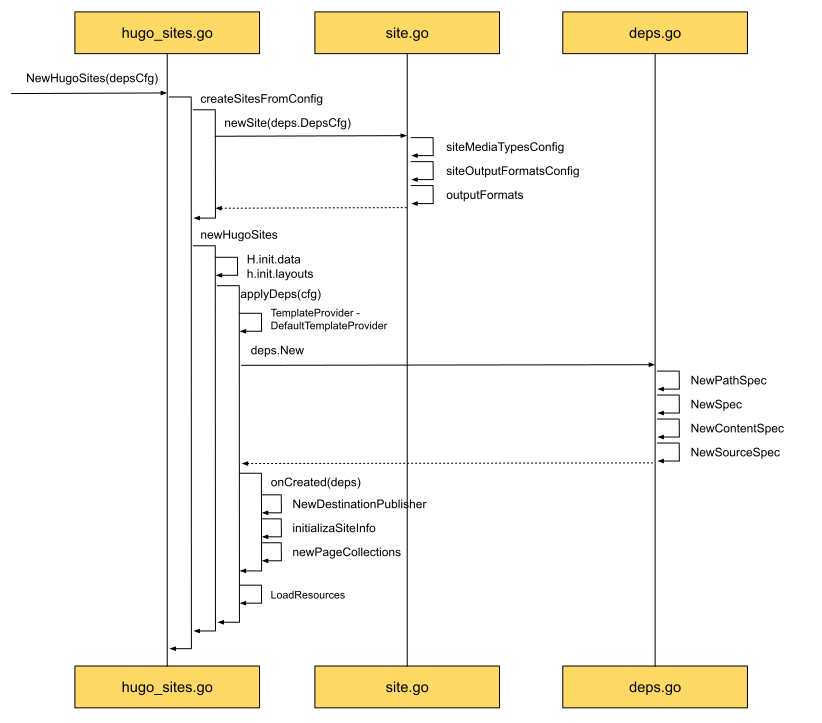

# 创建站点 - onCreated

Deps新建后，我们就可以应用Deps了。
在新建HugoSites的流程中，可以看到应用Deps的操作发生在onCreated中。

## onCreate时序图



从左下角可以看出，onCreate主要分为三部分，分别是：

* NewDestinationPublisher: 为站点创建publisher
* initializeSiteInfo：初始化站点信息，将站点所依赖的信息都汇集到一块
* newPageCollection：创建页面集合，因为最终渲染是以页面为单位，所以在HugoSites中为每个站点都配备了一个聚集器

### NewDestinationPublisher

```go
pub, err := publisher.NewDestinationPublisher(
				d.ResourceSpec,
				s.outputFormatsConfig,
				s.mediaTypesConfig,
			)
			...
			s.publisher = pub
```

ResourceSpec来自于Deps，其中包含了全面文件系统信息的PathSpec，和outputFormats, mediaTypesConfig，在我们的例子里，都是默认配置。
而在publisher中，我们不拥有当前site拥有的配置信息 - outputFormatsConfig, mediaTypesConfig。
同时拥有默认信息和定制化信息，这样我们就可以针对当前site进行定制化处理了。

### initializeSiteInfo

```go
func (s *Site) initializeSiteInfo() error {
	// Assemble dependencies to be used in hugo.Deps.
	s.Info = &SiteInfo{
		title:        "title",
		relativeURLs: s.Cfg.GetBool("relativeURLs"),
		owner:        s.h,
		s:            s,
	}
	return nil
}
```

在我们的例子中对基本信息做了简化，可以看到，这里会对站点所需要的基本信息，像标题等等进行汇总。

### newPageCollection

```go
...

pm := &pageMap{
    contentMap: newContentMap(),
    s:          s,
}
s.PageCollections = newPageCollections(pm)

...
```

PageCollections是页面的集合，可以提供类似于页面查找的服务。