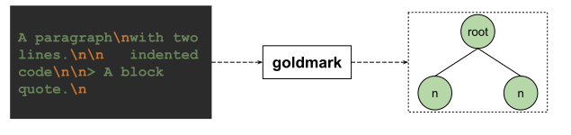
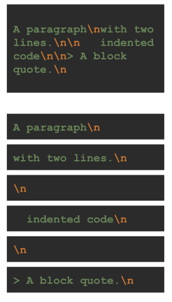
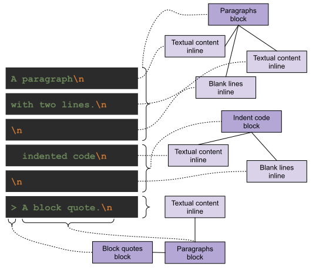
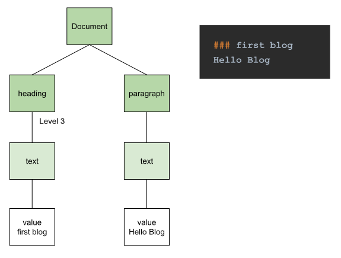
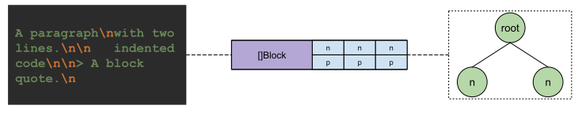
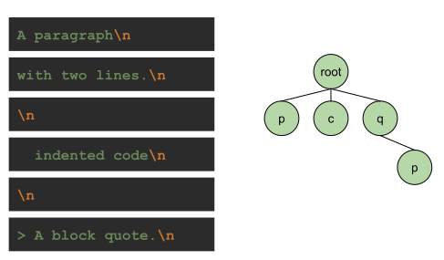
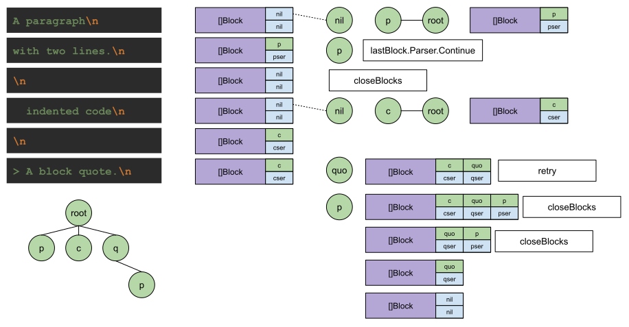

# Markdown文件是如何被翻译成HTML的

Markdown是一种文件格式，也是一种约定的语言。
之所以大受欢迎，是因为Markdown其简洁的语法。
不仅让作者在写作的过程中专注在内容创作上，让读者流畅的进行阅读。
还可以将内容直接发布到互联网上，方便传阅，让作品可以轻松的接触到更多的读者。

如果只是为了写作，传统的文本编辑器提供了更强大的样式支持，哪怕是高要求的印刷出版物，一样可以百分百支持。
随着互联网的发展，将文章放到网上已然成了一项基本需求。

而传统的文本编辑器上网的能力似乎不能满足现在的普遍需求。
一是这些强大的编辑器通常出自某一家大公司，并不是行业标准。
种类繁多不说，各家标准也不同，还没有全部公开，这些都让浏览器团队有心无力。

如果说只是要将内容放到网上，那传统的HTML不行吗？
这就是浏览器钦定的格式啊。
确实如此，HTML是方便了浏览器解析、渲染和展示，但对于写作者来说，并不友好，光标签种类就几十种，更不要提各种不同标签的属性了。

在这种左右两难的背景下，Markdown站了出来。
用简洁的语法替代了相对复杂的HTML，让创作者能更专注在内容创作上。
将标准开放，让大家参与其中，可遵循标准，也可以自定义标准，慢慢的也出现的统一的标准。

Hugo支持的就是Markdown语法，那Hugo是如何将Markdown语法文章翻译成HTML文本的呢？

通过查看最新的Hugo源码，我们发现Hugo将默认的Markdown解析器设置成了Goldmark。

那我们的疑问就变成了：Goldmark是如何将Markdown转换成HTML的呢？

## Goldmark工作原理

根据[Goldmark](https://github.com/yuin/goldmark)的介绍。
Goldmark遵循了[CommonMark 0.30](https://spec.commonmark.org/0.30/)规范。
用AST(Abstract Syntax Tree)结构对内容进行了解析。

要想知道Goldmark的工作原理，得先弄清楚CommonMark和AST这两个知识点。

### CommonMark 0.30

说到CommonMark规范，大家可能不了解。
但说到GitHub Flavored Markdown，相信大家都有过使用经验，其实GitHub Flavored Markdown就是基于CommonMark规范演化而来的。

细节在[CommonMark Spec 0.30](https://spec.commonmark.org/0.30/)中都有很清楚的描述。
下面我们从领域知识的角度，来进行解读。

让我们从一个例子开始：

```text
A paragraph
with two lines.

   indented code


> A block quote.

```

上面是一段用Markdown语法编写的文本信息，在解析阶段，会被解析成AST，如下图所示：



Goldmark先将文本信息读取到内存，如上图左所示。
那Goldmark是怎么解读这段文本的呢？

对于字符流的处理，有的是按字符一个个进行处理的，如JSON解析。
有的则是按行进行处理的，如配置文件。

通过Commonmark Spec中的[解析策略](https://spec.commonmark.org/0.30/#appendix-a-parsing-strategy)可以看出，是按行处理的。

那我们上面的文本就会按下面的顺序，以行为单位进行处理：



结合我们的MD写作习惯，让我们回想一下，是不是很多格式需要用换行来辅助说明。
比如段落，我们可以以每个句号为一行，可以换行，只要没有空行，就认为这些句子都是一个段落。
如果想要另起一个段落，直接用空行分隔就行。

在读取到了这一行行内容之后，要做怎样的处理呢？

同样是在CommonMark规范中的解析策略中可以了解到。
解析分为两步，首先是按Block将所有的行进行分类，这些行分别能组成什么类型的block。
按block将行处理完成后，就要对行内的信息进行处理了，在规范中将这些信息称之为inline信息。

上面出现了两个领域概念，一个是block，另一个则是inline，那规范里又是怎么定义这两个概念的呢？

在[Blocks and inlines](https://spec.commonmark.org/0.30/#blocks-and-inlines)章节，我们可以看到具体的定义：
* Blocks: 一个文档是由一系列blocks组成的
* Inline: 有一些block可以包含其它的block，而另一些block则包含inline内容，如text, links, 加粗text等等

也就是说，在规范里，我们将一个MD文件称之为document，document是由block序列组成的。
其中有的block可以包含其它block，有的block则包含inline相关的信息。
在规范中也有给这两种block相应的名称。
能包含其它block的block，我们管它们叫container block。
只包含inline信息的block，我们管它们叫leaf block。

其中container block有Block quotes, List items和Lists，这些block都可以包含其它block。

再看Leaf blocks，有Setext headings, Indent code blocks, Paragraphs等等。
这些leaf blocks可能包含inlines，如Links, Images, Textual content等等。

这样我们就可以将上面的文本信息转换成相应的block和inline了：



将文本信息解析成领域语言后，我们还需要用AST对解析后的信息进行存储。

### AST

AST也就是Abstract Syntax Tree - 抽象语法树。
是一种数据结构，它可以用来存储有一逻辑关系的字符集。
还可以利用树状结构来存储一些逻辑关系。

来举个例子：


我们将解析完的源码用AST来表示就如上图所示。
在源码中，我们将解析完的序列叫Statement sequence，像while和return都是statement。

在while中，有判断条件也有body。
在树状结构中，第一个子结点则是状态条件，另一个结点，就代表了body。

先看状态条件，这是一个比较操作。
其中操作符是不等号，操作对象则是变量b和常量0。

再看body对象，第一个分支也是一个条件判断，操作符为大于号，操作对象是变量a和变量b。
在这个判断条件中，body是if语句。
因为if, else可以成对出现，所以if判断语句肯定有一个判断条件，可能有两个body，一个是if body，另一个是else body。
上面的示例中就只有一个if body。
在if body中是一个赋值操作，赋值对象是变量a，运算操作是减法操作，运算减数是变量b，被减数则是变量a。

可以看到，通过AST结构，我们将上面的示例代码段解析成了状态序列，其中包含了基本信息和结构信息，为源码编译时提供详细信息。

通过上面的Markdown规范和了解到的源码AST示例，我们再举一个Markdown AST实例:



上面的示例是我们Hugo Playground中的真实文本。
按照规范来进行解析，生成的AST如上图所示。

我们将得到一个完整的Document树，其中有两个block结点，分别是heading和paragraph。
这两个block结点分别又包含了各自的inline结点text，并拥有相应的值。

对CommonMark规范和AST有了了解后，我们来看看goldmark究竟是如何实现的。

### goldmark的魔法

输入一段markdown文本，得到一颗AST树。
这是输入和输出，那要怎么设计能满足这一要求呢？



goldmark源码给出的答案是open block解析策略。
这在CommonMark规范中的解析策略中也有提到。
因为document是由block序列组成的，根据这一特点，我们可以通过深度优先算法，将block一个个按序解析完成。
虽然可能出现嵌套block的情况，但每一层结点的block同一时间只有一个。
这样我们只需要维护好这一处于开放状态的block就行。



当我们解析到新block时，就将其一级级打开，同时关闭同一级刚打开的block。
这样我们就可以建立好上面的AST block树了。
可以看到根结点有三个子结点，分别是paragraph, ident code block和quote block，其中quote block是container block，还包含了一个paragraph。

为了帮助更进一步的理解，根据goldmark实现源码，我们来一步步的重现一下goldmark的实现细节：



我们知道document是由block序列组成的。
goldmark也是根据这一特点进行解析的 - 以block为中心，通过维护处于打开状态的block，一行行的进行解析。

在进入解析之前，处于打开状态的block为空，也就我们看到的`[]Block`, block结构中有两个指针，一个是AST结点，另一个是block解析器指针，初始化时都为空。 

当读到第一行`A paragraph\n`时，根据这一行的起始特征 - 没有缩进，没有特殊符号。
判断为Paragraph结点类型，随既打开一个Paragraph结点。
并将新打开的结点添加父结点 - 根结点。
同时更新`[]Block`，结点指针指向新打开的结点p，同时记录下相应的解析器`pser`。
并将字符信息的起始地址和结束地址都以`segment`的形式，记录在结点的`Lines`中。

当读到第二行`with two lines.\n`时，因为当前打开的block是Paragraph，根据Paragraph特性，判断这一行仍属于当前打开block。
接着调用`lastBlock.Parser.Continue`继续处理这一行的信息。
打开`paragraphParser`的`Continue`方法，可以看到，只要不是空行，解析器就把这一行以`segment`的形式，添加到结点的`Lines`中。
并返回状态`Continue | NoChildren`。

当解析到第三行`\n`时，流程还是和上面一行一样，不同的是这一次，`Continue`在识别到内容为空行时，直接返回的状态是`Close`。
这时根据返回状态，总解析流程意识到`Paragraph`已完成解析，可以关闭block了。
处于打开状态的`[]Block`队列又恢复到初始化状态，AST结点指针和当前block解析器指针都归为空。

继续扫描新行`    indented code\n`，因为前面的4格缩进，这次识别出来的类型为`Indent Code Block`。
随既创建新结点`c`并添加到父结点 - 根结点。
同时更新处于打开状态的block序列`[]Block`。

继续扫描下一行`\n`，和`Paragraph`不同的是，`Indent Code Block`是允许以空行分隔的，如[样例112](https://spec.commonmark.org/0.30/#example-112)所示。
这也就意味着，并不能直接关闭当前开放状态的block，而是继续扫描。

这时就到了最后一行`> A block quote.\n`。
通过识别到起始字符为`>`，通过查询关键字符相关的解析器，识别出这是一个新的block - `Block quotes`。
除了和上面将新结点添加到父结点外，还需要继续扫描后面的字符` A block quote.\n`。
这时仍处于打开block流程中，继续打开新`Paragraph` block，发现这已经是最后一行后，打开block流程结束。
进入到关闭前一个block的流程，没错，这里关闭的就是之前的indent block。
这时流程发现再没有其它可以打开的block后，进入最后的收尾阶段，关闭当前所有处于开放状态的blocks。
从后往前，先关闭leaf类型的Paragraph block，最后关闭它的父结点container类型的quote block。

这样整个block解析流程就结束了，我们得到了上图左下角的AST数据结构。
根结点也就是Document结点下，第一层级有三个结点，分别是Paragraph, Indent, Quote block。
其中只有Quote block是container类型，可以包含子block，也就是第二层的Paragraph block。

## Markdown动手实践

通过CommonMD规范和goldmark的实现样例，我们掌握了Markdown的领域相关知识。
通过上面的梳理，进一步了解到了详细的转换流程。
下面我们自已动一动手，实现一个可以支持Heading和Paragraph block的解析器。
从理论到实际，出发吧，伟大的工程师啊！

可以这里尝试线上版本：[Show Me the Code, try it yourself](https://c.sunwei.xyz/markdown-parser.html)

实例代码：

```go
package main

import (
	"fmt"
	"github.com/sunwei/gobyexample/modules/markdown/parser"
)

func main() {
	var r = newReader()
	d, _ := parser.Parse(r.lines)
	d.Walk(func(v any,
		ws parser.WalkState) parser.WalkStatus {
		b := v.(parser.Block)
		if ws == parser.WalkIn {
			fmt.Println("Walk in: ")
			fmt.Printf("%s\n", b)
		} else {
			fmt.Println("Walk out.")
		}
		return parser.WalkContinue
	})
}

type line struct {
	raw       string
	startChar string
}

func (l *line) Raw() string {
	return l.raw
}

func (l *line) StartChar() string {
	return l.startChar
}

type reader struct {
	lines []parser.Line
}

func newReader() *reader {
	return &reader{lines: []parser.Line{
		&line{raw: "### first blog\n", startChar: "#"},
		&line{raw: "Hello Blog\n", startChar: "H"},
	}}
}
```
输出样例：
```shell
# Walk result
# Start from root
Walk in:
&{%!s(parser.BlockState=2) <nil> []}
# In first child
Walk in:
&{ -
  {%!s(parser.BlockState=2)
  %!s(*parser.heading=&{})
  [%!s(*parser.headLine=&{first blog})]}
%!s(int=3)}
Walk out.
# In second child
Walk in:
&{%!s(parser.BlockState=2)
%!s(*parser.paragraph=&{})
[%!s(*main.line=&{Hello Blog
 H})]}
Walk out.
# Out root
Walk out.

Program exited.
```
