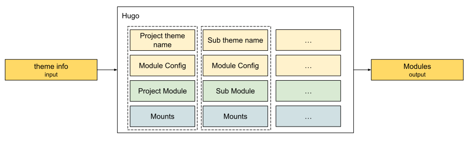
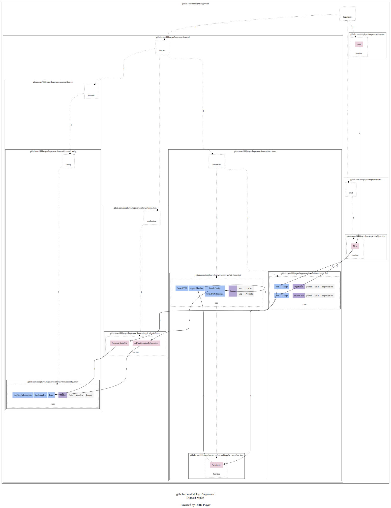
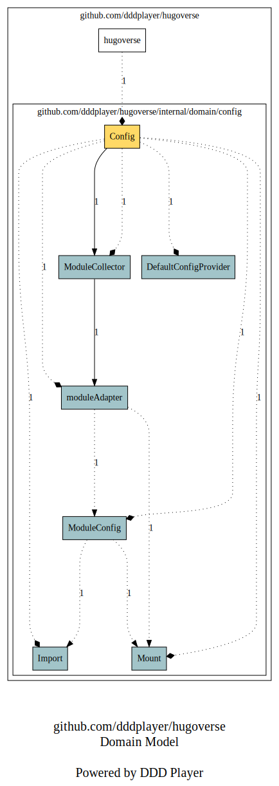
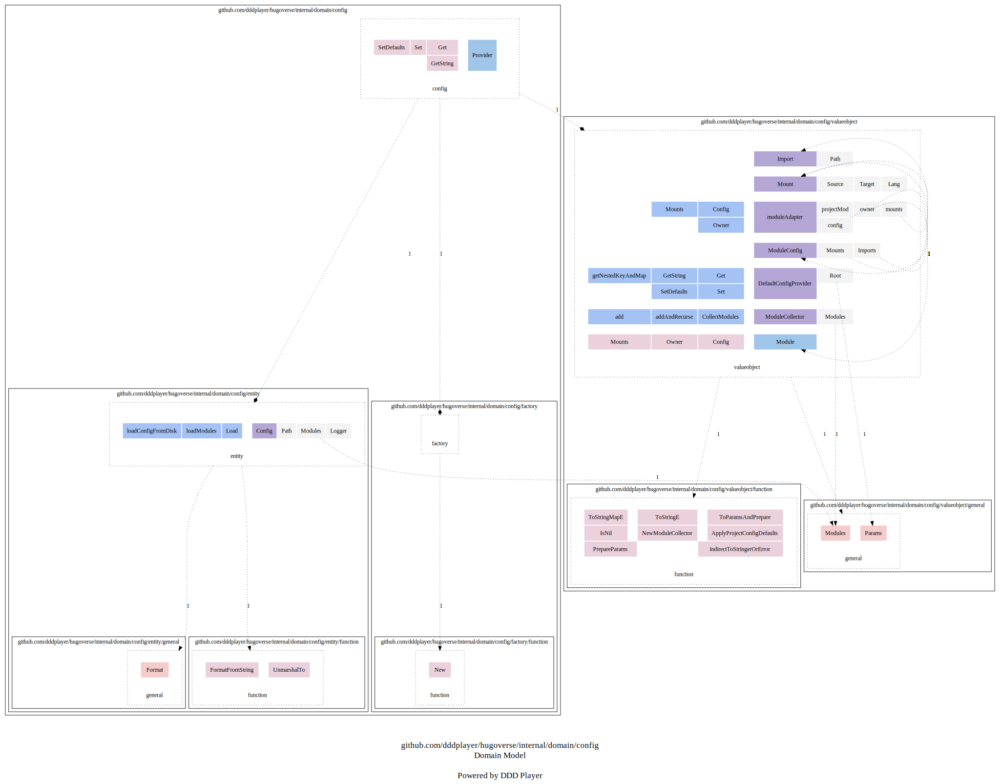
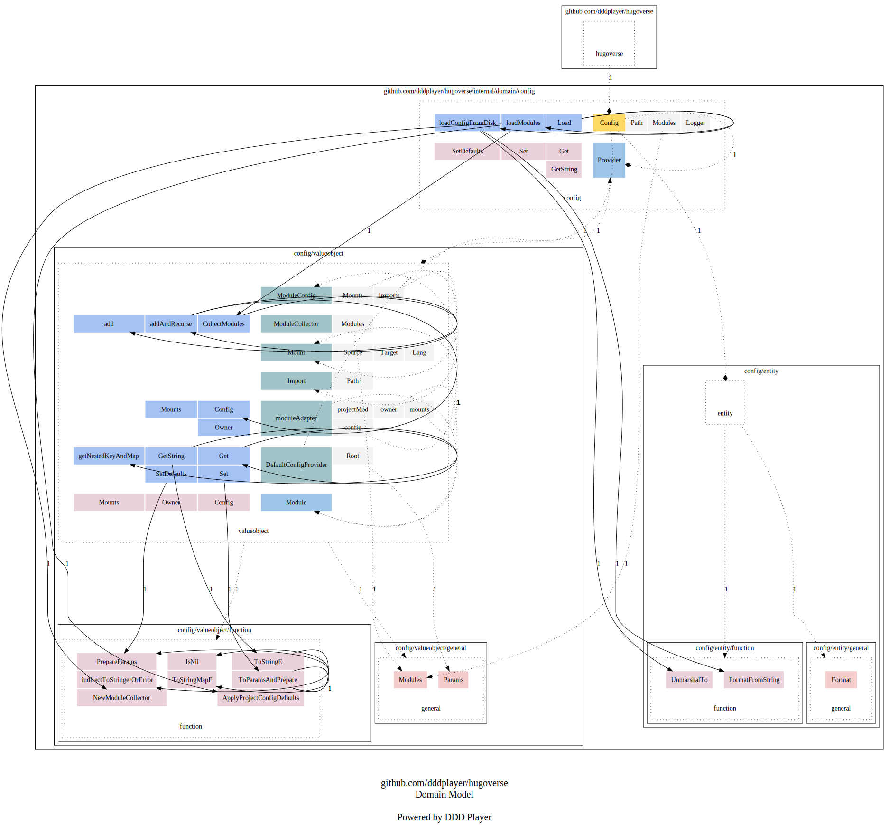
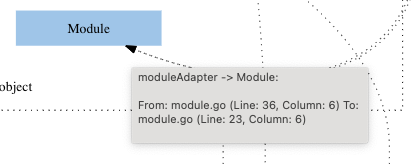

# DDD Hugo 配置信息

在用DDD来驱动Hugo配置信息开发之前，让我们先来回顾一下[Hugo源码精读 配置](../../03/code/config)中所描述到的主要实现思路。

**将配置文件config.toml转换成map:**


**再将默认配置信息加入其中**


**收集模块配置信息**



通过这些处理后，我们就能准备好完整的配置信息了。

但在静态站点生成领域里，又需要怎么样去组织这些对象，才能让大家协同并高效合作呢？

## Hugoverse 加载配置信息源码运行

运行以下命令：

```shell
➜  hugoverse git:(main) ✗ ./hugov build -p /var/folders/rt/bg5xpyj51f98w79j6s80wcr40000gn/T/hugoverse-temp-dir782641825
--- start to create `mytheme` module
--- theme: mytheme
=== modules: [%!s(*valueobject.moduleAdapter=&{true <nil> [{mycontent content en} {data data } {layouts layouts } {i18n i18n } {archetypes archetypes } {assets assets } {static static }] {[] [{mytheme}]}}) %!s(*valueobject.moduleAdapter=&{false 0xc0000ae360 [] {[] []}})]
```

上面我们调用了Hugoverse的build命令，指定的Hugo项目就是我们前面生成的[样例项目](../demo)。
输出的信息也就是样例项目中的配置信息。

从日志中可以看到，我们的样例项目配置的主题是: `mytheme`。

这样在加载模块的时候，就先要加载主模块，也就是样例项目本身，再加载主题模块`mytheme`。
从日志中可以看到，承载模块信息的是值对象`moduleAdapter`:

```go
// moduleAdapter implemented Module interface
type moduleAdapter struct {
	projectMod bool
	owner      config.Module
	mounts     []config.Mount
	config     config.ModuleConfig
}
```

对应的第一个模块信息如下:

```go
(*valueobject.moduleAdapter=&{
	true 
	<nil>
	[{mycontent content en} {data data } {layouts layouts } {i18n i18n } {archetypes archetypes } {assets assets } {static static }] 
	{[] [{mytheme}]}
})
```

说明是project模块，没有父结点，mounts里有详细的模块信息，其中我们配置的`contentDir = "mycontent"`内容目录信息也反应在了挂载信息里。

下一个模块信息如下:

```go
(*valueobject.moduleAdapter=&{false 0xc0000ae360 [] {[] []}})
```

可以看出，这个不是project模块，父结点就是上一个模块，其它的信息为空。
因为我们的主题很简单，就只有一个`mytheme.txt`文件，主要是用来简化主题模块的复杂度，这样可以让大家更容易理解Hugo主流程。


## Hugoverse Config 信息流

让我们先来看看Config模块是怎么和外部交互的，这样可以帮助我们实际理解六边形架构是怎么真实工作的。

```shell
➜  hugoverse git:(main) ~/go/bin/dp normal -m ./ -p github.com/dddplayer/hugoverse/internal/domain/config -mf
```



线上可缩放版本可[点这里](https://dddplayer.com/?path=https://assets.dddplayer.com/resource/hugov/github.com.dddplayer.hugoverse.internal.domain.config.messageflow.dot)查看。

从图中可看到Config模块主要是通过实体Config的Load方法对外提供服务的，主要调用路径有两条：

1. main -> cmd/New -> interface/buildCmd.Run -> application/GenerateStaticSite -> entity/Config.Load
2. main -> cmd/New -> interface/serverCmd.Run -> interface/api/NewServer -> interface/api/Server.registerHandler -> interface/api/Server.handleConfig -> application/AllConfigurationInformation -> entity/Config.Load

第一条路径是用来构建静态站点的，通过提供的应用服务GenerateStaticSite发起的调用。

第二条则是用来提供Headless CMS API服务发起的，通过提供的应用服务AllConfigurationInformation发起的调用。

总的来看，Config模块和外部交互的规则，完全符合[六边形架构](../hexagon)。
如果我们想要对外提供CMD和API的服务，那么internal application层就要提供支持，而具体的功能模块则由internal domain层的模块来负责。

配置信息模块就在internal/domain/config下，并且有一个实体Config负责对外提供统一服务。

下面我们就一起来看看模块内部的组成和实现。

## Config DDD 战略图

```shell
➜  hugoverse git:(main) ✗ ~/go/bin/dp strategic -m ./ -p github.com/dddplayer/hugoverse                    
```

战略图能给我们直观的展示在领域内部，有哪些关键领域对象帮帮助提供这些服务的，他们之间又是如何关联在一起的。

如谁是聚合根，负责统一对外提供服务。
哪些是实体对象，负责较复杂的事物处理。
又有哪些是值对象，负责承载数据和信息。

又比如，来了新的业务需求，我们要对战略图进行修改了。
那大家就可以拿出战略图，可视化对新的战略图进行讨论，用实际用例来测试，是否找到了准备的业务语言来描述，是否放在了合理的位置。



线上可缩放版本可[点这里](https://dddplayer.com/?path=https://assets.dddplayer.com/resource/hugov/github.com.dddplayer.hugoverse.strategic.config.dot)查看。

果然如我们所料：

- 实体Config也是聚合根，对外提供服务，并帮助内部成员专注在内部实现
- 值对象DefaultConfigProvider是实现了Provider接口的重要对象
- 值对象ModuleCollector用moduleAdapter帮忙组织了ModuleConfig，并把Import和Mount信息都准备好
  - Import指的是模块需要引入哪些模块，像我们的样例工程引用了Theme主题
  - Mount指的是挂载点，当我们准备好一些引入的模块后，我们怎么把相关的内容，如layouts的文件都挂载到相应的位置，为后面的渲染准备好模板


## Config 内部组织结构

有了全局视角后，我们理解了外部和Config模块是怎么交互的，也从战略图中理解了各关键对象是如何协作的。
那除了这些关键对象之外，要想实现完整的功能，肯定还有其它细节需要补充。
接下来，就让我们一起来看看Config模块的内部具体组成。

```shell
➜  hugoverse git:(main) ✗ ~/go/bin/dp normal -m ./ -p github.com/dddplayer/hugoverse/internal/domain/config -c
```



线上可缩放版本可[点这里](https://dddplayer.com/?path=https://assets.dddplayer.com/resource/hugov/github.com.dddplayer.hugoverse.internal.domain.config.composition.dot)查看。

从图中可以看到：

- config模块在根目录定义了Provider接口，为对外提供的服务定义了明确的契约
- 只有一个实体，那就是Config，这个实体拥有三个属性，分别是配置文件路径Path，用于提供记录信息的Logger，和所有模块信息
- 值对象相对丰富
  - DefaultConfigProvider，通过提供的方法可以看出，实现了Provider接口，其Root属性是Params类型，用以支持对外提供的方法
  - Module是一个接口，定义了每个Module需要提供Mounts, Config和Owner信息，因为这里的模块指的是Theme，而Theme是可嵌套的
  - 收集Module信息还需要一个收集器，那就是ModuleCollector，这个收集器的唯一属性就是Modules

这样一来，我们就能大致了解到Config模块内部是如何组织，协同工作的。

先定义接口，大家商量好后，就可以各自忙各自的了。
外部模块 - 应用可以知道怎么了解到Config模块可以提供哪些服务（Provider - Set, Get, GetString, SetDefaults）。
Config模块内部也可以自己决定要怎么去实现，并提供这些服务。
就像面向对象里的依赖反转原则 - 谁提供服务，谁定义接口。

明确了职责后，Config决定由实体对象Config来提供加载Load的功能，并返回接口Provider服务，这需要一个实现对象，那就是值对象DefaultConfigProvider。

在加载的过程中，需要一些外部信息，像配置文件路径信息。
有了这些信息后，实体Config就按自己的节奏来进行处理了。
从私有的方法可以看出，Config需要从本地加载配置文件 - loadConfigFromDisk，再加载模块信息loadModules，其中加载模块时，用到了值对象模块收集器。

在大家的配合下，最终实现了最开始的承诺 - 提供Provider服务。

## Config DDD 战术图

```shell
➜  hugoverse git:(main) ✗ ~/go/bin/dp tactic -m ./ -p github.com/dddplayer/hugoverse -d                    
```

战略图负责统一语言，方便治理领域模型。
但软件的交付除了架构设计，还离不开具体实现。

比如在代码走查的时候，我们还需要看到实现细节，像接口的实现，引用的关系，以及存放的位置，等等信息。



线上可缩放版本可[点这里](https://dddplayer.com/?path=https://assets.dddplayer.com/resource/hugov/github.com.dddplayer.hugoverse.tactic.detail.config.dot)查看。

DDD战略图可以帮助我们直观的查看领域对象，以及对象之间的关联关系，以保证大家用的都是同一语言 - 统一语言。
这样无论是在敏捷迭代IPM拉通等会议上，还是在架构设计的过程中，都能让消息高效准确的在团队内流通。

而在代码评审的时候，光有DDD战略图是不够的，还需要DDD战术图。
用以帮助大家理解代码实现的细节，团队就可以在这一过程中发现我们的代码实现是否符合架构的一些规则，如DDD强调不能由聚合根之外的内部对象对外提供服务等。

在上图中，我们可以看到：

- 确实是DefaultConfigProvider实现了Provider，有一条表示接口实现的虚线
- 聚合根对外提供的Load方法，分别调用了内部的loadConfigFromDisk和loadModules方法
- moduleAdapter的owner属性就是Module接口对象，自己也实现了Module接口

小技巧：我们可以用鼠标hover上这些线条获取更详细的信息，如下图所示：



## 小结

通过阅读Hugo源码，我们能理解Hugo的设计思路，并懂得Hugo是如何一步步实现这些功能的。

如果我们想把这些知识应用到工作生活中，我们还需要把这些零碎的领域知识组装成一副清晰的领域全景图。

在DDD所推荐的六边型架构中，我们能很明确的知道什么样的功能需要放在哪些目录下。
这正是这种架构框架带给我们的好处 - 先定义职责，形成共识，写代码的时候就知道我们需要把这些功能代码分别放置在哪里。

有了框架的帮助，我们借助DDDPlayer的Message Flow功能，可以看到Config模块是如何和处部进行交互的，又是谁充当着处交官的角色，那她将会是聚合根的首先。

有了清晰的职责划分，再用DDDPlayer的Composition功能，可以了解到Config模块是具体怎么组织内部的对象的，这又帮助我们了解到了更多的细节。

在DDD中，既要懂战略，也要懂战术。

战略指导我们要怎么做，有哪些关键对象需要明确出来。
而战术就能告知我们该怎么具体实现，如何动手实践。

战略结合战术，首先能让我们统一语言，知道在家说的一个个名词都是什么意思，让信息不失真，达到高效沟通的目的。
也让我们明确了实现细节，有问题也可以及时沟通，及时发现。

Config模块的策略就是由Config这个聚合根对外提供统一的服务，由DefaultConfigProvider来提供提前协商的接口服务。
并由ModuleCollector这个帮手来收集经过moduleAdapter适配器处理过的模块相关信息。

战术上Config模块也是遵循战略指导，提供了一些功能函数和方法具体实现了Config模块秘定义的功能服务。