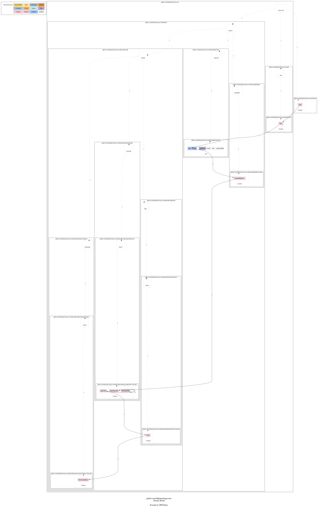
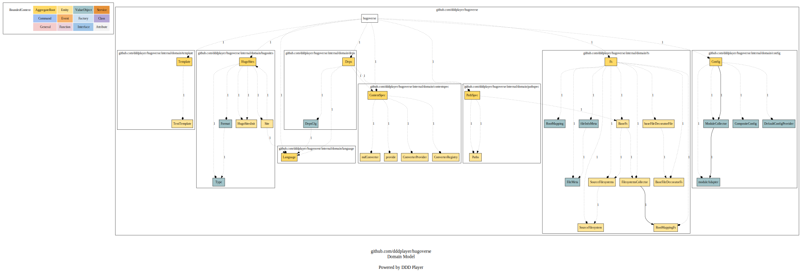
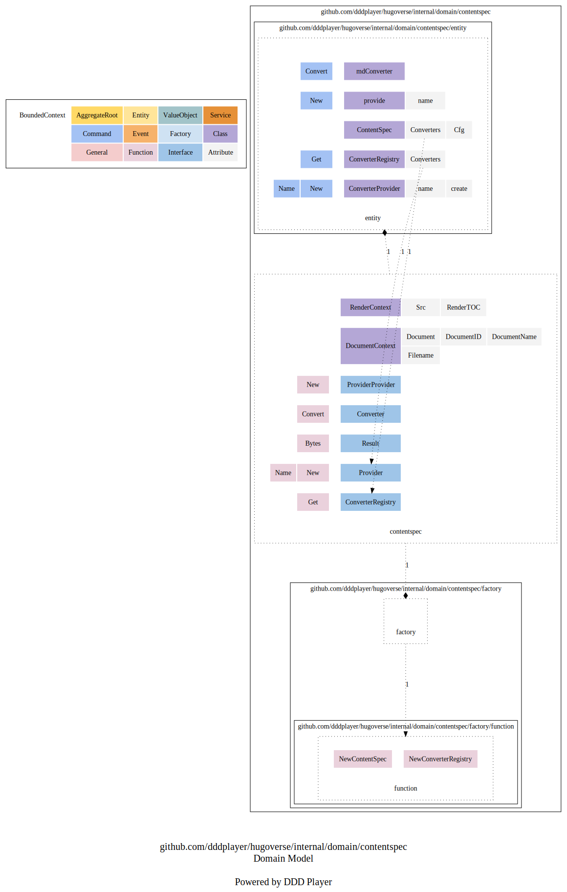
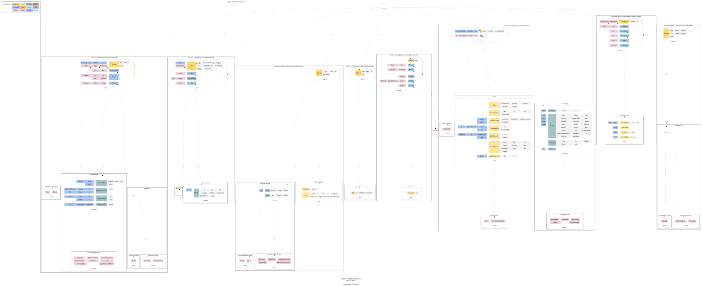

# DDD ContentSpec

在用DDD来驱动Hugo依赖的ContentSpec之前，让我们还是先来回顾一下[Hugo源码精读 ContentSpec](../../03/code/deps/contentSpec)中所描述到的主要实现思路。


Hugo的设计思路是通过转换器提供方名字，获得一个转换器。
这样就可以将内容转换成自己想要的格式，比如将Markdown格式转换成Html格式。

Hugo的设计也很简洁易懂。
那就是提供一个转换器提供方的注册处，里面用名字关联上转换器提供方实例。
值得注意的是这里存换的都是转换器提供方，而不是最终的转换器。
这些提供方可以通过调用New方法，最终生成真正的转换器实例。
用名字和转换器提供方一一映射的好处是，可以给一个转换器提供方取多个名字。
比如默认和Markdown对应的都是goldmark转换器提供方。

## Hugoverse ContentSpec 源码运行展示

```shell
➜  hugoverse git:(main) ✗ ./hugov build -p /var/folders/rt/bg5xpyj51f98w79j6s80wcr40000gn/T/hugoverse-temp-dir492284606

...
NewContentSpec: 
ContentSpec Converters: &{Converters:map[markdown:{name:markdown create:0x1260de0}]}
ContentSpec Markdown converter: type(*entity.mdConverter), &{}
...

```

在Hugoverse源码运行示例中，我们看到ContentSpec中最主要的成员就是Converters，也就是转换器注册处。
上面示例中，已经注册在案的有一个名为markdown的转换器提供方，其中还有一个create方法。
这个创建方法会在转换器提供方调用自身New方法的时候被调用，这样就可以换需实时创建出转换器了。

目前我们所得到的转换器还是一个`*entity.mdConverter`类型的空结构体。
这里我们先将其做为一个占位符，后面计划会用到`github.com/dddplayer/markdown`来实现Markdown解析和渲染的服务。

## Hugoverse ContentSpec 信息流

```shell
~/go/bin/dp normal -m ./ -p github.com/dddplayer/hugoverse/internal/domain/contentspec -mf
```



线上可缩放版本可 [点这里](https://dddplayer.com/?path=https://assets.dddplayer.com/resource/hugov/github.com.dddplayer.hugoverse.internal.domain.contentspec.messageflow.dot)查看。

从信息流图中，我们发现，和PathSpec一样。
在创建HugoSites的时候，applyDeps时，在新建Deps的过程中，和PathSpec一起，也创建了ContentSpec实例。

## ContentSpec DDD 战略图更新

```shell
➜  hugoverse git:(main) ✗ ~/go/bin/dp strategic -m ./ -p github.com/dddplayer/hugoverse                    
```



线上可缩放版本可[点这里](https://dddplayer.com/?path=https://assets.dddplayer.com/resource/hugov/github.com.dddplayer.hugoverse.strategic.contentspec.dot)查看。

从DDD战略图中也可以看出，ContentSpec也和PathSpec都是Deps中的一部分。
ContentSpec是聚合根，将ConverterProvider注册在ConverterRegistry中，provide是ConverterProvider的一个实例，而mdConverter则是一个converter。

## ContentSpec 内部结构

```shell
~/go/bin/dp normal -m ./ -p github.com/dddplayer/hugoverse/internal/domain/contentspec -c
```



线上可缩放版本可[点这里](https://dddplayer.com/?path=https://assets.dddplayer.com/resource/hugov/github.com.dddplayer.hugoverse.internal.domain.contentspec.composition.dot).

通过详细的内部结构图，进一步向我们展示了ContentSpec的实现细节：

* 在contentspec包中，统一定义了一系列接口，从ConverterRegistry到Convert，以及文档上下文和渲染上下文。
* 在实体包中，则是提供服务所需的所有实体
* 在仓库中，为了减少调用者的知识负担，让调用体验更好，更高效，由ContentSpec自己帮助封闭了新建ContentSpec的方法，以供调用。

## ContentSpec DDD 战术图更新

```shell
➜  hugoverse git:(main) ✗ ~/go/bin/dp tactic -m ./ -p github.com/dddplayer/hugoverse
```



线上可缩放版本可[点这里](https://dddplayer.com/?path=https://assets.dddplayer.com/resource/hugov/github.com.dddplayer.hugoverse.tactic.contentspec.dot)

这里丰富了DDD战术图。
到目前为止，包含了Config和Deps的ContentSpec。

## 小结

