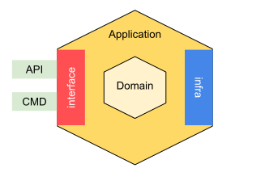

# 六边形架构

六边形架构（Hexagonal Architecture）和领域驱动设计（DDD）是两种软件设计理念，它们可以结合使用以创建可维护、灵活且高效的系统。

六边形架构着重于将系统的关注点分离开来，使得核心业务逻辑与外部环境（例如数据库、UI、外部服务等）解耦。
它将系统划分为内部和外部两个区域，内部区域包含核心业务逻辑，外部区域是与外界交互的接口。这种设计使得系统更易于测试、扩展和维护。

领域驱动设计（DDD）则聚焦于解决复杂业务领域的建模问题。它强调理解和建模业务领域，并将业务需求映射到软件设计中。
DDD提倡通过领域模型来表达业务概念，将软件设计与业务领域紧密结合，从而更好地理解和解决业务问题。

这两种理念可以协同工作。
六边形架构可以作为一种架构风格，帮助将系统按照内部和外部进行划分，而DDD则提供了一种方法来深入理解业务领域，并在系统中建立相应的领域模型。
通过将六边形架构和DDD相结合，可以在系统中建立清晰的业务边界，使得系统更易于扩展、维护和理解，并且更好地满足业务需求。

## Hugoverse的目录结构

```shell
➜  hugoverse git:(main) ✗ tree -L 3 -d
.
├── cmd
├── dddplayer
├── internal
│   ├── application
│   ├── domain
│   │   ├── config
│   │   ├── deps
│   │   ├── fs
│   │   ├── hugosites
│   │   ├── language
│   │   ├── pathspec
│   │   ├── site
│   │   └── template
│   └── interfaces
│       ├── api
│       └── cmd
└── pkg
    ├── hreflect
    ├── htime
    ├── lazy
    ├── log
    ├── overlayfs
    ├── paths
    ├── radixtree
    └── types
        └── hstring

27 directories
```

结合下图进行理解：



### Golang 项目目录结构

```shell
➜  hugoverse git:(main) ✗ tree -L 1 -d
.
├── cmd
├── dddplayer
├── internal
└── pkg

5 directories
```

这是常见的Golang项目目录结构：

- cmd: 存放命令行相关代码
- internal: 项目内部源码，也就是项目的核心内容
- pkg：包，多是自己写的工具包
- dddplayer: 这个目录是由[DDDPlayer CLI](https://github.com/dddplayer/dp)生成的，这里用来帮助我们更好的理解Hugoverse源码工作原理，及领域模型

### 六边形架构目录结构

```shell
➜  hugoverse git:(main) ✗ cd internal
➜  internal git:(main) ✗ tree -L 2 -d
.
├── application
├── domain
│   ├── config
│   ├── deps
│   ├── fs
│   ├── hugosites
│   ├── language
│   ├── pathspec
│   ├── site
│   └── template
└── interfaces
    ├── api
    └── cmd

14 directories
```

这里是六边形架构的目录内容：

- application: 做为一个应用，对外提供的服务都在这个目录里
- domain： DDD核心，这里存放着我们的核心领域内容，也就是静态站点生成领域的所有核心源码
- interfaces: 对应于六边型的adapter，我们这里提供了两个服务接口，一个是api，另一个是cmd

细心的小伙伴会发现，对应上图中我们还缺了一个目录，那就是infrastructure，理论是也是会放在internal目录下。
因为Hugoverse的特殊性，我们并不需要一些数据库之类的基础服务，所以这里并没有像repository之类的代码。

