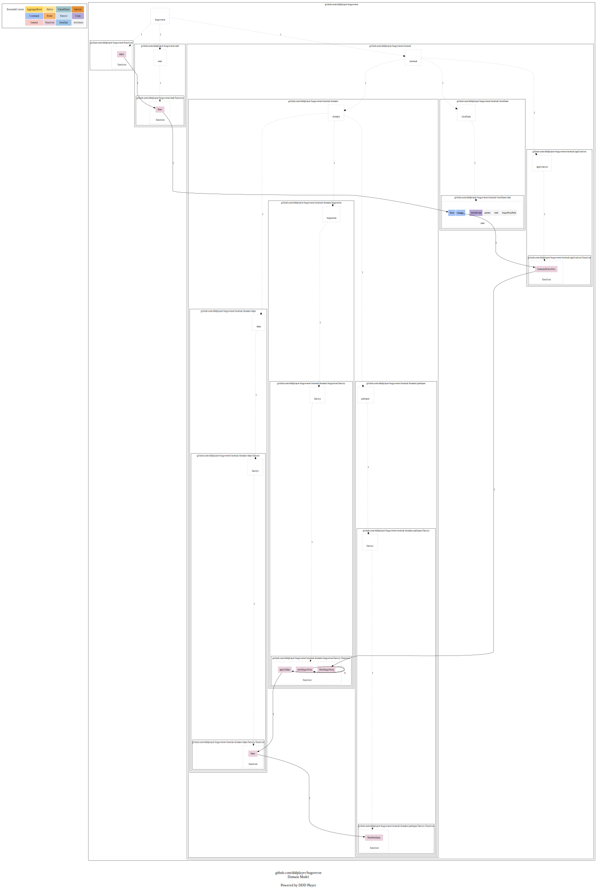
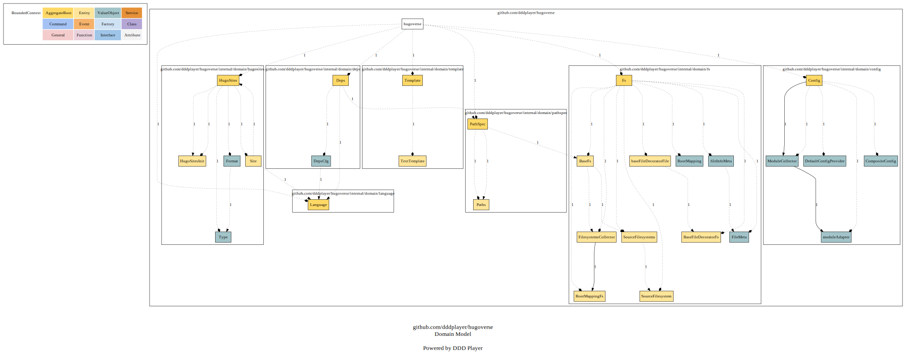
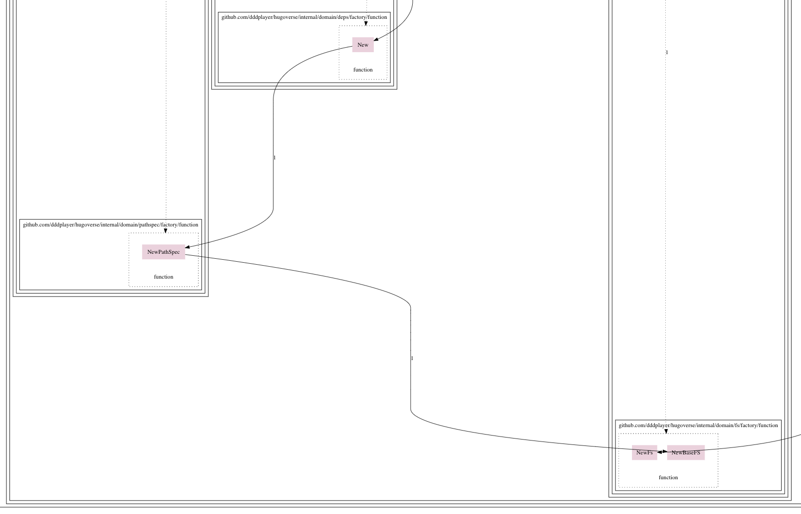
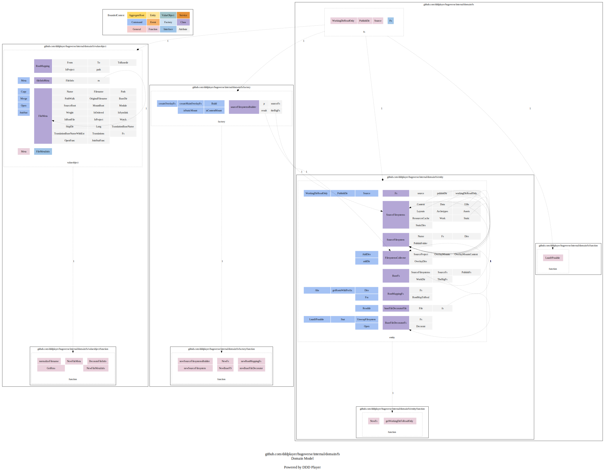
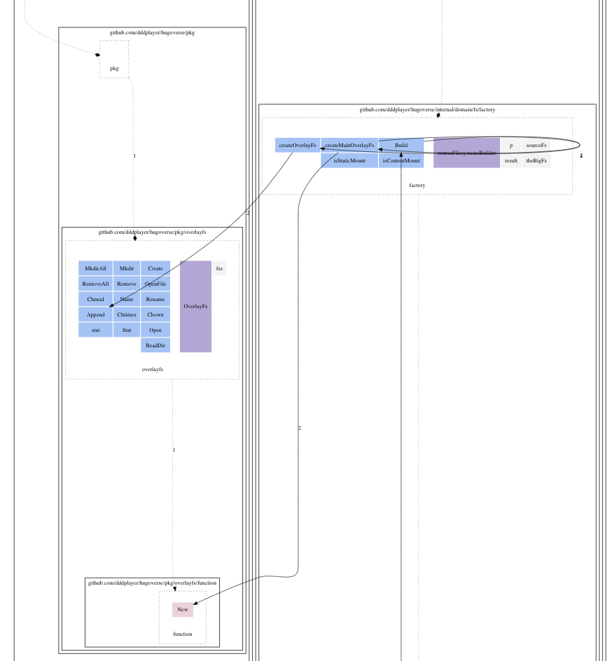
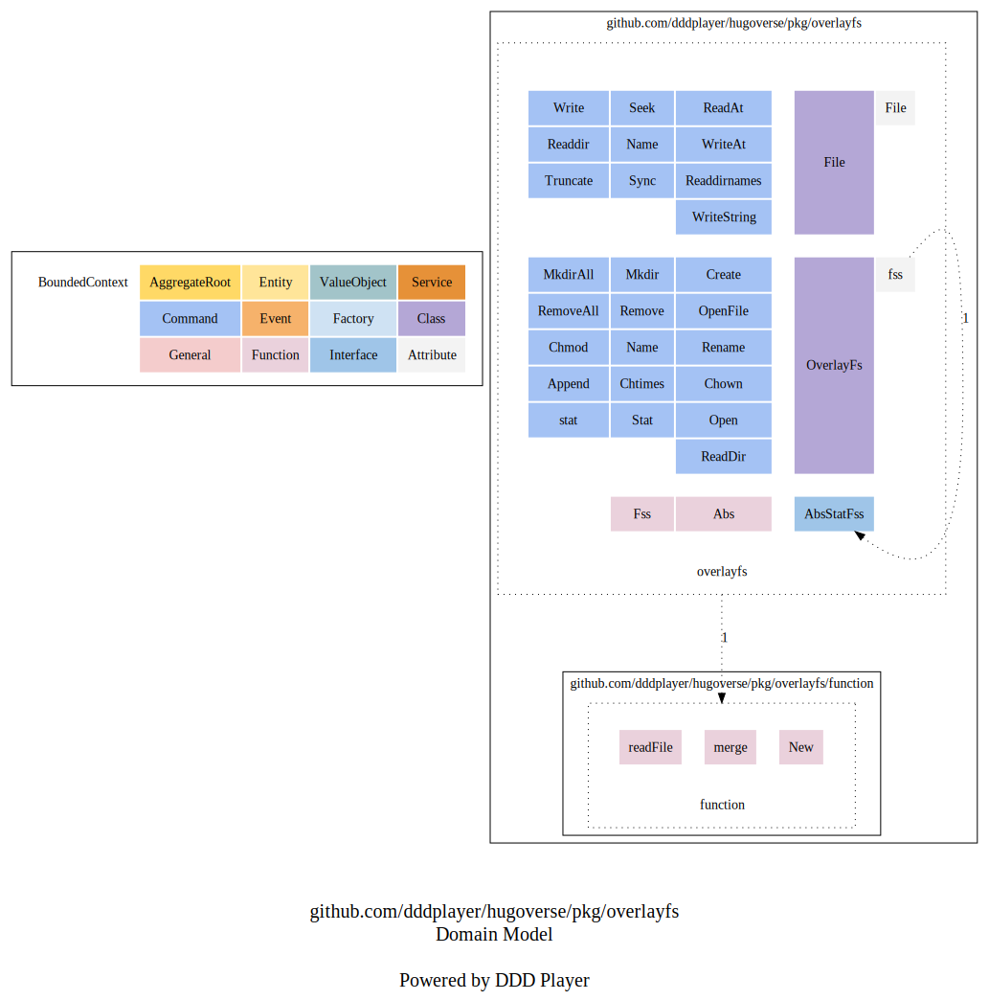
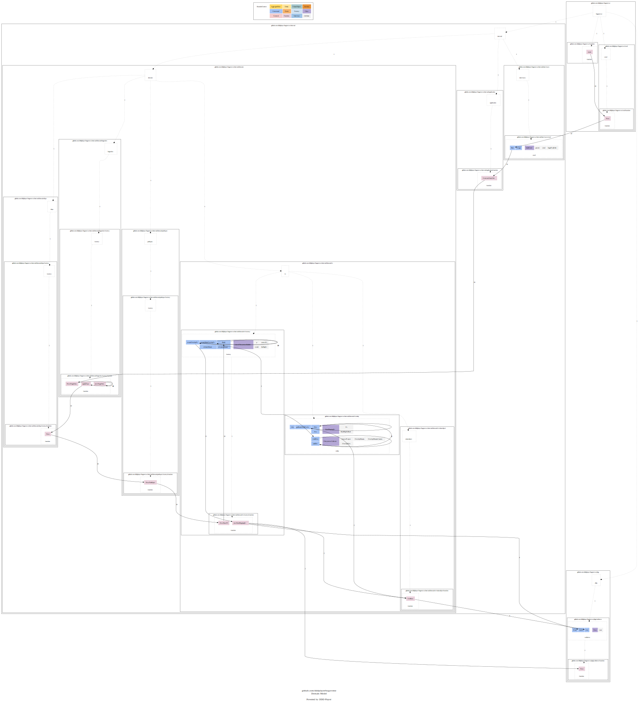
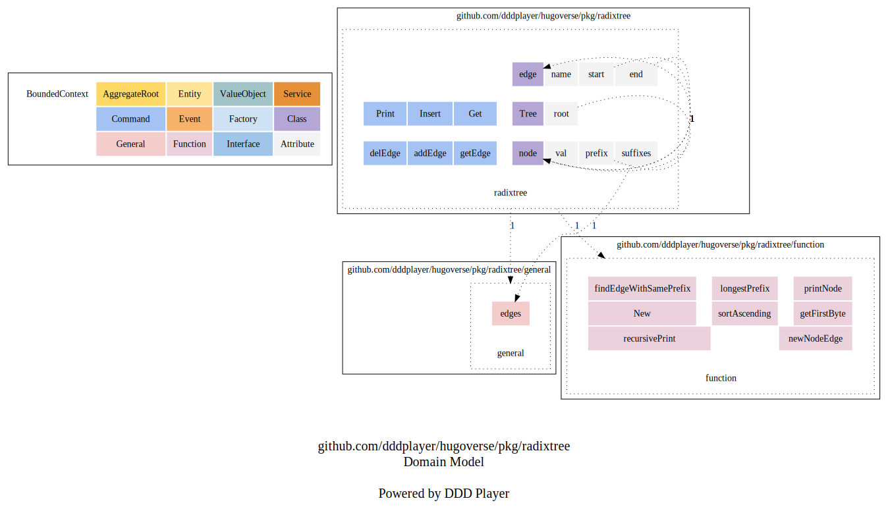
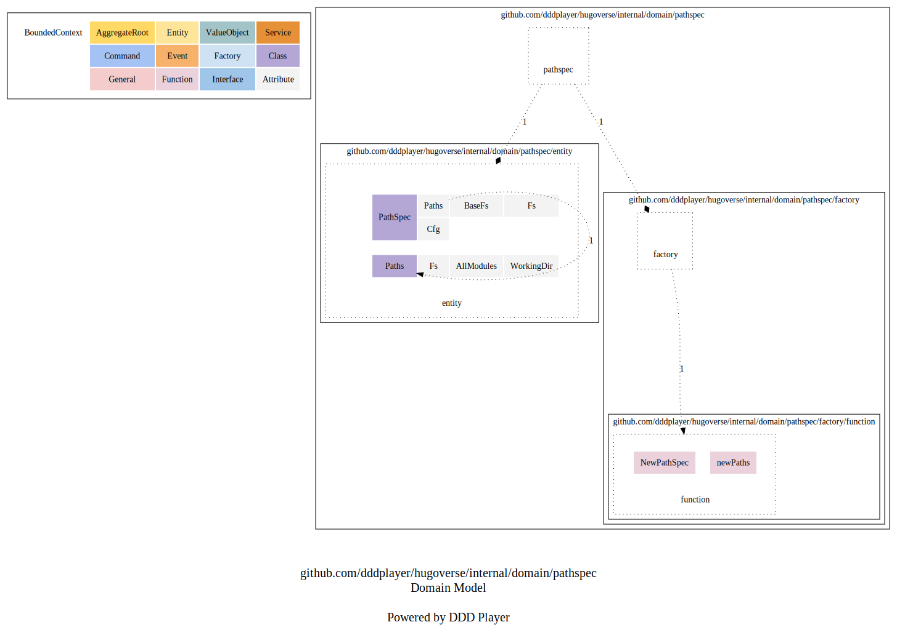
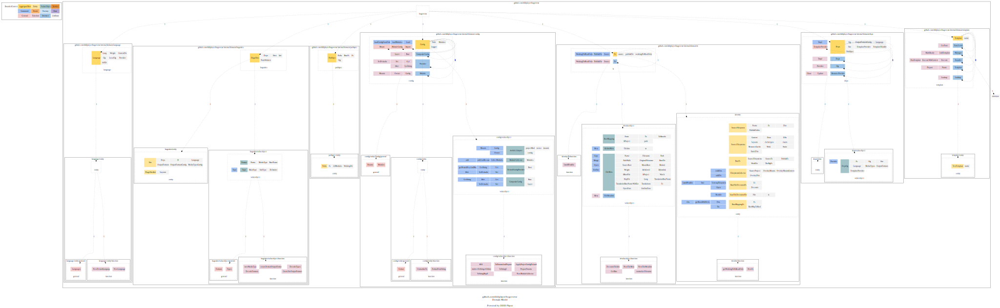

# DDD PathSpec

在用DDD来驱动Hugo依赖的PathSpec之前，让我们还是先来回顾一下[Hugo源码精读 PathSpec](../../03/code/deps/pathSpec)中所描述到的主要实现思路。


输入初始文件系统，以及模块信息，输出统一文件系统。

这样做的好处是让使用者不用去面对复杂的文件系统组织关系，而是直接使用按Hugo文件系统结构组织好的统一文件系统。

比如layouts：

- 用户可能会自定义layout，所以在Project模块下有可能有layouts目录。
- 用户还可能会引用主题，主题里也会有layouts目录。复杂的情况是这个主题可能还会引用其它主题，那我们就还得处理好其它的主题layouts目录。

如果不把这些目录结构都统一设置好，那我们在用layouts里的模板时，就得自己处理这些模板的依赖关系，及覆盖关系。
这些复杂度就会分散在不同的代码里，显然不符合高内聚，低耦合的要求。

所以，Hugo的做法是提前把这些信息都准备好，放在Hugo构建站点的依赖Deps里，以备后续使用之需。

## Hugoverse PathSpec 源码运行展示

```shell
➜  hugoverse git:(main) ✗ ./hugov build -p /var/folders/rt/bg5xpyj51f98w79j6s80wcr40000gn/T/hugoverse-temp-dir492284606

...
NewPathSpec: 
PathSpec: &{Paths:0xc0000173c0 BaseFs:0xc000017400 Fs:0xc00010d2f0 Cfg:0xc000136700}
PathSpec Paths: &{Fs:0xc00010d2f0 AllModules:[0xc00002a420 0xc00002a480] WorkingDir:/var/folders/rt/bg5xpyj51f98w79j6s80wcr40000gn/T/hugoverse-temp-dir492284606}
PathSpec BaseFs: &{SourceFilesystems:0xc000136850 SourceFs:0xc000012570 PublishFs:0xc000012558 WorkDir:0xc00006c1c0 TheBigFs:0xc00010d440}
PathSpec Fs: &{source:0xc00006c180 publishDir:0xc00006c1a0 workingDirReadOnly:0xc00006c1c0}
PathSpec Cfg: &{Lang:en Weight:0 ContentDir:mycontent Cfg:0xc0000504f8 LocalCfg:0xc000050500 Provider:0xc00006c1e0 initErr:<nil>}
...

```

PathSpec拥有着最全的路径信：

- Fs指向的是原始的文件信息，像原始的文件系统，指的就是我们的样例项目，还有相应只读的文件系统，再就是站点发布目录地址。
- Cfg是初始的配置信息，包括了默认配置和用户配置信息。
- Paths包含了构建BaseFs所需的所有信息，其中Fs就是上面所指的原始文件系统信息。地址不同（0xc00010d2f0，0xc00006c180），是因为创造Paths的形参并不是指针类型。
- BaseFs是我们要创造的目标，将所有模块的文件都按统一标准进行整理，生成一个方便使用的统一文件系统。

## Hugoverse PathSpec 信息流

```shell
~/go/bin/dp normal -m ./ -p github.com/dddplayer/hugoverse/internal/domain/pathspec -mf
```



线上可缩放版本可 [点这里](https://dddplayer.com/?path=https://assets.dddplayer.com/resource/hugov/github.com.dddplayer.hugoverse.internal.domain.pathspec.messageflow.dot)查看。

从信息流图中，我们发现，在创建HugoSites的时候，会applyDeps。
这时，我们会新建Deps，而PathSpec则是依赖之一。

## PathSpec DDD 战略图更新

```shell
➜  hugoverse git:(main) ✗ ~/go/bin/dp strategic -m ./ -p github.com/dddplayer/hugoverse                    
```



线上可缩放版本可[点这里](https://dddplayer.com/?path=https://assets.dddplayer.com/resource/hugov/github.com.dddplayer.hugoverse.strategic.pathspec.dot)查看。

可以看到，对比Config时的战略图，到PathSpec时，战略图变得丰富了许多。
基于上面的信息流，我们可以一起来看一看这一版的战略图。

- HugoSites是生成站点的地方，接近于application层，以方便提供服务。
- Deps是构建站点的依赖条件，在新建站点的时候，也要把依赖提前准备好。
- PathSpec是依赖之一，也是其它依赖要使用的信息，所以需要在最前面准备好。
- Fs是PathSpec依赖的，也是PathSpec的使命，那就是将站点项目，以及里面用到的所有模块，如主题，全部整理到一起，对外提供统一的服务

### Fs领域初览

从战略图中可以看出，PathSpec主要的工作就是借助于Fs模块，将所有的模块融合到一起，做为一个完整的文件系统，对外提供文件系统服务。

结合上一架构章节中，对[文件系统的组织](../../03/arch/#文件系统的组织)的描述，我们可以看到在Fs领域中，主要的实体和值对象有：

- Fs: 聚合根，也是实体，统一对外提供文件系统相关的服务
- BaseFs: 也就是基础文件系统，这里将所有的Hugo模块都整合成一个统一的文件系统，方便使用
- SourceFilesystems: 因为Hugo模块都是按统一的文件结构设计的，模块之间会有重名的目录结构，就需要将这些分散的文件系统结合到一起，通过Hugo的原则，对外提供统一文件系统服务。
- FilesystemCollector: 如何生成上面的SourceFilesystems，需要有这要一个文件系统收集器，进行收集。
  而收集器依赖的信息有RootMapping，通过对实体文件目录的映射，可以生成需要的RootMappingFs，最后封闭成具有装饰功能的文件系统帮助生成目标SourceFilesystem。

### Fs Message Flow

```shell
~/go/bin/dp normal -m ./ -p github.com/dddplayer/hugoverse/internal/domain/fs -mf
```



线上可缩放版本可[点这里](https://dddplayer.com/?path=https://assets.dddplayer.com/resource/hugov/github.com.dddplayer.hugoverse.internal.domain.fs.messageflow.dot).

正是在NewPathSpec的时候，调用了NewBaseFs。

### Fs 内部结构

```shell
~/go/bin/dp normal -m ./ -p github.com/dddplayer/hugoverse/internal/domain/fs -c
```


线上可缩放版本可[点这里](https://dddplayer.com/?path=https://assets.dddplayer.com/resource/hugov/github.com.dddplayer.hugoverse.internal.domain.fs.composition.dot).

从上图中可以看出，当我们想要新建NewBaseFs的时候，同样在Factory里，有一个sourceFilesystemsBuilder。
说明在新建BaseFs的时候，主要是由这个构建器来进行构建的，从其中的result指向的是SourceFilesystems，theBigFs指向中的是FilesystemsCollector也可以证明这一点。

从左侧方法可以看出，这个构建器在构建的时候，需要创建重叠文件系统createOverlayFs。
我们再来看看所引用的overlayfs包的相关信息，以帮助我们进一步理解PathSpec的具体实现细节。

### OverlayFs Message Flow

```shell
~/go/bin/dp normal -m ./ -p github.com/dddplayer/hugoverse/pkg/overlayfs -mf
```



线上可缩放版本可[点这里](https://dddplayer.com/?path=https://assets.dddplayer.com/resource/hugov/github.com.dddplayer.hugoverse.pkg.overlayfs.messageflow.dot)

由构建器在创建主重叠文件createMainOverlayFs时，调用的新建。
并在createOverlayFs时还调用了Append。
说明OverlayFs可以组织多个文件系统，提供统一服务。
就像是一个装饰器一样。


### OverlayFs 内部结构

```shell
~/go/bin/dp normal -m ./ -p github.com/dddplayer/hugoverse/pkg/overlayfs -c
```



线上可缩放版本可[点这里](https://dddplayer.com/?path=https://assets.dddplayer.com/resource/hugov/github.com.dddplayer.hugoverse.pkg.overlayfs.composition.dot)

可以清楚的看到，OverlayFs是由满足AbsStatFss接口的文件系统组成的，存储在fss里，而且是多个文件系统。

那这些原始的文件系统都从哪儿来的呢？
前面有提到构建器要createOverlayFs，那我们就顺着这个去找。

### RadixTree Message Flow

我们知道FilesystemsCollector是负责收集工作的，而他收集的正是RootMappingFs。
为什么叫Root Mapping?
因为在Hugo中，用户是可以灵活配置多重文件挂载点的。
如静态文件夹，或者数据文件夹。
都可以配置多个挂载点，这样我们就需创建一个逻辑根文件系统，来将这些有相同用途的文件都整合到一个文件系统中。

Hugo中的RootMappingFs对象，用的就是基数树radix tree这种数据结构来实现这个需求的。
对应RootMappingFs的RootMapToReal字段。

```shell
~/go/bin/dp normal -m ./ -p github.com/dddplayer/hugoverse/pkg/radixtree -mf
```



线上可缩放版本可[点这里](https://dddplayer.com/?path=https://assets.dddplayer.com/resource/hugov/github.com.dddplayer.hugoverse.pkg.radixtree.messageflow.dot)

可以看到以下调用顺序：

`sourceFilesystemsBuilder.createOvlerlayFs -> 
FilesystemsCollector.AddDir ->
FilesystemsCollector.addDir ->
RootMappingFs.Dirs ->
RootMappingFs.getRootsWithPreix ->
RootMappingFs.getRootsWithPreix ->
GetRms ->
radixtree/Tree.Get
`

看来RootMappingFs是以基数树的形式将所有Hugo组件(layouts, data, static等)给组织起来的。

### RadixTree 内部结构

```shell
~/go/bin/dp normal -m ./ -p github.com/dddplayer/hugoverse/pkg/radixtree -c
```



线上可缩放版本可[点这里](https://dddplayer.com/?path=https://assets.dddplayer.com/resource/hugov/github.com.dddplayer.hugoverse.pkg.radixtree.composition.dot)

可以看到基数数的特点就是通过前缀，把具有相同前缀的对象都放在同一父结点下。
这样能大大方便针对路径的查找速度。

## PathSpec 内部结构

```shell
~/go/bin/dp normal -m ./ -p github.com/dddplayer/hugoverse/internal/domain/pathspec -c
```



线上可缩放版本可[点这里](https://dddplayer.com/?path=https://assets.dddplayer.com/resource/hugov/github.com.dddplayer.hugoverse.internal.domain.pathspec.composition.dot).

可以看出PathSpec的内部结构较为简单，这样对外提供的服务也将会更加清晰。
让使用的成本变得更底。
这正是得益于前面提到的Fs, OverlayFs, RadixTree等等的全力支持。

## PathSpec DDD 战术图更新

```shell
➜  hugoverse git:(main) ✗ ~/go/bin/dp tactic -m ./ -p github.com/dddplayer/hugoverse
```



线上可缩放版本可[点这里](https://dddplayer.com/?path=https://assets.dddplayer.com/resource/hugov/github.com.dddplayer.hugoverse.tactic.pathspec.dot)

这里丰富了DDD战术图。
到目前为止，包含了Config和Deps的PathSpec。

## 小结

Hugo提供了很强大的配置功能，并且支持主题嵌套。
功能越强大，越灵活，对于实现来说，也就意味着越复杂。

我们可以简单将PathSpec理解为统一后的Hugo文件系统，提供的服务很简单。
这从PathSpec的内部组成对象也可以看出，就只有PathSpec和Paths两个主要对象。

通过DDD领域战略图则可以看出，为了让用户使用起来足够方便，还需要来自其它领域，主要是文件系统Fs领域的强力支持。
DDD战术图则为此提供了更详细的信息，让我们能看到Fs的具体实现细节。

PathSpec完美体现了Hugo将困难留给自己，把方便留给他人的设计理念。
