# Build源码分析

站点已经准备就绪，所有的依赖都已经各就各位。
从[事件风暴](../how/事件风暴.md)的主流程来看，接下来是时候进行最终构建了：

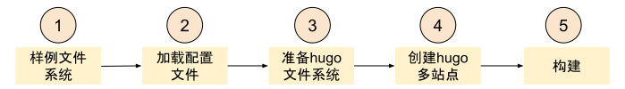

## 跬步千里 - Build源码实现

在事件风暴中我们已经看到了构建的详细流程：

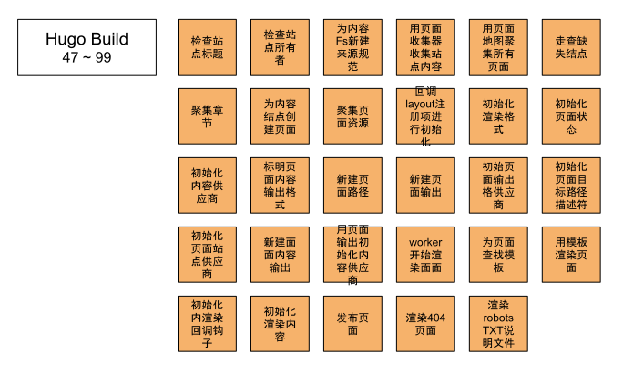

接下来，让我们从源码实现的角度来进一步分析。

## 了然于胸 - Build时序图

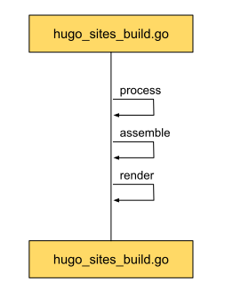

很清晰的三步：

* process：将文件系统的文件，有序地添加到内容图谱中。
* assemble：将内容图谱转换成页面图谱，为每一个内容图谱中的结点创建页面，包括首页、章节等结构页面。
* render：根据模板以及页面信息，进行最终站点渲染。

### Process时序图

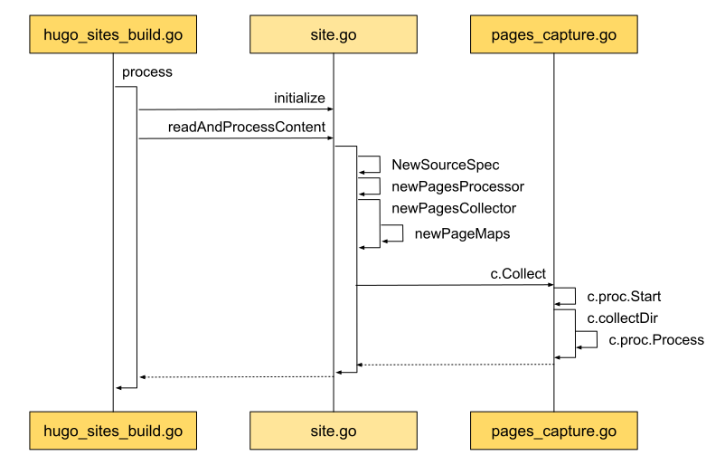

从中间可以看到，在开始处理之前，Site进行了初始化，以做好处理的准备。
开始处理内容时，先创建了资源规范NewSourceSpec，正是后续组件所要处理的内容。
紧接着创建页面处理器PagesProcessor和PagesCollector。
然后由收集器，从目录开始收集。

在[基础架构](../how/基础架构.md)中，有对处理流程进行介绍。
通过明确的分工，高效的协作，最终将所有文件分门别类，规整地放在中心货架上。

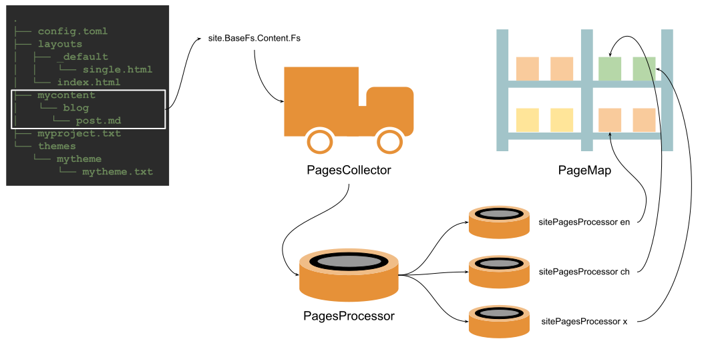

现在我们来看看具体地实现思路和细节。

先来举个例子：

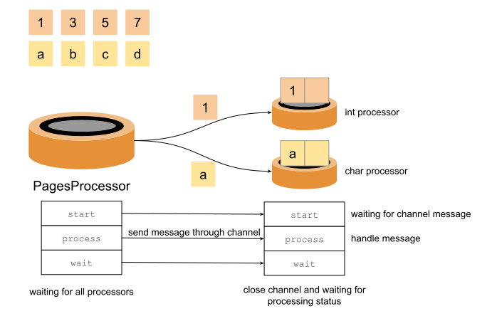

比如我们有两组数据要进行处理，一组是整型，一组是字符型。
我们需要一个来统筹管理的，分发任务。
还需要具体来处理信息的，一个整型处理器，一个字符型处理器。
为了让处理器之前紧密配合，就需要对处理流程进行统一。
可以看到总共分为三步，分别是开始、处理和等待。
这样在不同的阶段，负责协调的PagesProcessor就可以让其它的处理器各就各位，等待明确的信息就行。
其中在开始阶段，整型处理器和字符型处理器就已经准备好。
等待协调处理器发送具体处理对象了，这里用到了golang的频道作为信息传输通道。

页面是处理完成了，那我们的货架又长什么样，处理好的内容需要如何摆在这些货架上呢？

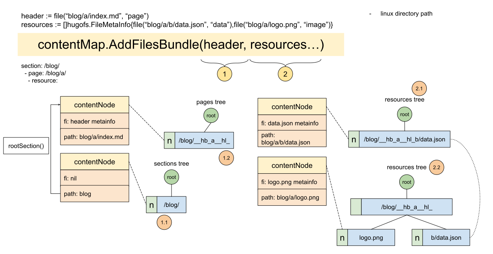

Hugo给这个货架取的名字是contentMap。
包含了好几颗树：pages tree, sections tree, resources tree。
没错，contentMap就是这些树的集合：

```go
type contentMap struct {
	// View of regular pages, sections, and taxonomies.
	pageTrees contentTrees

	// View of pages, sections, taxonomies, and resources.
	bundleTrees contentTrees

	// Stores page bundles keyed by its path's directory or the base filename,
	// e.g. "blog/post.md" => "/blog/post", "blog/post/index.md" => "/blog/post"
	// These are the "regular pages" and all of them are bundles.
	pages *contentTree

	// Section nodes.
	sections *contentTree

	// Resources stored per bundle below a common prefix, e.g. "/blog/post__hb_".
	resources *contentTree
}
```

其中pageTrees和bundleTrees又是树的集合：

```go
func newContentMap() *contentMap {
	m := &contentMap{
		pages:     &contentTree{Name: "pages", Tree: radix.New()},
		sections:  &contentTree{Name: "sections", Tree: radix.New()},
		resources: &contentTree{Name: "resources", Tree: radix.New()},
	}

	m.pageTrees = []*contentTree{
		m.pages, m.sections,
	}

	m.bundleTrees = []*contentTree{
		m.pages, m.sections,
	}

	return m
}
```

是为了方便后续的统一操作。

结合这些信息，再回过头来看上面的样例。

我们的目的是用contentMap组织好文件系统里的文件。
在示例中，contentMap可以将页面和资源有效的组织在一起，像header和resources。
其中"blog/a/index.md"是一个页面，"blog/a/b/data.json"和"blog/a/logo.png"都是资源文件，一个是数据类型，一个是图片类型。
最终都会以contentNode的形式，添加到对应的树中。
其中section tree也新增了一个结点，虽然没有相应的文件信息(fi: nil)，但path信息是"/blog/"。

树的数据结构是基数树，如何将识别到的信息放入相应的位置，则属于Hugo的领域知识。

比如Section的定义: [sections](https://gohugo.io/content-management/sections/)。
第一级目录就是section，这是为什么"/blog/"会出现在章节树的结点中。
还有一种情况也属于章节，那主是任何包含了"_index.后缀"格式文件的目录，也属于章节。
同时Hugo管这种结构叫[Branch Bundles](https://gohugo.io/content-management/page-bundles/#branch-bundles)。
直译就是分支。
那为什么要这样组织？
实际上是由Web[站点结构](https://webstyleguide.com/wsg3/3-information-architecture/3-site-structure.html)定义的。
Web站点的页面结构就是树状的。
有主页，了就是home page，还有不同的章节，如关于页面about page，它们都是从树根主页拓展开来的。

从站点结构就可以看出，站点页面有像主页，章节这样的索引页面，也有像某一篇博客这样的内容页面。
Hugo管前者叫[List Page](https://gohugo.io/templates/lists/)，后者则是普通页面。
在站点主题的模板中，都有对应的模板，像`layouts/_default/list.html`，`layouts/posts/single.html`。

Hugo正是根据站点的这些规律，按自己的理解，抽象出了List Page, Branch Bundle等等这些概念，将信息组织在了一起，并放入ContentMap中。

再结合我们一直所使用的实例来检验一下：

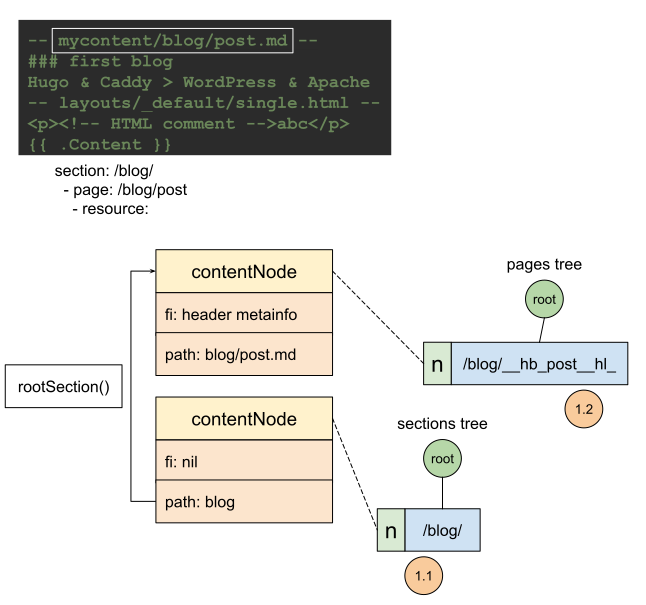

### 动手实践 - Show Me the Code of Build process

```go
package main

import (
	"context"
	"fmt"
	"golang.org/x/sync/errgroup"
	"strconv"
	"time"
)

func main() {
	s := &set{elements: []string{}}
	p := newPagesProcessor(s)
	p.Start(context.Background())
	defer func() {
		err := p.Wait()
		if err != nil {
			fmt.Println(err)
		}
	}()

	data := []any{1, "hello", 2, 3, 4, 5, 6, "world", "happy"}
	for _, d := range data {
		err := p.Process(d)
		time.Sleep(1 * time.Millisecond)
		if err != nil {
			fmt.Println(err)
			return
		}
	}

	fmt.Println(s)
}

type set struct {
	elements []string
}

func (s *set) Add(element string) {
	s.elements = append(s.elements, element)
}

type pageProcessor interface {
	Process(item any) error
	Start(ctx context.Context) context.Context
	Wait() error
}

func newPagesProcessor(s *set) *pagesProcessor {
	ps := make(map[string]pageProcessor)
	ps["i"] = &intProcessor{processor{
		s:        s,
		itemChan: make(chan interface{}, 2),
	}}
	ps["s"] = &stringProcessor{processor{
		s:        s,
		itemChan: make(chan interface{}, 2),
	}}

	return &pagesProcessor{processors: ps}
}

type pagesProcessor struct {
	processors map[string]pageProcessor
}

func (p *pagesProcessor) Process(item any) error {
	switch v := item.(type) {
	// Page bundles mapped to their language.
	case int:
		err := p.processors["i"].Process(v)
		if err != nil {
			return err
		}
	case string:
		err := p.processors["s"].Process(v)
		if err != nil {
			return err
		}
	default:
		panic(fmt.Sprintf(
			"unrecognized item type in Process: %T", item))
	}

	return nil
}
func (p *pagesProcessor) Start(
	ctx context.Context) context.Context {
	for _, proc := range p.processors {
		ctx = proc.Start(ctx)
	}
	return ctx
}
func (p *pagesProcessor) Wait() error {
	var err error
	for _, proc := range p.processors {
		if e := proc.Wait(); e != nil {
			err = e
		}
	}
	return err
}

type processor struct {
	s         *set
	ctx       context.Context
	itemChan  chan any
	itemGroup *errgroup.Group
}

func (p *processor) Process(item any) error {
	select {
	case <-p.ctx.Done():
		return nil
	default:
		p.itemChan <- item
	}
	return nil
}
func (p *processor) Start(ctx context.Context) context.Context {
	p.itemGroup, ctx = errgroup.WithContext(ctx)
	p.ctx = ctx
	return ctx
}
func (p *processor) Wait() error {
	close(p.itemChan)
	return p.itemGroup.Wait()
}

type intProcessor struct {
	processor
}

func (i *intProcessor) Start(
	ctx context.Context) context.Context {
	ctx = i.processor.Start(ctx)
	i.processor.itemGroup.Go(func() error {
		for item := range i.processor.itemChan {
			if err := i.doProcess(item); err != nil {
				return err
			}
		}
		return nil
	})
	return ctx
}

func (i *intProcessor) doProcess(item any) error {
	switch v := item.(type) {
	case int:
		i.processor.s.Add(strconv.Itoa(v))
	default:
		panic(fmt.Sprintf(
			"unrecognized item type in intProcess: %T", item))
	}
	return nil
}

type stringProcessor struct {
	processor
}

func (i *stringProcessor) Start(
	ctx context.Context) context.Context {
	ctx = i.processor.Start(ctx)
	i.processor.itemGroup.Go(func() error {
		for item := range i.processor.itemChan {
			if err := i.doProcess(item); err != nil {
				return err
			}
		}
		return nil
	})
	return ctx
}

func (i *stringProcessor) doProcess(item any) error {
	switch v := item.(type) {
	case string:
		i.processor.s.Add(v)
	default:
		panic(fmt.Sprintf(
			"unrecognized item type in stringProcessor: %T",
			item))
	}
	return nil
}
```
输出样例：
```shell
&{[1 hello 2 3 4 5 6 world happy]}

Program exited.
```

* [Build Processor线上可直接运行版本](https://c.sunwei.xyz/page-processor.html)

### Assemble

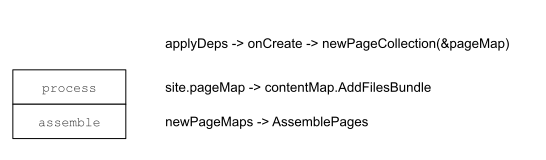

Assemble所做的事情很纯粹，那就是创建站点页面实例 - pageState。
因为支持多站点，contentMaps有多个。
所以Assemble不仅要创建pageState，还需要管理好所有的pages，这就用到了PageMaps。

```go
type pageMap struct {
	s *Site
	*contentMap
}

type pageMaps struct {
	workers *para.Workers
	pmaps   []*pageMap
}
```

实际上pageMap就是由contentMap组合而来的。
而contentMap中的组成树的结点就是contentNode。

正好，每个contentNode又对应一个pageState。

```go
type contentNode struct {
	p *pageState

	// Set if source is a file.
	// We will soon get other sources.
	fi hugofs.FileMetaInfo

	// The source path. Unix slashes. No leading slash.
	path string
	
	...
}
```

所以Assemble不仅要为前面Process处理过生成的contentNode创建pageState，还要补齐一些缺失的contentNode，如Section。

### PageState

可以看出，Assemble的重点就是组建PageState，那她到底长啥样：

```go
type pageState struct {
	// This slice will be of same length as the number of global slice of output
	// formats (for all sites).
	pageOutputs []*pageOutput

	// This will be shifted out when we start to render a new output format.
	*pageOutput

	// Common for all output formats.
	*pageCommon
	
	...
}
```

从注解中可以看出普通信息将由pageCommon提供，而输出信息则由pageOutput提供。
比较特殊的是pageOutputs，是pageOutput的数组。
在[基础架构](../how/基础架构.md)中，对这一点有作分析。
这要归因于Hugo的多站点渲染策略 - 允许在不同的站点中重用其它站点的页面。
```go
// hugo-playground/hugolib/page__new.go
// line 97

// Prepare output formats for all sites.
// We do this even if this page does not get rendered on
// its own. It may be referenced via .Site.GetPage and
// it will then need an output format.
ps.pageOutputs = make([]*pageOutput, len(ps.s.h.renderFormats))
```

那在Assemble中Hugo是如何组织pageState实例的呢？

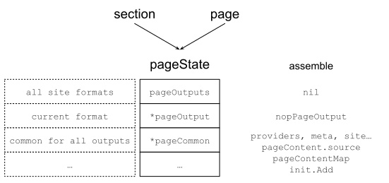

从上图中，可以看出Assemble阶段主要是新建pageState。
其中pageOutput在这一阶段只是一个占位符，空的nopPageOutput。
pageCommon则是在这一阶段给赋予了很多的信息，像meta相关的信息，及各种细节信息的providers。

### 动手实践 - Show Me the Code of Create a PageState

```go
package main

import (
	"fmt"
	"html/template"
)

func main() {
	outputFormats := createOutputFormats()
	renderFormats := initRenderFormats(outputFormats)

	s := &site{
		outputFormats: outputFormats,
		renderFormats: renderFormats,
	}

	ps := &pageState{
		pageOutputs: nil,
		pageOutput:  nil,
		pageCommon:  &pageCommon{m: &pageMeta{kind: KindPage}},
	}
	ps.init(s)

	// prepare
	ps.pageOutput = ps.pageOutputs[0]

	// render
	fmt.Println(ps.targetPaths().TargetFilename)
	fmt.Println(ps.Content())
	fmt.Println(ps.m.kind)
}

type site struct {
	outputFormats map[string]Formats
	renderFormats Formats
}

type pageState struct {
	// This slice will be of same length as the number of global slice of output
	// formats (for all sites).
	pageOutputs []*pageOutput

	// This will be shifted out when we start to render a new output format.
	*pageOutput

	// Common for all output formats.
	*pageCommon
}

func (p *pageState) init(s *site) {
	pp := newPagePaths(s)
	p.pageOutputs = make([]*pageOutput, len(s.renderFormats))
	for i, f := range s.renderFormats {
		ft, found := pp.targetPaths[f.Name]
		if !found {
			panic("target path not found")
		}
		providers := struct{ targetPather }{ft}
		po := &pageOutput{
			f:                      f,
			pagePerOutputProviders: providers,
			ContentProvider:        nil,
		}
		contentProvider := newPageContentOutput(po)
		po.ContentProvider = contentProvider
		p.pageOutputs[i] = po
	}
}

func newPageContentOutput(po *pageOutput) *pageContentOutput {
	cp := &pageContentOutput{
		f: po.f,
	}
	initContent := func() {
		cp.content = template.HTML("<p>hello content</p>")
	}

	cp.initMain = func() {
		initContent()
	}
	return cp
}

func newPagePaths(s *site) pagePaths {
	outputFormats := s.renderFormats
	targets := make(map[string]targetPathsHolder)

	for _, f := range outputFormats {
		target := "/" + "blog" + "/" + f.BaseName +
			"." + f.MediaType.SubType
		paths := TargetPaths{
			TargetFilename: target,
		}
		targets[f.Name] = targetPathsHolder{
			paths: paths,
		}
	}
	return pagePaths{
		targetPaths: targets,
	}
}

type pagePaths struct {
	targetPaths map[string]targetPathsHolder
}

type targetPathsHolder struct {
	paths TargetPaths
}

func (t targetPathsHolder) targetPaths() TargetPaths {
	return t.paths
}

type pageOutput struct {
	f Format

	// These interface provides the functionality that is specific for this
	// output format.
	pagePerOutputProviders
	ContentProvider

	// May be nil.
	cp *pageContentOutput
}

// pageContentOutput represents the Page content for a given output format.
type pageContentOutput struct {
	f        Format
	initMain func()
	content  template.HTML
}

func (p *pageContentOutput) Content() any {
	p.initMain()
	return p.content
}

// these will be shifted out when rendering a given output format.
type pagePerOutputProviders interface {
	targetPather
}

type targetPather interface {
	targetPaths() TargetPaths
}

type TargetPaths struct {
	// Where to store the file on disk relative to the publish dir. OS slashes.
	TargetFilename string
}

type ContentProvider interface {
	Content() any
}

type pageCommon struct {
	m *pageMeta
}

type pageMeta struct {
	// kind is the discriminator that identifies the different page types
	// in the different page collections. This can, as an example, be used
	// to to filter regular pages, find sections etc.
	// Kind will, for the pages available to the templates, be one of:
	// page, home, section, taxonomy and term.
	// It is of string type to make it easy to reason about in
	// the templates.
	kind string
}

func initRenderFormats(
	outputFormats map[string]Formats) Formats {
	return outputFormats[KindPage]
}

func createOutputFormats() map[string]Formats {
	m := map[string]Formats{
		KindPage: {HTMLFormat},
	}

	return m
}

const (
	KindPage = "page"
)

var HTMLType = newMediaType("text", "html")

// HTMLFormat An ordered list of built-in output formats.
var HTMLFormat = Format{
	Name:      "HTML",
	MediaType: HTMLType,
	BaseName:  "index",
}

func newMediaType(main, sub string) Type {
	t := Type{
		MainType:  main,
		SubType:   sub,
		Delimiter: "."}
	return t
}

type Type struct {
	MainType  string `json:"mainType"`  // i.e. text
	SubType   string `json:"subType"`   // i.e. html
	Delimiter string `json:"delimiter"` // e.g. "."
}

type Format struct {
	// The Name is used as an identifier. Internal output formats (i.e. HTML and RSS)
	// can be overridden by providing a new definition for those types.
	Name string `json:"name"`

	MediaType Type `json:"-"`

	// The base output file name used when not using "ugly URLs", defaults to "index".
	BaseName string `json:"baseName"`
}

type Formats []Format

```

输出结果：

```shell
/blog/index.html
<p>hello content</p>
page

Program exited.

```

* [PageState线上可直接运行版本](https://c.sunwei.xyz/page-state.html)

### Render

基础信息是由pageCommon提供了，那渲染过程中的输出由谁提供呢？

没错，轮到pageOutput了：

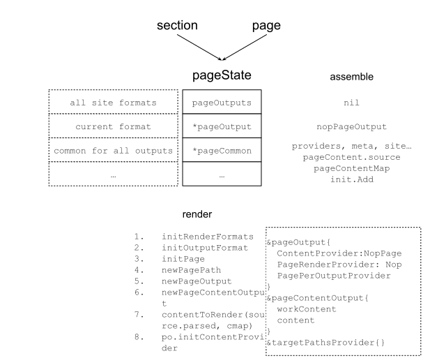

可以看到，在render阶段，pageState的pageOutput得到了最终的处理，为发布做准备了。
为了发布，最重的信息是发布什么，以及发布到哪里去。
这些信息都在pageOutput中，其中ContentProvider是提供发布内容的，而targetPathsProvider则是提供发布地址信息的。
其中地址信息主要来源于PagePath，这又和站点的RenderFormats和OutputFormats相关，哪下图所示：

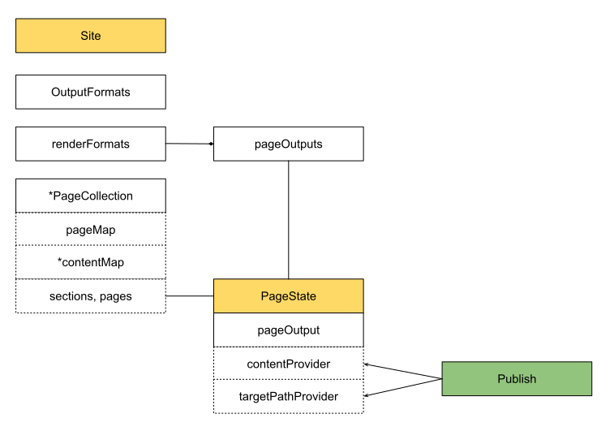

其中OutputFormats, RenderFormats及PageOutput之间的关系有在[基础架构](../how/基础架构.md)中有详细提到，这里就不再赘述。

```go
// We create a pageOutput for every output format combination, even if this
// particular page isn't configured to be rendered to that format.
type pageOutput struct {
	...

	// These interface provides the functionality that is specific for this
	// output format.
	pagePerOutputProviders
	page.ContentProvider
	page.TableOfContentsProvider
	page.PageRenderProvider

	// May be nil.
	cp *pageContentOutput
}
```

其中pageContentOutput正是实现了ContentProvider接口的实例。
其中有包含markdown文件原始信息的workContent字段，以及包含处理过后的内容content字段。
如Hugo[Shortcode](https://gohugo.io/content-management/shortcodes/)特性。
就是在这里经过contentToRender方法将原始信息进行处理，而最终实现的。

### 动手实践 - Show Me the Code of Publish

```go
package main

import (
	"bytes"
	"fmt"
	"io"
	"os"
	"path/filepath"
)

// publisher needs to know:
// 1: what to publish
// 2: where to publish
func main() {
	// 1
	// src is template executed result
	// it is the source that we need to publish
	// take a look at template executor example
	// https://c.sunwei.xyz/template-executor.html
	src := &bytes.Buffer{}
	src.Write([]byte("template executed result"))

	b := &bytes.Buffer{}
	transformers := createTransformerChain()
	if err := transformers.Apply(b, src); err != nil {
		fmt.Println(err)
		return
	}

	dir, _ := os.MkdirTemp("", "hugo")
	defer os.RemoveAll(dir)

	// 2
	// targetPath is from pageState
	// this is where we need to publish
	// take a look at page state example
	// https://c.sunwei.xyz/page-state.html
	targetPath := filepath.Join(dir, "index.html")

	if err := os.WriteFile(
		targetPath,
		bytes.TrimSuffix(b.Bytes(), []byte("\n")),
		os.ModePerm); err != nil {
		panic(err)
	}

	fmt.Println("1. what to publish: ", string(b.Bytes()))
	fmt.Println("2. where to publish: ", dir)
}

func (c *Chain) Apply(to io.Writer, from io.Reader) error {
	fb := &bytes.Buffer{}
	if _, err := fb.ReadFrom(from); err != nil {
		return err
	}

	tb := &bytes.Buffer{}

	ftb := &fromToBuffer{from: fb, to: tb}
	for i, tr := range *c {
		if i > 0 {
			panic("switch from/to and reset to")
		}
		if err := tr(ftb); err != nil {
			continue
		}
	}
	_, err := ftb.to.WriteTo(to)
	return err
}

func createTransformerChain() Chain {
	transformers := NewEmpty()
	transformers = append(transformers, func(ft FromTo) error {
		content := ft.From().Bytes()
		w := ft.To()
		tc := bytes.Replace(
			content,
			[]byte("result"), []byte("transferred result"), 1)
		_, _ = w.Write(tc)
		return nil
	})
	return transformers
}

// Chain is an ordered processing chain. The next transform operation will
// receive the output from the previous.
type Chain []Transformer

// Transformer is the func that needs to be implemented by a transformation step.
type Transformer func(ft FromTo) error

// FromTo is sent to each transformation step in the chain.
type FromTo interface {
	From() BytesReader
	To() io.Writer
}

// BytesReader wraps the Bytes method, usually implemented by bytes.Buffer, and an
// io.Reader.
type BytesReader interface {
	// Bytes The slice given by Bytes is valid for use only until the next buffer modification.
	// That is, if you want to use this value outside of the current transformer step,
	// you need to take a copy.
	Bytes() []byte

	io.Reader
}

// NewEmpty creates a new slice of transformers with a capacity of 20.
func NewEmpty() Chain {
	return make(Chain, 0, 2)
}

// Implements contentTransformer
// Content is 1.read from the from-buffer and rewritten to to the to-buffer.
type fromToBuffer struct {
	from *bytes.Buffer
	to   *bytes.Buffer
}

func (ft fromToBuffer) From() BytesReader {
	return ft.from
}

func (ft fromToBuffer) To() io.Writer {
	return ft.to
}

```

输出结果：

```shell
1. what to publish:  template executed transferred result
2. where to publish:  /tmp/hugo2834984546

Program exited.
```

* [Publish线上可直接运行版本](https://c.sunwei.xyz/publisher.html)
