# Template executor

Deps在准备好NewPathSpec，NewSpec，NewContentSpec，NewSourceSpec后，调用onCreate正式创建HugoSites，并在最后一步，加载模板执行器。

模板执行器只是提前将模板信息转换成了模板执行器，如何使用并没有涉及到。

为了让我们对模板生命周期有更全面的了解，让我们以robots.txt为例，来看看是如何通过模板执行器生成最终文件的。

## 了然于胸 - newTemplateExec时序图

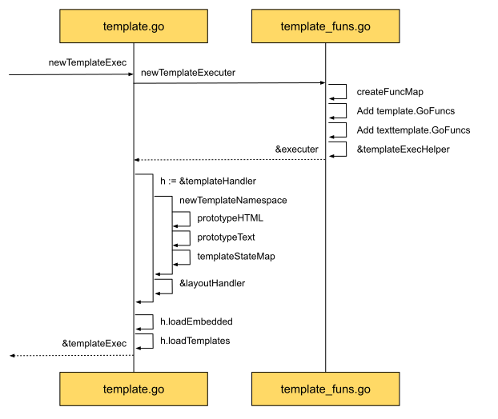

从时序图中，可以了解到创建执行器，主要分两步。

先创建包含了各种功能函数的executor。
其中的功能函数由两部分组成，一部分来自hugo，像htmlEscape等。
另一部分来自于golang的内置函数，如fmt.Sprint等等。
正是因为有这些功能函数的支持，才得以让模板的action块 - '{{}}'功能如此强大。

执行器创建好后，接下来就要创建模板的handler了。
处理器提供了模板加载、查询等相关的服务，以方便使用。
因为查询服务依赖于加载服务，所以在处理器实例后，紧接着就是加载模板了。
而模板又分两部分，一部分是由hugo提供的默认模板，像robot.txt等。
另一部分就是由用户所提供的layouts文件，有来于主题的，也有来于用户自定义的layout。

加载的是磁盘文件，得到的是解析过后的模板实例。

```go
templ, err := prototype.New(info.name).Parse(info.template)
```

源码里用的是prototype，而不是直接用的html。
这是因为我们的模板有两种后缀，一种是txt，另一种是html，需要找到相应的原型来对模板进行解析。

不管是什么模板，都是文本，HTML也不例外，也是文本。
HTML模板的源码也应证了这一点 - 直接调用文本模板的方法。
那这种关系是如何用代码实现的呢？

拿到模板字节信息后，用词法分析器对模板字节流进行解析，得到分析好的词义结构。
对于HTML模板而言，为了安全，需要对词义结构进行检查和必要地修改。
因为我们可以从不同渠道，获得不同的主题，这些主题中又包含了很多模板，并且主题中可以嵌套主题，为了保证安全，避免执行恶意代码。
最后就是执行解析好的模板。

为了方便理解，我们来举个例子 - robot.txt模板使用流程：

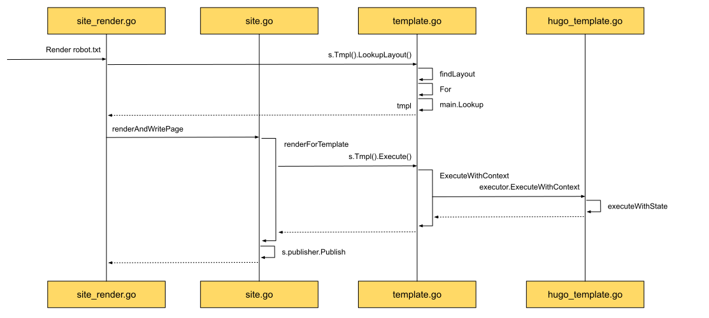

1. 查找：通过名字查找，调用templateExec中的handler查询方法LookupLayout进行查询。
2. 执行：准备执行模板所需要的信息，调用templateExec中的executor执行方法ExecuteWithContext开始执行。
   这里的执行方法实际上也是由text template提供的，前面咱们也提到了，不管是什么类型的模板，都是以text为基础的。

知道了工作流程后，让我们从源码层面，更深入的对Template进行理解。

我们先来看第一步： 模板解析。

## 词法解析 - parse

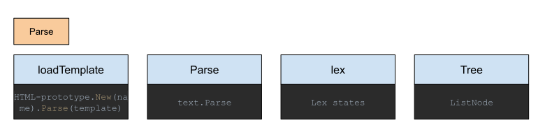

创建Deps的最后一步是loadResources，其中主要指的是Template资源。
在创建templateExec实例的过程中，就需要加载hugo默认和用户创建的模板。
加载模板后，获取了模板的字节信息，要想为我们所有，首先要读懂这些字节，这时，我们就用到了解析Parse，而且是由text模板提供的。
Parse为什么可以读懂这些字符信息呢，她依靠的是内部了词法分析器lex - lexer，分析器需要对action block的语义有充分的理解。
读懂后转换为方便后续操作的数据结构tree，在hugo中实际载体是listNode类型。

我们拿一段模板举个例子：

~[Template Parser example](images/12.3.1-Hugo-Sites-Template-parser.svg)

从上例中，我们可以看到，左上方是输入的信息。
包含一篇博客 - post.md，和一个模板 - single.html。
通过转换会得到最右边的输出网页内容。
其中，包含在模板中第一行的信息，剩下的是由博客提供的信息，其中的特殊字符，还被进行了转义。

在左下方第一步中，创建templateExec过程中，读取到了模板single.html。
通过解析，利用词法分析器，会得到如下状态：
```go
[“<p><!-- HT…”, “{{”, “ “, ”.Content”, ” “, ”}}”, EOF]
```
为了理解其中的工作原理，让我们先来看一下action block的词法分析器是如何工作的。

### Action Block lexer

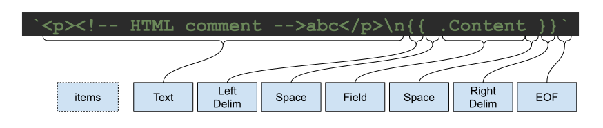

将我们的模板片断和分析结果对应上，就可以得到上图所示。

`可以看到词法分析器就像语言大师，可以读懂句子里所有的细节，并能准确说出他们每一个人的名字。`

#### Hugo又是怎么设计这个分析器的呢?

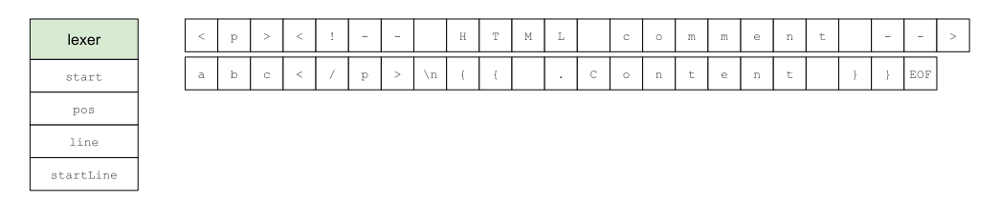

正如上图所示，左边就是简化后的分析器结构体，其中主要的字段有四个，实际分为两组。

一组是用来记录当前扫描的位置信息 - start, pos。
start指的是当前token起如的位置，如action block起始符`{{`，这里start指的就是第一个`{`符号的字节数组下标；而pos则是当前正在扫描的字符。

另一组是用来记录行数的信息 - startLine, line。
和上面类似，一个用于记录起始行，另一个用于记录当前行。

有了这两组信息，就可以精确地通过下标获取到具体的字节信息。

让我们来看看Hugo是怎么通过这些字段，将tokens一个个的精准识别出来的。

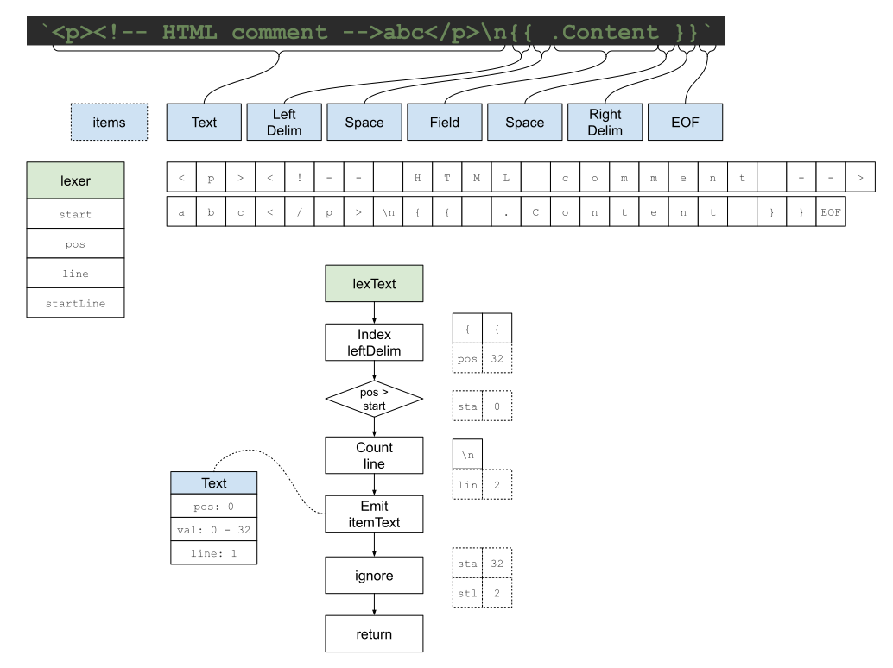

解析开始后，先进入到lexText处理函数，第一件做的事就是查找leftDelim - `{{`。
之所以这样设计，是因为在文本的眼里，她只关心哪些是文本，哪些不是。
而leftDelim的出现，意味着在当前字符串中不全是文本。

我们的例子正是这样，有文本，还有非文本片断。
通过识别，发现存在leftDelim，起始位置是32。
当前位置是0，因为刚开始扫描。
如果当前扫描位置大于起始位置，意味着在这一段中都是文本信息。
紧接着通过扫描换行符数量来判断，当前的文本行数信息。
示例中有一个换行符，意味接下来的扫描起始于第二行。

到目前为止，文本token的所有信息已经收集完毕。
可以正式提交第一个token了。
如左下方所示，当前text token中包含了起始位置信息pos，值val和行数信息line。
分别是起始位置0， 值从0到32，和行1。

在后续扫描的起始信息中，包含起始位置32，和起始行2。

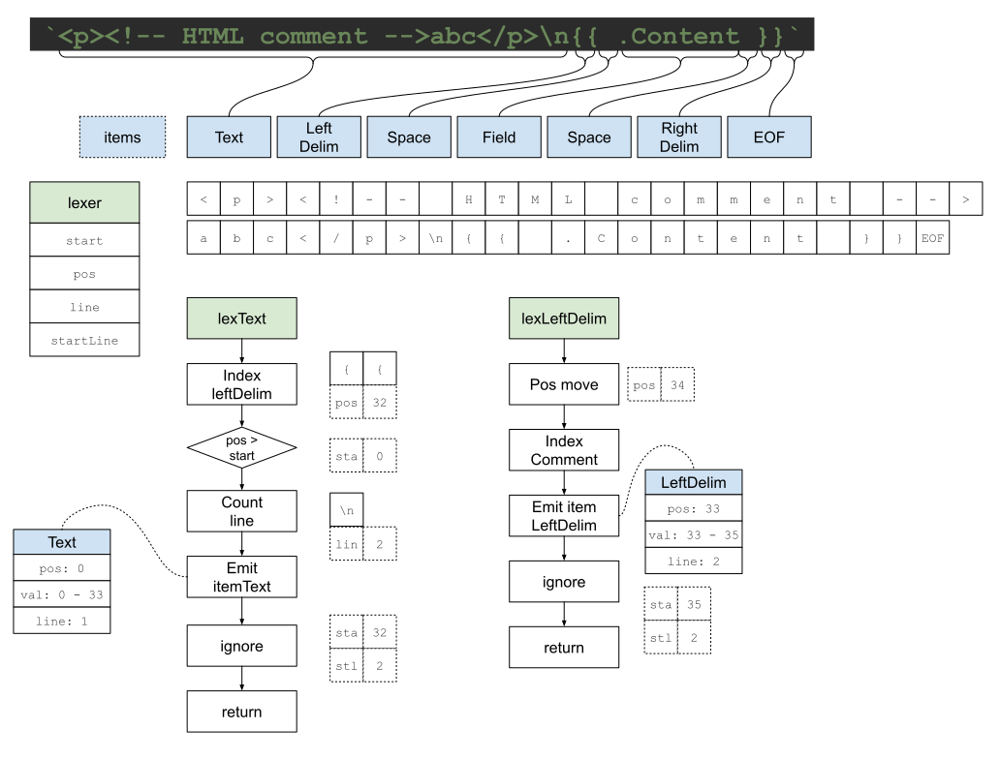

进入到leftDelim token。
开始查看其中是否包含了注解，在我们的示例中没有注解。
所以直接可以进入到action主体，并扫描。

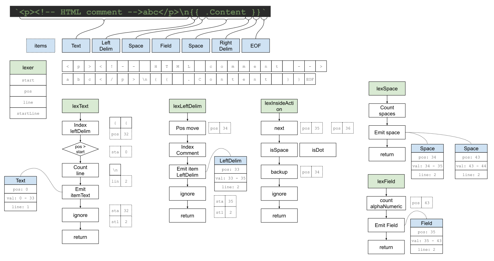

在这里，有一个中间状态lexInsideAction，会识别在action内部可能出现的token，起到一个分发器的作用。

判断的标准是基于next函数，也就是下一个字符。
我们的下一个字符是空格，会被isSpace捕获到，那分发器就会马上创建一个空格token，由右边的lexSpace函数继续处理，会合并多个空格。
在我们的示例中会出现两个space token，因此会由此函数提交两个space tokens。

再回到分发器。
当捕获到的下一个字符是dot - `.`，会被函数isDot进行处理。
由右下角的lexField函数进行具体处理。
Hugo支持的field格式是字母和数字，所以会先识别出field的名字，并提交field token。

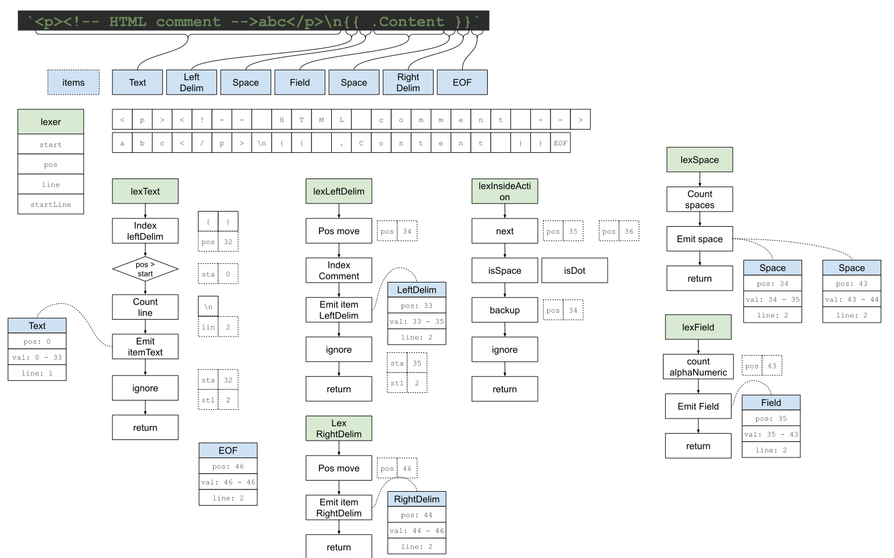

最终，我们来到rightDelim - `}}`，也就是action block的终止符。
同样，我们也需要将它作为一个token进行提交，如中下方所示。

这时我们就来到了这段字符的结尾了，也就是EOF - end of file处，分析器也会将这它作为一个独立的token进行提交。

这样，Hugo的action block词法分析器将分析流程分为不同的阶段。
由对应的处理函数专注于某一相应状态下，对特定字符进行具体分析，各司其职。
并将token的逻辑规则构建在函数转换的过程中，自然的从一个状态切换到另一个状态。
可以说分工明确，简单有效。

### FSM - Finite State Machine

从整体视角来看看样例中，生成的tokens之间的关系：

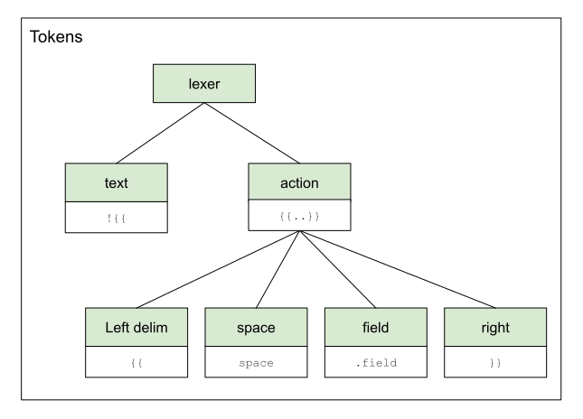

从层级关系来看，可以清晰的看到text和action是一个层，在action中的元素是另一层。
除了action之外，都会识别token并提交token。
而action的主要作用是识别下一个token，并转交给具体的处理函数进行处理。

这样一来，我们发现，每个处理函数，对应着不同的分析状态。
其中有的状态会提交token，有的状态只负责识别下一个可能的token。
从状态切换的视角来看，很像是FSM - Finite State Machine的工作模式。

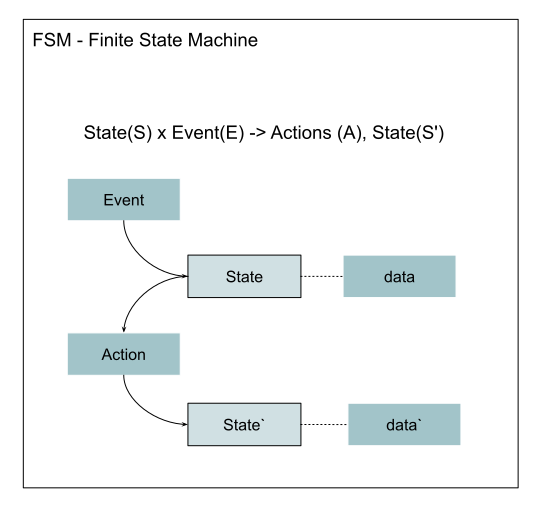

从上面的公式中可以看出。
输入信息是当前状态加上事件。
输出信息是处理动作加上新的状态。

当前状态对应的是相应的处理函数，而事件则是识别到的字符信息。
与状态对应的数据就是位置信息和行信息。
处理动作就是函数中所做出的下一个状态决定。
同时也生成了新的数据，像新的位置信息和新地行信息。

我们结合FSM的概念再梳理一下可能的实现方法：

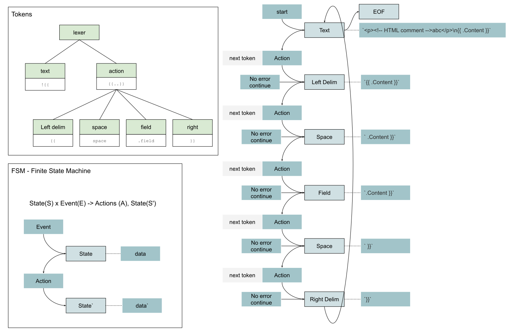

初始状态就是Text，初始数据就是样例模板片断。
触发动作后，识别出下一个状态是Left Delim，同时数据更新为action block相应的信息。
而触发事件就是当有请求想要获取下一个token - nextToken的时候。
这样我们就可以依据FSM的理念，同样实现一个action block模板的词法分析器了。

### 动手实践 - Show Me the Code of FSM

```go
package main

import (
	"errors"
	"fmt"
	"github.com/sunwei/gobyexample/modules/fsm"
)

func main() {
	// initial fsm with init state and data
	f := fsm.New(firstState, &data{
		err: nil,
		raw: "first",
	})
	// add state with handler
	f.Add(firstState,
		func(event fsm.Event) (fsm.State, fsm.Data) {
			if event.Type() == fsm.Action {
				fmt.Println(event.Data().Raw())
			}
			return secondState, &data{
				err: nil,
				raw: "second",
			}
		})
	f.Add(secondState,
		func(event fsm.Event) (fsm.State, fsm.Data) {
			if event.Type() == fsm.Action {
				fmt.Println(event.Data().Raw())
			}
			return lastState, &data{
				err: errors.New("something wrong"),
				raw: "last",
			}
		})
	// error occurs
	f.Add(lastState,
		func(event fsm.Event) (fsm.State, fsm.Data) {
			if e := event.Data().Error(); e != nil {
				fmt.Println(e)
				return errorState, nil
			}
			// if there is no error
			// quite with eof state
			return eofState, &data{
				err: nil,
				raw: "",
			}
		})

	for {
		// send message to notify fsm start the processing
		e := f.Process("continue")
		// quit with error
		if e != nil {
			fmt.Println("break because of error")
			break
		}
		// quite for eof state
		if f.State() == eofState {
			fmt.Println("eof")
			break
		}
	}
}

const (
	firstState  = "first"
	secondState = "second"
	lastState   = "last"
	errorState  = "error"
	eofState    = "eof"
)

type data struct {
	err error
	raw any
}

func (d *data) Error() error {
	return d.err
}
func (d *data) Raw() any {
	return d.raw
}
```

样例输出：

```shell
# FSM example
first
second
break because of error

Program exited.
```

* [线上可直接运行版本](https://c.sunwei.xyz/fsm.html)
* [FSM 模块源码](https://github.com/sunwei/gobyexample/tree/master/modules/fsm)

### 动手实践 - Show Me the Code of Action Block with FSM

```go
package main

import (
	"fmt"
	"github.com/sunwei/gobyexample/modules/lexer"
	"github.com/sunwei/gobyexample/modules/lexer/action"
)

func main() {
	// Action example
	lex, err := action.New(
		"<p><!-- HTML comment -->abc</p>\n{{.Content}}")
	if err != nil {
		fmt.Println(err)
		return
	}

	var tokens []lexer.Token
	for {
		// lexer iterate
		token := lex.Next()
		tokens = append(tokens, token)
		// reach end, analyzing done
		if token.Type() == action.TokenEOF {
			break
		}
	}

	// output tokens detail
	for i, t := range tokens {
		fmt.Println(i + 1)
		fmt.Println(t.Value())
	}

	return
}
```

样例输出：

```shell
# 5 tokens generated
EOF State
1
<p><!-- HTML comment -->abc</p>

2
{{
3
.Content
4
}}
5


Program exited.
```

* [Action Lexer线上可直接运行版本](https://c.sunwei.xyz/action-lexer.html)
* [Action Lexer with FSM](https://github.com/sunwei/gobyexample/tree/master/modules/lexer/action)

##### 动手实践 - Show Me the Code of Template Parser

有了FSM, Action Lexer的加持后，我们再来实现Template Parser简直易于反掌。

```go
package main

import (
	"fmt"
	"github.com/sunwei/gobyexample/modules/template/parser"
)

func main() {
	d, err := parser.Parse("example",
		"<p><!-- HTML comment -->abc</p>\n{{.Content}}")
	if err != nil {
		fmt.Println(err)
		return
	}
	fmt.Println(d.String())
}
```

样例输出：

```shell
# output
EOF State
<p><!-- HTML comment -->abc</p>
.Content


Program exited.
```

* [Template Parser线上可直接运行版本](https://c.sunwei.xyz/template-parser.html)
* [Template Parser module](https://github.com/sunwei/gobyexample/tree/master/modules/template/parser)

## 安全处理 - escape

词法分析器就像是认字，能帮助读懂每个字，每个词的意思。
同样的字，不同的人，确可以写出完全不同的文章。
Hugo拿到词法分析器后，在最终执行之前，针对HTML模板，还做了一件重要的事情。

那就是Escape - 主要是用来帮助消除安全隐患，将HTML中的恶意代码进行转义处理。

要想做到这一点。
光读懂字词还不够，还需要掌握HTML领域的知识。
比如如果想在这过程中去掉注解，首先就要了解HTML中注解的语法。
如果想要识别出恶意代码，那就要先识别出常规代码。
这些领域知识都可以在[HTML标准](https://html.spec.whatwg.org/multipage/syntax.html#syntax)文档中找到。

有了这些领域知识，再结合词法解析器，我们就可以清楚地知道，在什么结点，需要进行怎样的转义处理。

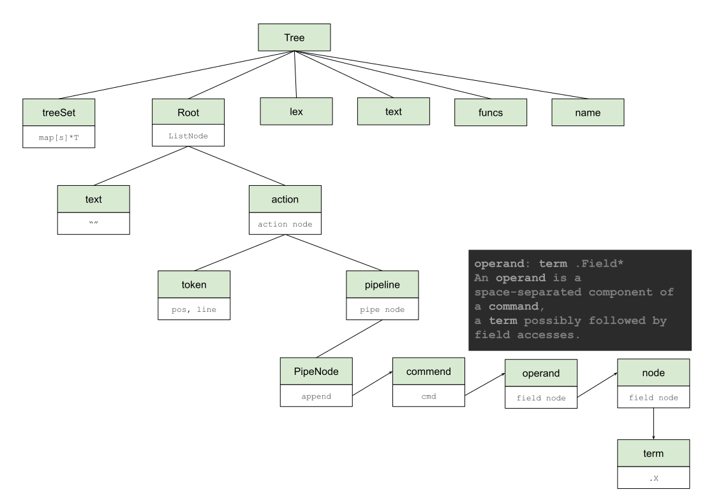

如上图所示，Hugo将token信息消化后，应用模板解析的领域知识，构建出清晰的树状结构。
我们随着Hugo的实现思路来进行分析。

Hugo用树结构体存储了所有Template相关的信息，其中在Escape阶段我们需要重点关注的是Root字段，ListNode类型。
展开之后，我们看到了熟悉的text结点和action结点。
有了这些结构，我们就有了结点之间的上下文，这样我们就可以着手Escape的具体操作了。

按顺序从Text开始。

在HTML中，text中可以包含[character references](https://html.spec.whatwg.org/multipage/syntax.html#character-references)。
也就是以`&`符开始的字节，如`<`小于号。
因为HTML中无论tag的开始和结束，都是以`<`起始的。
如果为了保持纯文本，就需要将`<`转换成字符索引状态。
如果不这样做，假设在文本中存在`<script>console.log("evil")</script>`这样的字符串信息，浏览器就会把它错当成代码运行了。
回到text结点中，如果碰到了文本结点，我们就需要将这些需要转换的字符进行统一处理了。

和Text不一样的是，在Action结点中，我们除了注意注解、转义等，还需要将子结点有效地组织起来。
在action中，词法分析器会帮助分析出像identifier(HtmlEscape)，field(.Content)这样的token。
而且还是成串出现的，很像linux中的管道。

Hugo也是利用了这一点，将这些token通过流水线组装在了一起，而流水线中的每一步，都是一个command命令 - 有命令名及参数。
有了命令后，Hugo还将词法分析器的identifier, field进一步转换成模板解析领域名称。
如每个命令下都是一个操作 - operand，且每个操作由多个结点组成，Hugo半这些结点称作词 - term。

通过数据结构，获取了这些详细的信息后。
如果想要对流水线处理的结果进行escape操作时，就变得很灵活了。
如我们可以在流水线中添加一道escape的工序。

理清了之后，就又到了我们喜闻乐见的上代码环节了。

### 动手实践 - Show Me the Code of Template Escape

```go
package main

import (
	"fmt"
	"github.com/sunwei/gobyexample/modules/template/escaper"
	"github.com/sunwei/gobyexample/modules/template/parser"
)

func main() {
	d, err := parser.Parse("example",
		"<p><!-- HTML comment -->abc</p>\n{{.Content}}")
	if err != nil {
		fmt.Println(err)
		return
	}
	fmt.Println(d.String())

	d, err = escaper.Escape(d)
	if err != nil {
		fmt.Println(err)
		return
	}
	fmt.Println(d.String())
}
```

代码输出：

```shell
# remove comments
# add escape function to pipeline
EOF State
<p><!-- HTML comment -->abc</p>
.Content
EOF State
<p>abc</p>.Content | EscapeHtml

Program exited.

```

可以看到，经过escape处理，最终我们移除了文本中的comments，以及在流水线中加上了EscapeHtml工序。

* [Template Escape线上可直接运行版本](https://c.sunwei.xyz/template-escaper.html)
* [Template Escape module](https://github.com/sunwei/gobyexample/tree/master/modules/template/escaper)

#### 执行模板 - execute

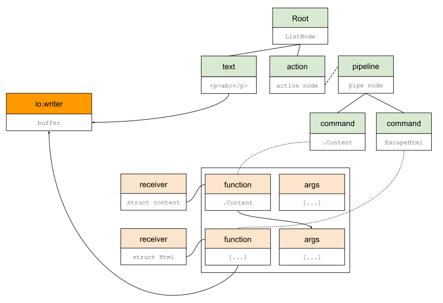

根据上一个章节中Escape样例代码的输出结果，现在的语法树如上图右上角所示。
其中Text结点内容移除了注解，只剩下文本信息"<p>abc</p>"。
而Action结点中，在pipeline的最后加入了新的命令"EscapeHtml"。

这样我们就顺利的进入到了模板执行环节。

模板的应用，目的是为了得到以模板为框架，并填充好动态内容的渲染结果。
那我们最终想得到的内容需要写入到指定的缓存中，就如上图左`io.writer`所示。

要想将动态内容填充到模板框架中，首先要获取动态内容。
有的内容是可以直接获取的，像Text结点中的信息。
而有的内容则需要实时计算得到的，就像Action结点中的pipeline。

在golang中，最小可执行单元是函数，函数可单独存在，也可以由接收者管理。
在Hugo中，有用到系统内置函数，也有用到自定义函数，还有结构体Page实例的方法。
为了便于理解，在我们的实例中，都由统一接收者`struct receiver`管理：

```go
type receiver struct {
	Data reflect.Value
	*escaper.Html
}
```

将由用户提供的结构体实例，都放在Data中 - `.Content`。
通过组合具体的Escape结构体，像`escaper.Html`，来丰富`receiver`的功能 - `EscapeHtml`。

函数的接收者已经明确，另一个需要注意的就是函数的参数。
像管道函数之所以方便使用，一是因为执行顺序一目了然，另一个优势就是隐性的参数传递，通常都是将前一个命令的执行结果作为后一个命令的最后一个参数传入。
这时我们就可以通过语法树的逻辑关系，将这一特性得以实现。

##### 动手实践 - Show Me the Code of Template Execute

```go
package main

import (
	"bytes"
	"fmt"
	"github.com/sunwei/gobyexample/modules/template/escaper"
	"github.com/sunwei/gobyexample/modules/template/executor"
	"github.com/sunwei/gobyexample/modules/template/parser"
	"html/template"
)

func main() {
	d, err := parser.Parse("example",
		"<p><!-- HTML comment -->abc</p>\n{{.Content}}")
	if err != nil {
		fmt.Println(err)
		return
	}

	d, err = escaper.Escape(d)
	if err != nil {
		fmt.Println(err)
		return
	}

	t := &tmpl{
		name: "hello world template",
		tmpl: d,
	}

	buf := &bytes.Buffer{}
	err = executor.Execute(t, buf, &content{})
	if err != nil {
		fmt.Println(err)
		return
	}
	fmt.Println(buf.String())
}

type content struct {
}

func (c *content) Content() template.HTML {
	return template.HTML("hello template")
}

type tmpl struct {
	name string
	tmpl *parser.Document
}

func (t *tmpl) Name() string {
	return t.name
}
func (t *tmpl) Tree() *parser.Document {
	return t.tmpl
}
```

输出结果：

```shell
# call Content and get hello template
# html escape ignore template.HTML type content
EOF State
EOF State
<p>abc</p>hello template

Program exited.

```

* [Template Execute线上可直接运行版本](https://c.sunwei.xyz/template-executor.html)
* [Template Execute module](https://github.com/sunwei/gobyexample/tree/master/modules/template/executor)

通过对模板进行词法分析，读懂模板信息。
再按action block上下文进行解析，得到语法树。
为了保证安全，在执行前，需要对语法树进行escape转义处理。
最终，结合golang语言的特性，将动态内容填充到模板框架中，写入指定缓存，输出最终渲染结果。