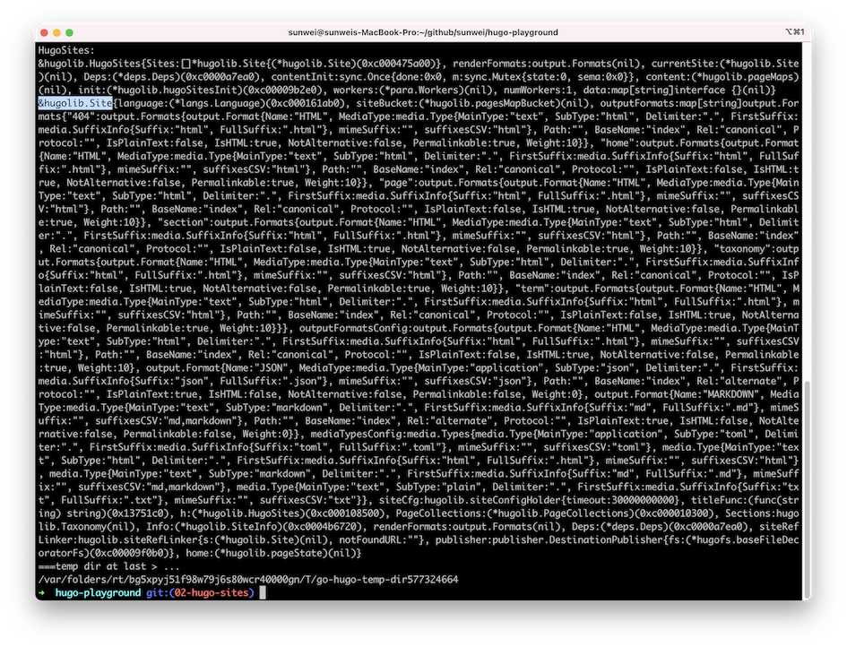
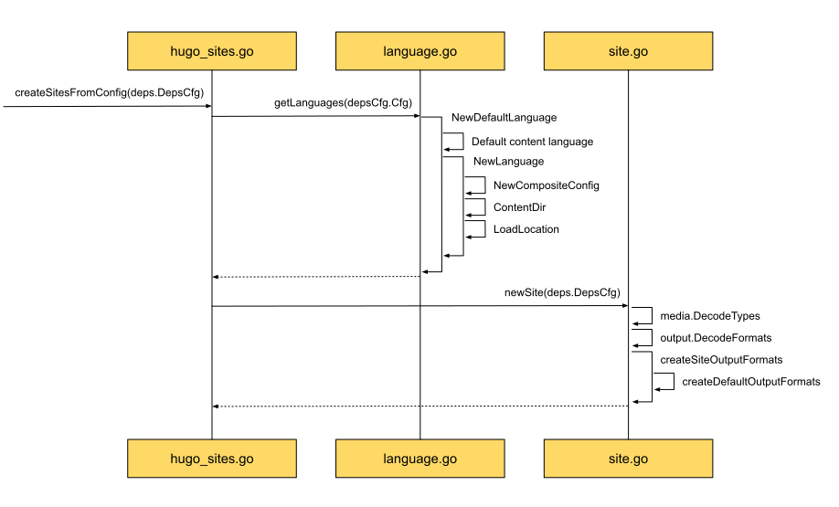
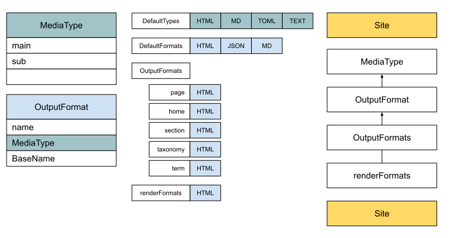
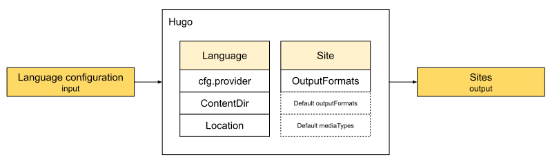

## HugoSites创建

当用户配置信息、Hugo默认配置信息，以及根据前面的信息所解析出来的模块信息都准备好后。
通过[事件风暴](../how/事件风暴.md)的主流程可以看出，Hugo下一步就开始创建站点了：


其中第三步 - 准备hugo文件系统，在原始文件系统的基础上，为Hugo准备好工作目录和发布目录。
真正创建HugoSites的步骤，是第四步。

在[基础架构](../how/基础架构.md)中，我们从基础架构的角度对Hugo是如何构建站点进行了分析：
* [文件系统的组织](../how/基础架构.md#文件系统的组织)
* [以及模板的生命周期](../how/基础架构.md#模板的生命周期)

从中，我们了解到，为了让接下来的站点构建专注在构建本身。

Hugo的文件系统需要将不同组件间的逻辑关系都梳理清楚，让多模块中的挂载点都有机的组合在一起，从而能够为其它模块提供便捷的服务。
从下面这张文件系统关系图能看出Hugo对站点领域中文件系统的理解：


模板信息也是在构建站点的时候进行加载的，从开始阶段的领域事件中可以看到：

虽然真正的模块执行阶段在站点渲染阶段，但同上面的文件系统一样，为了提供统一的服务，模块也需要在这之前分工明确，以做好准备。


### 跬步千里 - HugoSites源码实现

通过上面的组件分析，有帮助我们理解Hugo的设计理念，和模块组织结构。
为了进一步理解Hugo的具体实现，我们现在从源码出发，看一看Hugo是如何一步步将理念用代码实现的：


从左上角开始，调用`NewHugoSites`后，主要干了两件事，一个是`createSitesFromConfig`，另一个则是`newHugoSites`。

**createSitesFromConfig**

正是在这里，Hugo创建了Site，而且每个Site都有自己的`outputFormats`，而这依赖于`siteMediaTypesConfig`和`siteOutputFormatsConfig`。

**newHugoSites**

创建的则是HugoSites。
从两个Site构建顺序和定义来看，HugoSites包含了Site，Site保留有HugoSites的引用：

```go
type Site struct {
    language   *langs.Language
    
    // Output formats defined in site config per Page Kind, or some defaults
    // if not set.
    // Output formats defined in Page front matter will override these.
    outputFormats map[string]output.Formats
    
    // All the output formats and media types available for this site.
    // These values will be merged from the Hugo defaults, the site config and,
    // finally, the language settings.
    outputFormatsConfig output.Formats
    mediaTypesConfig    media.Types
    
    // The owning container. When multiple languages, there will be multiple
    // sites .
    h *HugoSites
	...
}

// HugoSites represents the sites to build. Each site represents a language.
type HugoSites struct {
    Sites []*Site
    *deps.Deps
    ...
}
```

在创建HugoSites的过程中，主要要做两件事。
一件是准备好需要惰性初始化的信息，如`h.init.data`和`h.init.layouts`，另一件则是应用依赖`applyDeps`。

其中重点放在了`applyDeps`，Hugo将所有需要在渲染前准备好的对象，都称作依赖。
其中包括模板信息、文件系统、站点发布者，站点信息采集者。
从上图也能看出Hugo的创建顺序：

* 如果用户没有主动设置模板提供方`TemplateProvider`，则应用默认模板提供者，并保存在配置信息中。
* 新建依赖`deps.New`，主要是创建出`NewPathSpec`, `NewSpec`, `NewContentSpec`, `NewSourceSpec`这四个规范，用来简化渲染阶段对文件系统的使用步骤。
* 正式创建`onCreated`，准备好上面的基础信息后，现在需要创建出目标发布器`NewDestinationPublisher`，初始化站点信息`initializeSiteInfo`，新建页面收集器`newPageCollections`。
* 加载资源`LoadResources`，这里加载的资源主要是模板，由上面的模板提供方提供。

通过时序图了解到Hugo的实现细节后，我们还可以到简化后的[HugoSites游乐场代码分支](https://github.com/sunwei/hugo-playground/tree/02-hugo-sites)进行实地体验：

```shell
➜  hugo-playground git:(main) git checkout 02-hugo-sites
Switched to branch '02-hugo-sites'
➜  hugo-playground git:(02-hugo-sites)
```
并且可以动行代码查看创建好后的HugoSites和Site实例：

```shell
➜  hugo-playground git:(02-hugo-sites) go run .
```
输出实例：


从上面的时序图中，我们了解到Hugo创建HugoSites的主脉络。
接下来让我们将时序图进一步展开，来好好看看各阶段的实现细节。
因为还有很多细节等待着我们去研究，好多疑问需要用这些细节来进行解答。
比如究竟模板是怎么组织的？
这些内置功能函数又是怎么应用上的？
为什么要这么多的文件系统？
都是用来做什么的？

再用`Input -> [?] -> Output`模型来进行抽象总结，提取核心思想，化繁为简，真正理解Hugo的设计理念。
最终还是要通过动手实践，用源码解释源码，达到不仅理解，还要会的最终目标。

### 了然于胸 - createSitesFromConfig时序图

将`createSitesFromConfig`进一步展开后，我们得到如下时序图：



可以了解到，Hugo先通过配置信息，准备好多语言实例，然后为每种语言分别生成一个站点。

在基础架中的[配置和语言关系](../how/基础架构.md#配置和语言的关系)栏，我们有介绍配置和语言的关系。
我们先来简单回顾一下：
* 在config.toml中提前配置多语言相关信息，包括`languageName`，`contentDir`，`weight`。
* 解析完这些自定义信息后，Hugo把这些信息都存放在了`config.Provider`中，并对外提供了按键值查询的方法。
* 在创建站点的时候，先创建语言。通过上面的时序图我们还能进一步了解到，语言对象不仅包含了基础配置信息，还包含了`ContentDir`和`Location`等信息。

总的来看，语言包含了配置信息，以及一些用户自定义的内容相关的关键信息。

再看上面时序图的右下角，也就是拿到语言信息后，要开始根据语言创建站点了。
在基础架构[站点创建时做的准备工作](../how/基础架构.md#发布的流程)中，我们有提到创建站点时所需要准备的工作。
包括MediaType, OutputFormat和OutputFormats，他们之间的关联如下图所示：


### 抽象总结 - 输入语言，输出站点



通过用户配置的语言信息，转换成和语言一一对应的站点，就是`createSitesFromConfig`所专注的事情。
其中站点Site需要对提供的服务就是针对每种页面类型所提供的`OutputFormats`，依赖于内部信息`Default outputFormats`和`Default mediaTypes`。

### 动手实践 - Show Me the Code of createSitesFromConfig

在知道`createSitesFromConfig`的实现原理后，我们再来动动小手，用代码来总结代码，巩固一下知识。

可以这里线上尝试，[Show Me the Code, try it yourself](https://c.sunwei.xyz/create-site.html)

代码里有注解说明，代码样例：

```go
package main

import (
	"fmt"
	"strings"
)

type configProvider struct {
	DefaultLanguage string
}

// Language manages specific-language configuration.
type Language struct {
	Lang string

	// If set per language, this tells Hugo that all content files without any
	// language indicator (e.g. my-page.en.md) is in this language.
	// This is usually a path relative to the working dir, but it can be an
	// absolute directory reference. It is what we get.
	// For internal use.
	ContentDir string

	// Global config.
	// For internal use.
	Cfg configProvider
}

// Site contains all the information relevant for constructing a static
// site.  The basic flow of information is as follows:
//
// 1. A list of Files is parsed and then converted into Pages.
//
//  2. Pages contain sections (based on the file they were generated from),
//     aliases and slugs (included in a pages frontmatter) which are the
//     various targets that will get generated.  There will be canonical
//     listing.  The canonical path can be overruled based on a pattern.
//
//  3. Taxonomies are created via configuration and will present some aspect of
//     the final page and typically a perm url.
//
//  4. All Pages are passed through a template based on their desired
//     layout based on numerous different elements.
//
// 5. The entire collection of files is written to disk.
type Site struct {
	language *Language

	// Output formats defined in site config per Page Kind, or some defaults
	// if not set.
	// Output formats defined in Page front matter will override these.
	outputFormats map[string]Formats

	// All the output formats and media types available for this site.
	// These values will be merged from the Hugo defaults, the site config and,
	// finally, the language settings.
	outputFormatsConfig Formats
	mediaTypesConfig    Types
}

func main() {
	cusCfg := configProvider{
		DefaultLanguage: "en",
	}

	lang := &Language{
		Lang:       cusCfg.DefaultLanguage,
		ContentDir: "mycontent",
		Cfg:        cusCfg,
	}

	mediaTypes := DecodeTypes()
	formats := DecodeFormats(mediaTypes)
	outputFormats := createSiteOutputFormats(formats)

	s := &Site{
		language: lang,

		outputFormats:       outputFormats,
		outputFormatsConfig: formats,
		mediaTypesConfig:    mediaTypes,
	}

	fmt.Println("Site:")
	fmt.Printf("%#v\n", s)
}

// Type (also known as MIME type and content type) is a two-part identifier for
// file formats and format contents transmitted on the Internet.
// For Hugo's use case, we use the top-level type name / subtype name + suffix.
// One example would be application/svg+xml
// If suffix is not provided, the sub type will be used.
// See // https://en.wikipedia.org/wiki/Media_type
type Type struct {
	MainType  string `json:"mainType"`  // i.e. text
	SubType   string `json:"subType"`   // i.e. html
	Delimiter string `json:"delimiter"` // e.g. "."
}

// Type returns a string representing the main- and sub-type of a media type, e.g. "text/css".
// A suffix identifier will be appended after a "+" if set, e.g. "image/svg+xml".
// Hugo will register a set of default media types.
// These can be overridden by the user in the configuration,
// by defining a media type with the same Type.
func (m Type) Type() string {
	// Examples are
	// image/svg+xml
	// text/css
	return m.MainType + "/" + m.SubType
}

// Types is a slice of media types.
type Types []Type

const defaultDelimiter = "."

var HTMLType = newMediaType("text", "html")

func newMediaType(main, sub string) Type {
	t := Type{
		MainType:  main,
		SubType:   sub,
		Delimiter: defaultDelimiter}
	return t
}

// DefaultTypes is the default media types supported by Hugo.
var DefaultTypes = Types{
	HTMLType,
}

// DecodeTypes takes a list of media type configurations and merges those,
// in the order given, with the Hugo defaults as the last resort.
func DecodeTypes() Types {
	var m Types

	// remove duplications
	// Maps type string to Type. Type string is the full application/svg+xml.
	mmm := make(map[string]Type)
	for _, dt := range DefaultTypes {
		mmm[dt.Type()] = dt
	}

	for _, v := range mmm {
		m = append(m, v)
	}

	return m
}

// Format represents an output representation, usually to a file on disk.
type Format struct {
	// The Name is used as an identifier. Internal output formats (i.e. HTML and RSS)
	// can be overridden by providing a new definition for those types.
	Name string `json:"name"`

	MediaType Type `json:"-"`

	// The base output file name used when not using "ugly URLs", defaults to "index".
	BaseName string `json:"baseName"`
}

// Formats is a slice of Format.
type Formats []Format

// GetByName gets a format by its identifier name.
func (formats Formats) GetByName(
	name string) (f Format, found bool) {
	for _, ff := range formats {
		if strings.EqualFold(name, ff.Name) {
			f = ff
			found = true
			return
		}
	}
	return
}

// HTMLFormat An ordered list of built-in output formats.
var HTMLFormat = Format{
	Name:      "HTML",
	MediaType: HTMLType,
	BaseName:  "index",
}

// DefaultFormats contains the default output formats supported by Hugo.
var DefaultFormats = Formats{
	HTMLFormat,
}

// DecodeFormats takes a list of output format configurations and merges those,
// in the order given, with the Hugo defaults as the last resort.
func DecodeFormats(mediaTypes Types) Formats {
	// Format could be modified by mediaTypes configuration
	// just make it simple for example
	fmt.Println(mediaTypes)

	f := make(Formats, len(DefaultFormats))
	copy(f, DefaultFormats)

	return f
}

func createSiteOutputFormats(
	allFormats Formats) map[string]Formats {
	defaultOutputFormats :=
		createDefaultOutputFormats(allFormats)
	return defaultOutputFormats
}

const (
	KindPage = "page"
	kind404  = "404"
)

func createDefaultOutputFormats(
	allFormats Formats) map[string]Formats {
	htmlOut, _ := allFormats.GetByName(HTMLFormat.Name)

	m := map[string]Formats{
		KindPage: {htmlOut},
		kind404:  {htmlOut},
	}

	return m
}
```

输出样例：

```go
# 解析Formats传入的MediaType
[{text html .}]
# Site实例
# 拥有了语言相关的配置项
# 每个页面类型也明确了自己的输出格式
Site:
&main.Site{
  language:(*main.Language)(0xc0000161b0),
  outputFormats:map[string]main.Formats{
    "404":main.Formats{
      main.Format{
        Name:"HTML",
        MediaType:main.Type{
          MainType:"text",
          SubType:"html",
          Delimiter:"."}, BaseName:"index"}},
    "page":main.Formats{
      main.Format{
        Name:"HTML",
        MediaType:main.Type{
          MainType:"text",
          SubType:"html",
          Delimiter:"."}, BaseName:"index"}}},
  outputFormatsConfig:main.Formats{
    main.Format{
      Name:"HTML",
      MediaType:main.Type{
        MainType:"text",
        SubType:"html",
        Delimiter:"."}, BaseName:"index"}},
  mediaTypesConfig:main.Types{
    main.Type{MainType:"text",
    SubType:"html", Delimiter:"."}}}

Program exited.
```

