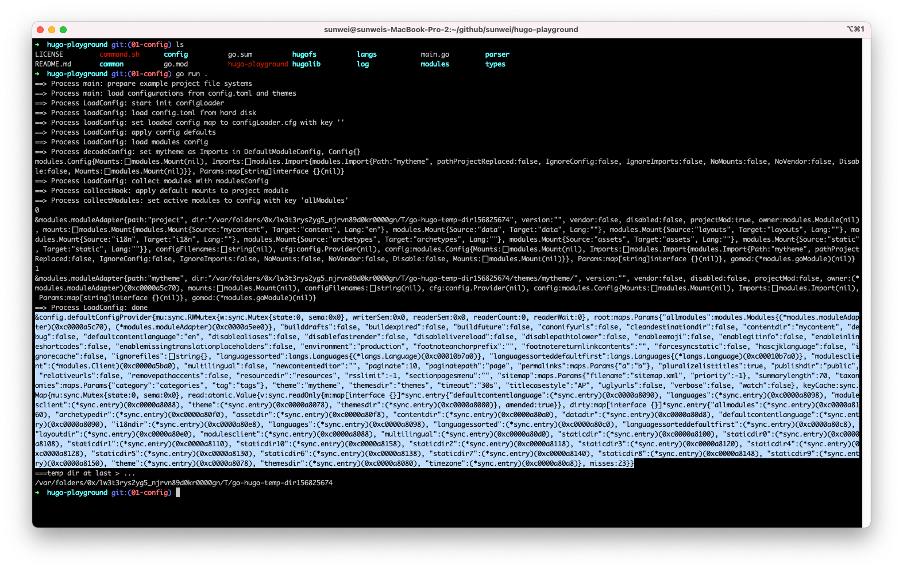
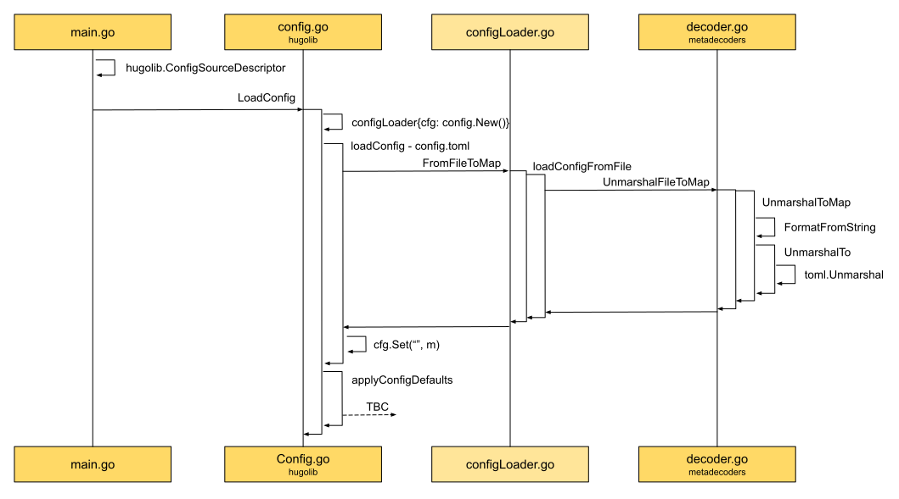
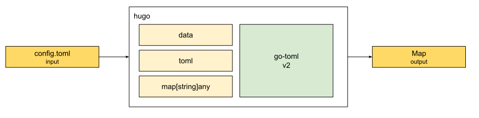
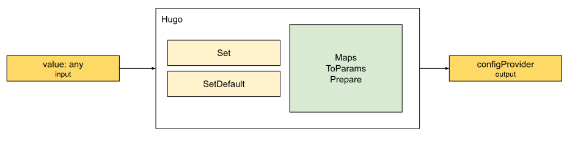
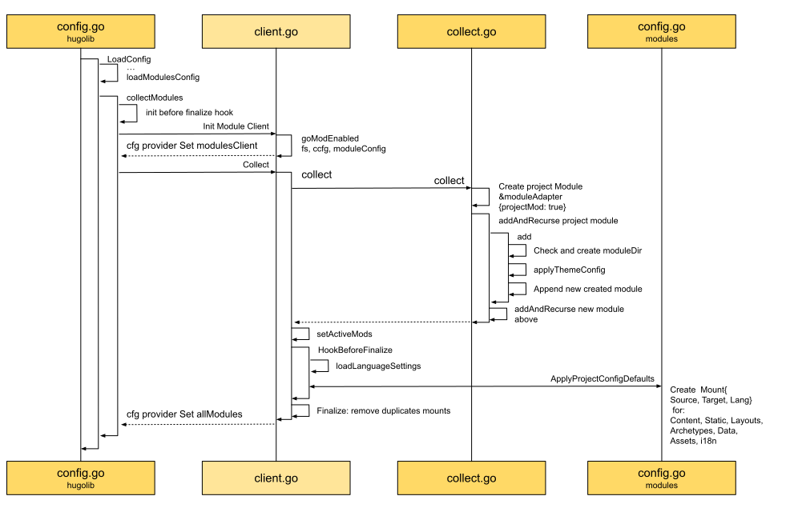
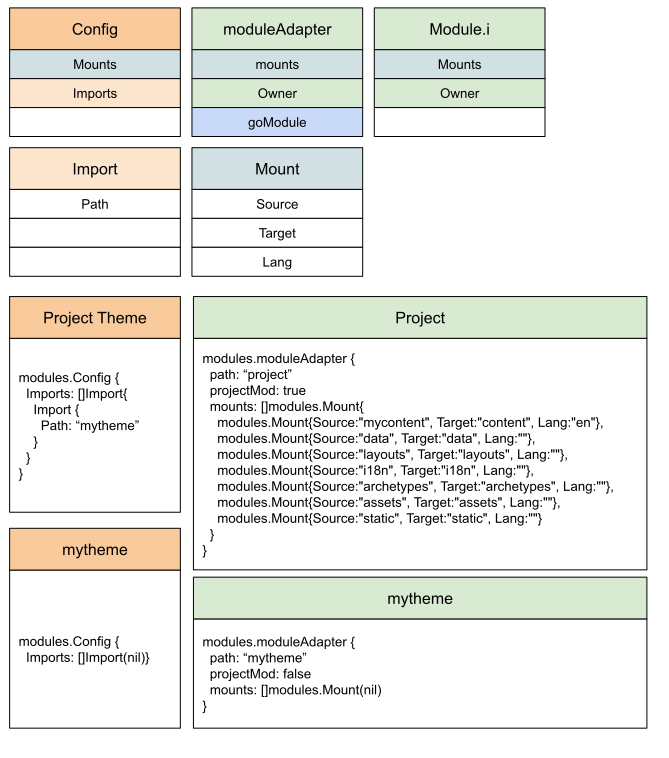

## Config源码分析

在[基础架构](../how/基础架构.md)中，从基础架构的视角出发。
有提到配置模块，以及[配置和语言的关系](../how/基础架构.md#配置和语言的关系)。

下面我们从源码实现的角度，详细的来看看Hugo是如何设计和实现配置模块的。

### 跬步千里 - Config模块源码

将[游乐场](https://github.com/sunwei/hugo-playground)源码， 切换到[01-config](https://github.com/sunwei/hugo-playground/tree/01-config)分支：

```shell
➜  hugo-playground git:(main) git checkout 01-config
Switched to branch '01-config'
Your branch is up to date with 'origin/01-config'.
➜  hugo-playground git:(01-config) 
```

通过将源码按配置模块进行裁剪，Config模块在我们面前也变得清晰，让我们在Hugo源码学习的道路上迈出了自信的一步。
通过命令行，我们可以看看具体的目录结构：
```text
➜  hugo-playground git:(01-config) tree
.
├── LICENSE
├── README.md
├── command.sh
├── common
│    ├── maps
│    │    ├── maps.go
│    │    └── params.go
│    └── paths
│         └── path.go
├── config
│    ├── commonConfig.go
│    ├── compositeConfig.go
│    ├── configLoader.go
│    ├── configProvider.go
│    ├── defaultConfigProvider.go
│    └── env.go
├── go.mod
├── go.sum
├── hugo-playground
├── hugofs
│    ├── files
│    │    └── classifier.go
│    └── fs.go
├── hugolib
│    └── config.go
├── langs
│    ├── config.go
│    └── language.go
├── log
│    └── logger.go
├── main.go
├── modules
│    ├── client.go
│    ├── collect.go
│    ├── config.go
│    └── module.go
├── parser
│    └── metadecoders
│         ├── decoder.go
│         └── format.go
└── types
    ├── convert.go
    └── types.go

13 directories, 30 files
```
总共也就13个文件夹，30个文件，其中还包含了一些Github和Golang工程的默认文件。

我们看看`main.go`文件中主要干了什么：
```go
...
    // 1. config
	log.Process("main", "load configurations from config.toml and themes")
	cfg, _, err := hugolib.LoadConfig(
		hugolib.ConfigSourceDescriptor{
			WorkingDir: tempDir,
			Fs:         afs,
			Filename:   "config.toml",
		},
	)
	fmt.Printf("%#v\n", cfg)
```
主要就是调用了LoadConfig函数，生成了配置信息，最打印出来。
主文件中其它的代码我们有在[游乐场](../how/游乐场.md)的介绍中提到过，感兴趣的小伙伴可以前往查看。

如果想要运行程序，查看输出的配置信息长啥样，也可以进入到工程根目录，简单运行命令：
```shell
go run .
```
得到运行结果如下：


进一步查看`LoadConfig`函数，我们发现主要做了三件事：
1. `loadConfig`，加载用户项目中的配置文件，如`config.toml`。
2. `applyConfigDefaults`，如果说上面是用户的自定义信息，那这里就是Hugo用到的默认信息。
3. `collectModules`，加载完自定义信息和默认信息后，根据得到的模块信息，准备模块，并将解析过后的模块信息，也放入配置信息中。

在本章我们重点看第1步`loadConfig`，在后续的章节里会有第2步`applyConfigDefaults`，和第3步`collectModules`的介绍。

### 了然于胸 - loadConfig时序图



从时序图中，我们可以清晰的看到`loadConfig`被调用的环境。
由主函数发起调用，在`hugolib/config.go`中先是构建好`configLoader`，调用`loadConfig`函数，将`config.toml`文件转换成Map类型数据。

在`loadConfig`中，通过函数名可以观察到Hugo的实现思路。
这也说明好的命名是多么的重要。

（温馨提示，在阅读下述流程函数时，可打开[配置源码](https://github.com/sunwei/hugo-playground/tree/01-config)对照查看。）

* `FromFileToMap`，将目标文件`config.toml`转换成Map类型的数据。
* `loadConfigFromFile`，为了达到上面的目的，首先要从硬盘加载这个文件。
* `UnmarshalFileToMap`，加载后，需要将字符弃，解组成Map类型的数据。
* `UnmarshalToMap`，解组对应的输出格式要求，可能不一样，这里是要求解组成Map类型，还有可能是其它类型。
* `FormatFromString`，从文件名获取文件格式`toml`。
* `UnmarshaTo`，通过获取的文件格式信息，以及文件数据信息，和对应的输出格式Map信息，解组总函数，知道该让谁具体负责了。
* `toml.Unmarshal`，所有信息被传送到具体操作员`toml`，可以外聘，也可以自己实现。Hugo选择了外聘`github.com/pelletier/go-toml/v2`。

### 抽象总结 - 输入配置文件，输出Map格式数据



首先了解用户的需求，是将config.toml文件作为输入，要求输出Map类型的数据。
Hugo先是收集信息，包括文件数据`data`，文件格式`toml`，和输出类型`map[string]any`，找到专业的人`go-toml`，进行处理。
最终得到符合要求的Map信息。

### 动手实践 - Show Me the Code of loadConfig

在知道`loadConfig`的实现原理后，我们再来动动小手，用代码来总结代码，巩固一下知识。

可以这里线上尝试，[Show Me the Code, try it yourself](https://c.sunwei.xyz/config-map.html)

代码里有注解说明，代码样例：
```go
package main

import (
	"bytes"
	"fmt"
	toml "github.com/pelletier/go-toml/v2"
	"golang.org/x/tools/txtar"
	"path/filepath"
	"strings"
)

// 文件结构
// 文件名: config.toml
// 文件内容：theme = 'mytheme'
var files = "-- config.toml --\n" +
	"theme = 'mytheme'"

// Format 文件格式类型
type Format string

// TOML 支持的格式，为简单示例，只支持TOML格式
const (
	TOML Format = "toml"
)

func main() {
	// 解析上面的文件结构
	data := txtar.Parse([]byte(files))
	fmt.Println("File start:")

	// Input: 数据，格式，输出类型
	var configData []byte
	var format Format
	m := make(map[string]any)

	// 遍历解析生成的所有文件，通过File结构体获取文件名和文件数据
	// f.Name 获取文件名
	// f.Data 获取文件数据
	// 如果是config.toml文件，则获取文件数据
	for _, f := range data.Files {
		if "config.toml" == f.Name {
			configData = bytes.TrimSuffix(
				f.Data, []byte("\n"))
			format = FormatFromString(f.Name)
		}
	}

	err := UnmarshalTo(configData, format, &m)
	if err != nil {
		fmt.Println(err)
	} else {
		fmt.Println(m)
	}

	fmt.Println("File end.")
}

// FormatFromString turns formatStr, typically a file extension without any ".",
// into a Format. It returns an empty string for unknown formats.
// Hugo 实现
func FormatFromString(formatStr string) Format {
	formatStr = strings.ToLower(formatStr)
	if strings.Contains(formatStr, ".") {
		// Assume a filename
		formatStr = strings.TrimPrefix(
			filepath.Ext(formatStr), ".")
	}
	switch formatStr {
	case "toml":
		return TOML
	}

	return ""
}

// UnmarshalTo unmarshals data in format f into v.
func UnmarshalTo(data []byte, f Format, v any) error {
	var err error

	switch f {
	case TOML:
		err = toml.Unmarshal(data, v)

	default:
		return fmt.Errorf(
			"unmarshal of format %q is not supported", f)
	}

	if err == nil {
		return nil
	}

	return err
}
```

程序输出结果：
```shell
# 解析后得到文件config.toml
# 准备Input：config file data, format, map[string]any
# 得到Output: map[theme:mytheme]
File start:
map[theme:mytheme]
File end.

Program exited.
```

### 了然于胸 - applyConfigDefaults时序图

上面的`loadConfig`帮助我们读取了文件系统里的config.toml文件，并将结果以`map[string]any`的格式。
那我们会把用户自定义的这些配置信息最终存储到哪儿，又将以什么形式提供服务呢？

我们来通过`applyConfigDefaults`时序图找寻一下线索：


从上图左下脚可以看到在`configLoader`调用`applyConfigDefaults`方法后，实际调用的是`l.cfg.SetDefaults`：
```go
// hugo-playground/hugolib/config.go
// line 54
func (l configLoader) applyConfigDefaults() error {
	defaultSettings := maps.Params{
		...
		"timeout":                              "30s",
		...
	}

	l.cfg.SetDefaults(defaultSettings)

	return nil
}
```
那`l.cfg`从哪儿来呢？
我们可以往时序图左上方看。
在创建`configLoader`实例的时候，有一同创建`cfg`，直接调用`config.New()`：
```go
// hugo-playground/config/defaultConfigProvider.go
// line 16
// New creates a Provider backed by an empty maps.Params.
func New() Provider {
	return &defaultConfigProvider{
		root: make(maps.Params),
	}
}
```
实际返回的是一个接口`Provider`，而实现了这个接口的对象就是`defaultConfigProvider`，一起初始化的还有字段`maps.Params`类型的`root`。

看来`Provider`就是默认配置项的接收者。
为了进一步验证我们的猜测，我们继续往右边看。
果然，在从config.toml中读到取用户的自定义配置信息后，也是调用的`Provider(cfg)`的`Set`方法，将解析后的`map[string]any`值设置到了`""`字段。

回到我们最初的问题：我们会把用户自定义的这些配置信息最终存储到哪儿，又将以什么形式提供服务呢？

这时我们已经知道，不管是用户自定义信息，还是默认配置信息，我们都存储在了这个配置提供者里面。
相信`ConfigProvider`就是我们要找寻的答案。
是时候来看看这个`Provider`接口的定义了：
```go
// hugo-playground/config/configProvider.go
// line 9
// Provider provides the configuration settings for Hugo.
type Provider interface {
	...
	Get(key string) any
	Set(key string, value any)
	SetDefaults(params maps.Params)
	...
}
```
确实，`Provider`不仅提供了`Set`方法，还提供了`Get`方法，那就没跑了。

弄清了起点和终点后，我们继续看看过程，`Set`和`SetDefaults`方法具体是怎么将不同类型的数据设置到`Provider`中的。

先看负责用户自定义配置项的`Set`方法。
拿到用户的配置信息后，首先需要将配置信息转换成`Params`类型：
```go
// hugo-playground/common/maps/params.go
// line 9
// Params is a map where all keys are lower case.
type Params map[string]any
```
实际他俩类型是一样的，都是`map[string]any`。

在类型转换成`Params`后，需要通过`PrepareParams`进行处理，让内部格式保持统一。
而`Params`所做的主要事情包括两项：一是将所有key都转换成小写字符串，二是将所有的值都转换成通用类型any。
这样的好处就是信息都按统一标准`Params`格式进行存储，因为类型确定，所以方便拓展和提供其它类型的数据服务。
比如想要获取整形数据，可以在`Provider`接口中定义`GetInt`方法，那我们就可以将所获取的any类型的值，转换成Int。
同理，如果需要其它类型的数据服务，一样可以满足。

再看负责默认配置的`SetDefaults`方法，比`Set`方法更简单，直接调用的就是`PrepareParams`。
因为自己定义的格式，自己最清楚如何使用。
相对面向用户的配置信息多样性，自己定义的默认值更具备确定性。

### 抽象总结 - 输入不同类型的值，输出标准的configProvider


从输入来看，我们要接收来自用户的自定义配置信息，同时也要接收默认的自定义配置信息，还有以后可能会碰到的单项更新信息。

从输出来看，我们需要提供一个通用的配置信息提供方，统一标准，方便满足获取不同数据类型的需求。

为了正确处理接收到的数据，并满足多样性数据服务的需求，Hugo将所有接收到的数据进行标准化处理，以统一的`Params`格式式进行存储。
这样就可以在标准化的基础上进行拓展，从而满足不同的数据需求。

### 动手实践 - Show Me the Code of applyConfigDefaults

在知道`applyConfigDefaults`的实现原理后，我们再来动动小手，用代码来总结代码，巩固一下知识。

可以这里线上尝试，[Show Me the Code, try it yourself](https://c.sunwei.xyz/config-provider.html)

代码里有注解说明，代码样例：
```go
package main

import (
	"fmt"
	"reflect"
	"strings"
)

// Provider 定义提供方需要具备的能力
// 通过Key查询值
// 设置键值对
// 设置默认参数
type Provider interface {
	Get(key string) any
	Set(key string, value any)
	SetDefaults(params Params)
}

// Params 参数格式定义
// 关键字为字符类型
// 值为通用类型any
type Params map[string]any

// Set 根据新传入参数，对应层级进行重写
// pp为新传入参数
// p为当前参数
// 将pp的值按层级结构写入p
// 递归完成
func (p Params) Set(pp Params) {
	for k, v := range pp {
		vv, found := p[k]
		if !found {
			p[k] = v
		} else {
			switch vvv := vv.(type) {
			case Params:
				if pv, ok := v.(Params); ok {
					vvv.Set(pv)
				} else {
					p[k] = v
				}
			default:
				p[k] = v
			}
		}
	}
}

func New() Provider {
	return &defaultConfigProvider{
		root: make(Params),
	}
}

// defaultConfigProvider Provider接口实现对象
type defaultConfigProvider struct {
	root Params
}

// Get 按key获取值
// 约定""键对应的是c.root
// 嵌套获取值
func (c *defaultConfigProvider) Get(k string) any {
	if k == "" {
		return c.root
	}
	key, m := c.getNestedKeyAndMap(strings.ToLower(k))
	if m == nil {
		return nil
	}
	v := m[key]
	return v
}

// getNestedKeyAndMap 支持多级查询
// 通过分隔符"."获取查询路径
func (c *defaultConfigProvider) getNestedKeyAndMap(
	key string) (string, Params) {
	var parts []string
	parts = strings.Split(key, ".")
	current := c.root
	for i := 0; i < len(parts)-1; i++ {
		next, found := current[parts[i]]
		if !found {
			return "", nil
		}
		var ok bool
		current, ok = next.(Params)
		if !ok {
			return "", nil
		}
	}
	return parts[len(parts)-1], current
}

// Set 设置键值对
// 统一key的格式为小写字母
// 如果传入的值符合Params的要求，通过root进行设置
// 如果为非Params类型，则直接赋值
func (c *defaultConfigProvider) Set(k string, v any) {
	k = strings.ToLower(k)

	if p, ok := ToParamsAndPrepare(v); ok {
		// Set the values directly in root.
		c.root.Set(p)
	} else {
		c.root[k] = v
	}

	return
}

// SetDefaults will set values from params if not already set.
func (c *defaultConfigProvider) SetDefaults(
	params Params) {
	PrepareParams(params)
	for k, v := range params {
		if _, found := c.root[k]; !found {
			c.root[k] = v
		}
	}
}

// ToParamsAndPrepare converts in to Params and prepares it for use.
// If in is nil, an empty map is returned.
// See PrepareParams.
func ToParamsAndPrepare(in any) (Params, bool) {
	if IsNil(in) {
		return Params{}, true
	}
	m, err := ToStringMapE(in)
	if err != nil {
		return nil, false
	}
	PrepareParams(m)
	return m, true
}

// IsNil reports whether v is nil.
func IsNil(v any) bool {
	if v == nil {
		return true
	}

	value := reflect.ValueOf(v)
	switch value.Kind() {
	case reflect.Chan, reflect.Func,
		reflect.Interface, reflect.Map,
		reflect.Ptr, reflect.Slice:
		return value.IsNil()
	}

	return false
}

// ToStringMapE converts in to map[string]interface{}.
func ToStringMapE(in any) (map[string]any, error) {
	switch vv := in.(type) {
	case Params:
		return vv, nil
	case map[string]string:
		var m = map[string]any{}
		for k, v := range vv {
			m[k] = v
		}
		return m, nil

	default:
		fmt.Println("value type not supported yet")
		return nil, nil
	}
}

// PrepareParams
// * makes all the keys lower cased
// * This will modify the map given.
// * Any nested map[string]interface{}, map[string]string
// * will be converted to Params.
func PrepareParams(m Params) {
	for k, v := range m {
		var retyped bool
		lKey := strings.ToLower(k)

		switch vv := v.(type) {
		case map[string]any:
			var p Params = v.(map[string]any)
			v = p
			PrepareParams(p)
			retyped = true
		case map[string]string:
			p := make(Params)
			for k, v := range vv {
				p[k] = v
			}
			v = p
			PrepareParams(p)
			retyped = true
		}

		if retyped || k != lKey {
			delete(m, k)
			m[lKey] = v
		}
	}
}

func main() {
	// 新建Config Provider实例
	// 实例中defaultConfigProvider实现了接口
	provider := New()

	// 模拟设置用户自定义配置项
	// config.toml中关于主题的配置信息
	// 类型是map[string]string
	// 需要转换成map[string]any，也就是Params类型
	provider.Set("", map[string]string{
		"theme": "mytheme",
	})

	// 模拟默认配置项
	// 超时默认时间为30秒
	provider.SetDefaults(Params{
		"timeout": "30s",
	})

	// 输出提前设置的所有配置信息
	fmt.Printf("%#v\n", provider.Get(""))
	fmt.Printf("%#v\n", provider.Get("theme"))
	fmt.Printf("%#v\n", provider.Get("timeout"))
}
```

程序输出结果：
```shell
# 输出Config Provider提前设置好的信息
# 包括用户自定义信息，和默认信息
# 准备Input：自定义信息，默认信息
# 得到Output: 通过Config Provider获取所有配置信息
main.Params{"theme":"mytheme", "timeout":"30s"}
"mytheme"
"30s"

Program exited.
```

### 了然于胸 - collectModules时序图

经过`loadConfig`和`applyConfigDefaults`，我们已经将用户自定义信息和默认信息都归置妥当，并且放在了`Config Provider`中，方便查用。

Hugo在拿到这些信息后，立马着手的事情就是`collectModules`，也就是收集模块信息了。


正如上图中`loadModulesConfig`所示，拿到配置信息后，就进行解码`decodeConfig`操作。
在我们的[示例](../how/游乐场.md)中，我们的项目用到了名为`mytheme`的主题，所以在项目配置信息中，我们需要把主题添加到导入项`Imports`中。



准备好了模块的配置信息后，接下来就是要根据这些配置信息，对模块进行处理了。

需要先准备好回调函数`beforeFinalizeHook`，为什么要准备这和个回调函数呢？
我们先把这个疑问放一放，一会我们就能发现实际的触发场景。

回调函数设置好后，接着就开始收集模块了。
如上图左上角所示，首先需要创建`Module Client`用来具体处理模块的收集工作。
为什么要叫`Client`呢？
这是因为现在Hugo支持Golang的mod模式，意味着可以用`go.mod`来导入主题，那我们就需要下载依赖包 - 主题工程来管理依赖了。
这样来看，叫客户端是不是就不难理解了。
在我们的[示例](../how/游乐场.md)中，主题目录是用来做流程讲解示范的，只有一个文本文件，所以这里的场景并不涉线上go模块加载。

客户端设置好后，开始收集，如上图中间所示，收集过程总共分四步：
* 按配置递归收集所有模块 - Collect
* 设置处于活跃状态的模块 - setActiveMods
* 触发提前设置的回调函数 - HookBeforeFinalize
* 移除重复的挂载信息 - Finalize

**Collect**

先为项目创建工程模块`Project Module`，然后开始递归收集模块：
```go
func (c *collector) collect() {
	...

	// c.gomods is [], GetMain() returns ni
	projectMod := createProjectModule(c.gomods.GetMain(), c.ccfg.WorkingDir, c.moduleConfig)

	// module structure, [project, others...]
	if err := c.addAndRecurse(projectMod, false); err != nil {
		c.err = err
		return
	}

	...
}
```

这里为什么会用到递归呢？
因为在Hugo中，模块之间是有相互依赖的。
通过最开始的模块配置信息也可以看出，我们把依赖的模块放在了Imports中，Project Module就需要导入"mytheme"模块。
在实际情况中，"mytheme"有可能也是依赖于其它的主题，所以也需要导入其它模块。

从上面时序图右下方可以看到，`addAndRecurse`做了四件事：
1. 为导入的模块创建模块文件夹，用来放置模块所有文件
2. 应用主题配置，就像最开始解析项目模块的配置信息一样，看是否还需要导入其它模块
3. 将模块添加到模块列表中
4. 为新模块重复上述步骤

这样，我们就能顺着项目模块的配置信息，逐个将所有的模块信息收集齐全了。

**setActiveMods**

递归收集完所有模块信息后，需要根据用户配置，进一步将禁用的模块给过滤到，留下这一次构建所需要的模块。

**HookBeforeFinalize**

过滤完模块后，在`Finalize`敲定前，是时候回调我们之前设置好地回调函数了。

除了加载多语言设置处，回调函数所做的操作主要集中在上面时序图的右下脚。
就是为项目模块准备好所有的挂载`Mount`，包括Content, Static, Layouts, Archetypes, Data, Assets, i18n，共七个组件。
其中Content和其它的组件有点不一样。
因为Content挂载点和多语言一一对应，也就是说有几种语言，就会有几个内容目录。

**Finalize**

等有了所有的模块的信息，挂载点也收集完毕后，我们还要做一件事情。
那就是要保证这些挂载点在全局视野下，没有重复。

结合时序图，我们进一步将其中的关键对象结构体，根据这些结构体的属性和行为，按流程处理后所得到的最终结果放在一起，可视化出来。
方便大家理解：



### 抽象总结 - 输入不同类型的值，输出标准的configProvider

在上图中，通过下方输出部分可以看出，一个模块配置项，对应一个模块。

在左边的模块配置信息中，包含了模块之间的依赖信息。
在上面的示例中项目模块饱含了主题模块。

在右边的模块实例中，首先要区分哪一个是项目模块，因为项目模块是站点构建的起点。
所以在模块中需要能标识身份信息的字段`projectMod`。

如果从挂载`Mounts`的角度来看模块，那每个模块实际上就是一个合并后的根文件系统。
Hugo将这个文件系统用七个组件进行了划分。

项目模块必需得包含这些信息，但因为依赖于其它模块，所以需要将项目模块放在最后处理。
Hugo将项目模块放在了模块队列的第一个，并用一个回调函数帮助在合适的时间点，对项目模的挂载进行了统一的处理。

再用`Input -> [?] -> Output`模型来进行分析，可以抽象为以下模型：


主题信息来源于用户自定义信息，作为输入传入收集模块功能单元。
在处理过程中，Hugo按Name, Module Config, Module, Mounts的对应关系，将模块相关信息进行处理。
最终生成所有模块的信息，并通过将这些信息设置在Config Provider中，为后续的操作做好准备。

### 动手实践 - Show Me the Code of collectModules

在知道`collectModules`的实现原理后。
按照我们的传统，让我们动动小手，用代码来总结代码，巩固一下知识。

可以这里线上尝试，[Show Me the Code, try it yourself](https://c.sunwei.xyz/collect-module.html)

代码里有注解说明，代码样例：

```go
package main

import "fmt"

type Mount struct {
	// relative path in source repo, e.g. "scss"
	Source string
	// relative target path, e.g. "assets/bootstrap/scss"
	Target string
	// any language code associated with this mount.
	Lang string
}

type Import struct {
	// Module path
	Path string
}

// Config holds a module config.
type Config struct {
	Mounts  []Mount
	Imports []Import
}

type Module interface {
	// Config The decoded module config and mounts.
	Config() Config
	// Owner In the dependency tree, this is the first module that defines this module
	// as a dependency.
	Owner() Module
	// Mounts Any directory remappings.
	Mounts() []Mount
}

type Modules []Module

var modules Modules

// moduleAdapter implemented Module interface
type moduleAdapter struct {
	projectMod bool
	owner      Module
	mounts     []Mount
	config     Config
}

func (m *moduleAdapter) Config() Config {
	return m.config
}
func (m *moduleAdapter) Mounts() []Mount {
	return m.mounts
}
func (m *moduleAdapter) Owner() Module {
	return m.owner
}

// happy path to easily understand
func main() {
	// project module config
	moduleConfig := Config{}

	imports := []string{"mytheme"}
	for _, imp := range imports {
		moduleConfig.Imports = append(moduleConfig.Imports, Import{
			Path: imp,
		})
	}

	// Need to run these after the modules are loaded, but before
	// they are finalized.
	collectHook := func(mods Modules) {
		// Apply default project mounts.
		// Default folder structure for hugo project
		ApplyProjectConfigDefaults(mods[0])
	}

	collectModules(moduleConfig, collectHook)

	for _, m := range modules {
		fmt.Printf("%#v\n", m)
	}
}

// Module folder structure
const (
	ComponentFolderArchetypes = "archetypes"
	ComponentFolderStatic     = "static"
	ComponentFolderLayouts    = "layouts"
	ComponentFolderContent    = "content"
	ComponentFolderData       = "data"
	ComponentFolderAssets     = "assets"
	ComponentFolderI18n       = "i18n"
)

// ApplyProjectConfigDefaults applies default/missing module configuration for
// the main project.
func ApplyProjectConfigDefaults(mod Module) {
	projectMod := mod.(*moduleAdapter)

	type dirKeyComponent struct {
		key          string
		component    string
		multilingual bool
	}

	dirKeys := []dirKeyComponent{
		{"contentDir", ComponentFolderContent, true},
		{"dataDir", ComponentFolderData, false},
		{"layoutDir", ComponentFolderLayouts, false},
		{"i18nDir", ComponentFolderI18n, false},
		{"archetypeDir", ComponentFolderArchetypes, false},
		{"assetDir", ComponentFolderAssets, false},
		{"", ComponentFolderStatic, false},
	}

	var mounts []Mount
	for _, d := range dirKeys {
		if d.multilingual {
			// based on language content configuration
			// multiple language has multiple source folders
			if d.component == ComponentFolderContent {
				mounts = append(mounts, Mount{Lang: "en", Source: "mycontent", Target: d.component})
			}
		} else {
			mounts = append(mounts, Mount{Source: d.component, Target: d.component})
		}
	}

	projectMod.mounts = mounts
}

func collectModules(modConfig Config, hookBeforeFinalize func(m Modules)) {
	projectMod := &moduleAdapter{
		projectMod: true,
		config:     modConfig,
	}

	// module structure, [project, others...]
	addAndRecurse(projectMod)

	// Add the project mod on top.
	modules = append(Modules{projectMod}, modules...)

	if hookBeforeFinalize != nil {
		hookBeforeFinalize(modules)
	}
}

// addAndRecurse Project Imports -> Import imports
func addAndRecurse(owner *moduleAdapter) {
	moduleConfig := owner.Config()

	// theme may depend on other theme
	for _, moduleImport := range moduleConfig.Imports {
		tc := add(owner, moduleImport)
		if tc == nil {
			continue
		}
		// tc is mytheme with no config file
		addAndRecurse(tc)
	}
}

func add(owner *moduleAdapter, moduleImport Import) *moduleAdapter {
	fmt.Printf("start to create `%s` module\n", moduleImport.Path)
	ma := &moduleAdapter{
		owner: owner,
		// in the example, mytheme has no other import
		config: Config{},
	}
	modules = append(modules, ma)
	return ma
}
```

输出结果：

```go
# collect theme as module
start to create `mytheme` module
# project module has no owner with default mounts
&main.moduleAdapter{projectMod:true, owner:main.Module(nil), mounts:[]main.Mount{main.Mount{Source:"mycontent", Target:"content", Lang:"en"}, main.Mount{Source:"data", Target:"data", Lang:""}, main.Mount{Source:"layouts", Target:"layouts", Lang:""}, main.Mount{Source:"i18n", Target:"i18n", Lang:""}, main.Mount{Source:"archetypes", Target:"archetypes", Lang:""}, main.Mount{Source:"assets", Target:"assets", Lang:""}, main.Mount{Source:"static", Target:"static", Lang:""}}, config:main.Config{Mounts:[]main.Mount(nil), Imports:[]main.Import{main.Import{Path:"mytheme"}}}}
# theme module owned by project module with no import in the example
&main.moduleAdapter{projectMod:false, owner:(*main.moduleAdapter)(0xc000102120), mounts:[]main.Mount(nil), config:main.Config{Mounts:[]main.Mount(nil), Imports:[]main.Import(nil)}}

Program exited.
```