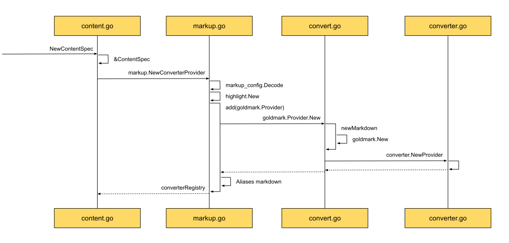
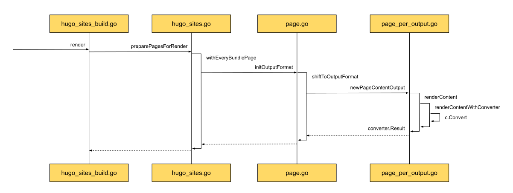
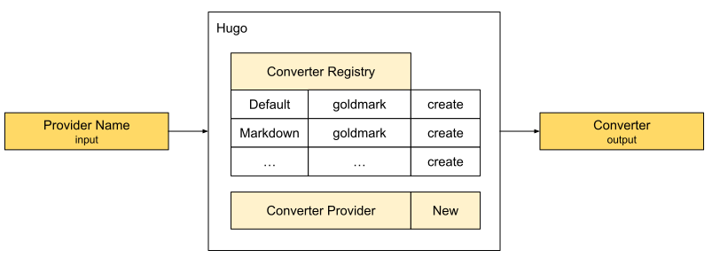

## ContentSpec

从基础架构中提到的Template vs Layouts章节，我们了解到Layouts是Template的重要组成部分。
Template将站点样式和内容分离，我们只需要提供内容就可以。

这里就会出现一个疑问：在写作的时候，我们用的明明是Markdown语法，并不是HTML超文本，而Template接收的内容格式是HTML。
那是在什么时候，由谁将Markdown转换成HTML的呢？

这就要聊到咱们Deps中的另一个依赖`ContentSpec`了。

### 了然于胸 - ContentSpec时序图

先通过新建时序图，来看看`ContentSpec`是如何进行组织和构建的。

我们先看创建和返回，新建ContentSpec的时候，首先调用的是`markup.NewConverterProvider`，由此返回的也是`converterRegistry`。
由此可见，ContentSpec实际上是ConverterProvider - 转换器提供方，实例就是converterRegistry - 转换器注册处。
也就是说，Hugo采用的是注册制，可能会有多个转换器注册在注册处，可根据请求的类型，返回相应的转换器，正是让专业的人干专业的事。

那我们接着来看看Hugo是如何设计这个转换器注册处的。

通过中间栏可以看到，Hugo先解析相关的配置项，可以了解到用户的定制化需求和默认的配置信息，如这么多markdown的开源工具，我们默认用哪一个。
再创建一些通用的工具，如高亮组件，可以用来满足用户的高亮需求。
做好了上述的准备工作后，注册处就可以开始营业了，提供的服务当然就是注册Markdown提供方了，在我这注册后，有活的时候，就可以分派给你了。
上图示例中的提供方就是goldmark.Provider，goldmark下是现在Hugo采用的默认markdown解析器。

在注册处里，并没有直接提供goldmark实例，而是提供了标准的converter.Provider，在这里面，包含了由goldmark.New提供的goldmark实例。
就像注册到滴滴平台的网约车，要求能够提供符合滴滴标准的车辆服务。

注册处为了方便查找服务提供方，还给这些提供方取了别名，给goldmark取的别名就是default。
如果没有特殊要求，注册处派出的服务提供方都是goldmark。
在网约车中，相当于滴滴的官方推荐。

注册处，是一个服务提供方。
我在打车的时候，才会打开滴滴的应用。
那在Hugo里，什么时候，会用到转换器注册处呢？

我们接着再来看看具体地使用场景。
如上述时序图所示，正是站点在渲染内容时使用到转换器的实际场景。

这个场景是由render渲染阶段触发的，正是Hugo在构建站点过程中对转换器使用的主要场景。
在上图最右边，我们可以看到，将需要渲染的内容renderContent交给converter进行转换，最终返回转换过后的结果convert.Result。
正是在这里，我们将用户所书写的markdown内容，转换成了我们所需要的HTML内容。

顺带看一下Hugo的渲染思路。
通过时序图的左侧可以看到，这是发生在render的准备阶段，Hugo为所有的Pages精心打扮一番，为渲染做好准备。

从基础架构中介绍的[OutputFormats](../how/基础架构.md)我们了解到，每个Page页面可以有多个OutputFormats输出格式。
在渲染的过程中，会明确具体要渲染的格式RenderFormats，RenderFormats是对OutputFormats去重后，处理生成的。

为了满足render时的要求，在准备阶段，Hugo为所有的Page，根据OutputFormat，都生成了相应的PageContentOutput。
如上图中间部分所示。

这样，我们的content就为render做好了准备。
合并后的RenderFormats也拥有了符合格式要求的内容信息，再配合Template，就可以生成最终的站点页面了。

这样一来，我们了解了Hugo是如何对注册处进行管理的。
以及转换器提供方要到什么地方，是如何完成注册操作的。
还了解到Hugo是在何时用到转换器的。
这样，从使用场景，到服务提供方，我们对全流程有了清晰的认识。
但还是感觉好像缺了什么似的，没错，那就是这些提供发究竟是如何将Markdown一步步转换成HTML的？

带着这个问题，拿Hugo Markdown默认转换器goldmark为例，我们来一探究竟。
详情请查看**Markdown文件是如何被翻译成HTML的**章节。

### 抽象总结 - 输入Markdown格式内容，输出HTML格式渲染结果

想要将Markdown格式的内容，渲染成最终的HTML，需要先从注册处获取转换器，新建实例后，用实例来进行最终渲染。

工欲善其事，必先利其器 - 获取转换器：

在转换器注册处，注册了不同的提供方。
为了方便查找，用名字作为索引。
这样调用方就能通过名字方便地获取能满足诉求的转换器提供方。
需要正式使用的时候，只需要调用New新建方法，就可以得到拥有实际转换功能的转换器。

进入转换环节后。
面对Markdown语法结构的字符流，解析器选择的数据结构是AST语法抽象树，这种结构的优点是树状结可以帮助表达内容Block之间的依赖关系。
不仅如此，树状结构很容易对树结点进行走查。
这样等进入到渲染阶段时，我们就可以专注在具体地渲染事项上，再不用关心结点之间的关联和依赖了。
这样，在调用相应的渲染方法，只需专注在具体地渲染细节上了。
比如在渲染heading的时候只需要关注标题的级别，选用对应的HTML标签就可以了。

### 动手实践 - Show Me the Code of ContentSpec

