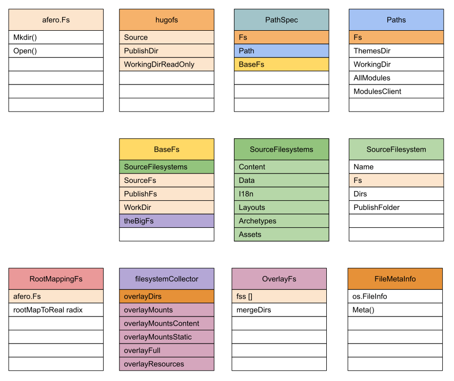
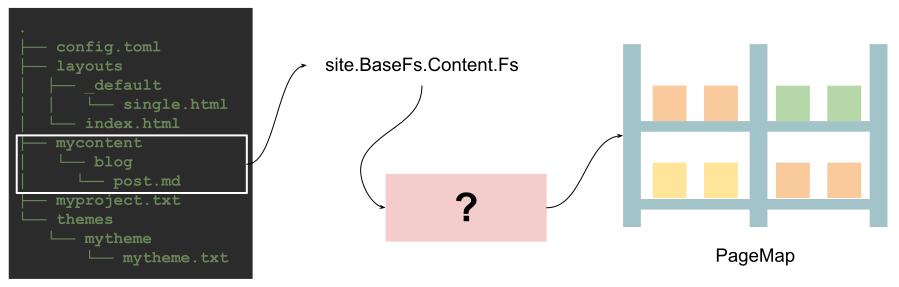
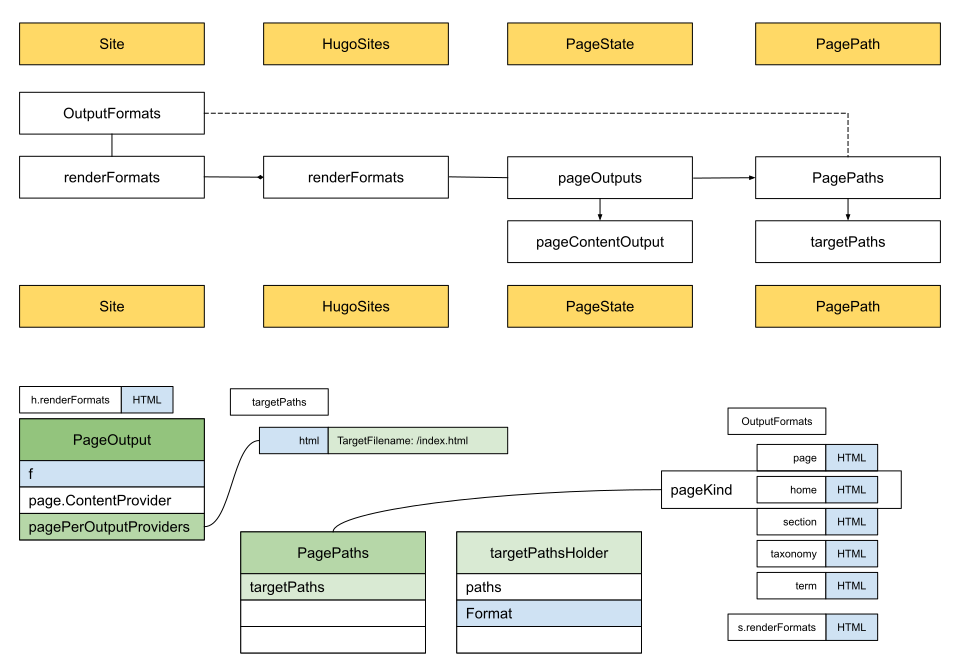

# Hugo Architecture

We can learn how to use Hugo to create our own sites and theme.
Here are examples: [Personal Site](https://hugo.notes.sunwei.xyz/s/what/site/) and [Custom Theme](https://hugo.notes.sunwei.xyz/en/docs/what/theme/).
It is easy to learn and use.

At the same time, Hugo is an open source project based on the Apache 2.0 protocol, which means that you can boldly use your creativity.

For example, for sites in the source code field, such as [Understanding Hugo in Depth](https://c.sunwei.xyz/), the source code and notes are separated and can be executed on [GolangPlay](https://go.dev/play/).
Make the learning experience of source code more three-dimensional, not only have interpretation, but also participate in it, modify the example to further help understanding.

At present, Hugo cannot support the construction of such a site for two main reasons.
The first reason is [Content Format](https://gohugo.io/content-network/formats/). 
The content format currently supported by Hugo is Markdown, and the above content format is .go source code file.
The second reason is [Functions](https://gohugo.io/functions/). 
Hugo does not have a function that handles code and can be used directly. 
To parse the source code and notes.
Although the string function can be combined for processing, it is cumbersome to use, difficult to expand, and even more impressive to maintain.

But we have the source codes. 
Can we ask for more?
After all, we are software engineers in pursuit!

Whether it is from a practical perspective or from the perspective of learning excellent sources to communicate and learn, we have every reason to explore this treasure.

The goal of this chapter is to open the Treasure Map to understand the infrastructure of the Hugo, which is mainly carried out in the following two directions:

* Provides an overview of the architectural thinking and a comprehensive understanding of the infrastructure
* Start with module code and discuss the relationship between configuration and language, Hugo modules, organization of file systems, collection of site content, lifecycle of templates, and publishing processes.

* By reading this chapter, we will have a comprehensive understanding of the Hugo site construction tool and a clear understanding of the relationship between the stages, laying a foundation for the next detailed source implementation chapters.

Let's go, great engineer!

## Architecture Design of Hugo

Combining the Hugo site construction domain [event](https://hugo.notes.sunwei.xyz//en/docs/how/event-storming/), 
and [Hugo playground](https://github.com/sun.com/hugo-playground) source code, the architecture design of Hugo will become very clear:


Hugo's architecture idea is easy to understand. 
It is mainly divided into three major blocks: configuration module, site module and dependency module.

### Configuration Module

The first thing Hugo parses is the configuration file `config.toml` of the user project.
Initiated by `configLoader`, the configuration file is read from the hard disk and stored as a key-value pair object after parsing.

`configLoader` mainly needs to complete three things:
1. Load the user project configuration file to understand the user's custom requirements.
2. Complete the default configuration `Defaults Config`, to ensure the normal operation of other modules.
3. Generate module configuration information, starting from the user project, using the user project as the first module - `project module`, and in our example there is a second module, that is the theme module `mytheme`.

There are dependencies between modules and there is only one Owner `Owner`.
The project module `project module` is special, because it is the initial module, so it does not belong to any other modules.

```go
type Module interface {
	...
	// Owner In the dependency tree, this is the first 
	// module that defines this module as a dependency.
	Owner() Module
	...
}
```

After all the information is collected, the `config.Provider` service will be provided externally: it can be queried and configuration items can be updated.

### HugoSites Module

This is the core module of building a site, which is equivalent to the aggregate root in DDD. 
It organizes all the information needed to build a site internally and provides site building services externally.

The initialization of `HugoSites` depends on `DepsCfg` and `Site`, yes, there are two sites.
The relationship between HugoSites and Site is one-to-many, and the relationship between Site and Language is one-to-one, 
so a multilingual site will create a site for each language, which together form HugoSites.

Language items are created by DepsCfg, but will be stored in `config.Provider`, so they are marked in light yellow.
The initialization of DepsCfg depends on `Fs` and `config.Provider`.
`Fs` records the source file address and release address.
The source files come from the user project, which is the actual hard disk file system.
The publishing address is obtained from config.Provider, and the default is the public folder. 
It will check whether it already exists here, and create it actively if not.
Finally, synchronize the newly created information such as `workingDir` back to config.Provider.

As can be seen, their dependencies are `HugoSites <- Site <- Language <- DepsCfg <- Fs`.

### Deps Module

Hugo refers to all the services and objects needed to build a site as dependencies, and puts them all in `Deps`.

In the process of building dependencies, `TemplateProvider` that provides templates will be generated;
Clear input and output media type `MediaType`; and output format `OutputFormats`; 
will be updated to `config.Provider`.

It will also be prepared for collecting site content, and there will be a `Page Collection` to help collect.
The publishing service that needs to be used when finally publishing the site is `Publisher`.
These will be updated to `Site`.

At the same time, it is also necessary to manage resources in a unified manner with clear specifications, 
which can ensure the convenience of use and conform to the principle of single responsibility in the principle of oriented design.
Contains `Path Spec` that provides a unified standard file structure service;
and a `Resources Spec` with all media type and output format information;
and a `Content Spec` that provides services for `Content` information;
Plus `Source Spec` to help define resource policies, such as filtering functions.

With the help of Deps, all the information needed to build the site, such as raw materials, rules, 
and output formats, etc., are prepared.

All is ready except for the opportunity!

## Hugo's component design

The architecture diagram can help us understand Hugo's architecture design from a global perspective.
Now let's go a step closer and look at the details of Hugo's architecture from a module perspective

### The relationship between configuration and language

Hugo provides powerful configuration features, such as configuration files, configuration directories, 
configuration themes, and more.
In the process of building a site, as long as it is a customized requirement that you can think of, 
it can basically be realized through configuration.

In order to meet different customization needs, 
Hugo's idea is to deal with the relationship between many configuration files first, 
so some configuration items need to be merged, which requires case insensitivity.
Customization is only a small part, and other general information is explained with the default configuration.

Supporting multiple languages is a common requirement, 
and the strategy followed by much software is to give priority to internationalization.
So how does Hugo understand the relationship between language and configuration?

In the [personal site](https://hugo.notes.sunwei.xyz/en/docs/what/site/) example, 
we configure language-related configurations in `config.toml` as follows:

```toml
defaultContentLanguage = 'zh'
[languages]
[languages.zh]
  languageName = '中文'
  contentDir = 'content'
  weight = 1

[languages.en]
  languageName = 'English'
  contentDir = 'content.en'
  weight = 2
```

The default language can be configured, and the supported languages are Chinese and English.

From this point of view, the configuration should include the language.
In other words, the language should be a field in the configuration structure.
And is this the case?
Let's start from the source code of [Hugo Playground](https://github.com/sunwei/hugo-playground) to find out.

Before that, let's look for clues from the architecture diagram:


It can be seen that the place where Language is finally created is in DepsCfg, not Config.
This is counter to our intuition, let's take a look at the key config.Provider, DepsCfg and Language related code snippets.

### config.Provider

```go
// Provider provides the configuration settings for Hugo.
type Provider interface {
	...
	Get(key string) any
	Set(key string, value any)
	...
}
```

It can be seen that the Provider interface provides `Get` and `Set` methods, just like a key/value warehouse.
The language-related configuration is also stored in the Provider.

### DepsCfg

```go
// DepsCfg contains configuration options that can be used to configure Hugo
// on a global level, i.e. logging etc.
// Nil values will be given default values.
type DepsCfg struct {
	// The language to use.
	Language *langs.Language
	
	// The configuration to use.
	Cfg config.Provider

	...
}
```

DepsCfg contains config.Provider and Language.

When creating a site, the direct input is DepsCfg:

```go
// newSite creates a new site with the given configuration.
func newSite(cfg deps.DepsCfg) (*Site, error) {
	...
}
```

Before calling to create a site, DepsCfg has already prepared Language:

```go
func createSitesFromConfig(cfg deps.DepsCfg) ([]*Site, error) {
	...
	languages := getLanguages(cfg.Cfg)
	for _, lang := range languages {
		... 
		cfg.Language = lang
		s, err = newSite(cfg)

		...
	}
	return sites, nil
}
```

From the Language structure, it can be seen that:

```go
// Language manages specific-language configuration.
type Language struct {
	Lang   string
	Weight int // for sort

	// Global config.
	// For internal use.
	Cfg config.Provider
	
	...
}
```

Language contains Cfg config.Provider.
That is to say, the relationship between Language and Config is actually an inclusive relationship, not as we felt above.
Think about it carefully, it makes sense.
Config focuses on providing configuration key/value warehouse management services, 
while Language and Site are in one-to-one correspondence, and additional configuration information is required.

### Hugo modules

When it comes to modularization, you may think of Nginx modules, IDEA plug-ins and so on.
Usually, I can meet my differentiated needs by uploading some modules.
The reason why everyone likes this kind of module is mainly because it is flexible enough to meet their own needs without too much effort.
Because many times, although they are roughly the same, there are always some differences in details.
This also shows the complexity of software, in addition to technical complexity, there is also business complexity.
In most cases, what we are facing is mainly business complexity.
This is also the best explanation of the saying "interlacing lines are like mountains" in the field of software.
Nowadays, not only the Internet industry, the financial industry, 
but also the traditional manufacturing industry have used information systems to help enterprises in production and management.
The same leave application system, even in the same industry and different companies, will be different.

However, Hugo's modules are a bit different from the modules in everyone's impression. 
They do not use functions as units to meet differentiated needs.
Instead, the directory structure is used to identify the same structure.

Let's take a look at the location of the module in our architecture:


In the architecture diagram, `Modules` needs to be organized in a unified manner, 
relying on the description information of `Modules Config`, 
and the loading of this information is the responsibility of configLoader.

Let's take a look at the actual call timing from the source code of [Hugo Playground](https://github.com/sunwei/hugo-playground):


It can be seen that in our playground, the main function calls the `LoadConfig` method, 
and does two things for `Modules` in this method.
One is `loadModulesConfig`, which organizes configuration information related to Modules into Module Config.
The other is `collectModules`, which standardizes the module information according to the module standard according to the collected configuration information.

Let's take a look at the source code definition of `Module Config`:

```go
// Config holds a module config.
type Config struct {
	Mounts  []Mount
	Imports []Import

	// Meta info about this module (license information etc.).
	Params map[string]any
}
```

It can be seen that there are two important fields, one is Mounts and the other is Imports.
`loadModulesConfig` mainly deals with the Imports field, in our example:

```
-- config.toml --
theme = "mytheme"
...
```

The configuration information of the theme is `theme = "mytheme"`, 
and when parsed into module configuration information, it becomes `c.Imports = [mytheme]`.

The next step is to collect the module `collectModules`:

```go
func (l configLoader) collectModules(modConfig modules.Config, ...) (modules.Modules, ...) {
	...
}
```

Pass in the module configuration information just collected, and output standard module information.
However, the configuration information we just collected has only Imports and only one value "mytheme". 
The output example is shown in the following figure:

```go
fmt.Printf("%#v\n", modulesConfig)

modules.Config{
	Mounts:[]modules.Mount(nil), 
	Imports:[]modules.Import{
		modules.Import{
			Path:"mytheme", 
			...
	}}, 
	Params:map[string]interface {}(nil)
}
```

**Why does Hugo call Theme a module? **

Enter the following command to create a site:
```shell
➜  tmp hugo new site xyz
```
查看目录结构：
```shell
➜  xyz tree
.
├── archetypes
│   └── default.md
├── config.toml
├── content
├── data
├── layouts
├── public
├── static
└── themes

7 directories, 2 files
```

Then enter the following command to create a theme:

```shell
➜  tmp hugo new theme mytheme
```

Also look at the directory structure:

```shell
➜  mytheme tree
.
├── LICENSE
├── archetypes
│   └── default.md
├── layouts
│   ├── 404.html
│   ├── _default
│   │   ├── baseof.html
│   │   ├── list.html
│   │   └── single.html
│   ├── index.html
│   └── partials
│       ├── footer.html
│       ├── head.html
│       └── header.html
├── static
│   ├── css
│   └── js
└── theme.toml

7 directories, 11 files
```

Let's compare the directory structures of Site and Theme together:


By comparison, it is not difficult to find that the directory structure is basically the same, 
including `archetypes`, `layouts`, `static` and so on.

On the Hugo official website, there is a clear description of [directory structure](https://gohugo.io/getting-started/directory-structure/).
You can also see from the source code:

```go
// hugo-playground/hugofs/files/classifier.go

const (
	ComponentFolderArchetypes = "archetypes"
	ComponentFolderStatic     = "static"
	ComponentFolderLayouts    = "layouts"
	ComponentFolderContent    = "content"
	ComponentFolderData       = "data"
	ComponentFolderAssets     = "assets"
	ComponentFolderI18n       = "i18n"
)

var (
	ComponentFolders = []string{
		ComponentFolderArchetypes,
		ComponentFolderStatic,
		ComponentFolderLayouts,
		ComponentFolderContent,
		ComponentFolderData,
		ComponentFolderAssets,
		ComponentFolderI18n,
	}
)

```

It can be seen that Hugo makes each module follow this unified principle by standardizing the directory structure, 
so that there are rules to follow no matter when parsing themes or user projects.


Take a look at Hugo's description of [module](https://gohugo.io/hugo-modules/configuration/):

> Hugo Modules are the core building blocks in Hugo. 
> A module can be your main project or a smaller module providing 
> one or more of the 7 component types defined in Hugo: 
> static, content, layouts, data, assets, i18n, and archetypes.

That is to say `static, content, layouts, data, assets, i18n, and archetypes`
Any combination of these 7 components is considered to meet the requirements of the module.

Hugo's modules are built on top of Go Modules and are easy to use:

```toml
[module]
[[module.imports]]
  path = 'github.com/sunwei/zero'
```

That is to say, we can now load the theme in the form of loading modules, 
instead of importing the theme as a git submodule, which is more convenient and reasonable.

After figuring out why the theme is also a module, 
let's take a look at the final configuration information of the module we got:

```go
// hugo-playground/hugolib/config.go 
// line 140
...
log.Process("collectModules", "set active modules to config with key 'allModules'")
for i, m := range moduleConfig.ActiveModules {
    fmt.Println(i)
    fmt.Printf("%#v\n", m)
}
...

Output:

==> Process collectModules: set active modules to config with key 'allModules'
0
&modules.moduleAdapter{path:"project", ... projectMod:true, owner:modules.Module(nil), 
	mounts:[]modules.Mount{
	    modules.Mount{Source:"mycontent", Target:"content", Lang:"en"}, 
	    modules.Mount{Source:"data", Target:"data", Lang:""}, 
		modules.Mount{Source:"layouts", Target:"layouts", Lang:""}, 
		modules.Mount{Source:"i18n", Target:"i18n", Lang:""}, 
		modules.Mount{Source:"archetypes", Target:"archetypes", Lang:""}, 
		modules.Mount{Source:"assets", Target:"assets", Lang:""}, 
		modules.Mount{Source:"static", Target:"static", Lang:""}}, ...}
1
&modules.moduleAdapter{path:"mytheme", ... projectMod:false, owner:(*modules.moduleAdapter)(0xc00019e410), 
	mounts:[]modules.Mount(nil), ...}

```

From the output results, there are two modules in total, one is `project` and the other is `mytheme`.
Because in our example, `mytheme` has only one txt file, none of the seven components, 
so the mounts are empty, and the project module has Mounts for each component.

Hugo implements Hugo Module through a clever standardized directory structure design.
Strong scalability and convenience allow users to focus on content creation, and personalization is also greatly satisfied.

## Organization of the file system

Currently, the main operations of Hugo are performed on local files.
For example, read configuration information, template information, blog content, write site information, and so on.
Because these operations are inseparable from the file system, 
Hugo has done a lot of work on the organization of file information to ensure a good user experience for the caller.

### Afero

The first is to select the basic file system [afero.Fs](https://github.com/spf13/afero):

> Afero is a filesystem framework providing a simple, 
> uniform and universal API interacting with any filesystem, 
> as an abstraction layer providing interfaces, types and methods. 
> Afero has an exceptionally clean interface and simple design without needless 
> constructors or initialization methods.

The services provided by Afero are basically consistent with Golang's native Fs interface, 
and secondly, it is compatible with multiple operating systems, so that it is compatible with both languages and systems, 
and the user experience is also consistent with the original.
does provide a good file system foundation for Hugo.

In order to visually view the association of various Fs in Hugo, 
we mark afero.Fs as the following structure, including basic operation examples of the file system:


### Fs in Hugo architecture

Let's review the scenario of Fs application in the Hugo architecture:


The first thing to appear is Fs, which is used to record the file system closest to the real directory. 
As a parameter of DpesCfg, when HugoSites creates Deps, it is transparently passed to Deps.
Deps is the module that really organizes and builds the entire file system, 
and finally uses PathSpec to organize the previous original file system into the file system required by Hugo.
Finally, it is used for Template and Page related operations.

### HugoFs

Let's first look at the basic Fs, which is HugoFs:


It can be seen that the basic hugoFs includes the input Source, 
the output target address PublishDir, and the WorkingDir for read-only.
And the first item is of type afero.Fs, so the color is the same as that of afero.Fs.
Colors will also be used later to associate different types of file systems.

### PathSpec

From the above Hugo architecture diagram, we know that HugoFs is finally passed into Dpes, 
and PathSpec is used to organize and manage all path-related information in a unified way:


It can be seen from the above figure that PathSpec contains hugoFs and Paths, and there is another important BaseFs.

Let’s look at Paths first, which includes the basic file system, 
theme and working directory information, and Modules-related information.
Based on Fs and Path, PathSpec needs to digest these basic information and provide complete file system services.

### BaseFs

Through the prepared basic information hugoFs and Paths, BaseFs not only provides some basic services, 
such as source file system and release target file system, and related information such as working directory.
It is also necessary to organize the files according to the basic directories required by Hugo, 
such as Content, Data, i18n, Layouts, Archetypes, Assets.
And it is required to strictly follow the module loading order to provide the final file service. 
For example, when the user adds some templates in the project directory and needs to overwrite the templates that come with the theme.


As shown in the figure above, BaseFs uses SourceFilesystems to organize the basic directory, 
and uses theBigFs to provide the final merged file system service.

### SourceFilesystems


In order to map out the basic file structure of Hugo, 
Hugo designed the corresponding structure SourceFilesystems to represent, and use fields to correspond one by one.
Each item has a common feature, namely SourceFilesystem.

大家可以回忆下，在上一节[Hugo的模块](#hugo的模块)中有提到，每一个模块是如何在Mount中存储这些信息的。
You can recall that in the previous section [Hugo's module](https://hugo.notes.sunwei.xyz/en/docs/how/arch/#hugo-modules), 
it was mentioned how each module stores this information in Mount.

### theBigFs



Multiple modules will generate multiple file systems with the same structure, 
who is in the front and who is in the back is determined by the module configuration information.
So how do you end up merging these filesystems?
As can be seen from the figure above, the answer given by Hugo is Overlay. 
For the working principle, please refer to [Wikipedia OverlayFS](https://zh.wikipedia.org/wiki/OverlayFS).

The organization of the Overlay is carried out by the filesystemCollector, 
and the file metadata FileMetaInfo is used to describe it, which is convenient for related file operations, 
such as query and sorting.
Before generating the Overlay view of the final state, 
RootMappingFs is needed to help organize the file system classified by Content, Static, etc.
Finally, the Collector will put the corresponding files into the corresponding collection.

With the above organized file systems, think about the possible use scenarios?

### File system scenario 1 - ContentSpec

```go
// hugo-playground/deps/deps.go
// line 145
log.Process("New content Spec", "content converter provider inside")
contentSpec, err := helpers.NewContentSpec(cfg.Language, ps.BaseFs.Content.Fs)
```

After the PathSpec is prepared, the creation of ContentSpec immediately uses Content.Fs, 
which is SourceFilesystem.Fs, which depends on theBigFs.overlayMountsContent.

### File system scenario 2 - loadTemplates

```go
// hugo-playground/tpl/tplimpl/template.go
// line 340
if err := helpers.SymbolicWalk(t.Layouts.Fs, "", walker); err != nil {
    if !os.IsNotExist(err) {
        return err
    }
    return nil
}
```

`Layouts.Fs` is used when loading user-defined templates.
Process the template files in the file system through walker, relying on `b.theBigFs.overlayDirs[files.ComponentFolderLayouts]`

Combining the design and application of the above file system, 
we can feel that the design requirements of the Hugo file system come from its own characteristics.
Because the concept of modules and the design of the module infrastructure are used.
The basic hugoFs cannot meet all the needs of Hugo in the process of operating the file system, 
so further encapsulation is required.

Hugo's approach is to use PathSpec to organize all information, hide complexity, 
and abstract BaseFs to provide comprehensive services that are closer to usage scenarios.
Use SourceFilesystems to organize intuitive services that conform to the characteristics of Hugo's infrastructure, 
and use the underlying technology of OverlayFs to realize the requirements for merging multiple file systems, 
and finally support the real actual usage scenarios.
Including the Content file system that provides article content services, 
and the Layouts file system when loading custom templates, etc.

## Site content collection solutions

[Organization of the file system](https://hugo.notes.sunwei.xyz/en/docs/how/arch/#organization-of-the-file-system) 
has helped us organize user site projects according to the Hugo basic components The structure is organized.
We can directly obtain the file system index of the site content from `BaseFs.Content.Fs`, 
and can directly read the file information to generate the site content.

But Hugo doesn't think so. We can use the following two scenarios to understand Hugo's lofty ambitions.

**Scene 1: Headless Bundle**

There is a page that we don't want her to publish as a separate page.
But you can get her in the form of a variable when you need her.
This is Hugo's solution to this need: [Headless Bundle](https://gohugo.io/content-management/page-bundles/#headless-bundle).

If we directly traverse the file system, we need to know its type when processing the file. 
If it is headless type, it will not be processed according to the conventional type.
The file type needs to be obtained from the file information when parsing the file.
The page type information can be placed in the file configuration, or can be indicated through special naming rules, 
and there are many such schemes.

If other pages depend on the Headless page, the problems caused by the order of page parsing must be considered.
If Headless is parsed earlier, relevant index information must be stored to facilitate subsequent queries that depend on her files.
If it is parsed after other pages, a possible solution is to mark the previously processed page as incomplete, 
specify the dependent Headless page, and suspend it to wait for the condition to be awakened.
After the parsing of the corresponding headless page is completed, when the time is right, 
resume the parsing process of the previous page.
This solution will hang continuously when there are many dependent Headless pages.
In addition, these configurations all rely on manual maintenance, 
and it is difficult to guarantee parsing efficiency and correctness.

**Scene 2: Page Resources**

Hugo Page can contain different resources, common ones are pictures, as well as audio, video, data, 
compressed packages and other types of resources.

The download page will provide download links for resources, such as software installation packages, 
and different versions will be provided for different operating systems.
Hugo can intelligently identify which files are page files and which pages are resource files, 
and put the resource file information in the `Resources` property of the page.
In this way, it is convenient for users to organize these resources flexibly according to the page, 
and can generate a download summary information of a certain type of software, 
and can also generate download software information of a certain chapter.

If you traverse the file system directly, each file is relatively independent, 
and you need to indicate the affiliation relationship of the same level through configuration information or other means, 
and also indicate the reference relationship between different levels.
These all need to be stored in the global build info.
Because they are independent of each other, there will be a sequence in the traversal process. 
The more complicated the relationship, the higher the probability of repeated information.
When new requirements emerge, complex logic processing is not conducive to software expansion.

From the above two scenarios, it can be observed.
Simply traversing the file system can indeed obtain basic file information.
However, if we need to flexibly organize various information, such as dependencies, resource summarization, 
and other cross-page processing scenarios, we need to further explore the content of the site and organize and manage it in units of pages.

### Sharpening a knife does not delay woodcutters

From [Hugo Event Storm](https://hugo.notes.sunwei.xyz/en/docs/how/event-storming/), 
it can be clearly seen that Hugo’s official collection of site content is in the `Hugo Build` stage, 
and it was all in preparation before:


### Clear division of labor and efficient collaboration

The current state of e-commerce is no longer integrating into our lives, but has become a part of our lives.
And after the period of competing product categories, basically what your family has, I also have.
Now the fight is more about features and services.
Since it is a feature, each one is more or less different.
The services are basically the same, the most important of which is the courier service.
Whoever can deliver packages to consumers in the shortest time will be most likely to be recognized by consumers, 
thereby occupying a higher market share, gaining the favor of investors, and entering a virtuous circle of development.

Hugo also agrees with the service concept of delivery in the shortest time.
After getting the content to be processed, 
it is immediately loaded out of the warehouse and sent to the sorting center closest to the consumer, 
and then the goods are sorted by an efficient sorting robot.

**Hugo's goal for content processing**



In our example, our Content is the file system represented by the `mycontent` directory. 
After processing by `PathSpec`, the file system can be obtained through `site.BaseFs.Content.Fs`.
In the end, Hugo needs to classify all the content in the content file system and store it on the PageMap shelf, 
so that the courier brother can quickly pick up the goods, load them into the car and deliver the package to the user.

How did Hugo do it?

**Land Container -- Big Truck**


In real life, packages will be transported by large trucks from all over the world through a network of sorting centers to the sorting point closest to consumers.
And Hugo's "big truck" is PagesCollector, which is not as complicated as the real world, 
and the goods are all in `site.BaseFs.Content.Fs`.

**Sorting robot**


After the goods are transported to the sorting center, after continuous optimization of the sorting efficiency, 
it can now be fully automated.
After PagesController delivers all the documents, the automatic sorting robot PagesProcessor starts to work seamlessly.
In order to improve processing efficiency, Hugo provides a robot for each site, 
and PagesProcessor is responsible for distributing tasks, 
and sitePagesProcessor focuses on the language categories it is good at.

Through a clear division of labor and efficient collaboration, 
all documents are finally classified and neatly placed on the center shelf.


## Template Lifecycle

In [Hugo event storm](https://hugo.notes.sunwei.xyz/en/docs/how/event-storming/), 
we learned about Hugo's design philosophy - to provide users with a consistent and easy writing expression.
The realization of this concept is to develop more practical functions based on the Golang Template, 
so that content creators can focus on content creation while having a good experience.

Let's review the implementation steps of Golang Template:


Let's see how Hugo revolves around it:


Hugo has done a lot of design around the Golang Template. 
Now let's take a look at the life cycle of the template through the domain events related to the template, 
to have a more comprehensive understanding.

### Hugo Template Lifecycle Domain Events

Let’s start with domain events to see which key events are strongly related to templates:


In addition to the above events that are mapped one by one with the Golang Template, there are more detailed events. 
In order to be intuitive and beautiful, we collect these events together for analysis:


You can see events that are strongly related to templates, mainly focusing on creating HugoSites and Build phases.
It can be found that the template life cycle can be divided into three stages:

1. The initial phase includes registering a callback, selecting a template service provider, and starting the template update.
   * Register layouts callback to HugoSites initialization field
   * Set the default template provider to the configuration item
   * Notify the template provider to start updating
2. Preparation stage, including preparing the template executor, collecting template-related functions, parsing Hugo built-in and user-defined templates, storing all templates in the template namespace, and connecting layout and templates with the layout processor.
   * New template executor
   * Collect template functions to function mappings
   * Collect text function-to-function mappings
   * New template namespace
   * New layout processor
3. In the rendering stage, after the page content is prepared, call back the layouts items registered in the initial stage, find the corresponding template through the layout processor, and finally render with the template to generate the site page
   * Create pages for content nodes
   * Call back the layout registration item to initialize
   * Find templates for pages
   * Render the page with a template

Events can help us clearly understand the template life cycle designed by Hugo.
Next, let's sort out the specific implementation process through the source code of [Hugo playground](https://hugo.notes.sunwei.xyz/en/docs/how/playground/), 
so that we can understand the template life cycle in a more three-dimensional way, 
and at the same time prepare for the following code implementation explanation chapters.

**Template vs Layouts**

Let's first look at two confusing concepts in Hugo, Template and Layouts.

When creating a [custom Hugo theme](https://hugo.notes.sunwei.xyz/en/docs/what/theme/), the most we touch is Layouts.
The official document explains that Layouts are used as templates. 
There is no problem with this explanation, but it will make it easy for us to have the illusion that Layouts are both templates, 
and directly equate Layouts and templates.

But is this really the case, let us look at their association from the code level:


By looking at the directory structure of the newly created theme, 
we will find that the automatically generated files are mainly in the layouts directory, 
including the home page template, header and footer templates, and so on.
In the code, Layouts appear in the form of `[]string`string array.
That is to say, in **code, Layouts is used to record layout-related file path information**.

If you want to convert Layouts into Golang Template, you need to convert it into `templateInfo` first.
And record the file name, analyze whether it is a text type, 
and store the content of the layout file in the template field as a string.

Whether it is a text type involves the design knowledge of Golang Template.
> Golang divides Template by type. Such as HTML and Text, by converting HTML tags, they will eventually be converted into Text.
> In the final analysis, through the conversion of different template types, they will all become text types.

Through templateInfo, Hugo will eventually generate the real Hugo template structure `templateState`.
It can be seen that the structure implements the `Template` interface.

So we can draw a conclusion: Layouts is not equal to Template, it is the raw material for making Template.

After clarifying the relationship between Template and Layouts, let's take a look at the start, 
preparation and rendering phases of the Template life cycle.

**Initial stage**


The init field in `HugoSites` is of type `hugoSitesInit`, which contains layouts of type lazy.init.
In this way, some callback methods can be registered in the layouts field, 
which is convenient for callback when the time is right.

At the same time, for HugoSites, it is directly facing the provider of the template service, 
so `TemplateProvider` needs to be set as the provider in the configuration information at this stage.
After the information is ready, the template service provider can be notified to start the work update.

**Preparation Phase**


It provides overall services externally and is associated with Deps is `templateExec`.
Contains `texttemplate.executer` and `templateHandler`, and all template functions.
Colors indicate the associations between structures.

It can be seen that `texttemplate.executer` contains `templateExecHelper`, because during the execution process, 
through the analysis of the template, the function may be used.

And `templateHander` needs to handle some operations related to template.
The `main` field is of type `templateNamespace`, which stores HTML and Text prototype information, 
and stores all `templateState` created by the prototype in `templateStateMap`.
`layoutHandler` is the key to connect layout and template. For example, when querying template through layout, 
layoutHandler is fully responsible.

**rendering phase**

Combining the overview of the init phase and the preparation phase:


With pre-preparation and organization, let's take a look at how the rendering phase happens:


Page rendering happens in `site_render.go`, officially started with `pageRender`.

It is divided into two steps in total. 
One is `page.resolveTemplate` to parse the template, 
and then start `site.renderAndWritePage` to render and write the page after getting the template.

1. Parse the template
Because Site combines Deps, it also holds `templateExec` information like Deps, 
and queries template information by calling `LookupLayout` method of `templateExec`.
Because these template information have been stored in `templateStateMap` in `templateNamespace`.

2. Render the page
We already have the page information `pageState` in `pageRender`, 
and the template information has been obtained through the previous step, 
so it is time to start the actual `site.renderForTemplate` rendering.
Or call the `Execute` method through `templateExec`.
Because the current executor is of `texttemplate.executer` type, 
the actual execution is in the `ExecuteWithContext` method of `texttemplate.executer`.
Here is the Golang Template source code used directly, instead of calling the default package of Golang.
Because the functions that come with Golang’s default package cannot fully meet Hugo’s demands.
It will be described in detail in the subsequent code implementation chapters, 
and here we still focus on the initial understanding of the infrastructure.

### summary


Starting from the Golang Template application example, we learned the basic process of template work in Golang.
This helps us further understand the design and implementation of Hugo.

By analyzing the core events that are strongly related to templates in Hugo domain events, 
we roughly divide the life cycle of Hugo templates into three stages: init, preparation, and rendering.

In order to understand the template life cycle three-dimensionally, we not only sort out the domain events, 
but also analyze the code structure.
Seeing that Hugo is based on HTML and Text template prototypes, 
it helps convert all Layouts into Templates and stores them in the Template namespace.
We also saw that in order to extend the functionality of the Golang Template, 
Hugo saves powerful custom functions in the executor.
This allows the template to have more helpers during the rendering process.
And all of these are encapsulated in the service `templateExec` provided externally, 
which not only encapsulates internally, but also provides convenience externally.

There are more interesting things, such as why can't Hugo directly use Golang's built-in Template package, 
but maintain it independently?
We will also further expand the explanation in the subsequent code implementation chapter.
Together with everyone, find out.

## Publish process

Through [template life cycle](https://hugo.notes.sunwei.xyz/en/docs/how/arch/#template-lifecycle), 
we can see that in the final rendering stage, the Template of the page is first found, and then the page is rendered.
In this way, we have the content to be published based on the template.

The main task of site publishing is to convert the content created by the author into the content to be published through template conversion, 
and write it into the file directory we specify according to the output format of the site.

Then there will be two problems here:
1. How is the content created by the author stored on the page and how to use it?
2. Who provided the information during the publishing process, such as output format, file name, and writing address?

We still start from the basic principles of Golang Template:


In the index.html template, we plan to use the `{{.Content}}` attribute to get the content.
To get it successfully, we need to set the correct value in the Content field in our content provider `Post` instance.
If everything is prepared according to the agreement, 
we can find the content in the upper right corner in the final Golang Template execution result.

In our [playground example](https://hugo.notes.sunwei.xyz/en/docs/how/playground/), 
we also have a layout that uses `.Content` - `layouts/_default/single.html`:

```
-- mycontent/blog/post.md --
---
title: "Post Title"
---
### first blog
Hello Blog

-- layouts/_default/single.html --
{{ .Content }}
===
Static Content
===

```

single.html will be used as a template for individual pages, such as `mycontent/blog/post.md` above.
After rendering through the template, the content in `post.md` will replace `{{ .Content }}` in `single.html`.

How does Hugo's page object PageState provide content services? 
Is it the same as above, is it placed in the attribute?
We quickly found the answer in the source code of [Hugo Playground](https://github.com/sunwei/hugo-playground):

```go
// Page is the core interface in Hugo.
type Page interface {
	ContentProvider
	...
}

// ContentProvider provides the content related values for a Page.
type ContentProvider interface {
    Content() (any, error)
	...
}
```

That's right, it's ContentProvider.
It can be seen that Golang Template not only supports attributes, but also supports methods.
The common feature is to be visible to the outside world - all start with a capital letter.

Then the above two questions become more specific:
1. Who is the ContentProvider in PageState?
2. Where do the details needed in the release process come from?


**Publish related domain events**

Similarly, we can start by publishing related domain events in [Domain Event Storm](https://hugo.notes.sunwei.xyz/en/docs/how/event-storming/):


It can be seen that there are two key moments.
One is during the site creation period, and the other is during the construction period.

Let's focus on publishing related events:


The interpretation of these events is described in detail in [Domain Event Storm](https://hugo.notes.sunwei.xyz/en/docs/how/event-storming/), 
so I won’t go into details here.

Combined with [source code](https://github.com/sunwei/hugo-playground), 
we further convert the above events into a code flow chart:


As expected, the object that provides content and other information services for PageState does exist, 
and that is `pageOutputs`.
But a doubt arises in my heart, why is it plural?

```go
// We create a pageOutput for every output format combination, even if this
// particular page isn't configured to be rendered to that format.
type pageOutput struct {
	...

	// These interface provides the functionality that is specific for this
	// output format.
	pagePerOutputProviders
	page.ContentProvider
	
	...
}

// these will be shifted out when rendering a given output format.
type pagePerOutputProviders interface {
    targetPather
	
	...
}
```

By consulting the above source code definition, we are more sure of the correctness of our analysis.
`PageOutput` does provide `ContentProvider` service and `targetPather` service as we expected, 
so that our previous two problems will be resolved.

Plus the annotation:
> We create a pageOutput for every output format combination, even if this
> particular page isn't configured to be rendered to that format.

We found that pageOutput corresponds to output format one by one, that is to say, 
there are as many pageOutputs as there are output formats, which also explains the above question about complex numbers.

What kind of corresponding relationship is it, and why is it designed in this way?
Let us still combine the above flow chart for analysis.

**Preparation work done when the site is created**


Let's first look at what release-related information is prepared when creating a Site.
The right side of the above figure is the part of the flow chart site. 
From the perspective of object reference relationship, we can understand that OutputFormats depends on OutputFormat, 
but not the aggregation relationship.
And OutputFormat depends on MediaType.

**MediaType**

As can be seen from the structure diagram on the left side of the above figure, OutputFormat has a MediaType field.
The main fields contained in MediaType are main and sub.

What are these fields for?
We can take a closer look at the middle part of the picture above.
In Hugo's DefaultTypes, after simplification, we retain four types: HTML, MD, TOML, and TEXT.
Take HTML MediaType as an example, it actually looks like `text/html`.
That's right, the main field is text, and the sub field is html.
Because first the files of the HTML media type are stored on disk as text, and then the content is organized in HTML format.
For a detailed introduction of Media Type, please refer to [Wikipedia](https://en.wikipedia.org/wiki/Media_type).

**OutputFormat**

Let's look at OutputFormat again:

```go
// Format represents an output representation, usually to a file on disk.
type Format struct {
   // The Name is used as an identifier. Internal output formats (i.e. HTML and RSS)
   // can be overridden by providing a new definition for those types.
   Name string `json:"name"`
   
   MediaType media.Type `json:"-"`
   
   // The base output file name used when not using "ugly URLs", defaults to "index".
   BaseName string `json:"baseName"`
   
   ...
}
```

As you can see from the annotation, 
the actual function is to record the relevant description information to output a file to the disk.
For example, the default value of BaseName is index, which will be used on the home page, 
and the default file name is index.html.

The `DefaultFormats` provided by Hugo has been simplified according to our example and retains three types: HTML, JSON, and MD.
Where HTML means that we will write the file to disk in HTML output format.

Examples are as follows:
```go
HTMLFormat = Format{
     Name:          "HTML",
     MediaType:     media.HTMLType,
     BaseName:      "index",
     Rel:           "canonical",
     IsHTML:        true,
     Permalinkable: true,

     // Weight will be used as first sort criteria. HTML will, by default,
     // be rendered first, but set it to 10 so it's easy to put one above it.
     Weight: 10,
 }
```

**OutputFormats**

If OutputFormats and OutputFormat are not an aggregation relationship, then what is the relationship?

Let's take a look at the structure of OutputFormats directly, and the answer will be clear.


The OutputFormats here are actually the OutputFormat mappings provided by the five types of Hugo pages.
If it is a home type page, then this type of page only provides results rendered in HTML format, not other formats, 
such as JSON.
That is to say **Under a site, the legal output format will be clearly defined for each type of page**.
This will effectively guarantee the validity of the output format during the page rendering process.

**renderFormats**

With a comprehensive site page output specification, why do we need this renderFormats?



As you can see from the lower right corner of the figure above, renderFormats actually comes from outputFormats.
It is generated by merging the outputFormats of all pages and deduplicating them.
It can be understood that renderFormats represents all output types of this site.
In our example, because all pages only support one type of HTML, after merging and deduplication, 
naturally our site has only one renderFormats, which is HTML.

From the perspective of value, we already know the relationship between the two, so why does Hugo set a renderFormats?
From the name, it takes the site as the unit, which can be understood as all the rendering formats of the site when rendering.

So why does HugoSites have the same renderFormats?
As can be seen from the upper left of the above figure, the renderFormats of the Site form the renderFormats of HugoSites.
This is easy to understand, because HugoSites is composed of multiple sites in different languages, that is to say, 
the renderFormats of HugoSites represent the rendering format of the entire site.

Continue to look to the right through the picture above to find more clues.
It turns out that there is a one-to-one correspondence between pageOutputs and renderFormats of HugoSites, 
that is to say, there are as many pageOutputs as there are rendering formats in the whole site.

Here comes another big question mark - each site has its own page and its own output format, 
**why provide pageOutputs in the site-wide output format for a single site page? **

Similarly, we can still find the answer from the source code:

```go
// hugo-playground/hugolib/page__new.go
// line 97

// Prepare output formats for all sites.
// We do this even if this page does not get rendered on
// its own. It may be referenced via .Site.GetPage and
// it will then need an output format.
ps.pageOutputs = make([]*pageOutput, len(ps.s.h.renderFormats))
```

As can be seen from the above code, the reason for this design is that the page may be referenced by other pages, 
or even called by pages in different languages.

The [specific description](https://gohugo.io/functions/getpage/#getpage-and-multilingual-sites) of the corresponding 
`.Site.GetPage` function in a multilingual usage scenario is as follows:
> The previous examples have used the full content filename to lookup the post. 
> Depending on how you have organized your content (whether you have the language 
> code in the file name or not, e.g. my-post.en.md), you may want to do the lookup 
> without extension. This will get you the current language’s version of the page:

```go
{{ with .Site.GetPage "/blog/my-post" }}{{ .Title }}{{ end }}
```

Since there is a cross-site call, the output format required by the caller must be prepared for the caller.
Looking back, it is necessary to prepare pageOutputs in the full site rendering format for each page pageState.

**pageOutputs**

In the publishing process, in addition to the content, some basic information is also reused, 
such as where to publish, under what name, and so on.
pageOutput is the general carrier of the output information, and this information is naturally included in it. 
From the upper right of the figure above, you can see that the object responsible for providing this information is PagePaths.
Which provides the target file name is the targetPaths.

**PagePaths**

Careful friends will find that there is a dotted line connection between OutputFormats and PagePaths of the Site.
The reason for the dotted line is that PagePaths is actually the information obtained from pageMeta, 
but the source is actually from the OutputFormats of the Site.

There are further example explanations in the middle and bottom.
You can see that PagePaths will obtain the current type of OutputFormats according to the type `pageKind` of the current page pageState.
The corresponding targetPathsHolder will be generated according to each OutputFormat.

According to the OutputFormat type of each PageOutput, 
select the corresponding targetPathsHolder and set it in `pagePerOutputProviders`.
So when rendering the page:

```go
func pageRenderer(
	ctx *siteRenderContext,
	s *Site,
	pages <-chan *pageState,
	results chan<- error,
	wg *sync.WaitGroup) {
	defer wg.Done()

	for p := range pages {
		templ, found, err := p.resolveTemplate()
		...
		targetPath := p.targetPaths().TargetFilename

		if err := s.renderAndWritePage("page "+p.Title(), targetPath, p, templ); err != nil {
			fmt.Println(" render err")
			fmt.Printf("%#v", err)
			results <- err
		}

		...
	}
}
```
You can get the target file name through `p.targetPaths().TargetFilename`.

### Publishing process for independent pages

Hugo divides the pages into two categories, one is the regular pages described above, 
and the other is the independent Standalone pages to be seen next, such as 404 pages.

```go
func (s *Site) render404() error {
	p, err := newPageStandalone(&pageMeta{
		s:    s,
		kind: kind404,
		urlPaths: pagemeta.URLPath{
			URL: "404.html",
		},
	},
		output.HTMLFormat,
	)
	if err != nil {
		return err
	}

	if !p.render {
		return nil
	}

	var d output.LayoutDescriptor
	d.Kind = kind404

	templ, found, err := s.Tmpl().LookupLayout(d, output.HTMLFormat)
	if err != nil {
		return err
	}
	if !found {
		return nil
	}

	targetPath := p.targetPaths().TargetFilename

	if targetPath == "" {
		return errors.New("failed to create targetPath for 404 page")
	}

	return s.renderAndWritePage("404 page", targetPath, p, templ)
}
```

The code flow is very clear. First create a page through `newPageStandalone`, then find the template, 
get the target file name, and finally render and write the page.
The overall process is basically the same.

Since PageOutput is the relationship in the publishing process, 
let's use the perspective of PageOutput to see how the independent pages will be different, 
and at the same time, we can also check whether our previous understanding is correct.

```go
// hugo-playground/hugolib/page__new.go
// line 92
func newPageFromMeta(
n *contentNode,
parentBucket *pagesMapBucket,
meta map[string]any,
metaProvider *pageMeta) (*pageState, error) {
	...
    if ps.m.standalone {
        ps.pageOutput = makeOut(ps.m.outputFormats()[0], shouldRenderPage)
    } else {
        outputFormatsForPage := ps.m.outputFormats()
    }
	...
}
```

Through the `newPageFromMeta` source code, we found that the `standalone` page is specially processed, 
and the `output.HTMLFormat` passed in `render404` is used to generate the pageOutput.

In this way, we can say with certainty that whether it is a normal page or an independent page, 
it is basically developed with pageOutput as the core, which conforms to the same publishing process.
Let's review the release process panorama again:


