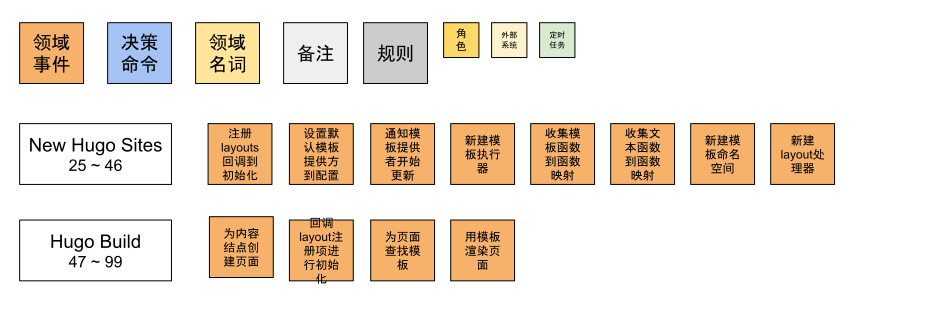

# Hugo Architecture

We can learn how to use Hugo to create our own sites and theme.
Here are examples: [Personal Site](https://hugo.notes.sunwei.xyz/s/what/site/) and [Custom Theme](https://hugo.notes.sunwei.xyz/en/docs/what/theme/).
It is easy to learn and use.

At the same time, Hugo is an open source project based on the Apache 2.0 protocol, which means that you can boldly use your creativity.

For example, for sites in the source code field, such as [Understanding Hugo in Depth](https://c.sunwei.xyz/), the source code and notes are separated and can be executed on [GolangPlay](https://go.dev/play/).
Make the learning experience of source code more three-dimensional, not only have interpretation, but also participate in it, modify the example to further help understanding.

At present, Hugo cannot support the construction of such a site for two main reasons.
The first reason is [Content Format](https://gohugo.io/content-network/formats/). 
The content format currently supported by Hugo is Markdown, and the above content format is .go source code file.
The second reason is [Functions](https://gohugo.io/functions/). 
Hugo does not have a function that handles code and can be used directly. 
To parse the source code and notes.
Although the string function can be combined for processing, it is cumbersome to use, difficult to expand, and even more impressive to maintain.

But we have the source codes. 
Can we ask for more?
After all, we are software engineers in pursuit!

Whether it is from a practical perspective or from the perspective of learning excellent sources to communicate and learn, we have every reason to explore this treasure.

The goal of this chapter is to open the Treasure Map to understand the infrastructure of the Hugo, which is mainly carried out in the following two directions:

* Provides an overview of the architectural thinking and a comprehensive understanding of the infrastructure
* Start with module code and discuss the relationship between configuration and language, Hugo modules, organization of file systems, collection of site content, lifecycle of templates, and publishing processes.

* By reading this chapter, we will have a comprehensive understanding of the Hugo site construction tool and a clear understanding of the relationship between the stages, laying a foundation for the next detailed source implementation chapters.

Let's go, great engineer!

## Architecture Design of Hugo

Combining the Hugo site construction domain [event](https://hugo.notes.sunwei.xyz//en/docs/how/event-storming/), 
and [Hugo playground](https://github.com/sun.com/hugo-playground) source code, the architecture design of Hugo will become very clear:


Hugo's architecture idea is easy to understand. 
It is mainly divided into three major blocks: configuration module, site module and dependency module.

**Configuration Module**

The first thing Hugo parses is the configuration file `config.toml` of the user project.
Initiated by `configLoader`, the configuration file is read from the hard disk and stored as a key-value pair object after parsing.

`configLoader` mainly needs to complete three things:
1. Load the user project configuration file to understand the user's custom requirements.
2. Complete the default configuration `Defaults Config`, to ensure the normal operation of other modules.
3. Generate module configuration information, starting from the user project, using the user project as the first module - `project module`, and in our example there is a second module, that is the theme module `mytheme`.

There are dependencies between modules and there is only one Owner `Owner`.
The project module `project module` is special, because it is the initial module, so it does not belong to any other modules.

```go
type Module interface {
	...
	// Owner In the dependency tree, this is the first 
	// module that defines this module as a dependency.
	Owner() Module
	...
}
```

After all the information is collected, the `config.Provider` service will be provided externally: it can be queried and configuration items can be updated.

**HugoSites Module**

This is the core module of building a site, which is equivalent to the aggregate root in DDD. 
It organizes all the information needed to build a site internally and provides site building services externally.

The initialization of `HugoSites` depends on `DepsCfg` and `Site`, yes, there are two sites.
The relationship between HugoSites and Site is one-to-many, and the relationship between Site and Language is one-to-one, 
so a multilingual site will create a site for each language, which together form HugoSites.

Language items are created by DepsCfg, but will be stored in `config.Provider`, so they are marked in light yellow.
The initialization of DepsCfg depends on `Fs` and `config.Provider`.
`Fs` records the source file address and release address.
The source files come from the user project, which is the actual hard disk file system.
The publishing address is obtained from config.Provider, and the default is the public folder. 
It will check whether it already exists here, and create it actively if not.
Finally, synchronize the newly created information such as `workingDir` back to config.Provider.

As can be seen, their dependencies are `HugoSites <- Site <- Language <- DepsCfg <- Fs`.

**Deps Module**

Hugo refers to all the services and objects needed to build a site as dependencies, and puts them all in `Deps`.

In the process of building dependencies, `TemplateProvider` that provides templates will be generated;
Clear input and output media type `MediaType`; and output format `OutputFormats`; 
will be updated to `config.Provider`.

It will also be prepared for collecting site content, and there will be a `Page Collection` to help collect.
The publishing service that needs to be used when finally publishing the site is `Publisher`.
These will be updated to `Site`.

At the same time, it is also necessary to manage resources in a unified manner with clear specifications, 
which can ensure the convenience of use and conform to the principle of single responsibility in the principle of oriented design.
Contains `Path Spec` that provides a unified standard file structure service;
and a `Resources Spec` with all media type and output format information;
and a `Content Spec` that provides services for `Content` information;
Plus `Source Spec` to help define resource policies, such as filtering functions.

With the help of Deps, all the information needed to build the site, such as raw materials, rules, 
and output formats, etc., are prepared.

All is ready except for the opportunity!

## Hugo's component design

The architecture diagram can help us understand Hugo's architecture design from a global perspective.
Now let's go a step closer and look at the details of Hugo's architecture from a module perspective

### The relationship between configuration and language

Hugo provides powerful configuration features, such as configuration files, configuration directories, 
configuration themes, and more.
In the process of building a site, as long as it is a customized requirement that you can think of, 
it can basically be realized through configuration.

In order to meet different customization needs, 
Hugo's idea is to deal with the relationship between many configuration files first, 
so some configuration items need to be merged, which requires case insensitivity.
Customization is only a small part, and other general information is explained with the default configuration.

Supporting multiple languages is a common requirement, 
and the strategy followed by much software is to give priority to internationalization.
So how does Hugo understand the relationship between language and configuration?

In the [personal site](https://hugo.notes.sunwei.xyz/en/docs/what/site/) example, 
we configure language-related configurations in `config.toml` as follows:

```toml
defaultContentLanguage = 'zh'
[languages]
[languages.zh]
  languageName = '中文'
  contentDir = 'content'
  weight = 1

[languages.en]
  languageName = 'English'
  contentDir = 'content.en'
  weight = 2
```

The default language can be configured, and the supported languages are Chinese and English.

From this point of view, the configuration should include the language.
In other words, the language should be a field in the configuration structure.
And is this the case?
Let's start from the source code of [Hugo Playground](https://github.com/sunwei/hugo-playground) to find out.

Before that, let's look for clues from the architecture diagram:


It can be seen that the place where Language is finally created is in DepsCfg, not Config.
This is counter to our intuition, let's take a look at the key config.Provider, DepsCfg and Language related code snippets.

**config.Provider**

```go
// Provider provides the configuration settings for Hugo.
type Provider interface {
	...
	Get(key string) any
	Set(key string, value any)
	...
}
```

It can be seen that the Provider interface provides `Get` and `Set` methods, just like a key/value warehouse.
The language-related configuration is also stored in the Provider.

**DepsCfg**

```go
// DepsCfg contains configuration options that can be used to configure Hugo
// on a global level, i.e. logging etc.
// Nil values will be given default values.
type DepsCfg struct {
	// The language to use.
	Language *langs.Language
	
	// The configuration to use.
	Cfg config.Provider

	...
}
```

DepsCfg contains config.Provider and Language.

When creating a site, the direct input is DepsCfg:

```go
// newSite creates a new site with the given configuration.
func newSite(cfg deps.DepsCfg) (*Site, error) {
	...
}
```

Before calling to create a site, DepsCfg has already prepared Language:

```go
func createSitesFromConfig(cfg deps.DepsCfg) ([]*Site, error) {
	...
	languages := getLanguages(cfg.Cfg)
	for _, lang := range languages {
		... 
		cfg.Language = lang
		s, err = newSite(cfg)

		...
	}
	return sites, nil
}
```

From the Language structure, it can be seen that:

```go
// Language manages specific-language configuration.
type Language struct {
	Lang   string
	Weight int // for sort

	// Global config.
	// For internal use.
	Cfg config.Provider
	
	...
}
```

Language contains Cfg config.Provider.
That is to say, the relationship between Language and Config is actually an inclusive relationship, not as we felt above.
Think about it carefully, it makes sense.
Config focuses on providing configuration key/value warehouse management services, 
while Language and Site are in one-to-one correspondence, and additional configuration information is required.

### Hugo modules

When it comes to modularization, you may think of Nginx modules, IDEA plug-ins and so on.
Usually, I can meet my differentiated needs by uploading some modules.
The reason why everyone likes this kind of module is mainly because it is flexible enough to meet their own needs without too much effort.
Because many times, although they are roughly the same, there are always some differences in details.
This also shows the complexity of software, in addition to technical complexity, there is also business complexity.
In most cases, what we are facing is mainly business complexity.
This is also the best explanation of the saying "interlacing lines are like mountains" in the field of software.
Nowadays, not only the Internet industry, the financial industry, 
but also the traditional manufacturing industry have used information systems to help enterprises in production and management.
The same leave application system, even in the same industry and different companies, will be different.

However, Hugo's modules are a bit different from the modules in everyone's impression. 
They do not use functions as units to meet differentiated needs.
Instead, the directory structure is used to identify the same structure.

Let's take a look at the location of the module in our architecture:


In the architecture diagram, `Modules` needs to be organized in a unified manner, 
relying on the description information of `Modules Config`, 
and the loading of this information is the responsibility of configLoader.

Let's take a look at the actual call timing from the source code of [Hugo Playground](https://github.com/sunwei/hugo-playground):


It can be seen that in our playground, the main function calls the `LoadConfig` method, 
and does two things for `Modules` in this method.
One is `loadModulesConfig`, which organizes configuration information related to Modules into Module Config.
The other is `collectModules`, which standardizes the module information according to the module standard according to the collected configuration information.

Let's take a look at the source code definition of `Module Config`:

```go
// Config holds a module config.
type Config struct {
	Mounts  []Mount
	Imports []Import

	// Meta info about this module (license information etc.).
	Params map[string]any
}
```

It can be seen that there are two important fields, one is Mounts and the other is Imports.
`loadModulesConfig` mainly deals with the Imports field, in our example:

```
-- config.toml --
theme = "mytheme"
...
```

The configuration information of the theme is `theme = "mytheme"`, 
and when parsed into module configuration information, it becomes `c.Imports = [mytheme]`.

The next step is to collect the module `collectModules`:

```go
func (l configLoader) collectModules(modConfig modules.Config, ...) (modules.Modules, ...) {
	...
}
```

Pass in the module configuration information just collected, and output standard module information.
However, the configuration information we just collected has only Imports and only one value "mytheme". 
The output example is shown in the following figure:

```go
fmt.Printf("%#v\n", modulesConfig)

modules.Config{
	Mounts:[]modules.Mount(nil), 
	Imports:[]modules.Import{
		modules.Import{
			Path:"mytheme", 
			...
	}}, 
	Params:map[string]interface {}(nil)
}
```

**Why does Hugo call Theme a module? **

Enter the following command to create a site:
```shell
➜  tmp hugo new site xyz
```
查看目录结构：
```shell
➜  xyz tree
.
├── archetypes
│   └── default.md
├── config.toml
├── content
├── data
├── layouts
├── public
├── static
└── themes

7 directories, 2 files
```

Then enter the following command to create a theme:

```shell
➜  tmp hugo new theme mytheme
```

Also look at the directory structure:

```shell
➜  mytheme tree
.
├── LICENSE
├── archetypes
│   └── default.md
├── layouts
│   ├── 404.html
│   ├── _default
│   │   ├── baseof.html
│   │   ├── list.html
│   │   └── single.html
│   ├── index.html
│   └── partials
│       ├── footer.html
│       ├── head.html
│       └── header.html
├── static
│   ├── css
│   └── js
└── theme.toml

7 directories, 11 files
```

Let's compare the directory structures of Site and Theme together:


By comparison, it is not difficult to find that the directory structure is basically the same, 
including `archetypes`, `layouts`, `static` and so on.

On the Hugo official website, there is a clear description of [directory structure](https://gohugo.io/getting-started/directory-structure/).
You can also see from the source code:

```go
// hugo-playground/hugofs/files/classifier.go

const (
	ComponentFolderArchetypes = "archetypes"
	ComponentFolderStatic     = "static"
	ComponentFolderLayouts    = "layouts"
	ComponentFolderContent    = "content"
	ComponentFolderData       = "data"
	ComponentFolderAssets     = "assets"
	ComponentFolderI18n       = "i18n"
)

var (
	ComponentFolders = []string{
		ComponentFolderArchetypes,
		ComponentFolderStatic,
		ComponentFolderLayouts,
		ComponentFolderContent,
		ComponentFolderData,
		ComponentFolderAssets,
		ComponentFolderI18n,
	}
)

```

It can be seen that Hugo makes each module follow this unified principle by standardizing the directory structure, 
so that there are rules to follow no matter when parsing themes or user projects.


Take a look at Hugo's description of [module](https://gohugo.io/hugo-modules/configuration/):

> Hugo Modules are the core building blocks in Hugo. 
> A module can be your main project or a smaller module providing 
> one or more of the 7 component types defined in Hugo: 
> static, content, layouts, data, assets, i18n, and archetypes.

That is to say `static, content, layouts, data, assets, i18n, and archetypes`
Any combination of these 7 components is considered to meet the requirements of the module.

Hugo's modules are built on top of Go Modules and are easy to use:

```toml
[module]
[[module.imports]]
  path = 'github.com/sunwei/zero'
```

That is to say, we can now load the theme in the form of loading modules, 
instead of importing the theme as a git submodule, which is more convenient and reasonable.

After figuring out why the theme is also a module, 
let's take a look at the final configuration information of the module we got:

```go
// hugo-playground/hugolib/config.go 
// line 140
...
log.Process("collectModules", "set active modules to config with key 'allModules'")
for i, m := range moduleConfig.ActiveModules {
    fmt.Println(i)
    fmt.Printf("%#v\n", m)
}
...

Output:

==> Process collectModules: set active modules to config with key 'allModules'
0
&modules.moduleAdapter{path:"project", ... projectMod:true, owner:modules.Module(nil), 
	mounts:[]modules.Mount{
	    modules.Mount{Source:"mycontent", Target:"content", Lang:"en"}, 
	    modules.Mount{Source:"data", Target:"data", Lang:""}, 
		modules.Mount{Source:"layouts", Target:"layouts", Lang:""}, 
		modules.Mount{Source:"i18n", Target:"i18n", Lang:""}, 
		modules.Mount{Source:"archetypes", Target:"archetypes", Lang:""}, 
		modules.Mount{Source:"assets", Target:"assets", Lang:""}, 
		modules.Mount{Source:"static", Target:"static", Lang:""}}, ...}
1
&modules.moduleAdapter{path:"mytheme", ... projectMod:false, owner:(*modules.moduleAdapter)(0xc00019e410), 
	mounts:[]modules.Mount(nil), ...}

```

From the output results, there are two modules in total, one is `project` and the other is `mytheme`.
Because in our example, `mytheme` has only one txt file, none of the seven components, 
so the mounts are empty, and the project module has Mounts for each component.

Hugo implements Hugo Module through a clever standardized directory structure design.
Strong scalability and convenience allow users to focus on content creation, and personalization is also greatly satisfied.

### Organization of the file system

Currently, the main operations of Hugo are performed on local files.
For example, read configuration information, template information, blog content, write site information, and so on.
Because these operations are inseparable from the file system, 
Hugo has done a lot of work on the organization of file information to ensure a good user experience for the caller.

#### Afero

The first is to select the basic file system [afero.Fs](https://github.com/spf13/afero):

> Afero is a filesystem framework providing a simple, 
> uniform and universal API interacting with any filesystem, 
> as an abstraction layer providing interfaces, types and methods. 
> Afero has an exceptionally clean interface and simple design without needless 
> constructors or initialization methods.

The services provided by Afero are basically consistent with Golang's native Fs interface, 
and secondly, it is compatible with multiple operating systems, so that it is compatible with both languages and systems, 
and the user experience is also consistent with the original.
does provide a good file system foundation for Hugo.

In order to visually view the association of various Fs in Hugo, 
we mark afero.Fs as the following structure, including basic operation examples of the file system:


#### Fs in Hugo architecture

Let's review the scenario of Fs application in the Hugo architecture:


The first thing to appear is Fs, which is used to record the file system closest to the real directory. 
As a parameter of DpesCfg, when HugoSites creates Deps, it is transparently passed to Deps.
Deps is the module that really organizes and builds the entire file system, 
and finally uses PathSpec to organize the previous original file system into the file system required by Hugo.
Finally, it is used for Template and Page related operations.

#### HugoFs

Let's first look at the basic Fs, which is HugoFs:


It can be seen that the basic hugoFs includes the input Source, 
the output target address PublishDir, and the WorkingDir for read-only.
And the first item is of type afero.Fs, so the color is the same as that of afero.Fs.
Colors will also be used later to associate different types of file systems.

#### PathSpec

From the above Hugo architecture diagram, we know that HugoFs is finally passed into Dpes, 
and PathSpec is used to organize and manage all path-related information in a unified way:


It can be seen from the above figure that PathSpec contains hugoFs and Paths, and there is another important BaseFs.

Let’s look at Paths first, which includes the basic file system, 
theme and working directory information, and Modules-related information.
Based on Fs and Path, PathSpec needs to digest these basic information and provide complete file system services.

#### BaseFs

Through the prepared basic information hugoFs and Paths, BaseFs not only provides some basic services, 
such as source file system and release target file system, and related information such as working directory.
It is also necessary to organize the files according to the basic directories required by Hugo, 
such as Content, Data, i18n, Layouts, Archetypes, Assets.
And it is required to strictly follow the module loading order to provide the final file service. 
For example, when the user adds some templates in the project directory and needs to overwrite the templates that come with the theme.


As shown in the figure above, BaseFs uses SourceFilesystems to organize the basic directory, 
and uses theBigFs to provide the final merged file system service.

#### SourceFilesystems


In order to map out the basic file structure of Hugo, 
Hugo designed the corresponding structure SourceFilesystems to represent, and use fields to correspond one by one.
Each item has a common feature, namely SourceFilesystem.

大家可以回忆下，在上一节[Hugo的模块](#hugo的模块)中有提到，每一个模块是如何在Mount中存储这些信息的。
You can recall that in the previous section [Hugo's module](https://hugo.notes.sunwei.xyz/en/docs/how/arch/#hugo-modules), 
it was mentioned how each module stores this information in Mount.

#### theBigFs


Multiple modules will generate multiple file systems with the same structure, 
who is in the front and who is in the back is determined by the module configuration information.
So how do you end up merging these filesystems?
As can be seen from the figure above, the answer given by Hugo is Overlay. 
For the working principle, please refer to [Wikipedia OverlayFS](https://zh.wikipedia.org/wiki/OverlayFS).

The organization of the Overlay is carried out by the filesystemCollector, 
and the file metadata FileMetaInfo is used to describe it, which is convenient for related file operations, 
such as query and sorting.
Before generating the Overlay view of the final state, 
RootMappingFs is needed to help organize the file system classified by Content, Static, etc.
Finally, the Collector will put the corresponding files into the corresponding collection.

With the above organized file systems, think about the possible use scenarios?

#### File system scenario 1 - ContentSpec

```go
// hugo-playground/deps/deps.go
// line 145
log.Process("New content Spec", "content converter provider inside")
contentSpec, err := helpers.NewContentSpec(cfg.Language, ps.BaseFs.Content.Fs)
```

After the PathSpec is prepared, the creation of ContentSpec immediately uses Content.Fs, 
which is SourceFilesystem.Fs, which depends on theBigFs.overlayMountsContent.

#### File system scenario 2 - loadTemplates

```go
// hugo-playground/tpl/tplimpl/template.go
// line 340
if err := helpers.SymbolicWalk(t.Layouts.Fs, "", walker); err != nil {
    if !os.IsNotExist(err) {
        return err
    }
    return nil
}
```

`Layouts.Fs` is used when loading user-defined templates.
Process the template files in the file system through walker, relying on `b.theBigFs.overlayDirs[files.ComponentFolderLayouts]`

Combining the design and application of the above file system, 
we can feel that the design requirements of the Hugo file system come from its own characteristics.
Because the concept of modules and the design of the module infrastructure are used.
The basic hugoFs cannot meet all the needs of Hugo in the process of operating the file system, 
so further encapsulation is required.

Hugo's approach is to use PathSpec to organize all information, hide complexity, 
and abstract BaseFs to provide comprehensive services that are closer to usage scenarios.
Use SourceFilesystems to organize intuitive services that conform to the characteristics of Hugo's infrastructure, 
and use the underlying technology of OverlayFs to realize the requirements for merging multiple file systems, 
and finally support the real actual usage scenarios.
Including the Content file system that provides article content services, 
and the Layouts file system when loading custom templates, etc.

### Site content collection solutions

[文件系统的组织](#文件系统的组织)已经帮我们将用户站点项目按Hugo基础组件的结构进行了组织。
我们从`BaseFs.Content.Fs`可以直接获取站点内容的文件系统索引，可以直接读取文件信息，生成站点面面了。

但Hugo不这么认为，我们可以用下面两个场景来了解一下Hugo的鸿鹄之志。

**场景一：Headless Bundle**

有一种页面，我们不希望她单独作为一个页面来发布。
但可以在需要她的时候，以变量的形式获取到她。
这就是Hugo对这种需求提供的解决方案：[Headless Bundle](https://gohugo.io/content-management/page-bundles/#headless-bundle)。

如果直接遍历文件系统，我们在处理该文件的时候，需要知道她的类型，如果是Headless类型的，就不按常规类型处理。
那文件类型就需要在解析文件的时候，从文件信息中获取到。
页面类型的信息可以放在文件配置中，也可以通过特殊的命名规则来表明，此类方案还有许多。

如果其它的页面依赖于Headless页面，就要考虑页面解析顺序所带来的问题。
如果Headless在前面被解析，就要存储好相关索引信息，以方便后续依赖于她的文件进行查询。
如果在其它页面之后解析，可能的方案是将之前处理的页面标记为未完成状态，并指明所依赖的Headless页面，并挂起等待条件成熟时被唤醒。
等相应的Headless页面解析完成后，时机成熟时，恢复之前页面的解析流程。
这种方案在依赖的Headless页面较多的情况下，会出现不断挂起的状况。
加上这些配置都依赖于手工维护，解析效率和正确性都很难保障。


**场景二：Page Resources**

Hugo Page可以包含不同的资源，常见的有图片类型的，还有音频、视频、数据、压缩包等等多种类型的资源。

下载页面会提供资源的下载链接，比如软件的安装包，针对不同的操作系统，会提供不同的版本。
Hugo可以很聪明的识别，哪个文件是页面文件，哪些页面是资源文件，并将资源文件信息放在页面的`Resources`属性里。
这样就方便用户根据页面，来灵活组织这些资源，可以生成一个某一类型软件的下载汇总信息，还可以生成某一章节的下载软件信息。

如果直接遍历文件系统，每个文件都是相对独立的，需要通过配置信息或者其它的方式标明同一层级的从属关系，还要标明不同层级之间的引用关系。
这些都需要在全局构建信息中存储。
因为互相独立，遍历过程中又会有先后顺序，关系越复杂，重复信息出现的概率就会越高。
当有新的需求出现时，复杂的逻辑处理也不利于软件的拓展。

从以上两个场景中，可以观察到。
简单的遍历文件系统，确实可以获取基本的文件信息。
但如果需要灵活地组织各种不同的信息，如依赖关系，资源汇总等等跨页面处理场景，我们还需要进一步对站点内容进行发掘，以页面为单位进行组织和管理。

#### 磨刀不误砍柴工

从[Hugo事件风暴](./事件风暴.md)中可以清楚的看到Hugo正式收集站点内容是在`Hugo Build`阶段，之前都是在做准备：


#### 分工明确，高效协作

电商现在的状态已然不是正在融入我们的生活，而是成为了我们生活的一部分。
并且过了拼产品类目的时期，基本上你家有的，我这也有。
现在拼的更多的是特色，和服务。
既然是特色，那每家多多少少都有些不一样。
而服务，基本上都是相同的，其中最重要的要属快递服务。
谁能以最短的时间将包裹送达消费者手中，谁将最容易获得消费者的认可，从而占有更高的市场份额，获得投资者的青睐，进入良性的循环发展。

Hugo也认同最短时间送达这样的服务理念。
拿到待处理的内容后，立马出库装车送到离消费者最近的分拣中心，再由高效的分类机器人对货品进行分类。

**Hugo对内容处理的目标**


在我们的样例中，我们的Content就是`mycontent`目录所代表的文件系统，经过`PathSpec`处理后，文件系统可通过`site.BaseFs.Content.Fs`得到。
最终，Hugo需要对内容文件系统中的所有内容进行分类，并存放在PageMap货架上，这样方便快递小哥快速取货，装车并将包裹送达用户手中。

那Hugo到底是怎么做到的呢？

**陆地集装箱 -- 大卡车**


在实际生活中，包裹会从全球各地通过分拣中心网络，靠大卡车运输到离消费者最近的分拣点。
而Hugo的"大卡车"就是PagesCollector，不像现实世界那么复杂，货物都在`site.BaseFs.Content.Fs`中。

**分拣机器人**


等货物运到分拣中心后，经过不断对分拣效率进行优化，现在已经做到可以完全自动化。
PagesController将所有文件送达后，自动分拣机器人PagesProcessor便开始工作，无缝衔接。
为了提高处理效率，Hugo为每一个站点都提供了一个机器人，由PagesProcessor负责分发任务，sitePagesProcessor专注处理自己所擅长的语言类别。

通过明确的分工，高效的协作，最终将所有文件分门别类，规整的放在中心货架上。


### 模板的生命周期

在[Hugo事件风暴](事件风暴.md)中，我们了解到Hugo的设计理念 - 给用户提供始终如一的轻松写作体现。
而实现这一理念则是以Golang Template为基础，开发出更多实用功能，让内容创造者专于内容创作的同时，还拥有良好的体验。

让我们回顾一下Golang Template的实现步骤：


再看看Hugo是如何围绕其展开的：


Hugo围绕着Golang Template做了很多设计，现在我们通过和模板相关的领域事件，一起来看看模板的生命周期，从而能够有更全面的理解。

#### Hugo模板生命周期领域事件

还是从领域事件入手，来看看有哪些关键事件和模板强相关：


除了上面和Golang Template一一映射的事件外，还有更细节的事件，为了直观好看，我们把这些事件收集到一起来进行分析：



可以看到和模板强相关的事件，主要集中在创建HugoSites和Build阶段。
进一步细分，可发现模板生命周期可分为三个阶段：

1. 开始阶段，包括注册回调，并选定模板服务提供方，并出发模板更新。
    * 注册layouts回调到HugoSites初始化字段
    * 设置默认模板提供方到配置项
    * 通知模板提供者开始更新
2. 准备阶段，包括准备好模板执行器，收集模板相关的功能函数，解析Hugo内置和用户自定义模板，将所有模板存储到模板命名空间，以及用layout处理器连接layout和模板。
    * 新建模板执行器
    * 收集模板函数到函数映射
    * 收集文本函数到函数映射
    * 新建模板命名空间
    * 新建layout处理器
3. 渲染阶段，准备好页面内容后，回调在开始阶段注册的layouts事项，通过layout处理器查找相应的模板，最终用模板进行渲染，生成站点页面
    * 为内容结点创建页面
    * 回调layout注册项进行初始化
    * 为页面查找模板
    * 用模板渲染页面

事件可以帮助我们清晰地了解到Hugo设计的模板生命周期。
下面我们再通过[Hugo游乐场](游乐场.md)源码梳理一遍具体实现流程，好让我们能更立体地了解到模板生命周期，同时也可以为后面的代码实现讲解章节做好准备。

**Template vs Layouts**

我们先来看看Hugo中两个容易混淆的概念，Template和Layouts。

在创建[自定义Hugo主题](../what/自定义主题.md)的时候，我们接触最多的就是Layouts。
官方文档解释Layouts就是用来当模板的，这样解释并没有问题，但这会让我们很容易产生一种Layouts既模板的错觉，并将Layouts和模板直接划上等号。

但真的是这样的吗，让我们从代码层面看看他们的关联：


通过查看新建主题的目录结构，我们会发现自动生成的的文件主要在layouts目录下，里面有首页模板，还有页头和页尾模板，等等。
在代码中，Layouts的出现通过都是以`[]string`字符串数组的形式出现的。
也就是说在**代码中Layouts就是用来记录layout相关的文件路径信息**的。

如果想将Layouts转换成Golang Template，首先需要将其转换成`templateInfo`。
并记录文件名，分析是否是文本类型，将layout文件内容以字符串存储在tempalte字段中。

其中是否是文本类型，涉及到Golang Template的设计知识。
> Golang将Template按类型进行了划分。如HTML和Text，通过对HTML标签进行转换，最终也会被转换成Text。
> 说到底，通过对不同模板类型的转换，都会变成文本类型。

通过templateInfo，最终Hugo会生成真正的Hugo模板结构体`templateState`。
可以看出该结构体实现了`Template`接口。

所以我们可以得出结论：Layouts不等于Template，是制作Template的原材料。

弄清了Template和Layouts之间的关系，我们分别来看看Template生命周期中的开始、准备和渲染阶段。

**开始阶段**


`HugoSites`中的init字段是`hugoSitesInit`类型的，其中就包含了lazy.init类型的layouts。
这样就可以在layouts字段注册一些回调方法，方便在时机成熟的时候回调。

同时，对于HugoSites而言，直接面对的是模板服务的提供商，所以需要在这个阶段将`TemplateProvider`作为提供商，设置在配置信息中。
等信息都准备妥当后，就可以通知模板服务提供商开始工作更新了。

**准备阶段**


对外提供整体服务，并和Deps关联的是`templateExec`。
包含了`texttemplate.executer`和`templateHandler`，以及所有的模板功能函数。
颜色表明各结构之间的关联关系。

可以看出，`texttemplate.executer`包含了`templateExecHelper`，因为在执行的过程中，通过对模板的分析，可能会用上功能函数。

而`templateHander`则需要处理和template相关的一些操作。
`main`字段是`templateNamespace`类型，里面存储了HTML和Text原型信息，并存储了由原型创建的所有`templateState`在`templateStateMap`中。
`layoutHandler`则是连接layout和template的关键，比如通过layout查询template时，就由layoutHandler全权负责。


**渲染阶段**

结合开始阶段和准备阶段一览：


通过前期的准备和组织，我们来看看渲染阶段是怎么发生的：


页面渲染发生在`site_render.go`中，从`pageRender`正式开始。

总共分为两大步，一是`page.resolveTemplate`解析模板，拿到模板后再开始`site.renderAndWritePage`渲染和写入页面。

1. 解析模板
因为Site组合了Deps，所以也和Deps一样，同样持有`templateExec`信息，通过调用`templateExec`的`LookupLayout`方法，查询模板信息。
因为这些模板信息都已经存储在了`templateNamespace`里的`templateStateMap`中。

2. 渲染页面
在`pageRender`中已经拥有了页面信息`pageState`，通过上一步又获取了模板信息，所以是时候开始真正地`site.renderForTemplate`渲染了。
还是通过`templateExec`调用`Execute`方法。 
因为当前的执行器是`texttemplate.executer`类型，所以真正地执行是在`texttemplate.executer`的`ExecuteWithContext`方法中。
这里是直接用的Golang Template源码，而不是调用Golang的默认包。
因为Golang默认包中自带的功能函数，并不能完全满足Hugo的诉求。
在后续代码实现章节将会详细讲述，这里还是专注在基础架构的初步理解上。

#### 小结


从Golang Template应用示例开始，我们了解到了Golang中模板工作的基本流程。
这有助于我们进一步理解Hugo的设计和实现。

通过对Hugo领域事件中模板强相关的核心事件进行分析，我们将Hugo模板的生命周期大致分为三个阶段：开始、准备、渲染。

为了立体的理解模板生命周期，我们不仅从领域事件进行梳理，还从代码结构进行分析。
看到了Hugo是基于HTML和Text模板原型，帮助将所有的Layouts转换成Template，并存储在了Template命名空间中。
还看到为了拓展Golang Template的功能，Hugo将强大的自定义函数保存在了执行器中。
这让模板在渲染过程中，有了更多的帮手。
而这一切，都封装在了对外统一提供的服务`templateExec`中，不仅对内进行封装，还对外提供了便捷。

还有更多有意思的事情，比如Hugo为什么不能直接用Golang内置的Template包，而要独立维护？
我们也会在后续代码实现章节，进一步展开讲解。
和大家一起，一探究竟。

### 发布的流程

通过[模板的生命周期](#模板的生命周期)我们可以看到在最后的渲染阶段，先找到页面的Template，然后对页面进行渲染。
这样我们就有了根据模板生成的待发布内容。

站点发布主要的任务就是将作者所创作的内容，通过模板转换生成待发布的内容，按照站点的输出格式，写入到我们指定的文件目录。

那这里就会有两个问题：
1. 作者所创作的内容是怎么存储在页面中的，又要怎么使用呢？
2. 发布过程中的信息，如输出格式、文件名、写入地址又是谁提供的呢？

我们还是从Golang Template基本原理出发:


在index.html模板中，我们计划用`{{.Content}}`属性来获取内容。
如果要成功获取，就需要在我们的内容提供商`Post`实例中，在Content字段设置上正确的值。
如果都按约定准备好后，在最终Golang Template执行结果中，我们就能发现右上角的内容。

在我们的[游乐场示例](游乐场.md)中，我们也有一个用到了`.Content`的layout - `layouts/_default/single.html`：
```
-- mycontent/blog/post.md --
---
title: "Post Title"
---
### first blog
Hello Blog

-- layouts/_default/single.html --
{{ .Content }}
===
Static Content
===

```
single.html会用做独立页面的模板，如上面的`mycontent/blog/post.md`。
通过模板渲染过后，`post.md`中的内容就会替换掉`single.html`中的`{{ .Content }}`。

那Hugo的页面对象PageState又是怎么提供内容服务的呢，也和上面一样，放在属性里吗？
我们在[Hugo Playground](https://github.com/sunwei/hugo-playground)源码中，很快找到了答案：

```go
// Page is the core interface in Hugo.
type Page interface {
	ContentProvider
	...
}

// ContentProvider provides the content related values for a Page.
type ContentProvider interface {
    Content() (any, error)
	...
}
```

没错，就是ContentProvider。
可以看出Golang Template不仅支持属性，同时还支持方法。
共同的特点就是要对外可见 - 都是大写字母开头。

那上面的两个问题就变得更具体了：
1. PageState中的ContentProvider是谁？
2. 发布流程中所需的详细信息是怎么来的？

**发布相关的领域事件**

同样，我们还是可以通过[领域事件风暴](事件风暴.md)中，发布相关的领域事件入手：


可以看到，关键时机有两个。
一个是在站点Site创建的时期，另一个则是在构建时期。

让我们专注在和发布相关的事件上：


这些事件的解读在[领域事件风暴](事件风暴.md)中有具体描述，这里就不再赘叙。

结合[源码](https://github.com/sunwei/hugo-playground)，我们进一步将上述事件转换成代码流程图：


不出所料，为PageState提供内容和其它信息服务的对象确实存在，那就是`pageOutputs`。
但心中不禁升起一丝疑问，为什么是个复数？

```go
// We create a pageOutput for every output format combination, even if this
// particular page isn't configured to be rendered to that format.
type pageOutput struct {
	...

	// These interface provides the functionality that is specific for this
	// output format.
	pagePerOutputProviders
	page.ContentProvider
	
	...
}

// these will be shifted out when rendering a given output format.
type pagePerOutputProviders interface {
    targetPather
	
	...
}
```
通过查阅上述源码定义，我们更加确定了我们分析的正确性。
`PageOutput`确实如我们所料，提供了`ContentProvider`服务和`targetPather`服务，这样我们前面的两个问题就有了着落。
再加上注解：
> We create a pageOutput for every output format combination, even if this
> particular page isn't configured to be rendered to that format.

我们发现pageOutput是和output format一一对应的，也就是说有多少种输出格式，就有多少个pageOutput，这也解释了上面关于复数的疑问。

那究竟是个什么样的对应关系，为什么要这样设计呢？
让我们还是结合上面的流程图来进行分析。

**站点创建时做的准备工作**


我们先看在创建Site的时候，都准备了哪些和发布相关的信息。
上图右边是流程图站点的部分，从对象引用关系来看，可以了解到OutputFormats依赖于OutputFormat，但不是聚合关系。
而OutputFormat又依赖于MediaType。

**MediaType**

从上图左侧的结构图可以看出，OutputFormat是拥有MediaType字段的。 
在MediaType包含的主要字段是main和sub。

那这些字段是干什么用的呢？
我们可以通过上图中间的部分来进一步了解。
在Hugo的DefaultTypes中，经过简化，我们保留了HTML, MD, TOML, TEXT四种类型。
拿HTML MediaType举例，实际上长这样`text/html`。
没错main字段就是text，而sub字段才是html。
因为首先HTML媒体类型的文件是以文本形式存储在磁盘上的，然后才是内容是以HTML格式进行组织的。
关于Media Type的详细介绍，可以参考[Wikipedia](https://en.wikipedia.org/wiki/Media_type)。

**OutputFormat**

再来看看OutputFormat：

```go
// Format represents an output representation, usually to a file on disk.
type Format struct {
   // The Name is used as an identifier. Internal output formats (i.e. HTML and RSS)
   // can be overridden by providing a new definition for those types.
   Name string `json:"name"`
   
   MediaType media.Type `json:"-"`
   
   // The base output file name used when not using "ugly URLs", defaults to "index".
   BaseName string `json:"baseName"`
   
   ...
}
```

通过注解可以看到，实际的作用就是记载了要将一个文件输出到磁盘上的相关说明信息。
比如BaseName的默认值就是index，首页就会用到，默认文件名是index.html。

Hugo提供的`DefaultFormats`根据我们的示例简化后，保留了HTML, JSON, MD三种。
其中HTML是指我们将以HTML的输出格式将文件写入到磁盘。

实例如下：
```go
HTMLFormat = Format{
     Name:          "HTML",
     MediaType:     media.HTMLType,
     BaseName:      "index",
     Rel:           "canonical",
     IsHTML:        true,
     Permalinkable: true,

     // Weight will be used as first sort criteria. HTML will, by default,
     // be rendered first, but set it to 10 so it's easy to put one above it.
     Weight: 10,
 }
```

**OutputFormats**

如果OutputFormats和OutputFormat不是聚合关系，那又是什么关系呢？

我们直接来看看OutputFormats的结构，就清楚答案了。


这里的OutputFormats实际上就是按照Hugo页面的五种类型，分别提供的OutputFormat映射关系。
如果是home类型的页面，那这种类型的页面只提供按HTML格式渲染的结果，而不是其它的格式，如JSON。
也就是说**在一个站点下，会为每个类型的页面都定义清楚合法的输出格式**。
这将会有效保障页面在渲染的过程中，输出格式的有效性。

**renderFormats**

有了全面的站点页面输出规范后，为什么还要这个renderFormats呢？


从上图右下角可以看到，实际上renderFormats来自于outputFormats。
是将所有页面的outputFormats合并，去重后产生的。
可以理解为renderFormats代表着这个站点所有输出的类型。
在我们的实例中，因为所有页面只支持HTML一种类型，所以合并去重后，自然我们这个站点的renderFormats只有一个，就是HTML了。

从值的角度我们已经知道了两者之间的关联了，那为何Hugo要设置一个renderFormats呢？
从名字上看是以站点Site为单位，可以理解为站点在渲染时所有的渲染格式。

那为什么HugoSites也有一个一模一样的renderFormats呢？
从上图左上方可以看出，Site的renderFormats组成了HugoSites的renderFormats。
这个好理解，因为HugoSites是由多个不同语言的Site所组成的，那就是说HugoSites的renderFormats代表了全站点的渲染格式。

继续通过上图往右看，可以发现更多的线索。
原来pageOutputs和HugoSites的renderFormats是一一对应关系，也就是说全站点有多少种渲染格式，就有多少个pageOutputs。

这里不禁又冒出另一个大大的问号 - 每个站点都拥有自己的页面，也都有自己的输出格式，**为什么要为单个站点页面提供全站点输出格式的pageOutputs呢？**

同样，我们还是可以从源码中找到答案：
```go
// hugo-playground/hugolib/page__new.go
// line 97

// Prepare output formats for all sites.
// We do this even if this page does not get rendered on
// its own. It may be referenced via .Site.GetPage and
// it will then need an output format.
ps.pageOutputs = make([]*pageOutput, len(ps.s.h.renderFormats))
```

从上面的代码中可以看到，这样设计的原因是页面可能会被其它的页面引用，甚至被不同语言的页面所调用。

对应的`.Site.GetPage`功能函数在多语言使用场景下的[具体说明](https://gohugo.io/functions/getpage/#getpage-and-multilingual-sites)如下：
> The previous examples have used the full content filename to lookup the post. 
> Depending on how you have organized your content (whether you have the language 
> code in the file name or not, e.g. my-post.en.md), you may want to do the lookup 
> without extension. This will get you the current language’s version of the page:

```go
{{ with .Site.GetPage "/blog/my-post" }}{{ .Title }}{{ end }}
```

既然存在跨站点调用的情况，那就得为调用方准备好调用方所需要的输出格式。
这样回过头来看，为每个页面pageState准备全站点渲染格式的pageOutputs是必需的。

**pageOutputs**

在发布流程中，除了内容，还有一些基础信息也很重用，如发布到哪，以什么名字写入等等。
pageOutput做为输出信息的总载体，这些信息自然了也包在其中，通过上图右上方可以看到负责提供这些信息的对象是PagePaths。
其中提供目标文件名的则是其中的targetPaths。

**PagePaths**

细心的小伙伴会发现Site的OutputFormats和PagePaths之间有一条虚线连接。
之所以是虚线，是因为PagePaths实际上是从pageMeta中获取的信息，但根源，实际上还是来源于Site的OutputFormats。

结合中下方有进一步实样例解释。
可以看到PagePaths会根据当前页面pageState的类型`pageKind`来获取当前类型的OutputFormats。
会根据每一种OutputFormat生成相应的targetPathsHolder。

根据每一个PageOutput的OutputFormat类型，选中相应的targetPathsHolder，设置在`pagePerOutputProviders`之中。
这样在渲染页面时：
```go
func pageRenderer(
	ctx *siteRenderContext,
	s *Site,
	pages <-chan *pageState,
	results chan<- error,
	wg *sync.WaitGroup) {
	defer wg.Done()

	for p := range pages {
		templ, found, err := p.resolveTemplate()
		...
		targetPath := p.targetPaths().TargetFilename

		if err := s.renderAndWritePage("page "+p.Title(), targetPath, p, templ); err != nil {
			fmt.Println(" render err")
			fmt.Printf("%#v", err)
			results <- err
		}

		...
	}
}
```
就可以通过`p.targetPaths().TargetFilename`获取到目标文件名了。

#### 独立页面的发布流程

Hugo将页面分成了两大类，一类就是上面介绍的常规页面，另一类就是接下来要看的独立Standalone页面，如404页面。

```go
func (s *Site) render404() error {
	p, err := newPageStandalone(&pageMeta{
		s:    s,
		kind: kind404,
		urlPaths: pagemeta.URLPath{
			URL: "404.html",
		},
	},
		output.HTMLFormat,
	)
	if err != nil {
		return err
	}

	if !p.render {
		return nil
	}

	var d output.LayoutDescriptor
	d.Kind = kind404

	templ, found, err := s.Tmpl().LookupLayout(d, output.HTMLFormat)
	if err != nil {
		return err
	}
	if !found {
		return nil
	}

	targetPath := p.targetPaths().TargetFilename

	if targetPath == "" {
		return errors.New("failed to create targetPath for 404 page")
	}

	return s.renderAndWritePage("404 page", targetPath, p, templ)
}
```

代码流程很清晰，先通过`newPageStandalone`创建页面，紧接着查找模板，获取目标文件名，最后渲染并写入页面。
整体流程基本一致。

既然PageOutput是发布流程上的关系所在，那我们还是用PageOutput的视角来看看独立页面会有哪些不同，同时也可以检测一下我们之前的理解是否正确。

```go
// hugo-playground/hugolib/page__new.go
// line 92
func newPageFromMeta(
n *contentNode,
parentBucket *pagesMapBucket,
meta map[string]any,
metaProvider *pageMeta) (*pageState, error) {
	...
    if ps.m.standalone {
        ps.pageOutput = makeOut(ps.m.outputFormats()[0], shouldRenderPage)
    } else {
        outputFormatsForPage := ps.m.outputFormats()
    }
	...
}
```

通过`newPageFromMeta`源码我们发现，对`standalone`的页面是有特殊处理的，而且用的就是`render404`中传入的`output.HTMLFormat`生成了pageOutput。

这样一来，我们可以确定的说，无论是普通页面，还是独立页面，基本上都是以pageOutput为核心进行展开的，符合同一套发布流程。
让我们再来回顾一下发布流程全景图：


