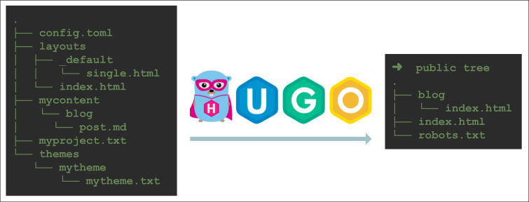
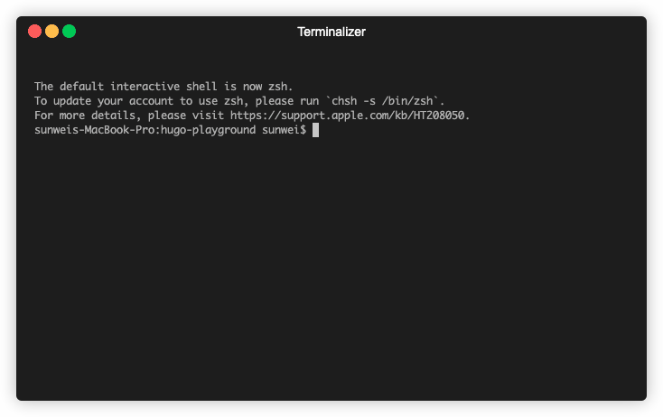
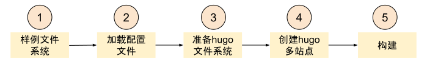
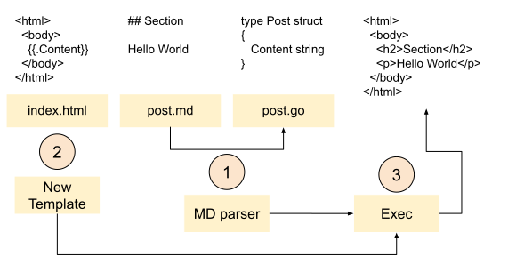
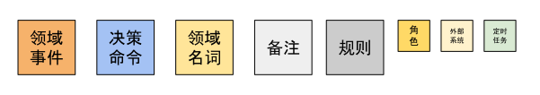
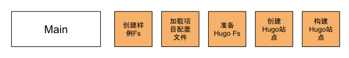
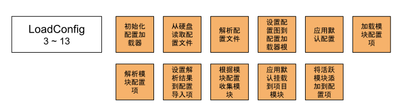
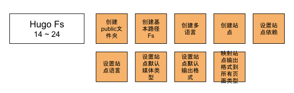
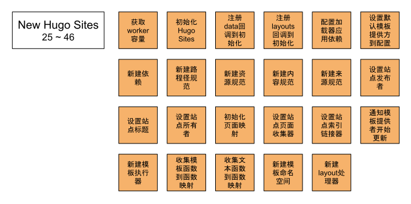
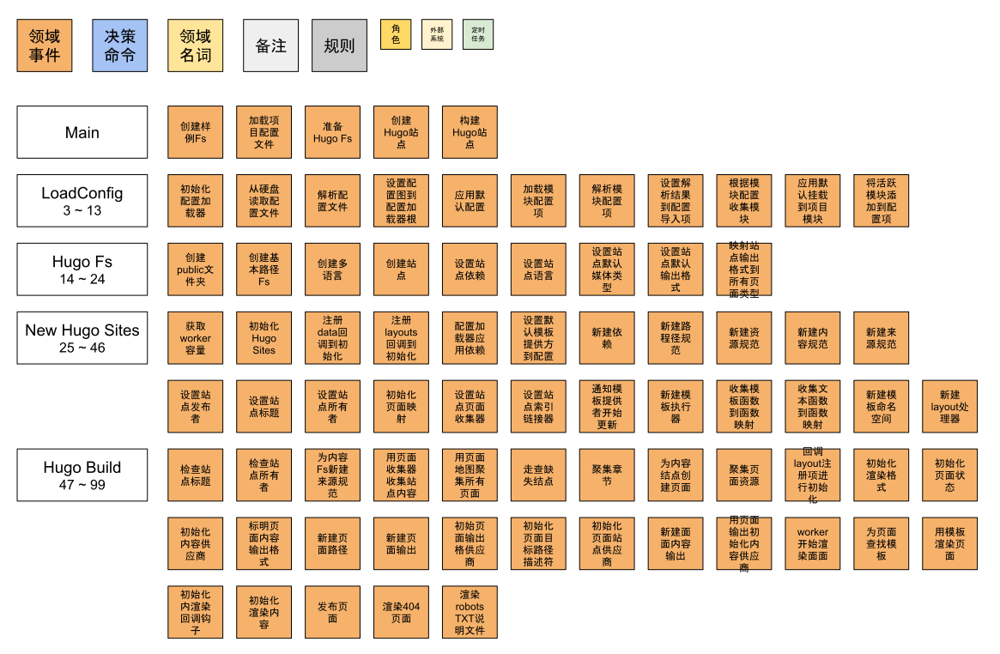

# Hugo 事件风暴

Hugo的功能很全面，拥有强大的自定义函数库，可以用来制作模板、短代码等。
这在站点的构建过程中，可以帮助提供各种数据，如获取目录结构，主动加载文件。
以及页面信息汇总，方便展示分页列表或者搜索。
还可以帮助分类，提供标签服务。

支持多语言，创建国际化站点一样简单。

主题库更是能满足各种不同的个性化需求，更贴近专业使用场景，你还可以零成本切换。

Hugo是如何一步步将博客变成站点的？
下面我们还是通过[游乐场](游乐场.md)实例，来一探究竟。



邀你一起来动手。
用我们最喜欢的IDE，打开我们的[游乐场](https://github.com/sunwei/hugo-playground)项目源码。
通过直接输出日志的方式，来看一看hugo的完整构建流程。

```shell
$ cd /go/to/hugo-playground
$ go run .
```



先来看一看主流程。
通过搜索以字符串"==> Process main:"开头的日志条目，我们可以了清楚的看到主函数的处理流程如下所示：

```
==> Process main: prepare example project file systems
==> Process main: load configurations from config.toml and themes
==> Process main: setup hugo file systems based on machine file system and configurations
==> Process main: create hugo sites based on deps
==> Process main: hugo building...
```

* 准备样例文件系统。100%模拟真实项目，写入硬盘
* 加载项目配置文件 - config.toml，并解析配置信息，如读取配置主题`theme = mytheme`信息
* 准备好hugo file systems。因为hugo项目的默认结构有包含多个目录，hugo会根据不同目录生成多个文件系统。（tips: 可以用`$ hugo new site <name>`
  命令查看默认项目目录结构）
* 创建hugo sites。hugo支持多语言，会为每个语言创建一个site。创建前需要准备好所有的依赖，如上面提到的文件系统就是依赖之一。
* 开始构建，并发布站点资源



## GoLang Template

从主流程可以看出，Hugo的渲染思路并不复杂，就是用模板(Layouts)，将不同的内容(Content)渲染成网站静态资源(Site)。

而实现这一设计的核心技术就是**GoLang Template**。



1. 通过Markdown解析器将post.md解析成结构体Post
2. 通过GoLang Template包根据index.html创建模板实例
3. 执行并生成渲染后的最终结果

### Show Me The Code

```go
package main

import (
	"html/template"
	"os"
)

// index html template
var indexTemplate = "<html>\n  <body>\n    {{.Content}}\n  </body>\n</html>\n"

// Post struct with exposed filed Content
type Post struct {
	Content string
}

func main() {
	// New Post with content
	// Source file could be post.md
	post := Post{"<h2>Section</h2>\n    <p>Hello World</p>\n"}

	// New template with indexTemplate, name as "index"
	tmpl, err := template.New("index").Parse(indexTemplate)
	if err != nil {
		panic(err)
	}

	// Render post with template `index`
	// write result to os.Stdout
	err = tmpl.Execute(os.Stdout, post)
	if err != nil {
		panic(err)
	}
}

```
Output Example:
```html
# body content with tag h2: Section
# tag p: Hello World
<html>
<body>
&lt;h2&gt;Section&lt;/h2&gt;
&lt;p&gt;Hello World&lt;/p&gt;

</body>
</html>
```

[Try it yourself](https://c.sunwei.xyz/template.html)

了解了站点渲染的基本原理后，我们再从全局视角来看看Hugo完整的构建流程。

## 看Hugo对站点构建的理解和设计

在[游乐场](https://github.com/sunwei/hugo-playground)项目源码下， 运行以下命令：

```shell
$ cd /go/to/hugo-playground
$ go run .
```

就可以得到构建全流程日志，如下所示
```text
➜  hugo-playground git:(main) go run .
==> Process main: prepare example project file systems
==> Process main: load configurations from config.toml and themes
==> Process LoadConfig: start init configLoader
==> Process loadConfig: load config.toml from hard disk
==> Process loadConfig: set loaded config map to configLoader.cfg with key ''
==> Process LoadConfig: apply config defaults
==> Process LoadConfig: load modules config
==> Process decodeConfig: set mytheme as Imports in DefaultModuleConfig, Config{}
==> Process LoadConfig: collect modules with modulesConfig
==> Process collectHook: apply default mounts to project module
==> Process collectModules: set active modules to config with key 'allModules'
==> Process LoadConfig: done
==> Process main: setup hugo file systems based on machine file system and configurations
==> Process newFs: create /public folder
==> Process newFs: new base path fs &BasePathFs{}
==> Process main: create hugo sites based on deps
==> Process createSitesFromConfig: start
==> Process NewLanguages: create multiple languages, only 'en' in our case
==> Process newSite: create site with DepsCfg with language setup
==> Process media.DecodeTypes: set default media types
==> Process output.DecodeFormats: set default output formats based on media types, and customized output formats configuration
==> Process site output formats: map siteOutputFormats to every hugo page types(KindPage, KindHome...)
==> Process createSitesFromConfig: end
==> Process newHugoSites: get number of worker
==> Process newHugoSites: init HugoSites
==> Process newHugoSites: add data to h.init
==> Process newHugoSites: add layouts to h.init
==> Process newHugoSites: configLoader applyDeps
==> Process applyDeps: set cfg.TemplateProvider with DefaultTemplateProvider
==> Process applyDeps: new deps
==> Process New PathSpec: new PathSpec with all source filesystem built
==> Process New resources Spec: with pathSpec, outputFormats, MediaTypes
==> Process New content Spec: content converter provider inside
==> Process New source Spec: with source filesystem and language
==> Process applyDeps-onCreate: set site publisher as DestinationPublisher
==> Process applyDeps-onCreate site initializeSiteInfo: set site title and owner
==> Process applyDeps-onCreate pageMap: with pageTree, bundleTree and pages, sections, resources
==> Process applyDeps-onCreate site PageCollections: with pageMap
==> Process applyDeps-onCreate site RefLinker: to manage ref link
==> Process applyDeps: deps LoadResources to update template provider, need to make template ready
==> Process templateProvider Update: new TemplateExec
==> Process GoFuncs: map template.GoFuncs to funcMap
==> Process GoFuncs: map texttemplate.GoFuncs to funcMap
==> Process newTemplateNamespace: with funcMap
==> Process NewLayoutHandler: to process layout request
==> Process main: hugo building...
==> Process HugoSites Build: start
==> Process HugoSites Build process: site initialize with title and owner
==> Process readAndProcessContent: new source spec with PathSpec, ContentInclusionFilter and BaseFs Content.Fs
==> Process readAndProcessContent: collect content with PagesProcessor
==> Process AssemblePages: pageMaps to assemble all pages
==> Process pm.CreateMissingNodes: check root section
==> Process assemblePages: assembleSections firstly
==> Process assemblePages: walk pageMap pages
==> Process pageMap pages.Walk: new page from content node
==> Process pageMap pages.Walk: assemble resources
==> Process render: h.init layouts do start
==> Process newHugoSites: h.init run s.Tmpl().MarkReady
==> Process render: init site render formats
==> Process site preapre pages for render: pageState init output format
==> Process pageState: init page do start
==> Process pageState: init contentProvider with page content output
==> Process site preapre pages for render: pageState init output format
==> Process pageState: init page do start
==> Process pageState init: new page paths
==> Process pageState init: new page output
==> Process pageState init: init OutputFormatsProvider, targetPathDescriptor, SitesProvider
==> Process pageState: new page content output
==> Process pageState: init contentProvider with page content output
==> Process site preapre pages for render: pageState init output format
==> Process pageState: init page do start
==> Process pageState init: new page paths
==> Process pageState init: new page output
==> Process pageState init: init OutputFormatsProvider, targetPathDescriptor, SitesProvider
==> Process pageState: new page content output
==> Process pageState: init contentProvider with page content output
==> Process render: render start with siteRenderContext
==> Process Site render: render pages
==> Process renderPages: start 3 workers to do page rendering
==> Process render page: resolve template for page
==> Process render page: resolve template for page
==> Process render page: resolve template for page
==> Process render and write page: render for template
==> Process output initContent: init render hooks
==> Process output initContent: content to render
==> Process render and write page: publish page
==> Process render and write page: publish page
==> Process Site render: render 404
==> Process pageState init: new page paths
==> Process pageState init: new page output
==> Process pageState init: init OutputFormatsProvider, targetPathDescriptor, SitesProvider
==> Process hugoSite render: cross sites robots TXT
==> Process pageState init: new page paths
==> Process pageState init: new page output
==> Process pageState init: init OutputFormatsProvider, targetPathDescriptor, SitesProvider
==> Process render and write page: render for template
==> Process render and write page: publish page
==> Process HugoSites Build: done
```

直观感受好像没有Golang Template流程看起来那么清晰。

我们现在利用DDD领域驱动开发的事件风暴方法来对日志进行分析，以帮助我们进一步理解Hugo对站点构建这一领域的理解。

### DDD之事件风暴



为了帮助我们充分理解某一特定领域，统一团队所有成员对这一领域知识的认知。
DDD提出了事件风暴这一方法。
该方法以研讨会的形式，让领域专家和团队成员坐在一起，用对话的形式将领域中关键事件一一识别出来，并用卡片将达成一致的事件记录下来，贴在墙壁或白板上。

我们的领域专家就是Hugo的源码库，这里就是简化后的[Hugo游乐场](https://github.com/sunwei/hugo-playground)。
而上面产出的全流程日志，就是站点领域专家对关键事件的描述。

### Hugo构建之主流程 - 事件风暴版



和之前的时序图版本对比：


同样轻量，便于理解。

### Hugo构建之LoadConfig

通过对日志3到13行的分析，加载配置项的关键事键按发生时间排列如图如示：

```text
==> Process main: load configurations from config.toml and themes
==> Process LoadConfig: start init configLoader
==> Process loadConfig: load config.toml from hard disk
==> Process loadConfig: set loaded config map to configLoader.cfg with key ''
==> Process LoadConfig: apply config defaults
==> Process LoadConfig: load modules config
==> Process decodeConfig: set mytheme as Imports in DefaultModuleConfig, Config{}
==> Process LoadConfig: collect modules with modulesConfig
==> Process collectHook: apply default mounts to project module
==> Process collectModules: set active modules to config with key 'allModules'
==> Process LoadConfig: done
```



* 引入配置加载器，用来处理配置项的相关操作。
* 从硬盘读取配置文件。因为Hugo支持多种格式的配置项，如yaml, toml, json等，所以要适配这些不同类型的配置文件。
* 解析配置文件，根据文件后缀选用相应的解析工具，读取配置文件中的配置信息。
* 将解析过后的map值，保存到配置加载器的根结点，对应的键值是空字符串`''`。并会对所有的配置键值进行小写处理，并保存，所以配置项对大小写不敏感。
* 应用默认配置。在用户的配置文件上中没有进行说明的，将会采用Hugo默认配置项。
* 加载模块配置项。这里引入了模块的概念，但和Nginx的模块有所区别。Hugo的模块指的是包含Hugo文件标准结构的目录，如主题，用户项目本身。
  其中主题是可以嵌套主题的，也就是说我们所使用的Theme A可能是基于Theme B构建的，而项目本身也有自己的标准目录，也可以有自己的layouts文件夹。
  那覆盖顺序就是Project Layouts > Theme A Layouts > Theme B Layouts。Hugo模块只有两类，Project模块和其它模块。
  从文件结构上讲，其实是一样的。
* 解析模块配置项。在项目配置文件config.toml中通常会配置主题项：theme = "mytheme"，这就是告诉配置加载器，本项目依赖于这个主题，即这个模块。
* 设置解析结果到模块配置项。既然模块之间可以相互依赖，那加载资源的时候就有加载顺序，需要将依赖关系提前梳理好。
  Hugo实现这一需求依赖的是模块配置项的Imports字段。
* 根据模块配置，收集模块。通过上一步的关系梳理，现在就是加载模块的时候了，将模块文件结构，按标准文件结构解析成一个个的挂载项，为构建文件系统做准备。
* 应用默认挂载到项目模块。项目本身也是遵循的标准文件结构的，也需要将文件结构消化成相应的挂载项。
* 将活跃模块添加到配置项。在我们的用例中，有Project和Mytheme两个模块。在配置项中，对应的字段是"allModule"。
  
配置项包含了所有配置相关的信息，除了用户自定义的字段，还有Hugo的默认配置。
其中较为特殊的就是"allModule"字段，里面包含了包括项目模块在内的所有模块信息。
LoadConfig不仅包含常规配置项信息，不包含了模块的配置信息。

### Hugo构建之HugoFs

通过对日志14到24行的分析，可以看到Hugo对自身File System的理解和设计：

```text
==> Process main: setup hugo file systems based on machine file system and configurations
==> Process newFs: create /public folder
==> Process newFs: new base path fs &BasePathFs{}
==> Process main: create hugo sites based on deps
==> Process createSitesFromConfig: start
==> Process NewLanguages: create multiple languages, only 'en' in our case
==> Process newSite: create site with DepsCfg with language setup
==> Process media.DecodeTypes: set default media types
==> Process output.DecodeFormats: set default output formats based on media types, and customized output formats configuration
==> Process site output formats: map siteOutputFormats to every hugo page types(KindPage, KindHome...)
==> Process createSitesFromConfig: end
```



* 创建public文件夹。public是默认的站点发布文件夹名，当然，也支持自定义。
* 创建基本路径Fs。只包含源项目文件系统和发布文件系统，也是Hugo文件系统基础所在。
* 创建多语言。Hugo支持多语言站点发布。会是语言为单位，在包含基础配置信息的基础上，准备相应的语言配置信息，也可以将语言描述对象理解为语言配置项。
* 设置站点依赖。如果要构建站点，会依赖很多信息。Hugo将所有的信息都放在了依赖里。如上面提到的基础路径文件系统及配置项。当然远不止这两项。
* 设置站点语言。Hugo公为每个语言生成一个站点。
* 设置站点默认媒体类型。站点资源要符合Web服务器要求，就需要保证站点的媒体内容是Hugo所支持的，并可正确转换成Web服务器支持的媒体类型。
* 设置站点默认输出格式。用户产出的内容将会以Web服务器支持的格式进行输出，所以输出格式也是站点的一部分。
* 映射站点输出格式到所有页面类型。Hugo将页面分为了五类，每一类和输出格式是如何对应的，也需要在这里进行说明。

从HugoFs可以理解到。
Hugo认为一个站点，需要包含：

* 源，也就是用户创造的内容。
* 发布地址，public文件系统
* 配置信息，包含用户自定义、默认配置，及所有模块的相关信息。
* 语言，和站点一一对应，多个语言对应多个站点
* 输出格式，以什么形式进行渲染。输出格式中包含了媒体类型，如HTML格式通常是text/html类型。

### Hugo构建之Sites

通过对日志25到46行的分析，可以看到Hugo对Sites的理解和设计：

```text
==> Process newHugoSites: get number of worker
==> Process newHugoSites: init HugoSites
==> Process newHugoSites: add data to h.init
==> Process newHugoSites: add layouts to h.init
==> Process newHugoSites: configLoader applyDeps
==> Process applyDeps: set cfg.TemplateProvider with DefaultTemplateProvider
==> Process applyDeps: new deps
==> Process New PathSpec: new PathSpec with all source filesystem built
==> Process New resources Spec: with pathSpec, outputFormats, MediaTypes
==> Process New content Spec: content converter provider inside
==> Process New source Spec: with source filesystem and language
==> Process applyDeps-onCreate: set site publisher as DestinationPublisher
==> Process applyDeps-onCreate site initializeSiteInfo: set site title and owner
==> Process applyDeps-onCreate pageMap: with pageTree, bundleTree and pages, sections, resources
==> Process applyDeps-onCreate site PageCollections: with pageMap
==> Process applyDeps-onCreate site RefLinker: to manage ref link
==> Process applyDeps: deps LoadResources to update template provider, need to make template ready
==> Process templateProvider Update: new TemplateExec
==> Process GoFuncs: map template.GoFuncs to funcMap
==> Process GoFuncs: map texttemplate.GoFuncs to funcMap
==> Process newTemplateNamespace: with funcMap
==> Process NewLayoutHandler: to process layout request
```



* 获取worker容量。将会决定在渲染过程中有几个goroutine用来渲染页面。
* 初始化Hugo Sites。在Hugo里有两个site，一个是Sites，另一个是HugoSites。Site和Language一一对应，HugoSites和Site是一对多的关系。
* 注册data相关处理行为到初始化。Hugo用到了lazy init的，因为有一些初始化的工作依赖于某些处理后的数据，需要在一开始说明，但在适当的时机激活。
* 注册layouts相关处理行为到初始化。同上，Hugo layouts就相当于是golang里的模板，这里会真正加载内部模板和用户自定义模板。
* 配置加载器应用依赖。将依赖关联到配置加载器中。
* 设置默认模板提供方到配置。负责提供模板相关的服务，并且关联到配置中。
* 新建依赖。创建依赖实例，关联之前准备的依赖项。
* 新建路径规范。PathSpec，根据所有模块的挂载信息，和Hugo标准文件结构，生成OverlayFs格式的统一文件系统服务。
* 新建资源规范。ResourceSpec，基于PathSpec，提供不同资源的处理工具，如图片。
* 新建内容规范。ContentSpec，基于PathSpec中的Content.Fs，提供站点内容相关的具体服务，如内容长度统计等。
* 新建来源规范。SourceSpec，对BaseFs中的source统一管理，提供过滤等服务。
* 设置站点发布者。当站点准备好发布时，发布相关的工作都由发布者负责。
* 设置站点标题。对站点基础信息标题进行设置，包括标题的处理函数。如全大写、驼峰、首标题第一个字首字母大写等。
* 设置站点所有者。既站点的拥有者。
* 初始化页面映射。PageMap，一个站点会有一个PageMap，用来管理所有的Page，在Hugo里Page指所有站点不同类型的页面，像Home, Section, Term等。
* 设置站点页面收集器。如何将实际用户创作的内容，如post、页面管理生成的内容，如section和目录结构一一映射，并用PageMap管理起来，谁来负责 - 页面收集器。
* 设置站点索引链接器。页面是一个个的页面，页面之间的关系需要索引来进行管理。
* 通过模板提供者开始更新。通过上面的配置信息，对模板配置进行更新。
* 新建模板执行器。当模板全部加载和转换完成后，新建TemplateExec对外提供执行功能，将内容按模板进行渲染。
* 收集模板函数到函数映射。Golang Template提供了一些内置函数，方便用程序的形式处理一些内容，如print。Hugo对此进行了增强，定义了很多功能强大的函数。
* 收集文本函数到函数映射。Hugo提供了两大类函数，一大类来自于默认template，另一大类来自于text template。
* 新建模板命名空间。前模板相关信息封闭在命名空间中，这样方便治理各类模板和函数。
* 新建layout处理器。在对外提供服务时，还可以根据需求对layout进行最后的转换，以满足一些定制化需求。

### Hugo构建之LoadConfig

通过对日志47到99行的分析，可以看到Hugo如何构建站点的：

```text
==> Process main: hugo building...
==> Process HugoSites Build: start
==> Process HugoSites Build process: site initialize with title and owner
==> Process readAndProcessContent: new source spec with PathSpec, ContentInclusionFilter and BaseFs Content.Fs
==> Process readAndProcessContent: collect content with PagesProcessor
==> Process AssemblePages: pageMaps to assemble all pages
==> Process pm.CreateMissingNodes: check root section
==> Process assemblePages: assembleSections firstly
==> Process assemblePages: walk pageMap pages
==> Process pageMap pages.Walk: new page from content node
==> Process pageMap pages.Walk: assemble resources
==> Process render: h.init layouts do start
==> Process newHugoSites: h.init run s.Tmpl().MarkReady
==> Process render: init site render formats
==> Process site preapre pages for render: pageState init output format
==> Process pageState: init page do start
==> Process pageState: init contentProvider with page content output
==> Process site preapre pages for render: pageState init output format
==> Process pageState: init page do start
==> Process pageState init: new page paths
==> Process pageState init: new page output
==> Process pageState init: init OutputFormatsProvider, targetPathDescriptor, SitesProvider
==> Process pageState: new page content output
==> Process pageState: init contentProvider with page content output
==> Process site preapre pages for render: pageState init output format
==> Process pageState: init page do start
==> Process pageState init: new page paths
==> Process pageState init: new page output
==> Process pageState init: init OutputFormatsProvider, targetPathDescriptor, SitesProvider
==> Process pageState: new page content output
==> Process pageState: init contentProvider with page content output
==> Process render: render start with siteRenderContext
==> Process Site render: render pages
==> Process renderPages: start 3 workers to do page rendering
==> Process render page: resolve template for page
==> Process render page: resolve template for page
==> Process render page: resolve template for page
==> Process render and write page: render for template
==> Process output initContent: init render hooks
==> Process output initContent: content to render
==> Process render and write page: publish page
==> Process render and write page: publish page
==> Process Site render: render 404
==> Process pageState init: new page paths
==> Process pageState init: new page output
==> Process pageState init: init OutputFormatsProvider, targetPathDescriptor, SitesProvider
==> Process hugoSite render: cross sites robots TXT
==> Process pageState init: new page paths
==> Process pageState init: new page output
==> Process pageState init: init OutputFormatsProvider, targetPathDescriptor, SitesProvider
==> Process render and write page: render for template
==> Process render and write page: publish page
==> Process HugoSites Build: done
```


* 检查站点标题。开始构建之前，先检查一下是否设置好了这些基础信息。
* 检查站点所有者信息。同上。
* 为内容Fs新建来源规范。SourceSpec，针对正在构建的站点，进一步定制化，说明哪些文件需要处理，哪些应该忽略。
* 用页面收集器收集站点内容。上一阶段是准备阶段，构建阶段是真正地收集阶段。
* 用页面映射聚集所有页面。一个站点对应一个PageMap，根据上面收集的结果，对收集到的页面进行一一映射管理。
* 走查缺失结点。Hugo引入了section概念，这样方便管理内容的层级关系。
  在收集页面时，Hugo用的是[基数树](https://en.wikipedia.org/wiki/Radix_tree)对页面进行管理的。
  这样对于section而言，就需要在树结构中补全相应缺失结点。
* 聚集章节。章节也是一种页面类型，上面是针对页面走查缺失的章节结点，对页面信息进行补全。这里是专门用来处理章节。
* 为内容结点创建页面。我们最终的目标是把收集到的信息，用模板给渲染出来，这里创建的页面PageState结构体，就是上面代码例子中的Post，用来为渲染做准备。
* 聚集页面资源。一篇博客中会引用一起图片，数据等，都属于博客的资源，需要和页面对应上。
* 回调layout注册项进行初始化。在一开始注册的模板提供方和注册到lazy init里的加调方法，对模板内容文件进行处理。如模板解析，加入命名空间等。
* 初始化渲染格式。通过前面的输出信息，明确渲染要求，并进行输出。
* 初始化页面状态。PageState，前面是准备初始化所需的内容，这里专门进行初始化。
  作为渲染的关键，因为所有模板需要的信息都依赖于这个结构体，这导致PageState结构体体积巨大。
* 初始化内容提供商。对于渲染阶段而言，重点是将内容转换为站点文件，抽象出对应的服务，有助于封装隐藏在背后的复杂度，方便消费者使用。
* 标明页面内容输出格式。Hugo支持对同一页面输出多种格式，这里就是为满足用户的输出需求进行准备。
* 新建页面路径。PagePath，为PageState准备页面路径相关的信息，帮助说明输出格式，及目标发布地址。
* 新建页面输出。PageOutput，包含所有输出所需要的信息，如页面渲染提供商、Table of Content提供商等。
* 初始化页面输出供应商。获取相应的配置信息并初始化。
* 初始化页面目标路径描述符。页面将要发布到哪个目标，需要用描述符承载相应的信息。
* 初始化页面站点供应商。和站点相关的信息在此维护。
* 新建页面内容输出。和页面内容输出相关的信息在此提供。
* 用页面输出初始化内容供应商。内容供应商依赖于页面内容输出。
* Worker开始渲染页面。当渲染流程中的对象都准备就绪时，由上一步提供的worker开始获取渲染业务，并进行实际渲染。
* 为页面查找模板。通过模板提供商查找页面模板，为了组织起所有内容，Hugo提供了模板查找逻辑，帮助定位合适的模板。
* 用模板渲染页面。通过模板执行器，对PageState进行渲染。
* 初始化渲染回调钩子。提供渲染过程中的交互接口。
* 初始化渲染内容。为页面输出配置相关博客内容。
* 发布页面。将渲染好的内容发布到对应目标地址。
* 渲染404。对应用户博客，404页面属于独立页面，可以重用上面的流程进行渲染和发布。
* 渲染robots TXT说明文件。对于搜索引擎提供爬取说明。和404页面一样属于独立页面。

## 小结



本章用DDD事件驱动开发中的事件风暴Event Storming方法，对Hugo构建全流程中的关键事件进行了收集和分析，以帮助大家了解到构建的全过程。

可以看到，基于Golang Template提供的基础功能，Hugo在此基础上，进行了增强：


Hugo眼中的站点构建，需要涵盖从用户博客项目到发布站点的全流程。

首先要通过配置文件理解用户对站点的具体需求，如想用哪个风格的主题，站点叫什么名字，要支持几种语言，以及以什么格式进行输出。
为了减轻用户的认知负担，Hugo采用主动配置加默认配置的策略，帮助用户补全构建站点所需要的其它信息。

了解了用户需求后，Hugo需要将用户的博客内容有效地进行组织。
项目内包含了主题，甚至主题里面还嵌套了主题。
还包含了项目本身的所有文件。
无论是主题，还是博客本身，都遵循下面这一目录结构:
```text
.
├── archetypes
├── config.toml
├── content
├── data
├── layouts
├── public
├── static
└── themes
```
在组织这些文件时，就需要考虑这些文件的依赖关系，像layouts之间是覆盖的关系，这就对挂载顺序有要求。
而像static目录相对比较特殊，所有的文件是什么样，就原封不动的拷贝到最终目录。
面对这些需求，Hugo的做法是将博客本身视为一个模块，同样将主题模块也视为一个模块，并清晰的用挂载点来帮助说明具体的信息，并将解析后的信息放入配置结构中。
后续通过这些信息，用OverlayFs技术提供需要合并的服务，用BaseFs提供基础的文件服务，还有大而全的标准服务。

配置信息全了，文件系统也按需求准备好了，接下来就要开始收集站点的页面了。
Hugo为content目录定义了Section章节概念：
```text
content
└── blog        <-- Section, because first-level dir under content/
    ├── funny-cats
    │   ├── mypost.md
    │   └── kittens         <-- Section, because contains _index.md
    │       └── _index.md
    └── tech                <-- Section, because contains _index.md
        └── _index.md
```
这样，在扫描所有文章的同时，还需要关注章节的相关信息。
所以在扫描完所有的文章后，还需要补全章节的结点，并进行专门的章节扫描。

最后根据输出的要求，用layouts模板对收集到的页面信息PageState进行渲染，输出并发布到指定目录。